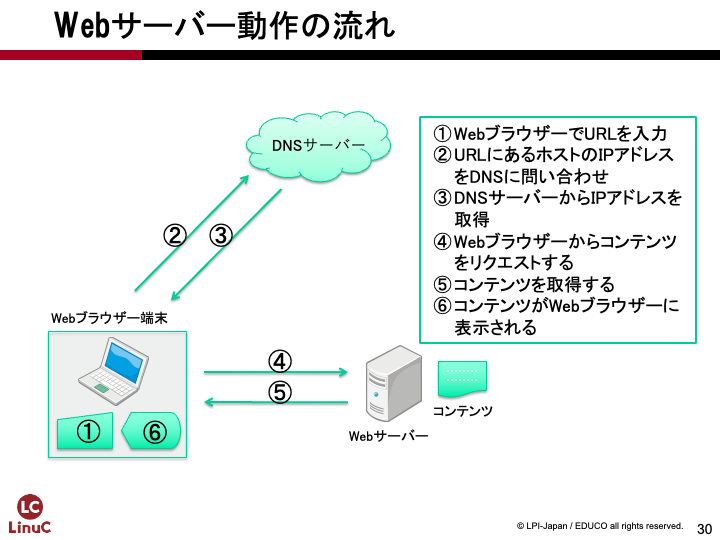

# Webサーバーの構築
第4章では、ホームページやWebシステムを公開するためのWebサービスを設定します。パッケージのインストールやシステム管理権限、セキュリティを考慮したネットワークのアクセス制限などについても触れます。

## 用語集
### HTML(HyperText Markup Language) {.unlisted .unnumbered}
Webページを書くためのタグを使って文章を構造的に記述できるマークアップ言語です。他ドキュメントへのハイパーリンクを書いたり、画像を利用したり、リストや表などの高度な表現も可能です。現在では、ページレイアウトなどを定義するCSS（Cascading Style Sheets）や、プログラムを記述できるJavaScriptなどと組み合わせて高度なWebページを作成できます。

### HTTP(HyperText Transfer Protocol) {.unlisted .unnumbered}
WebブラウザとWebサーバーの間でHTMLなどのコンテンツ(データ)送受信に使われる通信手順です。ファイルのリクエスト(要求)とファイルのレスポンス(返送)が組でセッションになります。現在では、通信を暗号化するなどしてセキュリティを高めたHTTPS（Hypertext Transfer Protocol Secure）が使用されています。

### Apache HTTPサーバー {.unlisted .unnumbered}
世界中でもっとも使われているWebサーバーであり、大規模な商用サイトから自宅サーバーまで幅広く利用されています。Apacheソフトウェア財団のApache HTTPサーバープロジェクトで開発が行われているオープンソースソフトウェアです。

### URL(Uniform Resource Locator) {.unlisted .unnumbered}
インターネット上のリソースを指定するための記述方法で、ホームページのアドレスやメールのアドレスなどを指定できます。リソースを特定するスキーム名とアドレスを「://」でつないで書きます。

### パッケージ {.unlisted .unnumbered}
プログラムの本体であるバイナリや設定ファイル、ドキュメントなどを一式まとめてインストール可能なようにまとめたものです。大きなプログラムの場合、本体とライブラリ、各種拡張機能などを別々のパッケージとしてまとめて選択的にインストールできるようにしていることがあります。Linuxディストリビューションは、このパッケージの集合体と考えることができます。

### システム管理権限 {.unlisted .unnumbered}
Linuxは複数のユーザーが同時に利用できるマルチユーザー型のOSです。システム管理権限は、システム全体に対する変更などが行える権限で、一般的なユーザーには与えられていません。Linuxではrootユーザーか、sudoコマンドを使える権限が与えられたユーザーのみシステム管理権限を行使できます。

\pagebreak
## Webサーバーの仕組み
Webシステムとは、インターネット環境で最も代表的なクライアントサーバー型のシステムで、WebサーバーとクライアントのWebブラウザとで構成されます。Webサーバーは要求されたファイルをWebクライアントに提供し、クライアントは受け取ったファイルを表示します。

{width=70%}


提供される情報はテキストから画像や動画と幅広く、クライアントが対応しているデータならば広く扱えます。Webシステムの文章データとしてはHTMLが一般的に使われています。

WebサーバーとしてApache HTTPサーバーが多く使われていますが、Nginx（エンジンエックス）や各種Webアプリケーションを動作させるのに特化したWebアプリケーションサーバーなども使われています。

## パッケージのインストール
LinuxでWebサーバーを動作させるには、まずWebサーバーのインストールを行います。ソースコードをコンパイルして動かすこともできますが、パッケージを使えば簡単にインストールが行えます。実習で使用しているAlmaLinuxではRPM形式のパッケージを使用しており、パッケージ管理ツールとしてdnfコマンドが使用できます。

### dnfコマンド
dnfコマンドを使うと、パッケージのインストールや削除、アップデートなどが行えます。

### dnfコマンドとyumコマンド
dnfコマンドは、従来はyumコマンドが行っていたパッケージ管理を置き換えるコマンドです。dnf installコマンド等、使用しているサブコマンドはそのままyumコマンドでも実行できます。

### sudoコマンドによるroot権限の取得
dnfコマンドによるパッケージのインストールは、システムの変更を伴うため管理者であるrootユーザーの権限が必要になります。コマンド実行時にroot権限を取得するには、sudoコマンドを使用します。OSインストール時、あるいは初期設定時に作成したユーザーにはsudoコマンドを実行する権限が与えられています。

### dnfコマンドが参照するパッケージリポジトリ
dnfコマンドは、インストールに使用するパッケージをリポジトリと呼ばれる場所から取得します。通常はインターネット上にリポジトリサーバーが用意されており、インターネット経由でパッケージをダウンロードします。今回はインターネットにアクセスできる前提で作業を行います。

### プロキシーが必要な場合には
インターネットへのアクセスにプロキシーを経由する必要がある場合、dnfコマンドの設定でプロキシーを設定することでアクセスできるようになります。設定方法はマニュアル等を参照してください。

### インターネットにアクセスできない環境でのパッケージ管理
インターネットにアクセスできない環境ではインターネット上のリポジトリにアクセスできないため、以下のような方法でインストールを行う必要があります。本教科書ではインストール時に必要なソフトウェアを選択してインストールする方式を採っていますが、その他の方法が必要となる場合もあります。

- OSインストール時にあらかじめ必要なソフトウェアを選択してインストールしておく
- ISOイメージに含まれているRPMパッケージファイルをdnfコマンドを使って手動でインストールする
- ISOイメージをリポジトリとして扱うように設定ファイルを作成する
- アクセス可能なローカルネットワーク上にリポジトリサーバーを用意する

ただし、リポジトリサーバーを用意する以外の方法ではセキュリティアップデートなどが行われた最新のパッケージをインストールするのが難しくなります。実際のシステムを運用するには、継続的にパッケージをアップデートできる方法を考えておくべきでしょう。

### 依存関係の解消
動作するために複数のパッケージが必要となる場合、dnfコマンドはインストールするパッケージが必要とするパッケージも同時にインストールを行います。必要となるパッケージがあることを依存関係と呼びます。

## dnf installコマンドによるパッケージのインストール
Apache HTTPサーバーのパッケージ名はhttpdです。インストールするには、sudoコマンドを頭に付けてdnf installコマンドを実行します。

```
$ sudo dnf install httpd
メタデータの期限切れの最終確認: 1:41:14 前の 2023年12月05日 08時09分38秒 に実施 しました。
依存関係が解決しました。
================================================================================
 パッケージ                Arch       バージョン            リポジトリ  サイズ
================================================================================
インストール:
 httpd                     x86_64     2.4.57-5.el9          appstream      46 k
依存関係のインストール:
 almalinux-logos-httpd     noarch     90.5.1-1.1.el9        appstream      18 k
弱い依存関係のインストール:
 mod_http2                 x86_64     1.15.19-5.el9         appstream     148 k
 mod_lua                   x86_64     2.4.57-5.el9          appstream      60 k

トランザクションの概要
================================================================================
インストール  4 パッケージ

ダウンロードサイズの合計: 272 k
インストール後のサイズ: 601 k
これでよろしいですか? [y/N]: y ← yと入力
パッケージのダウンロード:
(1/4): almalinux-logos-httpd-90.5.1-1.1.el9.noa  33 kB/s |  18 kB     00:00
（略）
GPG 鍵 0xB86B3716 をインポート中:
 Userid     : "AlmaLinux OS 9 <packager@almalinux.org>"
 Fingerprint: BF18 AC28 7617 8908 D6E7 1267 D36C B86C B86B 3716
 From       : /etc/pki/rpm-gpg/RPM-GPG-KEY-AlmaLinux-9
これでよろしいですか? [y/N]: y ← yと入力
鍵のインポートに成功しました
トランザクションの確認を実行中
トランザクションの確認に成功しました。
トランザクションのテストを実行中
トランザクションのテストに成功しました。
トランザクションを実行中
  準備             :                                                        1/1
  インストール中   : mod_lua-2.4.57-5.el9.x86_64                            1/4
  インストール中   : almalinux-logos-httpd-90.5.1-1.1.el9.noarch            2/4
  インストール中   : mod_http2-1.15.19-5.el9.x86_64                         3/4
  インストール中   : httpd-2.4.57-5.el9.x86_64                              4/4
  scriptletの実行中: httpd-2.4.57-5.el9.x86_64                              4/4
  検証             : almalinux-logos-httpd-90.5.1-1.1.el9.noarch            1/4
  検証             : httpd-2.4.57-5.el9.x86_64                              2/4
  検証             : mod_http2-1.15.19-5.el9.x86_64                         3/4
  検証             : mod_lua-2.4.57-5.el9.x86_64                            4/4

インストール済み:
  almalinux-logos-httpd-90.5.1-1.1.el9.noarch    httpd-2.4.57-5.el9.x86_64
  mod_http2-1.15.19-5.el9.x86_64                 mod_lua-2.4.57-5.el9.x86_64

完了しました!
```

sudoコマンドを初めて実行する際には、実行しているユーザーのパスワードが要求されます。sudoコマンド実行後、しばらくの間は再度実行する際にはパスワードが要求されませんが、一定時間経過後は再度要求されます。

dnfコマンドはリポジトリにアクセスし、新たに利用可能になったパッケージのリストを取得してパッケージデータベースを更新します。

インストールを行うhttpdパッケージの依存関係を確認し、必要となる追加のパッケージも同時にインストールを行います。実行例では、依存関係にある7つのパッケージ、弱い依存関係にある3つのパッケージの合計10のパッケージも追加でインストールすることを提案しています。問題なければ y を入力してパッケージのダウンロードとインストールを行います。

## Webサーバーの起動
Webサーバーを起動します。systemctlコマンドを使って、Webサーバーをバックグラウンドサービスとして起動します。

### systemctlコマンド
systemctlコマンドはsystemdを制御するためのコマンドです。systemdはLinuxがOSとして起動する際、Linuxカーネルが起動した後に一番最初に実行されるプロセスで、OS全体を制御します。systemctlコマンドは管理対象をユニットという単位で管理します。

### systemctl startコマンドによるWebサーバーの起動
Webサーバーを起動するには、systemctl startコマンドを実行します。systemdはWebサーバーをhttpd.serviceユニットとして管理しています。ユニット名の.serviceは省略形の名称が重複していない限り省略できます。

```
$ sudo systemctl start httpd
```

エラーなどが発生しなければ、systemctl startコマンドの実行は何も表示されず終了します。

## systemctl statusコマンドによるWebサーバーの動作確認
Webサーバーが正しくバックグラウンドサービスとして実行されているかを確認します。システム的に確認する方法と、Webサーバーとして動作していることの確認の両方を実行します。

### systemctl statusコマンドによる動作状態の確認
systemctl statusコマンドで、管理対象となるユニットの状態やログの一部などを確認できます。

表示を終了するにはQキーを入力します。

```
$ sudo systemctl status httpd
● httpd.service - The Apache HTTP Server
     Loaded: loaded (/usr/lib/systemd/system/httpd.service; disabled; preset: d>
     Active: active (running) since Tue 2023-12-05 09:52:55 JST; 1s ago
       Docs: man:httpd.service(8)
   Main PID: 37780 (httpd)
     Status: "Started, listening on: port 443, port 80"
      Tasks: 214 (limit: 10786)
     Memory: 30.3M
        CPU: 46ms
     CGroup: /system.slice/httpd.service
             tq37780 /usr/sbin/httpd -DFOREGROUND
             tq37781 /usr/sbin/httpd -DFOREGROUND
             tq37782 /usr/sbin/httpd -DFOREGROUND
             tq37783 /usr/sbin/httpd -DFOREGROUND
             tq37784 /usr/sbin/httpd -DFOREGROUND
             mq37785 /usr/sbin/httpd -DFOREGROUND

12月 05 09:52:55 host1.example1.jp systemd[1]: Starting The Apache HTTP Server.>
12月 05 09:52:55 host1.example1.jp systemd[1]: Started The Apache HTTP Server.
12月 05 09:52:55 host1.example1.jp httpd[37780]: Server configured, listening o>
```

### Loadedの意味
ユニットの設定がsystemdに読み込まれているかどうかを表しています。ユニットの定義ファイルの位置や、自動起動の設定がされているかが確認できます。

### Activeの意味
現在、ユニットがアクティブかどうかを表しています。また、プロセスが動作しているかどうかが確認できます。

## Webサーバーへの接続の確認
Webサーバーが起動できたら、様々な方法でWebサーバーに接続して動作を確認します。

### curlコマンドによるローカル接続確認
ローカルでWebサーバーが動作していることを確認します。curlコマンドを実行して、自分自身（ローカル）を指すlocalhostに接続してみます。

```
$ curl localhost
<!DOCTYPE html PUBLIC "-//W3C//DTD XHTML 1.1//EN" "http://www.w3.org/TR/xhtml11/DTD/xhtml11.dtd">

<html xmlns="http://www.w3.org/1999/xhtml" xml:lang="en">
        <head>
                <title>Test Page for the HTTP Server on AlmaLinux</title>
                <meta http-equiv="Content-Type" content="text/html; charset=UTF-8" />


                <div class="footer">
                        <a href="https://apache.org">Apache&trade;</a> is a registered trademark of <a href="https://apache.org">the Apache Software Foundation</a> in the United States and/or other countries.<br />
                        <a href="https://nginx.com">NGINX&trade;</a> is a registered trademark of <a href="https://www.f5.com">F5 Networks, Inc.</a>.
                </div>
        </body>
</html>
```

Webサーバーが実行されているので、サンプルページのHTMLが返ってきます。

### ゲストOSのWebブラウザによるローカル接続確認
仮想マシンのGUIを使ってWebブラウザを実行し、Webサーバーに接続してみます。

1. 画面左上の「アクティビティ」をクリック
1. 画面下に並んでいるアイコンから一番左のFirefoxを実行
1. アドレスに「localhost」を入力しEnterキーを押す

{width=70%}

Webブラウザの要求に対して、WebサーバーがHTMLを返し、WebブラウザがそのHTMLを解釈してWebページを表示しているのが分かります。HTMLが要求したことにより追加で取得した画像ファイルも埋め込まれています。1つのWebページを表示するのに、Webブラウザの裏側で複数のセッションがやり取りされて画像ファイルなどが取得されるようになっています。

## Webサーバーの停止
Webサーバーを停止してみます。停止にはsystemctl stopコマンドを実行します。

```
$ sudo systemctl stop httpd
```

### systemctl statusコマンドによる動作状態の確認
systemctl statusコマンドを実行して、動作状態を確認します。

```
$ sudo systemctl status httpd
○ httpd.service - The Apache HTTP Server
     Loaded: loaded (/usr/lib/systemd/system/httpd.service; disabled; preset: d>
     Active: inactive (dead)
       Docs: man:httpd.service(8)

12月 05 09:52:55 host1.example1.jp systemd[1]: Starting The Apache HTTP Server.>
12月 05 09:52:55 host1.example1.jp systemd[1]: Started The Apache HTTP Server.
12月 05 09:52:55 host1.example1.jp httpd[37780]: Server configured, listening o>
12月 05 09:57:37 host1.example1.jp systemd[1]: Stopping The Apache HTTP Server.>
12月 05 09:57:38 host1.example1.jp systemd[1]: httpd.service: Deactivated succe>
12月 05 09:57:38 host1.example1.jp systemd[1]: Stopped The Apache HTTP Server.
```

Active行が inactive (dead)になっており、プロセス関係の情報が表示されなくなり、Webサーバーが停止しているのが分かります。

### curlコマンドによる接続確認
Webサーバーが停止している状態で、curlコマンドを実行してみます。

```
$ curl localhost
curl: (7) Failed to connect to localhost port 80: 接続を拒否されました
```

即座にエラーが表示されて、Webサーバーにアクセスできないのが分かります。

### Webサーバーを再度起動
Webサーバーを再度起動し、正常にアクセスできるように復旧したことを確認してください。

```
$ sudo systemctl start httpd
```
```
$ curl localhost
```

## ファイアウォールの設定とリモート接続確認
セキュリティを強化するため、デフォルトでは外部からは必要最低限のネットワーク通信しか受け付けないようにファイアウォールが設定されています。そのため、ローカルではWebサーバーに接続できても、リモートからは接続できません。ファイアウォールの設定を変更して、リモートからの接続を許可します。

### 仮想マシンでのリモート接続の確認方法
リモート接続の確認は、ホストOS上で起動したWebブラウザからゲストOS上のWebサーバーに接続します。同一の物理マシンですが、論理的には別々のOS、別々のIPアドレスを持っており、ネットワークを経由してリモートにあるWebサーバーに接続していることになります。

### デフォルト状態では接続できないことを確認する
まず、現在のファイアウォールの設定を確認します。ファイアウォールの操作には、firewall-cmdコマンドを使用します。

```
$ sudo firewall-cmd --list-all
public (active)
  target: default
  icmp-block-inversion: no
  interfaces: enp0s3 enp0s8
  sources:
  services: cockpit dhcpv6-client ssh
  ports:
  protocols:
  forward: yes
  masquerade: no
  forward-ports:
  source-ports:
  icmp-blocks:
  rich rules:
```

services行にhttpが含まれていないので、接続が許可されていません。

ホストOS上でWebブラウザを起動したら、アドレスに「192.168.56.101」を入力し、Enterキーを押します。

{width=70%}

Webサーバーからの結果を待ち続けており、テストページは表示されません。Webサーバーは動作していますが、ファイアウォールが手前で遮っているためWebサーバーに到達できないためです。そのまま待っていると、Webブラウザがタイムアウトしてエラーが表示されます。

### ファイアウォールの設定を変更して接続を許可する
firewall-cmdコマンドでhttpサービスの接続を許可します。

```
$ sudo firewall-cmd --add-service=http --zone=public
success
```

再度ファイアウォールの設定を確認します。

```
$ sudo firewall-cmd --list-all
public (active)
  target: default
（略）
  services: cockpit dhcpv6-client http ssh
（略）
```

services行にhttpが追加され、接続が許可されました。

再度、ホストOS上のWebブラウザから「192.168.56.101」に接続します。

{width=70%}

テストページが表示されたら、ホストOSからのアクセスはファイアウォールを通過してWebサーバーに接続できています。

## システム起動時のWebサーバー自動起動とファイアウォールの設定
Webサーバーの起動や、ファイアウォールの設定を行いましたが、これらの設定はOSを再起動すると無効になってしまいます。OSを再起動してもWebサーバーが自動的に起動し、ファイアウォールの設定が行われてHTTPによるアクセスが可能になるように設定しましょう。

### OS再起動
まず、OSを再起動し、Webサーバーが自動起動せず、ファイアウォールの設定が行われないことを確認します。OSを再起動するにはrebootコマンドを実行します。rebootコマンドはsudoコマンドを付けて実行しないでも実行できます。

```
$ reboot
```

### 再起動後の動作確認
Webサーバーが自動的に起動していないこと、ファイアウォールの設定でHTTPが許可されていないことを確認します。

```
$ sudo systemctl status httpd
```

```
$ sudo firewall-cmd --list-all
```

### Webサーバーの自動起動設定
WebサーバーをOS起動時に自動的に起動するようにするにはsystemctl enableコマンドを実行します。

```
$ sudo systemctl enable httpd
Created symlink /etc/systemd/system/multi-user.target.wants/httpd.service → /usr/lib/systemd/system/httpd.service.
```

### ファイアウォールの自動設定
OS起動時にファイアウォールを自動的に設定するようにするにはfirewall-cmdにpermanentオプションを付けて実行します。permanentオプションを付けて実行した場合、ファイアウォールの設定に即座には反映されないので、firewall-cmdコマンドをreloadオプションをつけて実行し、変更を反映させる必要があります。

```
$ sudo firewall-cmd --add-service=http --zone=public --permanent
$ sudo firewall-cmd --reload
$ sudo firewall-cmd --list-all
```

### OS再起動と確認
再度、OSを再起動します。再起動後、Webサーバーが自動起動していること、ファイアウォールの設定が行われていることを確認します。

```
$ sudo systemctl status httpd
```

```
$ sudo firewall-cmd --list-all
```

## ログの確認
Webサーバーへのアクセスや発生したエラーはログファイルに記録されています。アクセスログはどのような人がどのようなページにアクセスしているかの分析に、エラーログは発生した障害の解決に利用されます。

それぞれ、どのような情報が記録されているか確認してみましょう。

### Webサーバーのログファイルの確認
Webサーバーのログは/var/log/httpdディレクトリに記録されています。このディレクトリの中にあるファイルを確認するには、管理者権限が必要です。

```
$ sudo ls /var/log/httpd
access_log  error_log
```

access_logとerror_logの2つのログファイルが確認できます。

### アクセスログの確認
アクセスログに記録されている内容を確認します。

```
$ sudo cat /var/log/httpd/access_log
::1 - - [05/Dec/2023:10:12:37 +0900] "GET / HTTP/1.1" 403 4681 "-" "curl/7.76.1"
192.168.56.1 - - [05/Dec/2023:10:12:45 +0900] "GET / HTTP/1.1" 403 4681 "-" "Mozilla/5.0 (Windows NT 10.0; Win64; x64; rv:120.0) Gecko/20100101 Firefox/120.0"
```

アクセスログには、以下のような情報が記録されています。

- アクセス元のIPアドレス
- アクセスした時間
- アクセスの内容
- アクセスの結果（エラー番号）
- アクセスした際に入力されたURL
- アクセスに利用されたブラウザの種類

### エラー番号
アクセスログの中で分かりにくいのが、アクセスの結果を示すエラー番号です。エラー番号は様々な種類が定義されていますが、現時点で記録されているのは主に以下の2つです。

- 200：アクセスが成功した
- 404：アクセスしたファイルなどが見つからず失敗した

この2つ以外にも、304や403などが記録されている場合があります。

### エラーログの確認
エラーログに記録されている内容を確認します。

```
$ sudo cat /var/log/httpd/error_log
[Tue Dec 05 10:10:15.601798 2023] [core:notice] [pid 38902:tid 38902] SELinux policy enabled; httpd running as context system_u:system_r:httpd_t:s0
[Tue Dec 05 10:10:15.602587 2023] [suexec:notice] [pid 38902:tid 38902] AH01232: suEXEC mechanism enabled (wrapper: /usr/sbin/suexec)
[Tue Dec 05 10:10:15.620801 2023] [lbmethod_heartbeat:notice] [pid 38902:tid 38902] AH02282: No slotmem from mod_heartmonitor
[Tue Dec 05 10:10:15.627884 2023] [mpm_event:notice] [pid 38902:tid 38902] AH00489: Apache/2.4.57 (AlmaLinux) OpenSSL/3.0.7 mod_fcgid/2.3.9 configured -- resuming normal operations
[Tue Dec 05 10:10:15.627895 2023] [core:notice] [pid 38902:tid 38902] AH00094: Command line: '/usr/sbin/httpd -D FOREGROUND'
[Tue Dec 05 10:11:02.247923 2023] [autoindex:error] [pid 38905:tid 39025] [client 192.168.56.1:49370] AH01276: Cannot serve directory /var/www/html/: No matching DirectoryIndex (index.html) found, and server-generated directory index forbidden by Options directive
[Tue Dec 05 10:12:37.353480 2023] [autoindex:error] [pid 38906:tid 39093] [client ::1:33426] AH01276: Cannot serve directory /var/www/html/: No matching DirectoryIndex (index.html) found, and server-generated directory index forbidden by Options directive
[Tue Dec 05 10:12:45.191945 2023] [autoindex:error] [pid 38906:tid 39095] [client 192.168.56.1:49378] AH01276: Cannot serve directory /var/www/html/: No matching DirectoryIndex (index.html) found, and server-generated directory index forbidden by Options directive
```

エラーログには、Webサーバーの起動や停止の際に出力されたログや、アクセスログにも記録されているエラーの詳細などが記録されています。

エラーログの中に以下のようなエラーがあります。

```
AH01276: Cannot serve directory /var/www/html/: No matching DirectoryIndex (index.html) found, and server-generated directory index forbidden by Options directive
```

これは、/var/www/htmlディレクトリにindex.htmlが存在しない、というエラーです。実はテストページとして表示されていたのは、エラー404が発生した時にWebサーバーが返すHTMLの内容がテストページのように見えていただけで、実際には必要なファイルが見つからないエラーが発生していたわけです。このエラーを解決してみましょう。

### index.htmlを配置する
Webサーバーは、Webブラウザからのリクエストに応じて表示するHTMLファイルなどを/var/www/htmlディレクトリ以下に配置するように設定されています。現時点ではこのディレクトリには何も配置されていないため、404エラーが発生していました。このエラーを解消するため、index.htmlを作成してみます。index.htmlは、Webブラウザがファイル名を指定しなかった場合にデフォルトで参照されるHTMLファイルの名前です。

以下のコマンドを実行して、/var/www/htmlディレクトリにindex.htmlファイルを作成します。

```
$ sudo sh -c "echo 'Hello,World' > /var/www/html/index.html"
```

書き込みには管理者権限が必要ですが、リダイレクトによってファイルを作成するにはコマンド全体をsudoコマンドで呼び出したsh -cコマンドで実行する必要があります。また、コマンド全体を「"」(ダブルクォーテーション)で囲い、書き込み文字列を「'」(シングルクォーテーション)で囲っています。この違いにも注意してコマンドを入力してください。

\pagebreak
### Webブラウザからのアクセスとログの確認
Webブラウザから再度Webサーバーにアクセスしてみます。今度はテストページではなく、「Hello,World」の文字列が表示されたのではないでしょうか。

{width=70%}

また、アクセスログにどのように記録されているか、エラーログにエラーが記録されていないことも確認してみてください。

\pagebreak
