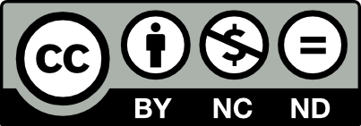
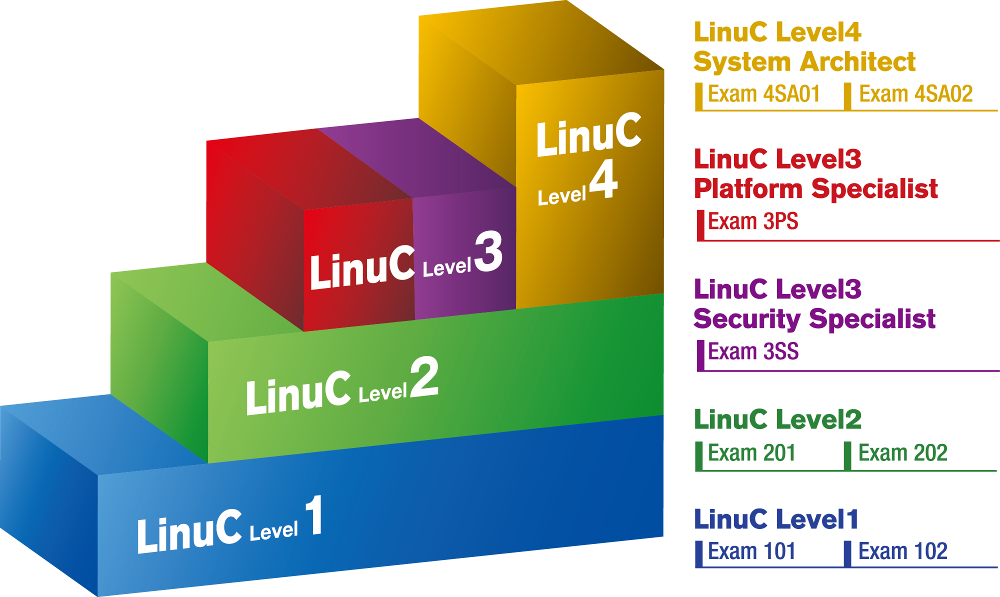

# Preface {.unlisted .unnumbered}

The Non-Profit Organization LPI-Japan is pleased to announce the development and public release of the **\"Linux Server Construction Standard Textbook\"** (hereafter referred to as \"this textbook\") on the internet, intended for use in the education of Linux engineers.

This textbook was developed in response to numerous requests from educational institutions for teaching materials and learning environments that allow students to learn server construction using Linux starting from the **\"basics.\"**

The textbook is published under the license attached to it (Creative Commons License).

To remain current with the latest technological trends, this textbook will be updated from time to time. For the most up-to-date information regarding this textbook, please refer to the following webpage:

<https://linuc.org/textbooks/server/>

## Purpose of This Textbook {.unlisted .unnumbered}

The purpose of this textbook is to help you acquire the server construction knowledge included in the **LinuC Level 2 (201 and 202 exams)** scope through hands-on practice.

Building servers and performing real-world tasks such as accessing websites and sending or receiving emails you will gain a deeper understanding of **server operating principles** and **network protocols**.

### Areas Not Covered in This Textbook {.unlisted .unnumbered}

To keep the practical procedures concise, descriptions of basic Linux operations and system administration (which are covered in the **LinuC Level 1** scope) are kept to a bare minimum.

Self-directed research is apart of the learning process, some details have been intentionally left for the reader to explore. If you encounter something you don't understand, please research it independently to deepen your understanding.

## Intended Hands-on Environment {.unlisted .unnumbered}

This textbook is designed for self-study. The following environment has been established for the practical exercises:

### Using Virtual Machines {.unlisted .unnumbered}

The learning environment is built using **Virtual Machines (VMs)**. Using VMs allows you to install and run Linux on top of a Windows, Linux, or macOS host operating system.

Since multiple VMs can run simultaneously, you can conduct exercises involving multiple servers connected via a network for example **DNS** or **Email** setups all on a single physical computer.

Common software for virtualization includes:

-   **VirtualBox** (Windows, Linux, macOS)
-   **VMware Workstation** (Windows)
-   **VMware Fusion** (macOS)
-   **Parallels Desktop** (macOS)
-   **UTM** (macOS)
-   **Linux KVM** (Linux)

In this textbook, explanations will be using **VirtualBox running on Windows**.

### Operating System (OS) {.unlisted .unnumbered}

This textbook uses **AlmaLinux version 9.3** as the Linux distribution.

The practical examples use the version corresponding to the **Intel/AMD x86_64** architecture, you can also follow the exercises using versions for other architectures, such as **ARM**.

### Network {.unlisted .unnumbered}

The network environment for these practical exercises assumes that **Internet access** is available.

If you are unable to connect to the Internet, you can still proceed with the exercises by pre-installing the necessary software during the **OS installation** phase. 

### Classroom Training {.unlisted .unnumbered}

Even in a classroom setting with multiple students, this textbook assumes that each student will primarily conduct the exercises individually using their own virtual machines.

If you wish to perform exercises where students connect to each other via a network, the instructor should provide specific instructions for modifying the VM and OS settings. Alternatively, students can attempt interconnected exercises after completing the standard textbook curriculum. In such cases, please pay particular attention to the following points:

-   **Configure the VirtualBox network settings to \"Bridged Adapter\"** to allow the virtual machines to communicate with each other.
-   **Assign unique IP addresses, hostnames, and domain names** to each student.
-   **Modify DNS name resolution settings** to ensure proper communication across the network

## Overall Flow {.unlisted .unnumbered}

The practical exercises in this textbook will proceed according to the following structure:

### Chapter 1: Overview of Linux Server Construction {.unlisted .unnumbered}

This chapter explains the overall scope of the exercises and covers essential preliminary information.

### Chapter 2: Preparing the Virtual Machine Environment {.unlisted .unnumbered}

Includes an explanation of virtual machines, the installation of VirtualBox, and the creation of virtual machines.

### Chapter 3: Linux Installation and Configuration {.unlisted .unnumbered}

You will install Linux onto the virtual machine created in the previous chapter.

### Chapter 4: Web Server Installation and Configuration {.unlisted .unnumbered}

You will install the Apache HTTP Server as the web server on your Linux system.

### Chapter 5: DNS Server Installation and Configuration {.unlisted .unnumbered}

You will install BIND as a DNS server, configure domains, and enable name resolution. Multiple virtual machines will be used to enable interconnected communication via name resolution.

### Chapter 6: Mail Server Installation and Configuration {.unlisted .unnumbered}

You will install Postfix and Dovecot as mail servers and configure them to enable the sending and receiving of emails.

### Chapter 7: Network and Security Configuration {.unlisted .unnumbered}

This chapter covers the configuration of Linux network settings and security protocols.

## About the Authors and Creators {.unlisted .unnumbered}

This textbook is being developed using an **open project format**. From the planning stages onward, project members have collaborated through the exchange of ideas and have shared responsibilities for preliminary technical research, writing, and peer review.

### Toru Miyahara (Author in charge of Version 4) {.unlisted .unnumbered}

\"This textbook was created with the hope that it will help all of you who are about to start studying Linux/Open Source Software, as well as to the teachers who are providing guidance. In the revision for Version 4, I have not only updated it for compatibility with new distributions but also made adjustments to ensure the practical exercises are even easier to understand.\"

### Mika Tsukada (Author in charge of Version 4) {.unlisted .unnumbered}

\"On this occasion, I was in charge of the practical exercise sections from Chapter 2 to Chapter 4. This was my first time being involved in a project like this, and it was a very good experience. I would be happy if this textbook helps many of you who are about to learn Linux.\"

### Contributors to the development of Version 4 {.unlisted .unnumbered}

-   Akio Itabashi
-   Yasutomo Kawanishi (RIKEN)
-   Takahiro Kujirai (Zeus Enterprise Co., Ltd.)
-   Mitsuo Kobayashi (Crotech Co., Ltd.)
-   Takashi Sakamoto (Tokyo Denki University)
-   Toshifumi Takemoto (Internous Co., Ltd.)
-   Atsushi Taniguchi (Members Co., Ltd.)
-   Akira Togashi (Kanagawa Prefectural Western General Vocational Technical School)
-   Ayumi Hataya
-   Akiomi Fukunaga (Bold Co., Ltd.)
-   Yasutaka Mizusawa

\"We have received a great deal of feedback from numerous authors, reviewers, and users from Version 1 through Version 3. We would like to express our deepest gratitude.\"

### Contributors to the English Translation {.unlisted .unnumbered}

- Tommy McGee (mintarc Co LTD.)
- Ryo McGee (mintarc Co LTD.)
- Mine McGee (mintarc Co LTD.)

\"It was a pleasure to translate this essential resource, and we hope it serves as a valuable tool for the global FOSS community\"

## Copyright {.unlisted .unnumbered}

The copyright of this textbook belongs to the **LPI-Japan**, a Non-Profit Organization.

Copyright© LPI-Japan. All Rights Reserved.

## Rights Regarding Use {.unlisted .unnumbered}

This textbook is licensed under the **Creative Commons Attribution-NonCommercial-NoDerivs 4.0 International (CC BY-NC-ND 4.0)** license.

{width=200px}

### Attribution {.unlisted .unnumbered}

Please indicate that the copyright of this textbook belongs to the **LPI-Japan**, a Non-Profit Organization.

### Non-Commercial {.unlisted .unnumbered}

This textbook may be used freely as teaching material for non-commercial purposes. Use for commercial purposes, primarily aimed at commercial gain or monetary compensation, requires permission from LPI-Japan, a Non-Profit Organization. However, in education where this textbook is used, if no fee is charged for the textbook itself, it can basically be used even in commercial education. In such cases, and for any other inquiries, please feel free to contact the LPI-Japan Secretariat.

### NoDerivatives (No Alteration) {.unlisted .unnumbered}

Please use this textbook without making any alterations. Any modifications to this textbook are carried out by the **LPI-Japan**, a Non-Profit Organization, or by organizations authorized by LPI-Japan.

## Feedback {.unlisted .unnumbered}

For feedback on this textbook or inquiries about its use, please contact:

LPI-Japan Secretariat (Specified Non-Profit Organization)

<info@lpi.or.jp>

\pagebreak
## Introduction to the Linux Engineer Certification \"LinuC\" {.unlisted .unnumbered}

The Linux Engineer Certification \"LinuC\" is a technical certification that proves the skills necessary for everything from system construction to operation and management required of IT engineers in the Cloud/DX (Digital Transformation) era. It broadly covers technical domains from architectural design to system construction and operation management. Through the acquisition of four certification levels, you can step-by-step and reliably acquire and prove the skills that are in demand.

The formulation of LinuC's exam topics and exam development is carried out by a community of high-level IT engineers who are active in the field. Therefore, it covers technical areas used as industry standards globally, and the content tests the knowledge and practical skills truly needed at the front lines of system development and operation management. As a result, unlike traditional technical certifications that remain confined to legacy Linux domains, it has become a certification that is sufficiently useful for IT engineers aiming to be active both domestically and internationally.

{width=50%}

### LinuC Level 1 {.unlisted .unnumbered}

Proof of a \"job-ready\" engineer who understands computer systems and can perform basic operations and system management of Linux systems, including virtual environments (ITSS Level 1).

### LinuC Level 2 {.unlisted .unnumbered}

Proof of an engineer who can perform design, introduction, maintenance, and problem-solving based on architecture for Linux system design and network construction, including virtual environments (ITSS Level 2).

### LinuC Level 3 Platform Specialist and Security Specialist {.unlisted .unnumbered}

Proof of a specialist who can build and operate Linux platforms with flexibility and high availability through technologies such as virtualization and automation, and who can also implement layer-by-layer hardening from OS to middleware, build authentication and authorization infrastructure, and execute countermeasures against attacks for secure Linux systems (ITSS Level 3).

### LinuC Level 4 System Architect {.unlisted .unnumbered}

Proof of an advanced engineer who can oversee the entire system lifecycle, including on-premises/cloud and physical/virtualized environments, and design and build the optimal architecture (ITSS Level 4).

\pagebreak

For more details about LinuC, please refer to the following website:

<https://linuc.org/about/01.html>

{width=25%}

\pagebreak
