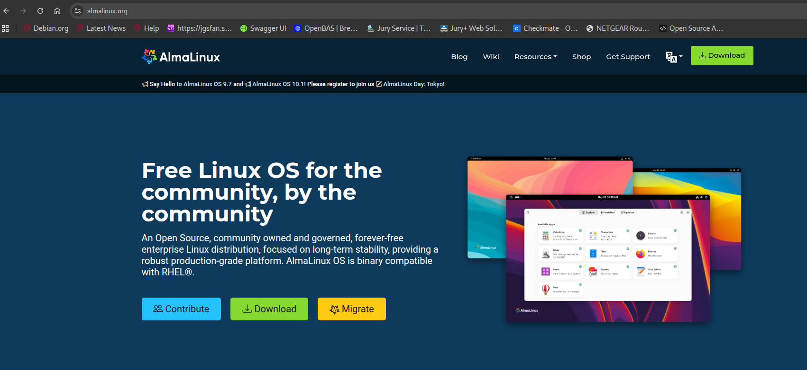
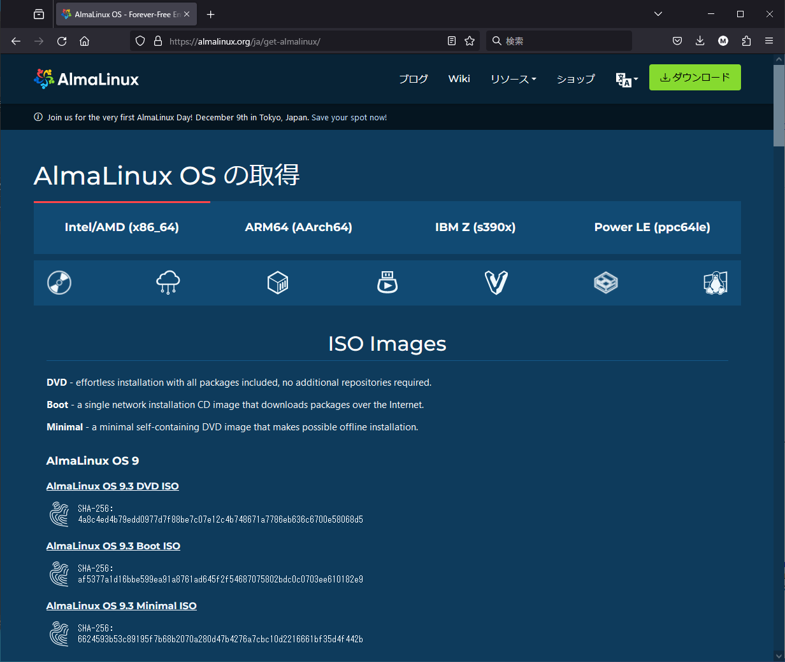
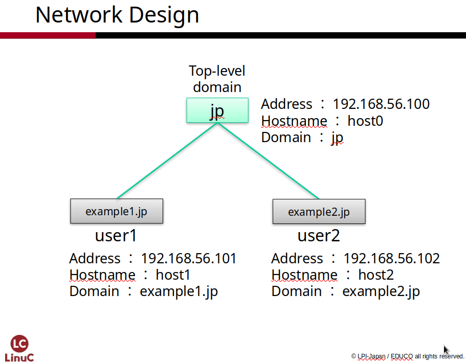

# Linux Server Overview

In this textbook, we aim to understand the primary technologies included
in the **LinuC Level 1 and Level 2** exam objectives through hands-on
practice, including installing Linux and building a server environment.

**Chapter 1** provides an overview of Linux servers and verifies the
environment and knowledge necessary for the practical exercises that
begin in Chapter 2.

## Glossary

### Linux {.unlisted .unnumbered}

Linux is a general term for operating systems aimed at being
UNIX-compatible, originally developed by Linus Torvalds. Its source code
is open to the public, and development continues daily through the
cooperation of developers all around the world.

### Linux Distributions {.unlisted .unnumbered}

"Linux" refers only to the core of the OS (the kernel). However, a
system cannot function with the Linux kernel alone. A Linux Distribution
is created by adding various software programs and installers to the
kernel to make it usable. Each distribution has its own development
policy, according to which software is bundled and released

### AlmaLinux {.unlisted .unnumbered}

This is one of many Linux distributions. It is an open-source
distribution that provides a free environment compatible with the
commercial Red Hat Enterprise Linux (RHEL). It is developed and
maintained by the AlmaLinux community.

### IP Address {.unlisted .unnumbered}

When communication occurs via IP on the internet, an IP address is
assigned to every individual host. An IP address acts as the "address"
indicating the location of a host on the network. While two types---IPv4
and IPv6---exist today, this textbook uses IPv4. In IPv4, a 32-bit
address is divided into 8-bit segments separated by dots (.) and
expressed in decimal format.

### Network Address {.unlisted .unnumbered}

An IP network consists of groups of one or more hosts. Communication
happens both within these networks and between different networks. The
Network Address is used to identify these specific networks. An IP
address can be divided into a Network Part (representing the network the
host belongs to) and a Host Part (assigned to the individual host).

### Subnet Mask {.unlisted .unnumbered}

This is a numerical value used to identify the network address portion
of an IP address. Among the 32 bits, the bits starting from the
beginning that represent the network part are set to "1". For example,
if the first 24 bits are the network part, it is written as "/24"
after the IP address or converted to decimal as "255.255.255.0".

### Hostname {.unlisted .unnumbered}

The name assigned to a computer connected to a network. This can refer
to a short name (omitting the domain) or a Fully Qualified Domain Name
(FQDN) which includes the domain name.

### Domain Name {.unlisted .unnumbered}

A name assigned to identify computers and networks on the internet.
Organizations, such as companies, acquire and use unique domain names.
While they usually consist of letters, numbers, and certain symbols,
Internationalized Domain Names (like .jp in Japanese characters) are
also in use.

### DNS Server Address {.unlisted .unnumbered}

The process of converting an FQDN (Hostname + Domain Name) into an IP
address is called "Name Resolution." The DNS (Domain Name System)
performs this task. A host requests name resolution from its configured
DNS server address.

### Hard Disk Drive (HDD) {.unlisted .unnumbered}

A storage medium using magnetism. Used in PCs and video recorders.

### SSD {.unlisted .unnumbered}

A storage medium using flash memory (semiconductor memory). It has
superior read/write performance compared to hard disks

### DVD {.unlisted .unnumbered}

A type of optical media. Originally popular for video playback, it is
now used for data storage. With a capacity of approx. 4.7GB (compared to
700MB for a CD-ROM), it is often used as an OS installation disc

### USB Flash Drive {.unlisted .unnumbered}

External storage connected via USB. It can also be used as an OS
installation medium.

## Hardware Used in the Practical Exercises

In the practical exercises of this textbook, we will build a practice
environment using **virtual machines**.

Details regarding virtual machines will be explained in **Chapter 2**,
this section explains the hardware specifications and requirements
needed for these exercises.

### The Machine (Hardware)

The hardware assumed for these exercises is a standard **"Personal
Computer" (PC)** capable of running Windows, Linux, or macOS. You will
set up the practice environment by installing **virtual machine
software**, such as **"VirtualBox,"** on the PC you have prepared.

### CPU

High-performance CPUs are not required as the exercises do not involve
heavy processing loads.

However, **Virtualization Technology** is necessary to run virtual
machines. Unless the CPU is very old, it should already have this
technology, but it must be **enabled in the BIOS (UEFI)**.

Since this textbook uses VirtualBox, it assumes an **IA (Intel
Architecture)** CPU.

*Note: You can perform similar exercises by using virtual machine
software that supports **ARM architecture** CPUs and installing an
ARM-compatible Linux distribution. However, since virtual machine
settings will differ, please adapt the instructions accordingly as you
proceed *

### Memory (RAM)

For AlmaLinux 9.3, **1.5GB or more** of memory is recommended.

In the DNS and email exercises, you will use three virtual machines
simultaneously, requiring **4.5GB** of memory for the VMs alone. Since
memory is also needed for your physical operating system (called the
**Host OS**) and other applications running at the same time, it is
recommended to have at least **8GB** of RAM, or **16GB or more** for a
smooth experience.

If your computer has a small amount of memory, you will need to improve
efficiency by:

-   Reducing the memory allocated to each virtual machine.
-   Closing unnecessary applications.
-   Accepting a decrease in speed due to **memory swapping**.

### Storage

The virtual hard disks used by virtual machines are stored as files on
the storage (HDD or SSD) connected to your PC. These virtual hard disk
files consume storage space based on the amount actually used.

The environment used in these exercises will consume approximately
**7GB** of capacity. Since VirtualBox creates virtual hard disk files
with a default maximum of 20GB, you will need to prepare at least
**21GB** (for current usage) and up to **60GB** (to account for the
maximum limits) of space for three virtual machines.

Because reading from and writing to virtual hard disk files happens
frequently, it is recommended to use an **SSD**, which is faster than a
hard disk.

### Network

For the practical exercises, you will need to be able to connect to the
**internet**. The PC prepared for the exercises can be connected via
either **wired LAN** or **wireless LAN (Wi-Fi)**.

## Linux Distribution to be Used

In this textbook, we will use the version of **AlmaLinux 9.3** that
corresponds to the **Intel/AMD x86_64** architecture.

https://almalinux.org/

{width=70%}

AlmaLinux is provided as a distribution based on Red Hat Enterprise
Linux, which is a commercial distribution. It is a distribution provided
free of charge, with no costs incurred for its use.

### Obtaining the Installation ISO Image

Download the ISO image distributed by AlmaLinux. Since virtual machines
allow installation by setting the ISO image in a virtual optical drive,
there is no need to create an installation DVD or USB flash drive.

To download the ISO image, access the following URL.

https://mirrors.almalinux.org/isos/x86_64/9.3.html

When you access this URL, many mirror sites will be displayed. For
example, a mirror site URL provided by IIJ would look like the
following:

http://ftp.iij.ad.jp/pub/linux/almalinux/9.3/isos/x86_64/

**If the URL is unavailable** URLs may change due to changes in site
structure. In such cases, please follow the links from the AlmaLinux
website to find the download site.

{width=70%}

## ISO Image File Name

ISO images have file names like the following:

```
AlmaLinux - [Version] - [Architecture] - [Image Type].iso
```

## Version

This textbook explains the construction method using **AlmaLinux 9.3**,
which was the latest version at the time of writing. Due to future
updates, newer versions of AlmaLinux may become available. As long as
you are using **Version 9.x**, there are no major differences between
minor versions, so it is assumed that you can build a server using the
same procedures. However, default settings may change due to security
updates or other factors, which can alter behavior.

When studying the content of this textbook for the first time, we
recommend that you first confirm the operation by using the same
version, and then check if it works similarly with a different version.
Information regarding differences in behavior between versions will be
shared on the Slack channel used for information exchange for this
textbook, and we plan to address these in future updates of this
textbook.

## Architecture

The Linux kernel supports various types of CPU architectures. Because
binaries differ depending on the architecture, you must select the ISO
image that matches your specific architecture. The primary architectures
include the following:

### x86_64

The CPU architecture for Intel and AMD. This is the 64-bit version.

### aarch64

The CPU architecture for ARM. This is the 64-bit version.

In addition to these, ISO images compatible with architectures such as
PowerPC (ppc64le) and IBM S/390 (s390x) are also provided.

## ISO Image Types

There are several types of ISO images. You select an image based on the
purpose of your installation. AlmaLinux provides the following three
types of ISO images:

-   Boot Only (boot.iso)
-   Minimal (minimal.iso)
-   Full Package (dvd.iso)

In the exercises for this textbook, we will use the ISO image that
allows for a full installation (**dvd.iso**) because we will also use a
GUI environment. Please download **AlmaLinux-9.3-x86_64-dvd.iso**.

In professional practice, servers are often built by performing a
minimal installation and then adding only the necessary packages. Once
you become accustomed to the process, try challenging yourself to
install using the ISO image for a minimal OS installation
(**minimal.iso**).

### boot.iso {.unlisted .unnumbered}

This ISO image is only for booting the installer. It
performs a "network installation," where the files to be installed are
retrieved via the network. It can also be used to boot into "Rescue
Mode" to recover a system when a failure occurs. Since it has the
minimum configuration required for booting, the ISO image size is small.

### minimal.iso {.unlisted .unnumbered}

This ISO image performs a minimal OS installation.
Because it does not exceed the capacity limits of DVD media, you should
choose this if you intend to create a physical DVD for installation.

### dvd.iso {.unlisted .unnumbered}

This ISO image allows for a full installation. Because the
size is large, it cannot be written to a standard DVD, but it can be
used as-is when installing to a virtual machine. If you wish to install
directly onto a physical machine, you can write this to a USB flash
drive to create a bootable USB.

## Network Environment

Since the exercises in this textbook utilize virtual machines, no
special networking setup is required. However, please confirm the
following points:

### Internet Connection

In order to install software, access to repository servers provided on
the internet is necessary. In VirtualBox, which is used for these
exercises, you will connect to external networks using a "NAT
Network". No special configuration is required for the VirtualBox NAT
Network as long as the PC used for the exercises can connect to the
internet.

If you need to connect via a proxy, please obtain the necessary
configuration information or consult with your network administrator.

### Connection Between Virtual Machines

Since connections between virtual machines are made via a virtual
network, the method varies depending on the specifications of the
virtualization software you are using. VirtualBox, which is used in this
textbook, utilizes a "Host-Only Network" connection. This means that
only the virtual machines themselves and the host OS can connect to each
other. Because they are isolated from external networks, you can
configure IP addresses and other settings independently.

## Network Configuration Items

When building a server, you need to decide how to configure the
following items.

### Domain Name

A domain name is required when configuring a DNS server. This domain
name is only valid within this specific network and remains isolated
from external DNS systems.

In this textbook, we will use two domain names, **example1.jp** and
**example2.jp**, for the two virtual machines. Additionally, we will
create another virtual machine to perform name resolution via DNS and
configure it as the **jp** domain.

  | Machine | Settings |
  |---|---|
  | 1st Machine | example1.jp. |
  | 2nd Machine | example2.jp. |
  | 3rd Machine | jp. |

### Hostname

This is the hostname you will set for your own PC. We will set **host1**
and **host2** to match their respective domain names. For the **jp**
domain, we will set **host0**.

Hostnames are sometimes written as an **FQDN (Fully Qualified Domain
Name)** by combining them with the domain name. In FQDN notation, they
are represented as follows:

  | Machine | Settings |
  |---|---|
  | 1st Machine | host1.example1.jp. |
  | 2nd Machine | host2.example2.jp. |
  | 3rd Machine | host0.jp. |

### IP Address

The IP addresses are set as follows, matching the defaults of the
VirtualBox Host-Only Network connection:

  | Machine | Settings |
  |---|---|
  | 1st Machine | 192.168.56.101 |
  | 2nd Machine | 192.168.56.102 |
  | 3rd Machine | 192.168.56.100 |

### Subnet Mask

The subnet mask is a value that separates the network portion and the
host portion of an IP address.

In this textbook, we will use **255.255.255.0 (/24)**.

### Network Address

The network address is an address that represents the entire network to
which the PCs belong. In this textbook, it will be **192.168.56.0**.

### Default Gateway

This is the value required for communication with different subnets.
Since the Host-Only Network connection does not connect to external
networks, we will not configure a default gateway. In actual server
construction, please check the network settings and confirm/configure
the appropriate default gateway address.

### DNS Server Address

There is a mechanism called DNS (Domain Name System) that resolves the
correspondence between hostnames and IP addresses. To use DNS, the IP
address of a DNS server is required. In Chapter 5 of this textbook, we
will actually configure and operate a DNS server. In the exercises,
since you will first refer to the DNS server running on your own machine
(locally), set the DNS server address to your own IP address.

  | Machine | Settings |
  |---|---|
  | 1st Machine | 192.168.56.101 |
  | 2nd Machine | 192.168.56.102 |
  | 3rd Machine | 192.168.56.100 |

## Network Settings Summary

The network settings for each virtual machine are as follows:

{width=70%}

### The 1st Virtual Machine

  | Configuration Item | Setting Value |
  |---|---|
  | Hostname | host1.example1.jp. |
  | IP Address | 192.168.56.101 |
  | Subnet Mask | 255.255.255.0 (/24) |
  | Network Address | 192.168.56.0 |
  | Default Gateway | Not required |
  | DNS Server Address | 192.168.56.101 |

### The 2nd Virtual Machine

  | Configuration Item | Setting Value |
  |---|---|
  | Hostname | host2.example2.jp. |
  | IP Address | 192.168.56.102 |
  | Subnet Mask | 255.255.255.0 (/24) |
  | Network Address | 192.168.56.0 |
  | Default Gateway | Not required |
  | DNS Server Address | 192.168.56.102 |

### The 3rd Virtual Machine

  | Configuration Item | Setting Value |
  |---|---|
  | Hostname | host0.jp. |
  | IP Address | 192.168.56.100 |
  | Subnet Mask | 255.255.255.0 (/24) |
  | Network Address | 192.168.56.0 |
  | Default Gateway | Not required |
  | DNS Server Address | 192.168.56.100 |

\pagebreak
