# Install VirtualBox and Create The Virtual Machines

In Chapter 2, you will install VirtualBox and create virtual machines to
prepare the environment for the practical exercises.

## Glossary

### Virtualization Technology {.unlisted .unnumbered}

A technology that implements hardware functions through software.
Various types of technologies exist, such as virtual machines, virtual
networks, and virtual storage.

### Virtual Machine {.unlisted .unnumbered}

A software implementation of computer hardware using virtualization
technology. You can install an OS and run various applications on it.

### Virtual Host {.unlisted .unnumbered}

The machine that executes the virtual machines. On a virtual host, a
normal OS is running, and the virtual machines operate much like regular
applications.

### Guest OS {.unlisted .unnumbered}

The OS installed on a virtual machine. You can install and run an OS
that is a different type from the one running on the virtual host.

## What is a Virtualized Environment?

A virtualized environment is a system environment constructed and
operated by utilizing virtualization technology. Virtualization
technology includes various types such as virtual machines, virtual
networks, virtual storage, and containers.

### Relationship between Virtualization Technology and Cloud

Today, an increasing number of systems are being built and operated
using the cloud. Many cloud services achieve their functionality by
utilizing virtualization technology to efficiently provide system
resources to users. To understand and utilize the cloud, it is essential
to first understand the foundations of virtualization technology.

## What is a Virtual Machine?

A virtual machine is a mechanism that executes a virtual computer via
software. You can install a guest OS onto a virtual machine and run
applications.

### Host OS Type vs. Hypervisor Type

Virtual machine execution environments are broadly divided into the
"**Host OS type**," which runs like an application on top of a host
OS, and the "**Hypervisor type**," which runs on hypervisor software
dedicated specifically to executing virtual machines. This textbook uses
the **Host OS type** because it is easy to set up and run.

## Benefits of Virtual Machines

There are several advantages to using virtual machines.

### Coexistence with the Host OS

A virtual machine runs like an application on the host OS. Because you
can run other applications at the same time, you can easily do things
like look something up in a web browser while logged into and operating
Linux on the virtual machine via a terminal.

### No Need to Prepare Hardware

A major obstacle when learning server construction using Linux is
preparing the physical hardware. Even if you can secure the hardware,
installing Linux requires hardware knowledge, such as changing BIOS/UEFI
settings. Since setting methods vary by manufacturer, it can be
difficult to find specific help. With virtual machines, such
prerequisite knowledge is rarely required, making it easy to install
Linux and build a learning environment.

### Flexibility

Virtual machines possess the flexibility to easily change the number of
CPUs, memory capacity, and disk capacity as needed.

### OS Selection

You can install different operating systems on each virtual machine. For
example, you can run a virtual machine with Linux and one with Windows
simultaneously.

## Disadvantages of Virtual Machines

Using virtual machines has disadvantages as well as advantages.

### Speed

Because a virtual machine implements computer operations via software,
it runs slower than running an OS or application directly on the
physical hardware (bare metal).

### Resource Consumption

While you can run multiple virtual machines at once, they consume CPU,
memory, and storage resources accordingly. Since the host OS also
requires resources to run smoothly, the physical hardware used must have
sufficient resources available.

## Virtual Machine Resources

When creating a virtual machine, the user must adjust resources such as
CPU, memory, and network interfaces. Similar work is required for
physical machines, but virtual machines have the advantage of being
adjustable later. You can start with default settings and change them as
needed.

### CPU

You can assign as many CPUs to a virtual machine as necessary. However,
since the CPU is shared between the host OS and other virtual machines,
assigning a large number is not always better.

### Memory

The memory capacity set for a virtual machine is allocated from the host
machine to the virtual machine. The host machine must have enough RAM to
support both the host OS and the allocated guest OS memory.

### Disk

Virtual disks (equivalent to HDD/SSD) are created as "virtual disk
files" on the host OS.

-   **Dynamically Allocated (Variable):** The file grows only as the
    virtual machine uses space.
-   **Fixed Size:** A file of the full specified capacity is created
    immediately. Using dynamic allocation helps save disk space on the
    host machine.

### Optical Drive

The virtual optical drive assigned to a virtual machine can be linked to
physical CD/DVD media set in a physical drive, or more commonly, it can
be assigned an **ISO image**. This is one of the main reasons why
installing an OS on a virtual machine is so easy.

### Network

You can assign network interfaces to the virtual machine. Since
functions vary depending on the virtualization software, you must use
them according to their specific features.

## Installing VirtualBox

In the exercises for this textbook, we will install Linux onto
**VirtualBox** (virtualization software) and then deploy and operate
various servers within that environment.

### Enabling Hardware Virtualization Technology

To run VirtualBox, the virtualization support technology in your
computer's processor must be enabled. This technology is called **Intel
VT (Intel VT-x)** for Intel CPUs and **AMD-V** for AMD CPUs. To enable
virtualization, you must configure the settings in your computer's
**UEFI (or BIOS)** menu. For detailed instructions, please check the
manual for your specific computer.

### Downloading VirtualBox

VirtualBox can be downloaded from the following URL:

```
https://www.virtualbox.org/
```

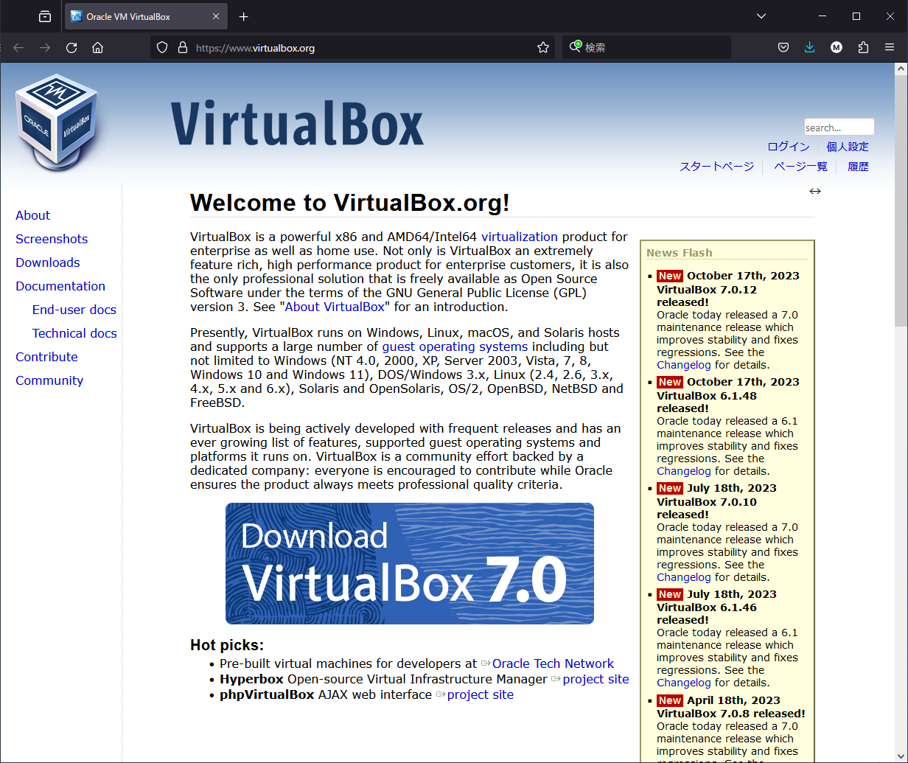{width=70%}

You can download the version that matches your Host OS. For this
session, we will install it on a **Windows environment**. Click
**"Downloads"** from the menu on the left, then click **"Windows
hosts"** under "VirtualBox binaries" to download the installer.

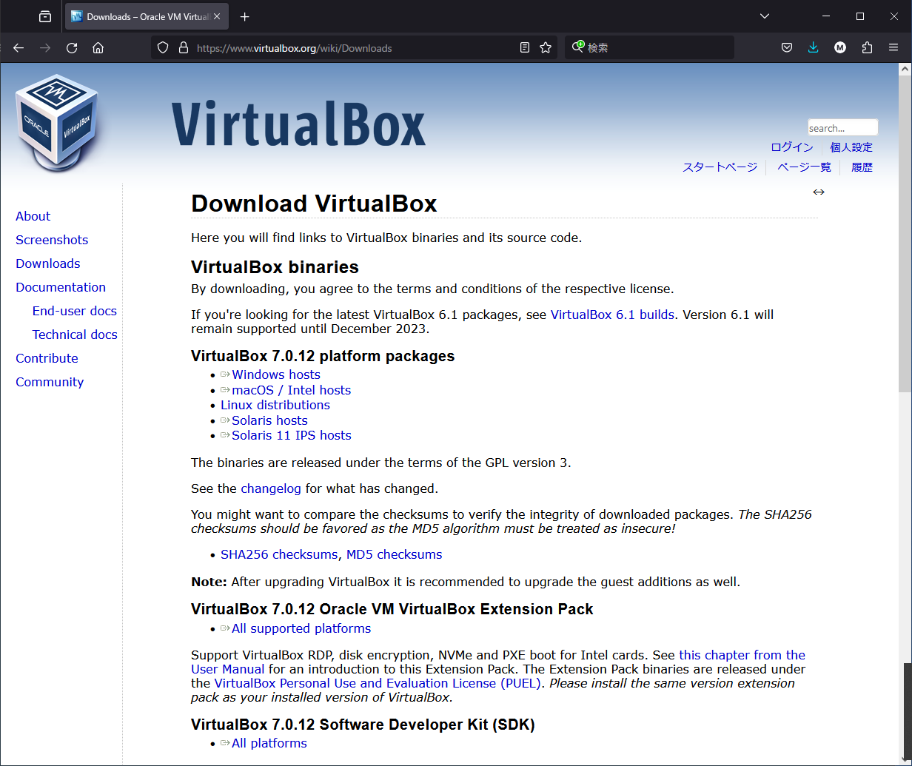{width=70%}

In this textbook, we are using version **7.0.12**. Since there is a
possibility that network functionality (specifically the Host-Only
Adapter) may have changed in later versions, if a newer version is
currently available, please download version 7.0.12 from the
**"VirtualBox older builds"** section.

```
https://www.virtualbox.org/wiki/Download_Old_Builds_7_0
```

### Running the VirtualBox Installer

Once the download of the VirtualBox installer is complete, run the
installer to perform the installation.

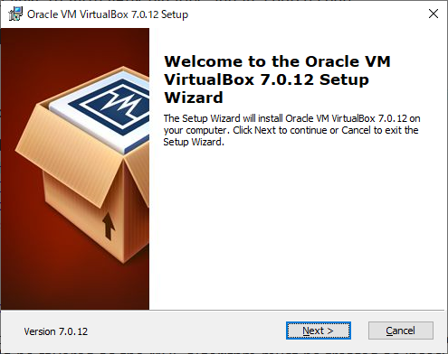{width=70%}

Since no special configuration is required during installation, proceed
by following the installer's instructions. The installer will ask for
confirmation regarding the installation of **virtual network
interfaces** and integration with **Python**; you may proceed as-is
without any issues.

Once the installation is finished, click the **"Finish"** button. The
installer will close, and VirtualBox will launch automatically.

## Launching VirtualBox

Launch VirtualBox. If the installer did not launch it automatically,
double-click the VirtualBox icon added to your desktop to start it. Once
VirtualBox starts, the **VirtualBox Manager** will be displayed.

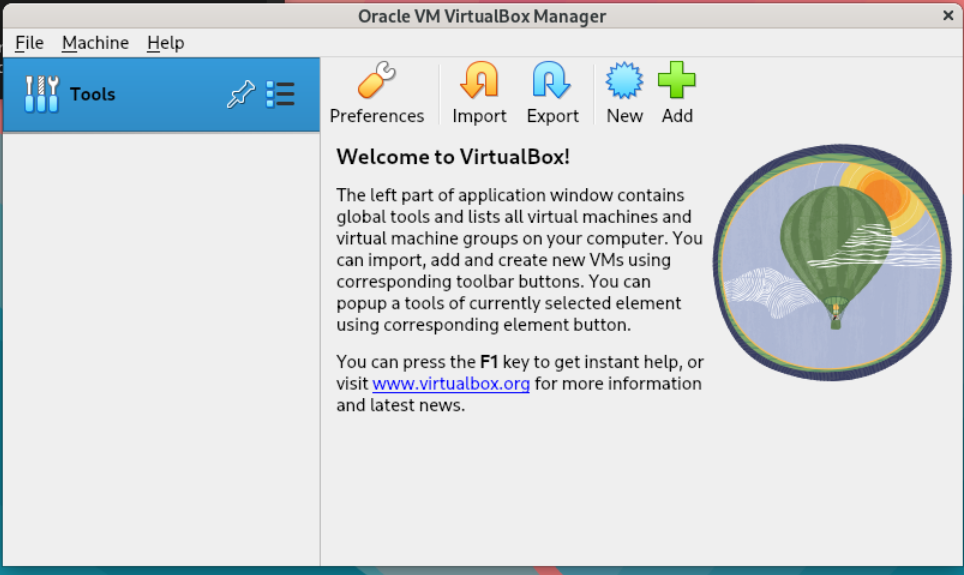{width=70%}

### VirtualBox Manager

The VirtualBox Manager is a tool for managing the entire virtual machine
execution environment within VirtualBox. It is primarily used for the
following:

-   Configuring various settings for VirtualBox itself
-   Managing virtual machines (Creating, deleting, and organizing)
-   Managing media (ISO images, virtual hard disks, etc.)

## Returning to Host OS Control via the Host Key

While operating a virtual machine with your mouse, if you want to return
mouse control to the Host OS, press the Host Key. By default, the Right
Ctrl key on your keyboard is set as the Host Key. The current Host Key
setting is also displayed at the bottom right of the virtual machine
window.

### Returning to Host OS Control if the Host Key Cannot Be Pressed

Some keyboards do not have a Right Ctrl key, which can make it
impossible to "escape" from the virtual machine's control. In such a
case, you can return control to the Host OS by shutting down the Guest
OS to stop the virtual machine.

### Changing the Host Key

You can change the Host Key from the VirtualBox Manager Preferences.

1.  Access the Preferences by selecting **"File (F)"** →
    **"Preferences (P)"** from the VirtualBox Manager menu.
2.  Once the "Preferences" window appears, select **"Input"** from
    the settings items on the left.
3.  Select the **"Virtual Machine (M)"** tab.
4.  Click on the **"Shortcut"** section for the first item, **"Host
    Key Combination."**
5.  Press the key you wish to set as the new Host Key, and the setting
    will switch to that key.

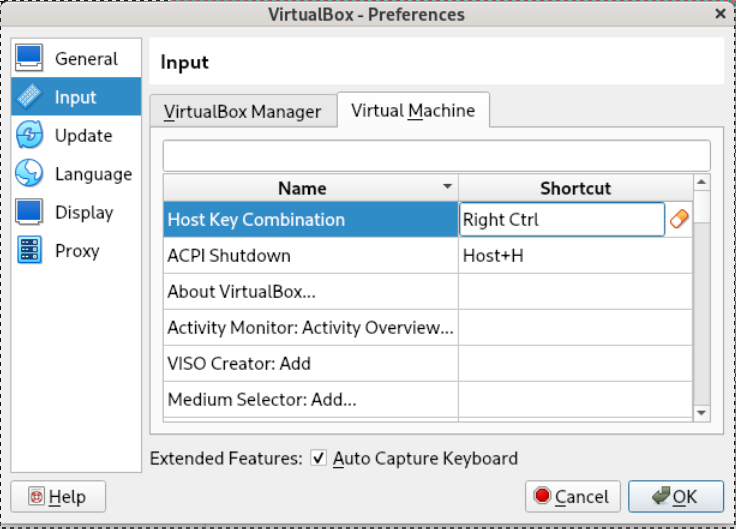{width=70%}

The keys that can be set as the Host Key include **Ctrl, Alt, Windows
(Command), and Shift** (though Shift cannot be set alone). It is best to
avoid setting the **Left Ctrl** key as the Host Key, as this will
conflict with standard keyboard shortcuts used during command-line
operations. You can also set a combination of multiple keys to be the
Host Key; therefore, it is a good idea to set a combination of two or
three keys as your Host Key.

## Creating a Virtual Machine

Now, create a virtual machine. Click the **"New (N)"** button in the
VirtualBox Manager to start creating a new virtual machine. You can
choose between **"Guided Mode,"** where you configure various settings
in an interactive format, and **"Expert Mode,"** where you can
configure everything on a single screen. In this guide, we will use the
default **Guided Mode**.

### Virtual Machine Name and OS Settings

First, set the name of the virtual machine and the type of OS. Since
these settings can be changed later, any other necessary items will be
configured afterward. The items to be set and their details are as
follows:

  | Item | Setting Value |
  |---|---|
  | Name | host1.example1.jp |
  | Type | Linux |
  | Version | Red Hat 9.x (64-bit) |

Once configured, click the **"Next"** button.

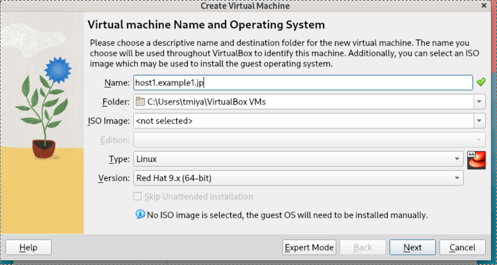{width=70%}

### Virtual Machine Hardware Settings

In this step, you will configure the virtual machine's hardware by
setting the main memory capacity and the number of processors. You will
also configure the EFI settings.

  | Item | Setting Value |
  |---|---|
  | Base Memory | 2048 MB |
  | Processors | 1 |
  | Enable EFI (special OSes only) | Checked |

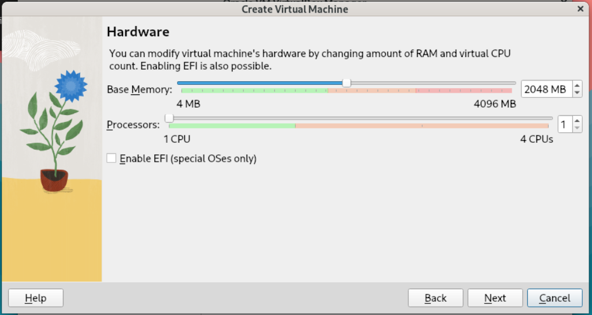{width=70%}

The capacity of **Base Memory** is limited by the amount of physical RAM
installed in your computer. Allocating a larger amount of memory to the
virtual machine can make it operate more smoothly. While it will
function with the default **2048 MB**, you may allocate **4096 MB (4
GB)** if your system has enough room to spare.

The number of **Processors** is limited by the number of physical CPU
cores in your computer. Additionally, some processors may appear to have
double the number of cores due to virtual CPU features
(Hyper-Threading). While it works with the default **1** processor, you
may allocate **2** if you have sufficient resources.

**Enable EFI** is not checked by default. We will **check this box**
because leaving it unchecked can cause issues where the OS installation
screen does not fit correctly, making parts of the screen invisible.

Once configured, click the **"Next"** button.

### Virtual Hard Disk Settings

Configure the virtual hard disk where the OS will be installed.

  | Item | Setting Value |
  |---|---|
  | Disk Size | 20.00GB |

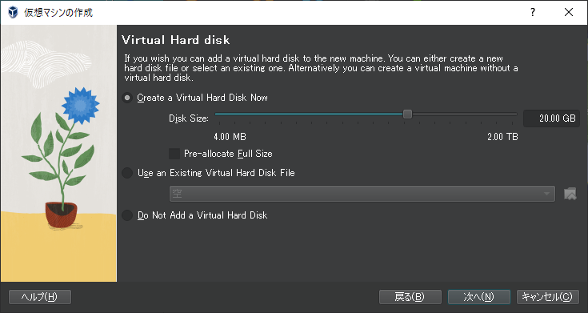{width=70%}

The capacity of the virtual hard disk is limited by the amount of
physical storage available on your computer. Unless you check
**"Pre-allocate Full Size,"** the virtual hard disk will only consume
as much space as the guest OS actually uses; therefore, this setting
defines the **maximum capacity** it can reach.

Installing the OS and configuring the server does not require a vast
amount of space, but when building a server for actual production, you
must estimate and set the necessary capacity accordingly. Additionally,
since virtual hard disks can be added later, learning the method for
adding them is also a good idea.

### Confirming Virtual Machine Settings

Finally, verify the virtual machine settings. Double-check to ensure
that all the configurations you have made up to this point have been
correctly reflected.

After confirmation, click the **"Finish"** button.

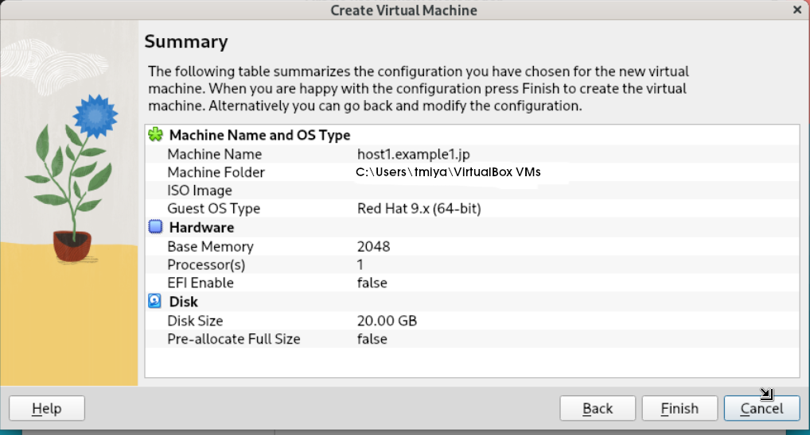{width=70%}

Confirm that the newly created virtual machine has been added to the
VirtualBox Manager.

## How to Configure Virtual Machine Settings

To check or change the settings of a virtual machine, select the machine
in the VirtualBox Manager. You can make changes via the various
configuration details displayed on the right side. Clicking on a section
heading (such as **"General"** or **"System"**) will open the
settings screen for that specific item.

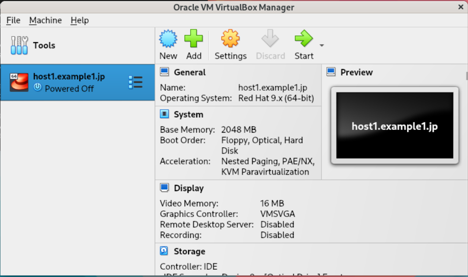{width=70%}

Let's check the EFI enablement that was configured during the virtual
machine creation as a test.

### Verifying EFI Enablement

If EFI is not enabled during the creation of the virtual machine, a
problem will occur where the screen size does not fit correctly when the
OS installer starts, making parts of the screen invisible. Click on
**"System"** and verify that the following setting is checked. If it
is not checked, please check it.

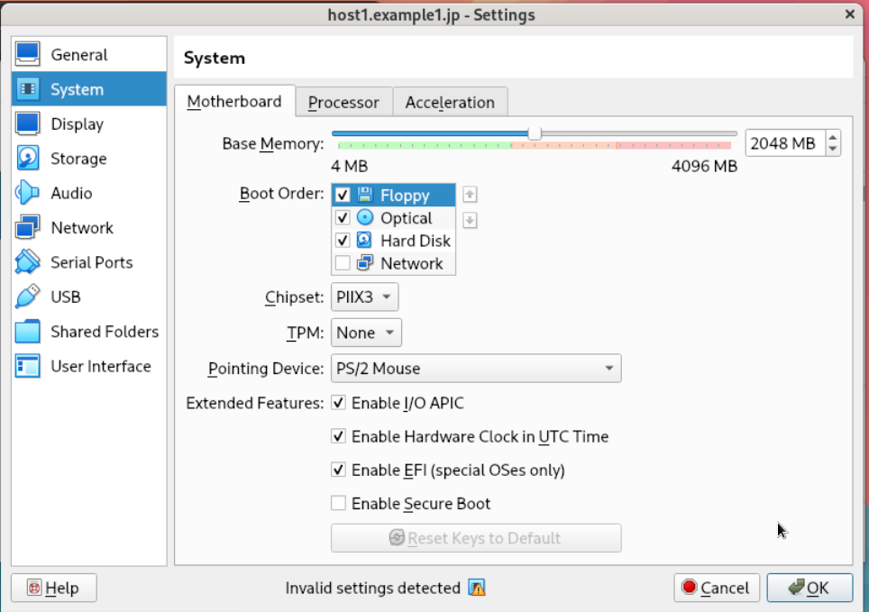{width=70%}

## Adding a Network

To enable communication between the host machine and the virtual
machine, add a **"Host-only Adapter"** using the following steps.

By default, only a network connecting to an external network via **NAT**
is configured.

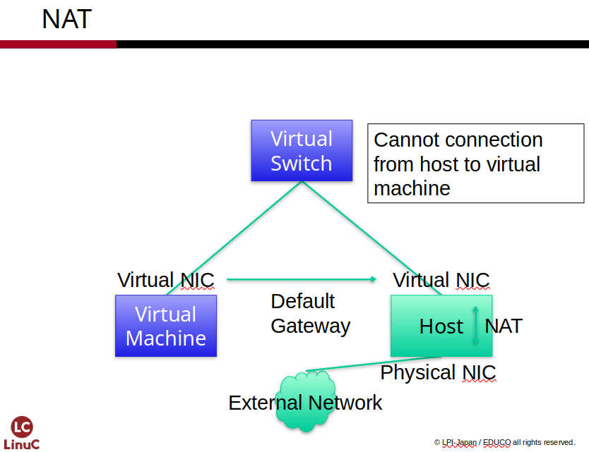{width=70%}

### Verifying Virtual Network Settings

Verify the virtual network settings in VirtualBox.

Click the **list button (three horizontal lines)** to the right of
**"Tools"** in the VirtualBox Manager and select **"Network."**

Select the **"Host-only Networks"** tab and confirm that
**"VirtualBox Host-Only Ethernet Adapter"** exists. If it was created
automatically during installation, the IP address will be set to
**192.168.56.1/24**. This IP address is assigned to the virtual network
adapter created on the host OS. The DHCP server is also enabled by
default, but it will not be used for the exercises in this textbook.

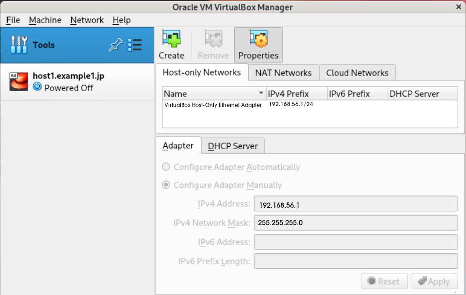{width=70% angle=90}

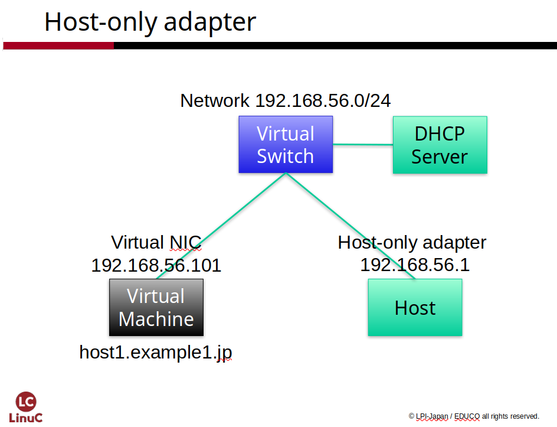{width=70% angle=90}

### Adding a Network Adapter to the Virtual Machine

Add a network adapter to the virtual machine.

Select the virtual machine from the VirtualBox Manager, then select
**'Network'** from the various settings information on the right side.

A virtual machine can have up to four network adapters configured.
**Adapter 1** is set to **NAT**, which allows it to connect to external
networks and the internet beyond.

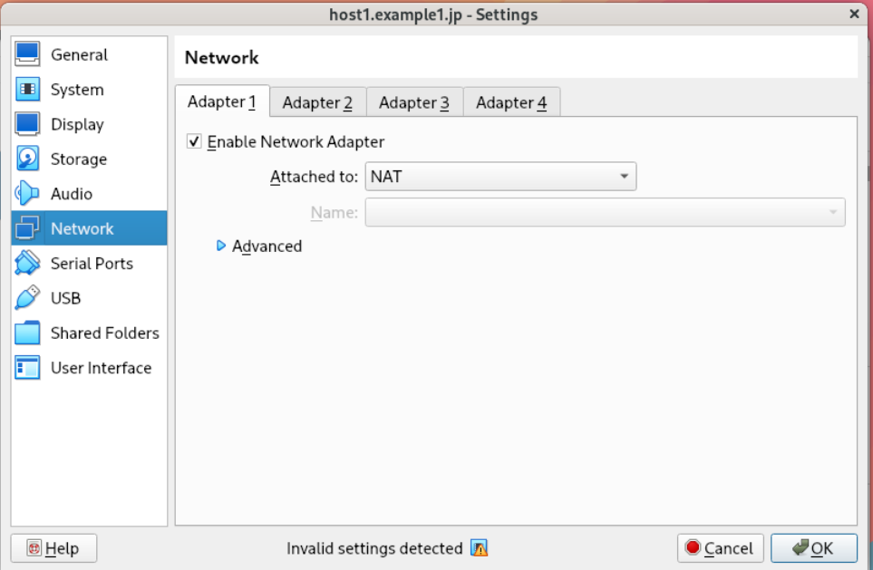{width=70%}

Select the **'Adapter 2'** tab and check the box for **'Enable
Network Adapter.'** When you set **'Attached to'** to **'Host-only
Adapter,'** the **'Name'** field will be set to **'VirtualBox
Host-Only Ethernet Adapter.'** This allows the virtual machine to
communicate with the host machine.

Once configured, click **'OK**

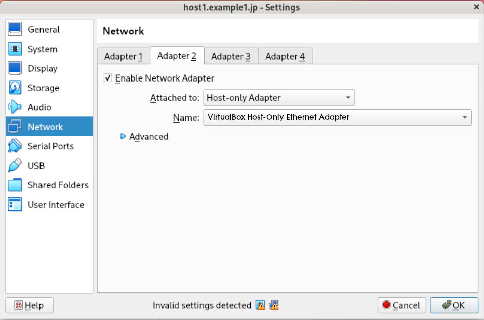{width=70%}

## Configuring the Virtual Optical Drive to Load the ISO Image

Configure the virtual machine's virtual optical drive to load the OS
installation ISO image that was downloaded in Chapter 1.

Select the virtual machine from the VirtualBox Manager, then select
**"Storage"** from the various settings information on the right side.

The virtual machine has two types of storage devices connected: **IDE**
and **SATA**. The virtual optical drive is connected to the IDE
controller. If no image is set to be loaded, the virtual optical drive
will be displayed as **"Empty"**; select it.

Click the **circular icon** to the right of **"Optical Drive: IDE
Secondary Device 0"** and select **"Choose a disk file..."** to open
the file dialog. Select the pre-prepared OS installation ISO image and
click the **"Open"** button. The "Empty" label will change to the
name of the file.

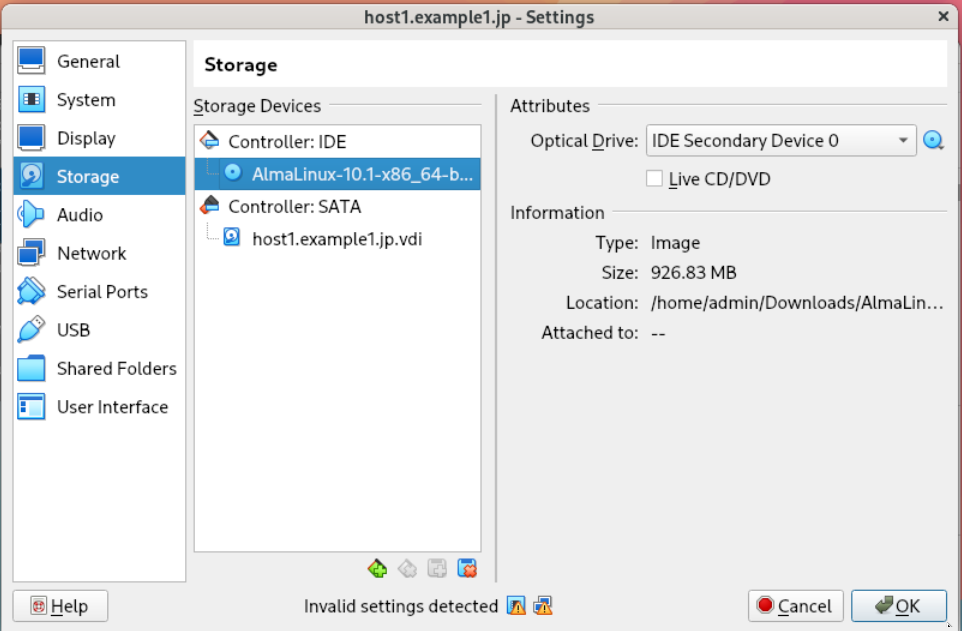{width=70%}

This completes the creation of the virtual machine and the preparations
for OS installation.

\pagebreak
