# **Installing and Configuring Linux**

In Chapter 3, we will install AlmaLinux on the virtual machine created
with VirtualBox. Following the installation, we will perform the initial
configuration and verify the network connectivity

## Glossary

### ISO Image {.unlisted .unnumbered}

CD-ROMs and DVD-ROMs store files in a format called ISO 9660. An ISO
image refers to an entire disc in this ISO 9660 format saved as a single
file.

### Bootloader {.unlisted .unnumbered}

The first program loaded when the OS starts. The **bootloader** loads
the Linux kernel, which then starts the system.

### Partition {.unlisted .unnumbered}

Linux divides a disk into multiple sections (**partitions**) for use. In
addition to partitions for storing data, there are partitions for
**swap** space used by virtual memory.

### NAT {.unlisted .unnumbered}

**NAT (Network Address Translation)** is a mechanism that converts IP
addresses during IP communication. Since global IPv4 addresses that can
connect directly to the internet are scarce, NAT is utilized so that a
single global IP address can be shared and used by multiple hosts.

### root {.unlisted .unnumbered}

The username for the Linux **system administrator**.

## Starting the Virtual Machine

Select the virtual machine in the VirtualBox Manager and click
**"Start."** The virtual machine will launch in a separate window.

### Mounting the ISO Image File

If you have not previously configured the virtual optical drive of the
virtual machine to load an ISO image, a dialog box for selecting a
bootable ISO image will be displayed.

Follow the on-screen instructions to specify the ISO image file, then
click the **"Mount and Retry Boot"** button to start the system.

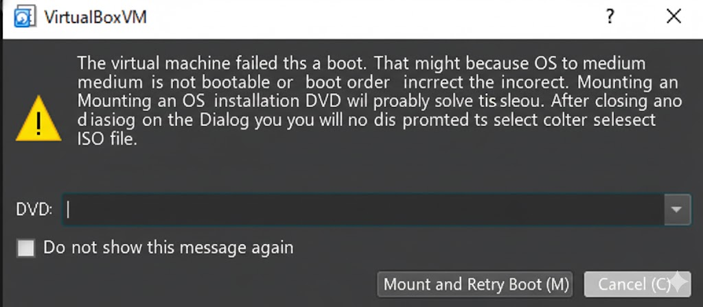{width=70%}

## OS Installation

Follow the steps below to perform the OS installation.

### Selecting the Installer Boot Option

When the system starts after loading the OS installation ISO image, the
**GRUB** bootloader will launch first. Here, you can select the boot
options for the installer.

Boot using the default option, **"Test this media & install AlmaLinux
9.3,"** which will perform a test to ensure the ISO image is not
corrupted before proceeding with the installation. Since this option is
already selected, simply press the **Enter** key.

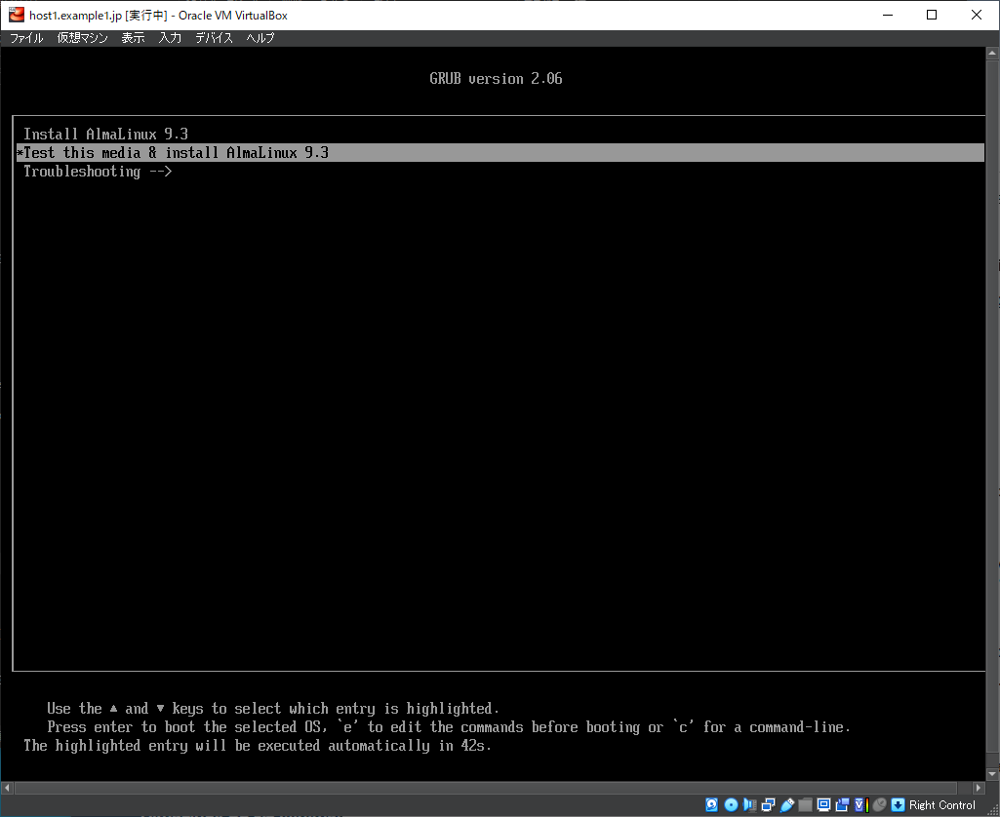{width=70%}

### Language Selection

The language selection screen will be displayed. Select **"Japanese
**日本語**"** from the menu on the left. **"Japanese (Japan) **日本語
**(**日本**)"** will then appear in the menu on the right side of the
screen. Click the **"Continue"** button

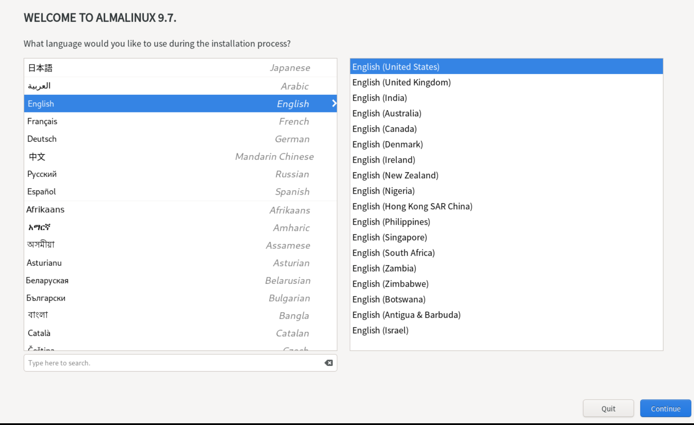{width=70%}

### Installation Summary

The **Installation Summary** screen displays a collection of various
settings. Items marked with an **"!"** icon are
mandatory fields that must be configured before proceeding.

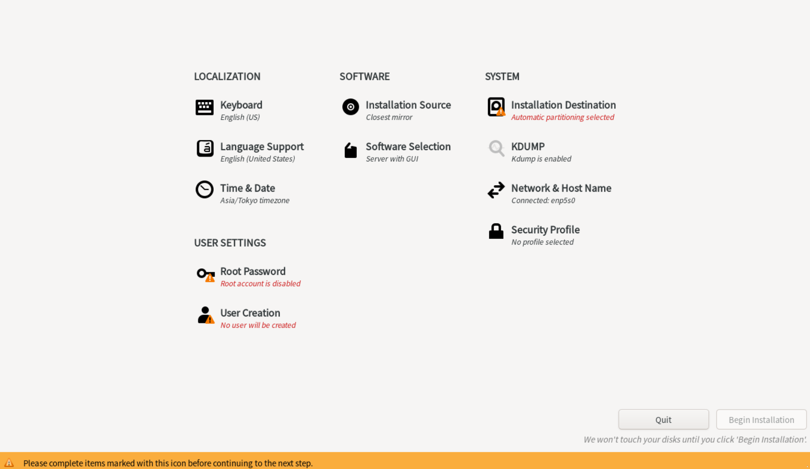{width=70%}

### Installation Destination Settings

Click on **"Installation Destination."** The screen will change,
allowing you to perform **"Device Selection"** and **"Storage
Configuration."**

By default, the virtual hard disk created during the virtual machine
setup is selected as the local standard disk. Additionally, the
partition settings for that device are set to **"Automatic."**

In this case, we will use the default settings for the installation
destination, so simply click the **"Done"** button.

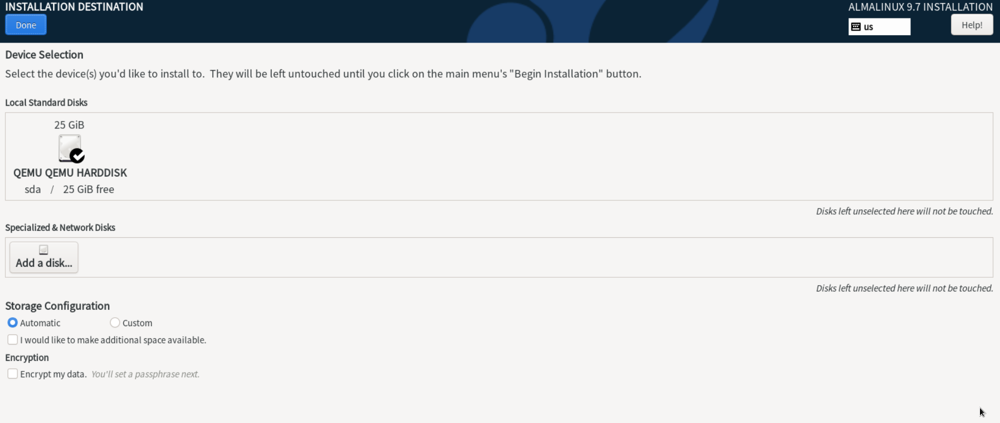{width=70%}

### Network and Hostname Settings

Click on **"Network & Host Name."** The screen will change, allowing
you to configure the network interfaces and the host name.

Since two network adapters were configured in the virtual machine
settings, two network interfaces will be recognized here.

### Configuring the Internet Connection (NAT)

**"Ethernet (enp5s0)"** corresponds to Adapter 1, where NAT was
configured. This network interface will be used to connect to external
networks and the internet.

Since VirtualBox's NAT is automatically configured via DHCP, verify
that it is set as follows:

  | Item | Setting Value |
  |---|---|
  | IP Address | 10.0.2.15/24 |
  | Default Route | 10.0.2.2 |
  | DNS | Varies depending on the environment |

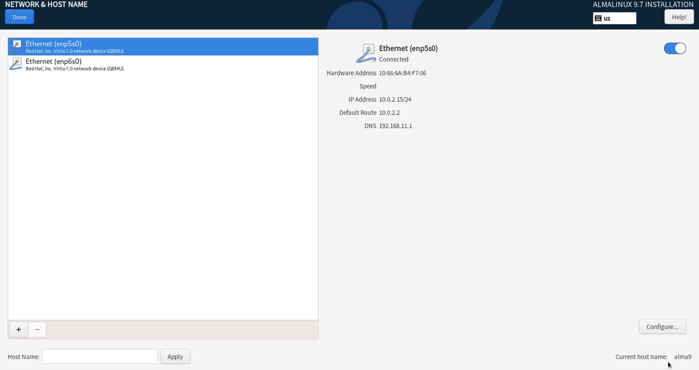{width=70%}

The DNS settings will vary depending on your environment, but since they
will be the same as the network settings on the host OS, check the host
OS network configuration to ensure that the appropriate reference DNS is
set.

### Configuring the Connection with the Host OS (Host-only)

**"Ethernet (enp0s8)"** corresponds to Adapter 2, where the Host-only
adapter was configured. This is used to connect from the Host OS to the
Guest OS running on the virtual machine.

If the DHCP server was enabled during the Host-only adapter
configuration in VirtualBox, an IP address such as **"192.168.56.3"**
will be assigned automatically. However, since this will be used as a
server, we will configure a **static IP address**.

The values to be configured are as follows:

  | Item | Setting Value |
  |---|---|
  | Address | 192.168.56.101 |
  | Netmask | 24 (automatically configured) |
  | Gateway | Do not set |
  | DNS Server | 192.168.56.101 |

The steps are as follows:

1.  Select **"Ethernet (enp0s8)"** and click **"Configure..."**.
2.  When the **"Editing enp0s8"** dialog appears, select the **"IPv4
    Settings"** tab.
3.  Change the **"Method"** to **"Manual"**.
4.  Click **"Add"** under **"Addresses"** and set each field to the
    values listed below. For **"DNS servers,"** enter
    **"192.168.56.101"** so that the system refers to itself.
5.  Click the **"Save"** button.

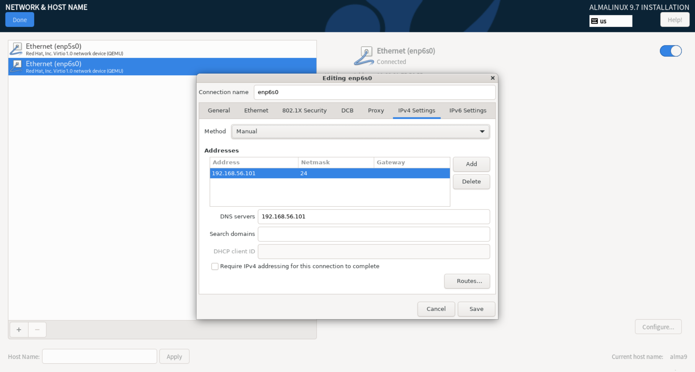{width=70%}

### Hostname Settings

Configure the hostname. Set the hostname as follows:

  | Item | Setting Value |
  |---|---|
  | Hostname | host1.example1.jp |

After entering the name, click the **"Apply"** button. Confirm that
the **"Current host name"** display has changed. Once the settings for
the two network interfaces and the hostname are complete, click the
**"Done"** button.

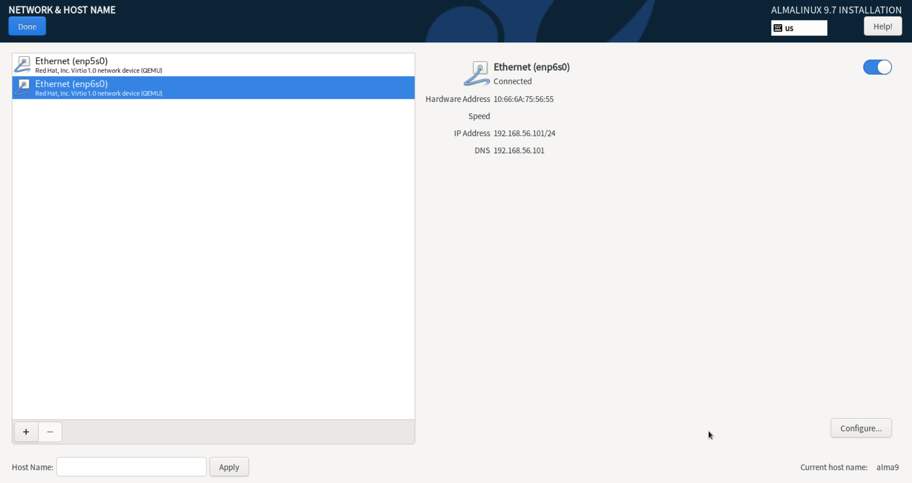{width=70%}

### Installing Additional Software (Only if there is no internet connection)

If you are in an environment where you cannot connect to the internet,
you should pre-install the software required for the exercises.

On the **"Software Selection"** screen, check the software you wish to
install from the **"Additional software for selected environment"**
list on the right side. For the exercises in this textbook, check and
install the following additional software:

-   DNS Name Server
-   Mail Server
-   Basic Web Server

Note that even if you install these three items, the software required
for sending and receiving emails will not be installed. Those must be
installed manually at a later time from the ISO image.

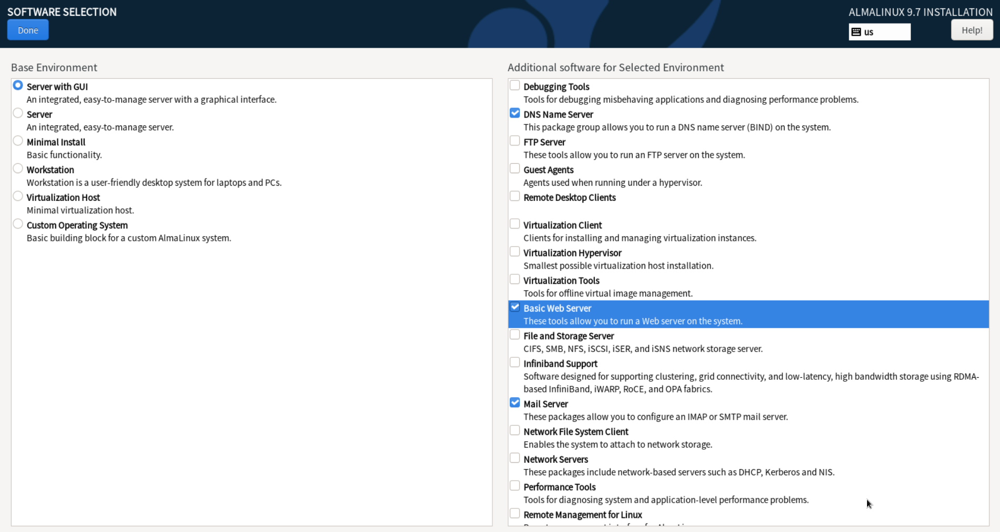{width=70%}

### Root Password Settings

Click on **"Root Password."** Here, you will set the password for the
**root** user, who holds system administrative privileges for Linux.

To avoid typing errors, enter the same password twice in the **"Root
Password"** and **"Confirm"** fields.

If the password does not meet certain requirements such as length or a
mix of uppercase, lowercase, and numbers it will be labeled as a
"weak" password. You should either enter a password that is labeled as
"Good" or better; otherwise, if the password is to weak, you must
click the **"Done"** button **twice** to proceed.

Once the root password has been set, click the **"Done"** button.

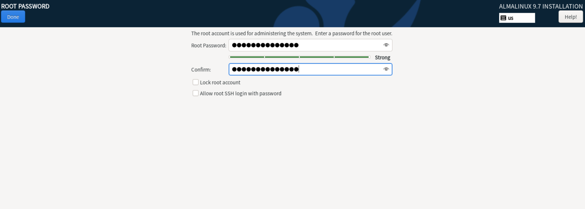{width=70%}

### Beginning the Installation

Once all the necessary settings are complete, begin the installation.
Click the **"Begin Installation"** button.

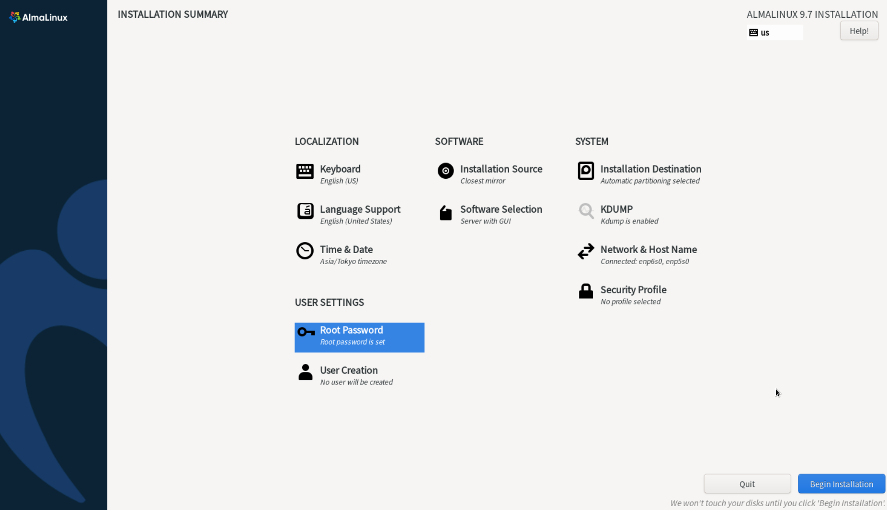{width=70%}

The installation will begin, and the **"Installation Progress"**
screen will be displayed.

Once the installation is complete, click the **"Reboot System"**
button to restart the machine.

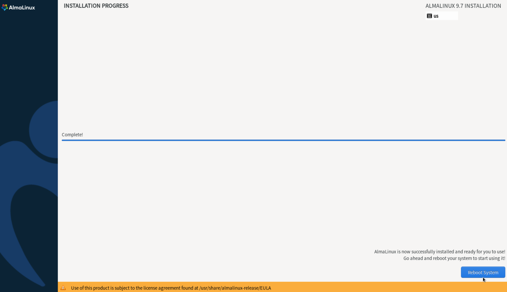{width=70%}

## Post-Installation Initial Setup

Once the system has rebooted, perform the initial setup. Click the
**"Start Setup"** button.

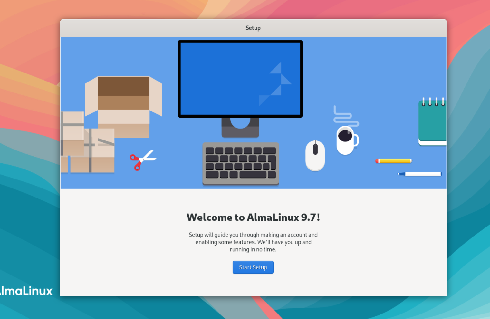{width=70%}

### Privacy

Configure whether or not to provide information using location services.
This setting does not affect the system's performance, so you may turn
it either **ON** or **OFF**. Once configured, click the **"Next"**
button.

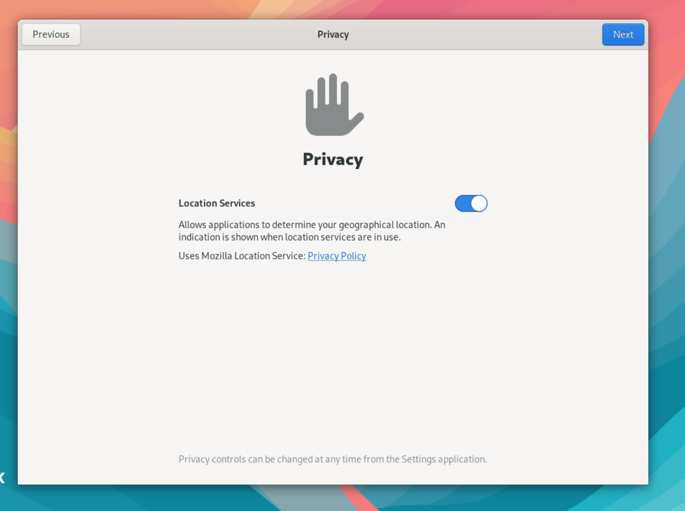{width=70%}

### Online Accounts

Configure the connection to your online accounts. Since there is no need
to connect them at this time, click the **"Skip"** button.

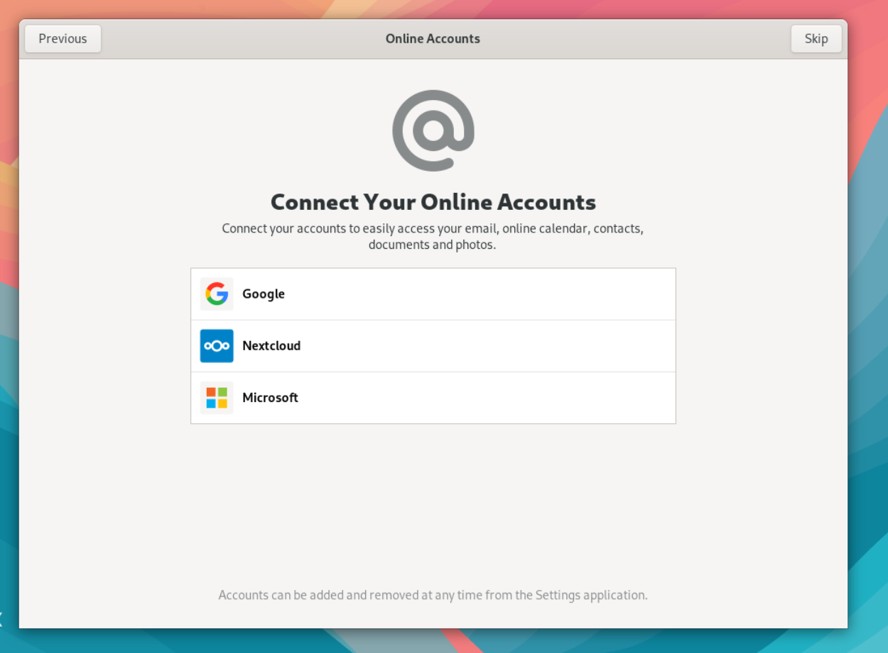{width=70%}

### User Information

Create the initial user. Configure the following settings to create a
server administration user for the exercises.

  | Item | Setting Value |
  |---|---|
  | Full name | admin |
  | Username | admin |

After setting it up, click the "Next (N)" button.

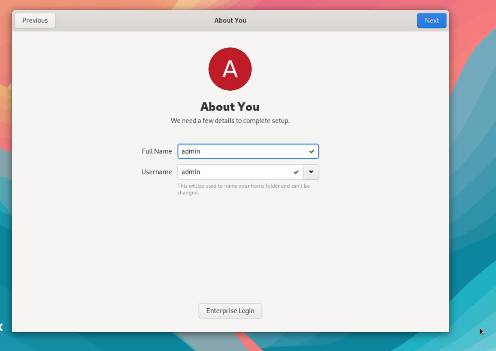{width=70%}

Set the password for the **"admin"** user as well. Just like the root
password, enter the same password in both the **"Password"** and
**"Confirm"** fields.

Once configured, click the **"Next"** button.

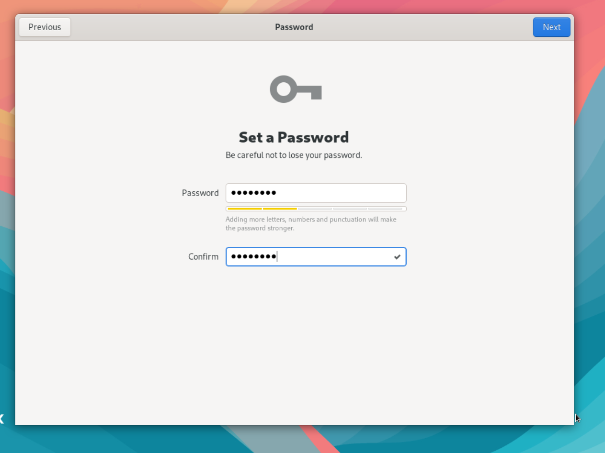{width=70%}

Once you have completed all settings, click the "Get Started with
AlmaLinux (S)" button.

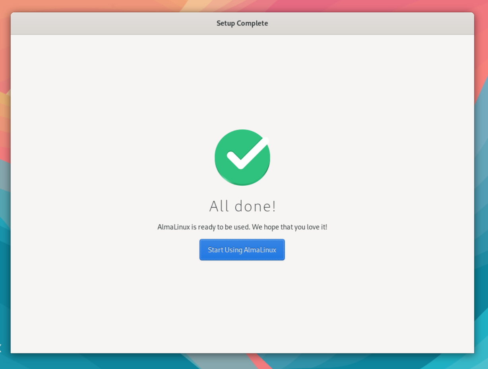{width=70%}

The initial setup screen will switch to the GUI desktop. A **"Welcome
to AlmaLinux"** message will appear, and you can start a tour to check
how to operate the system. If you wish to see the tour, click the
**"Take a Tour"** button. If this is your first time using the
AlmaLinux GUI, it is a short tour, so please consider checking it out.

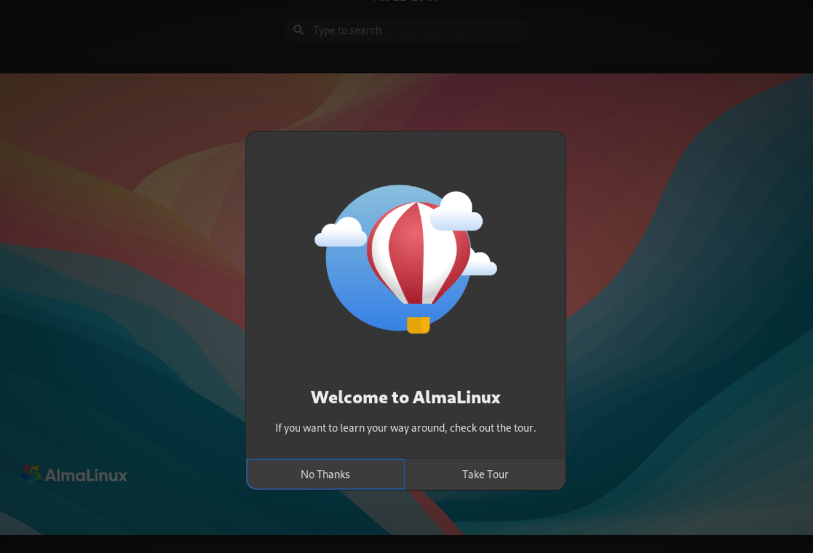{width=70%}


## Logging In and Logging Out

To start using Linux, you must **log in**, and once you are finished,
you **log out**. Since you are currently logged in automatically as the
initial user, let's try logging out and then logging back in.

### How to Log Out

To log out, click the **Power icon** in the menu bar at the top right of
the screen. Then, click **"Power Off / Log Out"** and select **"Log
Out"** from the options that appear.

A confirmation dialog will be displayed; click **"Log Out"** to
proceed.

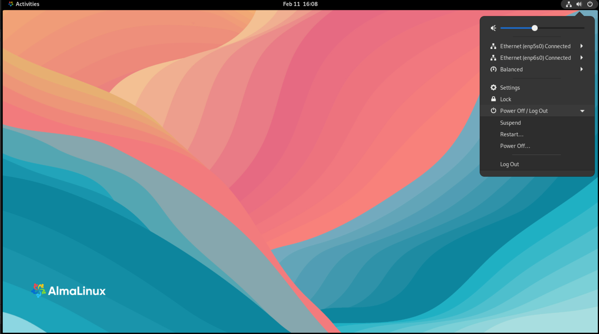{width=70%}


### How to Log In

To log in, click to select the user you want to log in as, and then
enter the password.

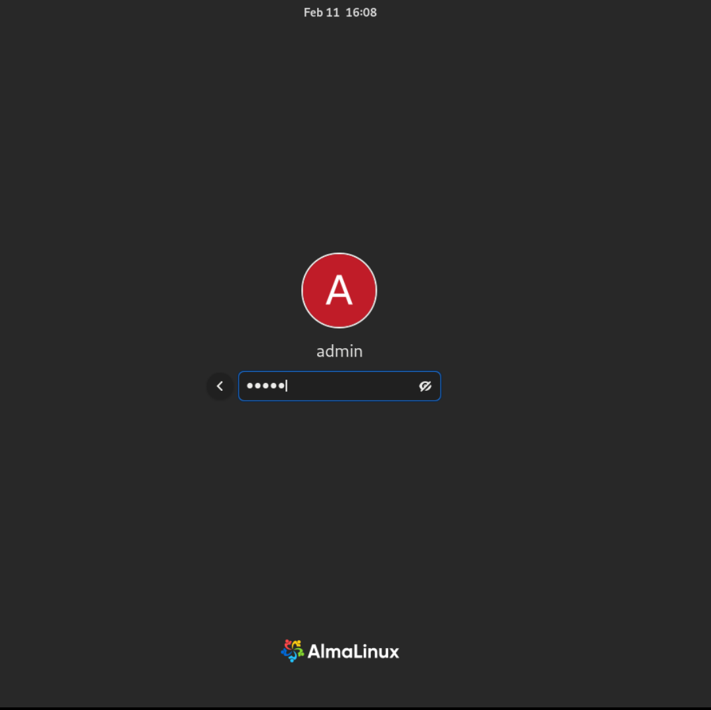{width=70%}

## Launching the Terminal for Command Execution

To operate Linux by executing commands, launch the **"Terminal"** app.
Click on **"Activities"** in the top-left corner of the screen, then
click the **"Terminal"** app icon from the icons displayed at the
bottom of the screen.

{width=70%}

You can also operate the system by connecting remotely from the **Host
OS** using **SSH**, rather than operating the virtual machine directly.
For the specific method, please refer to the explanation in **Chapter
7**.

## Verifying Network Connectivity

Verify that the network is correctly connected. There are two types of
connections to test: the connection to external networks or the internet
via **NAT**, and the connection to the **Host OS** via the **Host-Only
Network**. Each will be tested individually.

### Verifying Name Resolution

Use the *dig* command to verify name resolution via **DNS**.

```
$ dig lpi.or.jp
(Omitted)
;; QUESTION SECTION :
;lpi.or.jp. IN A
;; ANSWER SECTION :
lpi.or.jp. 5 IN A 219.94.215.12
(Omitted)
You can see that DNS name resolution is working properly.
```

### Verifying Internet Connectivity

Use the *ping* command to verify the connection to a server on the
internet.

```
$ ping lpi.or.jp
PING lpi.or.jp (219.94.215.12) 56(84) bytes of data.
64 bytes from 12.215.94.219.static.www232b.sakura.ne.jp (219.94.215.12):
icmp_seq=1 ttl=128 time=15.8 ms
^C
--- lpi.or.jp ping statistics ---
1 packets transmitted, 1 received, 0% packet loss, time 0ms
```

To stop the execution of the **ping** command, press **Ctrl + c**. This
confirms that communication is functioning correctly. You can also see
that the destination IP address is the same as the one you found using
the **dig** command.

Since some servers do not return a response to the ping command, if you
do not receive a reply, you should try connecting to other servers.
Alternatively, you can try launching a **web browser** within the Linux
GUI to see if you can connect to a website.

### Verifying the Connection from the Guest OS to the Host OS

Use the **ping** command to verify the connection to the Host OS. The IP
address for the Host OS side is **"192.168.56.1"**, as confirmed in
the VirtualBox network settings.

```
$ ping 192.168.56.1
PING 192.168.56.1 (192.168.56.1) 56(84) bytes of data.
64 bytes from 192.168.56.1: icmp_seq=1 ttl=64 time=6.59 ms
^C
--- 192.168.56.1 ping statistics ---
1 packets transmitted, 1 received, 0% packet loss, time 0ms
rtt min/avg/max/mdev = 6.592/6.592/6.592/0.000 ms
```

### Verifying the Connection from the Host OS to the Guest OS

Launch the **Command Prompt** on the Host OS and use the **ping**
command to verify the connection to the Guest OS. The IP address for the
Guest OS is **"192.168.56.101"**.

To launch the Command Prompt, type **"cmd"** into the "Type here to
search" box at the bottom left of your screen. When **"Command
Prompt"** appears in the search results, click it to open.

Once open, execute the **ping** command.

```
> ping 192.168.56.101
Pinging 192.168.56.101 with 32 bytes of data:
Reply from 192.168.56.101: bytes=32 time<1ms TTL=64
Ping statistics for 192.168.56.101:
Packets: Sent = 1, Received = 1, Lost = 0 (0% loss),
Approximate round trip times in milli-seconds:
Minimum = 0ms, Maximum = 0ms, Average = 0ms
Once you have confirmed, press Ctrl+C to stop the operation.
\pagebreak
```
