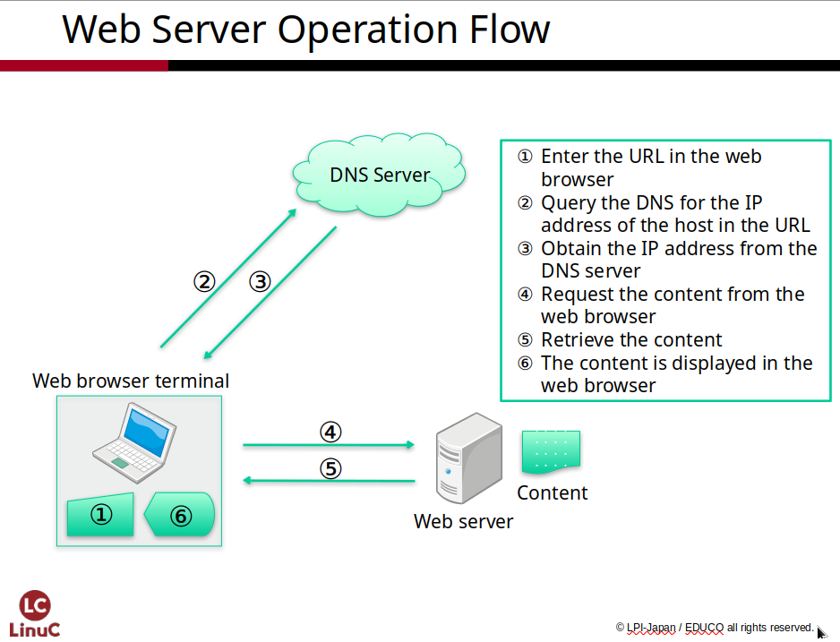
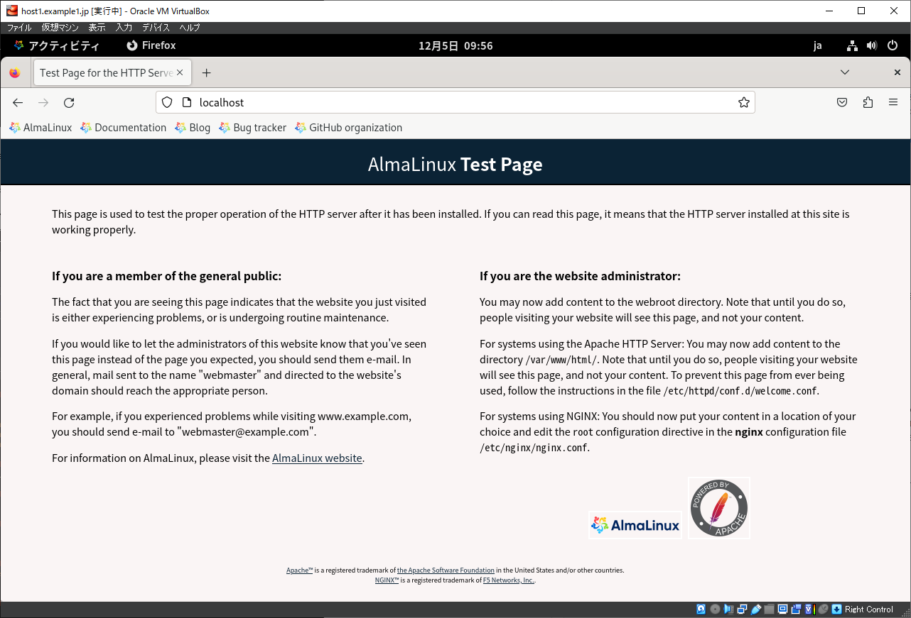
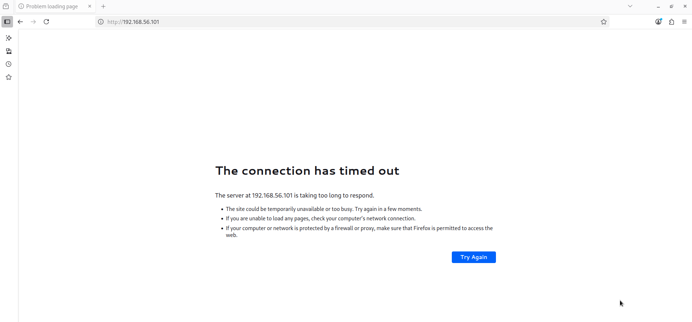
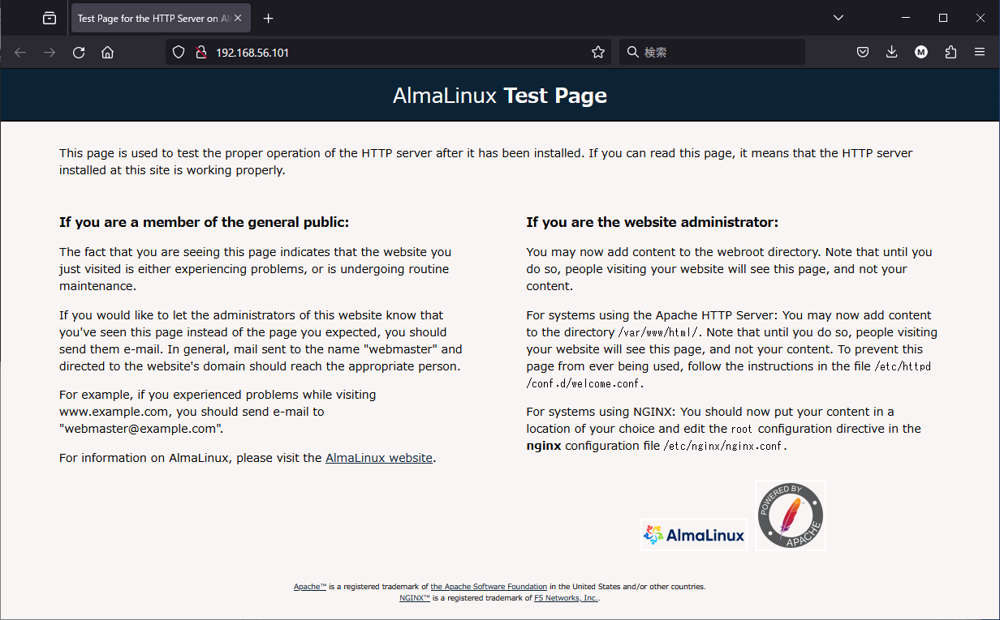
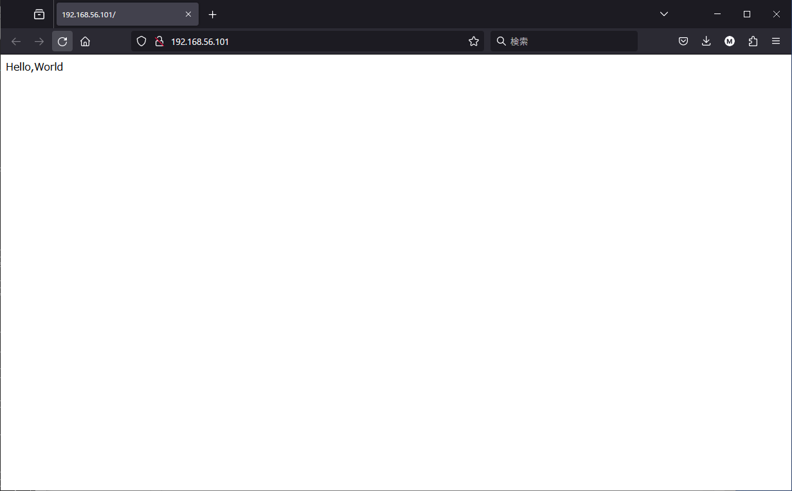

# Building a Web Server

In Chapter 4, we will set up a Web service to publish homepages and web
systems. We will also cover package installation, system administration
privileges, and network access restrictions with security in mind.

## Glossary

### HTML (HyperText Markup Language) {.unlisted .unnumbered}

A markup language used to write web pages by structurally describing
text using tags. It allows for hyperlinks to other documents, the use of
images, and advanced expressions such as lists and tables. Today, highly
sophisticated web pages are created by combining HTML with **CSS
(Cascading Style Sheets)** for layout and **JavaScript** for
programming.

### HTTP (HyperText Transfer Protocol) {.unlisted .unnumbered}

The communication protocol used between web browsers and web servers
to send and receive content (data) like HTML. A "Request" for a file
and a "Response" (sending the file back) form a single session.
Currently, **HTTPS (Hypertext Transfer Protocol Secure)**, which
increases security by encrypting communication, is the standard.

### Apache HTTP Server {.unlisted .unnumbered}

The most widely used web server in the world, utilized for everything
from large-scale commercial sites to home servers. It is open-source
software developed by the Apache HTTP Server Project under the Apache
Software Foundation.

### URL (Uniform Resource Locator) {.unlisted .unnumbered}

A method for specifying resources on the internet, such as homepage or
email addresses. It consists of a **scheme name** (which identifies the
resource type) and an **address** connected by *://*.

### Package {.unlisted .unnumbered}

A collection of files including the program binaries, configuration
files, and documentation, bundled together for easy installation. For
large programs, the main body, libraries, and various extensions are
often split into separate packages so they can be installed selectively.
A Linux distribution can be thought of as a collection of these
packages.

### System Administration Privileges {.unlisted .unnumbered}

Linux is a multi-user OS where multiple users can use the system
simultaneously. System administration privileges allow for changes to
the entire system---permissions that are not granted to general users.
In Linux, only the **root user** or users granted permission to use the
**sudo command** can exercise these administrative powers.

## How Web Servers Work

A **Web system** is the most representative type of **client-server
system** used in an internet environment. It is composed of a **Web
server** and a client's **Web browser**.

The Web server provides the requested files to the Web client, and the
client displays the files it has received.

{width=70%}

The information provided covers a wide range, from **text to images and
videos**, and can include any data that the client is capable of
supporting.

**HTML** is commonly used for text data within Web systems. While the
**Apache HTTP Server** is widely used as a Web server, others like
**Nginx** (pronounced "Engine-X") and **Web application servers
**which are specialized for running various web applications are also
frequently used.

## Package Installation

To run a Web server on Linux, you must first install the Web server
software. While it is possible to compile and run the software from
**source code**, using a **package** allows for an easier installation
process.

The **AlmaLinux** distribution used in this practical training utilizes
the **RPM format** for packages, and the **dnf command** is available as
the package management tool.

### The dnf Command

By using the **dnf command**, you can perform tasks such as installing,
removing, and updating software packages.

### dnf vs. yum

The **dnf command** is the successor to the **yum command**, replacing
it as the standard for package management. Subcommands like *dnf
install* can generally be executed using the *yum* command as well,
maintaining compatibility.

### Obtaining Root Privileges with the sudo Command

Installing packages via the *dnf* command involves making changes to the
system, which requires **root (administrator)** privileges. To obtain
root privileges while executing a command, use the **sudo command**.
Users created during the OS installation or initial setup are typically
granted the authority to execute the *sudo* command.

### Installing Packages with the dnf install Command

The **dnf command** retrieves the packages required for installation
from locations known as **repositories**. Typically, repository servers
are available on the internet, and packages are downloaded via an
internet connection. This guide assumes that an internet connection is
available for these tasks.

### If a Proxy is Required

If your internet access requires a **proxy server**, you can enable
access by configuring the proxy settings within the *dnf* configuration
files. Please refer to the official manuals for specific configuration
methods.

### Package Management in Offline Environments

In environments without internet access, you cannot reach online
repositories. Therefore, you must use alternative installation methods.
While this textbook generally uses a method of selecting necessary
software during the OS installation, other situations may require the
following:

-   **Pre-selecting software:** Choosing all necessary software during
    the initial OS installation process.
-   **Manual RPM installation:** Using the *dnf* command to manually
    install *.rpm* files contained within an ISO image.
-   **Local ISO repository:** Creating a configuration file to treat an
    ISO image as a local repository.
-   **Local network repository:** Setting up a dedicated repository
    server within an accessible local area network (LAN).

However, methods other than setting up a local repository server make it
difficult to install the latest security updates. For actual system
operation, it is essential to plan a method that allows for continuous
package updates.

### Resolving Dependencies

When a software package requires other packages to function, the *dnf*
command automatically installs those additional packages simultaneously.
This requirement for other software is known as a **dependency**.

## Installing Packages with the dnf install Command

The package name for the **Apache HTTP Server** is ***httpd***. To
install it, execute the *dnf install* command prefixed with the *sudo*
command.

```
$ sudo dnf install httpd
Last metadata expiration check: 1:41:14 ago on December 05, 2023, at
08:09:38 AM.
Dependencies resolved.
==========================================================================
Package Arch Version Repository Size
==========================================================================
Installing:
httpd x86_64 2.4.57-5.el9 appstream 46 k
Installing dependencies:
almalinux-logos-httpd noarch 90.5.1-1.1.el9 appstream 18 k
Installing weak dependencies:
mod_http2 x86_64 1.15.19-5.el9 appstream 148 k
mod_lua x86_64 2.4.57-5.el9 appstream 60 k
Transaction Summary
==========================================================================
Install 4 Packages
Total download size: 272 k
Installed size: 601 k
Is this ok? [y/N]: y ← (Input 'y')
Downloading Packages:
(1/4): almalinux-logos-httpd-90.5.1-1.1.el9.noa ...
(omitted)
Importing GPG key 0xB86B3716:
Userid : "AlmaLinux OS 9 <packager@almalinux.org>"
Fingerprint : BF18 AC28 7617 8908 D6E7 1267 D36C B86C B86B 3716
From : /etc/pki/rpm-gpg/RPM-GPG-KEY-AlmaLinux-9
Is this ok? [y/N]: y ← (Input 'y')
Key imported successfully
Running transaction check
Transaction check succeeded.
Running transaction test
Transaction test succeeded.
Running transaction
Preparing : 1/1
Installing : mod_lua-2.4.57-5.el9.x86_64 1/4
Installing : almalinux-logos-httpd-90.5.1-1.1.el9.noarch 2/4
Installing : mod_http2-1.15.19-5.el9.x86_64 3/4
Installing : httpd-2.4.57-5.el9.x86_64 4/4
Running scriptlet: httpd-2.4.57-5.el9.x86_64 4/4
Verifying : almalinux-logos-httpd-90.5.1-1.1.el9.noarch 1/4
Verifying : httpd-2.4.57-5.el9.x86_64 2/4
Verifying : mod_http2-1.15.19-5.el9.x86_64 3/4
Verifying : mod_lua-2.4.57-5.el9.x86_64 4/4
Installed:
almalinux-logos-httpd-90.5.1-1.1.el9.noarch httpd-2.4.57-5.el9.x86_64
mod_http2-1.15.19-5.el9.x86_64 mod_lua-2.4.57-5.el9.x86_64
Complete!
```

When you execute the **sudo command** for the first time, you will be
prompted for the password of the user currently running the command.
After running a *sudo* command, you will not be asked for the password
again for a short period; however, it will be requested again after a
certain amount of time has elapsed.

The **dnf command** accesses the repositories, retrieves a list of newly
available packages, and updates the package database.

It checks the **dependencies** of the *httpd* package being installed
and simultaneously installs any required additional packages. In the
execution example, the system proposes installing a total of three
additional packages: one package with a strict dependency and two
packages with "weak" dependencies. If there are no issues, enter **y**
to proceed with downloading and installing the packages.

## Starting the Web Server

Now, you will start the Web server. Use the **systemctl command** to
start the Web server as a background service.

### The systemctl Command

The **systemctl command** is used to control **systemd**. systemd is the
very first process executed by the Linux kernel when the OS boots, and
it manages the entire system. The *systemctl* command manages its
targets in units called **"Units."**

### Starting the Web Server with systemctl start

To start the Web server, execute the **systemctl start** command.
systemd manages the Web server as a unit named **httpd.service**. The
*.service* extension of the unit name can be omitted as long as there
are no other units with the same name.

```
$ sudo systemctl start httpd
```

If no errors occur, the **systemctl start** command will complete
without displaying any output.

## Verifying Web Server Operation with the systemctl status Command

Check whether the Web server is correctly running as a background
service. You should perform both a **system-level verification** and a
verification that it is **functioning as a Web server**.

### Checking Operation Status with systemctl status

Using the **systemctl status** command, you can check the status of a
managed unit and view a portion of its recent logs.

To exit the status display and return to the command prompt, press the
**Q** key.

```
$ sudo systemctl status httpd
● httpd.service - The Apache HTTP Server
         Loaded: loaded (/usr/lib/systemd/system/httpd.service; disabled; preset: disabled)
         Active: active (running) since Tue 2023-12-05 09:52:55 JST; 1s ago
             Docs: man:httpd.service(8)
     Main PID: 37780 (httpd)
         Status: "Started, listening on: port 443, port 80"
            Tasks: 214 (limit: 10786)
         Memory: 30.3M
                CPU: 46ms
         CGroup: /system.slice/httpd.service
                         |-37780 /usr/sbin/httpd -DFOREGROUND
                         |-37781 /usr/sbin/httpd -DFOREGROUND
                         |-37782 /usr/sbin/httpd -DFOREGROUND
                         |-37783 /usr/sbin/httpd -DFOREGROUND
                         |-37784 /usr/sbin/httpd -DFOREGROUND
                         `-37785 /usr/sbin/httpd -DFOREGROUND

Dec 05 09:52:55 host1.example1.jp systemd[1]: Starting The Apache HTTP Server...
Dec 05 09:52:55 host1.example1.jp systemd[1]: Started The Apache HTTP Server.
Dec 05 09:52:55 host1.example1.jp httpd[37780]: Server configured, listening on: port 443, port 80
```

### The Meaning of "Loaded"

This indicates whether the unit's configuration has been successfully
loaded into **systemd**. You can confirm the location of the unit
definition file and check if the **auto-start (enable)** settings have
been configured.

### The Meaning of "Active"

This represents the current activity status of the unit. You can use
this to verify whether the process is actually running.

## Confirming the Connection to the Web Server

Once the Web server has started, you can verify its operation by
connecting to it using various methods.

### Local Connection Check via the curl Command

If the Web server is running locally...

```
$ curl localhost
<!DOCTYPE html PUBLIC "-//W3C//DTD XHTML 1.1//EN" "http://www.w3.org/TR/xhtml11/DTD/xhtml11.dtd">

<html xmlns="http://www.w3.org/1999/xhtml" xml:lang="en">
    <head>
        <title>Test Page for the HTTP Server on AlmaLinux</title>
        <meta http-equiv="Content-Type" content="text/html; charset=UTF-8" />


        <div class="footer">
            <a href="https://apache.org">Apache&trade;</a> is a registered trademark of <a href="https://apache.org">the Apache Software Foundation</a> in the United States and/or other countries.<br />
            <a href="https://nginx.com">NGINX&trade;</a> is a registered trademark of <a href="https://www.f5.com">F5 Networks, Inc.</a>.
        </div>
    </body>
</html>
```

Since the Web server is running, the HTML for the sample page will be
returned.

### Local Connection Check via the Guest OS Web Browser

Try connecting to the Web server by launching a Web browser using the
virtual machine's

1.  GUI.Click **"Activities"** in the top-left corner of the screen.
2.  Click the **Firefox** icon (the leftmost icon) from the row of icons
    at the bottom of the screen.
3.  Enter **"localhost"** in the address bar and press the **Enter**
    key.

{width=70%}

You can see that the Web server returns HTML in response to the Web
browser's request, and the Web browser then interprets that HTML to
display the Web page. Image files, which were retrieved additionally
because the HTML requested them, are also embedded. In order to display
a single Web page, multiple **sessions** (exchanges) take place behind
the scenes within the Web browser to acquire image files and other
assets.

## Stopping the Web Server

Try stopping the Web server. To stop it, execute the **systemctl stop**
command.

```
$ sudo systemctl stop httpd
```

### Checking Operation Status with the systemctl status Command

Execute the **systemctl status** command to verify the current operating
state.

```
$ sudo systemctl status httpd
○ httpd.service - The Apache HTTP Server
Loaded: loaded (/usr/lib/systemd/system/httpd.service; disabled; preset: disabled)
Active: inactive (dead)
Docs: man:httpd.service(8)
Dec 05 09:52:55 host1.example1.jp systemd[1]: Starting The Apache HTTP Server...
Dec 05 09:52:55 host1.example1.jp systemd[1]: Started The Apache HTTP Server.
Dec 05 09:57:37 host1.example1.jp systemd[1]: Stopping The Apache HTTP Server...
Dec 05 09:57:38 host1.example1.jp systemd[1]: httpd.service: Deactivated successfully.
Dec 05 09:57:38 host1.example1.jp systemd[1]: Stopped The Apache HTTP Server.
```

The **Active** line has changed to **inactive (dead)**, and information
regarding processes is no longer displayed, indicating that the Web
server has stopped.

### Connection Check via the curl Command

Try executing the **curl command** while the Web server is in a stopped
state.

```
$ curl localhost
curl: (7) Failed to connect to localhost port 80: Connection refused
```

The error is displayed immediately, confirming that the Web server
cannot be accessed.

### Restarting the Web Server

Restart the Web server and verify that it has been restored to a state
where it can be accessed normally.

```
$ sudo systemctl start httpd
```

```
$ curl localhost
```

## Firewall Configuration and Remote Connection Verification

To enhance security, the firewall is configured by default to accept
only the bare minimum of network communication from external sources.
For this reason, even if you can connect to the Web server locally, you
cannot connect to it remotely. We will change the firewall settings to
allow remote connections.

### How to Verify Remote Connections on a Virtual Machine

To verify a remote connection, you will use a Web browser running on the
**Host OS** to connect to the Web server on the **Guest OS**. Although
they are on the same physical machine, they are logically separate
operating systems with separate IP addresses; therefore, the connection
is treated as reaching a remote Web server via a network.

### Confirming that Connections are Blocked by Default

First, check the current firewall settings. To manage the firewall, use
the **firewall-cmd** command.

```
$ sudo firewall-cmd --list-all
public (active)
target: default
(omitted)
services: cockpit dhcpv6-client ssh
(omitted)
```

Since the **services** line does not contain *http*, the connection is
not permitted. Once you have launched the Web browser on your **Host
OS**, enter **"192.168.56.101"** in the address bar and press the
**Enter** key.

{width=70%}

inability to connect from the host OS

The browser continues to wait for a response from the Web server, but
the test page is not displayed. Although the Web server is running, it
cannot be reached because the firewall is blocking the connection in
front of it. If you continue to wait, the Web browser will eventually
time out and display an error message.

### Changing Firewall Settings to Allow Connections

Use the **firewall-cmd** command to allow connections for the **http**
service.

```
$ sudo firewall-cmd --add-service=http --zone=public
success
```

Please check the firewall settings again.

```
$ sudo firewall-cmd --list-all
public (active)
target: default
(omitted)
services: cockpit dhcpv6-client http ssh
(omitted)
```

The **services** line now includes *http*, meaning the connection is
permitted. Connect to **"192.168.56.101"** from the Web browser on
your **Host OS** once again.

If the test page appears, it confirms that access from the Host OS is
passing through the firewall and successfully connecting to the Web
server.

{width=70%}

## Configuring Web Server Auto-start and Firewall Persistence

We have successfully started the Web server and configured the firewall;
however, these settings will become invalid if the OS is restarted.
Let's configure the system so that the Web server starts automatically
upon reboot and the firewall settings remain in place to allow HTTP
access.

### Restarting the OS

First, restart the OS to confirm that the Web server does **not** start
automatically and the firewall settings are **not** applied by default.
To restart the OS, execute the **reboot** command. You can run the
*reboot* command without using *sudo*.

```
$ reboot
```

### Verifying Operation After Reboot

Confirm that the Web server has **not** started automatically and that
HTTP is **not** permitted in the firewall settings.

```
$ sudo systemctl status httpd
```

```
$ sudo firewall-cmd --list-all
```

### Web Server Auto-start Configuration

To ensure the Web server starts automatically when the OS boots, execute
the **systemctl enable** command.

```
$ sudo systemctl enable httpd
Created symlink /etc/systemd/system/multi-user.target.wants/httpd.service -> /usr/lib/systemd/system/httpd.service.
```

### Automatic Firewall Configuration

To ensure the firewall is configured automatically when the OS boots,
execute the **firewall-cmd** command with the **permanent** option. When
running with the permanent option, the settings are not reflected in the
firewall's current state immediately; therefore, you must execute the
**firewall-cmd** command with the **reload** option to apply the
changes.

```
$ sudo firewall-cmd --add-service=http --zone=public --permanent
$ sudo firewall-cmd --reload
$ sudo firewall-cmd --list-all
```

### OS Restart and Verification

Restart the OS once more. After the reboot, verify that the Web server
has started automatically and that the firewall settings have been
applied correctly.

```
$ sudo systemctl status httpd
```

```
$ sudo firewall-cmd --list-all
```

## Checking the Logs

Access to the Web server and any errors that occur are recorded in log
files. **Access logs** are used to analyze who is accessing which pages,
while **error logs** are used to resolve any issues that arise. Let's
examine what kind of information is recorded in each.

### Checking the Web Server Log Files

Web server logs are recorded in the */var/log/httpd* directory. You need
administrative (root) privileges to check the files inside this
directory.

```
$ sudo ls /var/log/httpd
access_log  error_log
```

### Checking the Access Log

We will now examine the contents recorded in the access log.

```
$ sudo cat /var/log/httpd/access_log
::1 - - [05/Dec/2023:10:12:37 +0900] "GET / HTTP/1.1" 403 4681 "-" "curl/7.76.1"
192.168.56.1 - - [05/Dec/2023:10:12:45 +0900] "GET / HTTP/1.1" 403 4681 "-" "Mozilla/5.0 (Windows NT 10.0; Win64; x64; rv:120.0) Gecko/20100101 Firefox/120.0"
```

### Error Numbers (HTTP Status Codes)

One of the more confusing parts of the access log is the "error
number" (status code) that indicates the result of the request. While
there are many different codes defined, you will primarily see the
following two at this stage:

-   **200:** The access was **successful**.
-   **404:** The access **failed** because the requested file could not
    be found.

In addition to these two, you might also see codes like **304** or
**403** recorded in your logs.

### Checking the Error Log

We will now examine the contents recorded in the error log.

```
$ sudo cat /var/log/httpd/error_log
[Tue Dec 05 10:10:15.601798 2023] [core:notice] [pid 38902:tid 38902] SELinux policy enabled; httpd running as context system_u:system_r:httpd_t:s0
[Tue Dec 05 10:10:15.602587 2023] [suexec:notice] [pid 38902:tid 38902] AH01232: suEXEC mechanism enabled (wrapper: /usr/sbin/suexec)
[Tue Dec 05 10:10:15.620801 2023] [lbmethod_heartbeat:notice] [pid 38902:tid 38902] AH02282: No slotmem from mod_heartmonitor
[Tue Dec 05 10:10:15.627884 2023] [mpm_event:notice] [pid 38902:tid 38902] AH00489: Apache/2.4.57 (AlmaLinux) OpenSSL/3.0.7 mod_fcgid/2.3.9 configured -- resuming normal operations
[Tue Dec 05 10:10:15.627895 2023] [core:notice] [pid 38902:tid 38902] AH00094: Command line: '/usr/sbin/httpd -D FOREGROUND'
[Tue Dec 05 10:11:02.247923 2023] [autoindex:error] [pid 38905:tid 39025] [client 192.168.56.1:49370] AH01276: Cannot serve directory /var/www/html/: No matching DirectoryIndex (index.html) found, and server-generated directory index forbidden by Options directive
[Tue Dec 05 10:12:37.353480 2023] [autoindex:error] [pid 38906:tid 39093] [client ::1:33426] AH01276: Cannot serve directory /var/www/html/: No matching DirectoryIndex (index.html) found, and server-generated directory index forbidden by Options directive
[Tue Dec 05 10:12:45.191945 2023] [autoindex:error] [pid 38906:tid 39095] [client 192.168.56.1:49378] AH01276: Cannot serve directory /var/www/html/: No matching DirectoryIndex (index.html) found, and server-generated directory index forbidden by Options directive
```

The error log contains records output during the starting and stopping
of the web server, as well as detailed information regarding errors that
are also recorded in the access log.

Within the error log, you will find errors such as the following:

```
AH01276: Cannot serve directory /var/www/html/: No matching DirectoryIndex 
    (index.html) found, and server-generated directory index forbidden by 
    Options directive
```

This error indicates that **index.html** does not exist in the
**/var/www/html** directory. In reality, the 'test page' you were
seeing was simply the HTML content returned by the web server when a
**404 error** occurs; it just looked like a test page. Essentially, an
error was occurring because a required file could not be found. Let's
try to resolve this error.

### Placing the index.html File

Web servers are configured to look for HTML files and other content
within the **/var/www/html** directory to display in response to
requests from a web browser. Since nothing is currently placed in this
directory, a **404 error** was occurring. To resolve this error, we will
create an **index.html** file. "index.html" is the default filename
the web browser looks for when no specific file is specified in the URL.

Execute the following commands to create the **index.html** file in the
**/var/www/html** directory:

```
$ sudo sh -c "echo 'Hello ,World ' > /var/www/html/index.html"
```

Administrative privileges are required to write to this directory.
However, to create a file using redirection, you must execute the entire
command using *sh -c* called by the *sudo* command. Additionally, the
entire command is enclosed in **double quotes (")**, while the string
to be written is enclosed in **single quotes (')**. Please pay close
attention to this distinction when entering the command.

### Checking the Logs

Try accessing the web server from your web browser again. This time,
instead of the test page, you should see the string **"Hello, World"**
displayed.

{width=70%}

Also, please check how this is recorded in the access log, and confirm
that no new errors are being recorded in the error log.

\pagebreak
