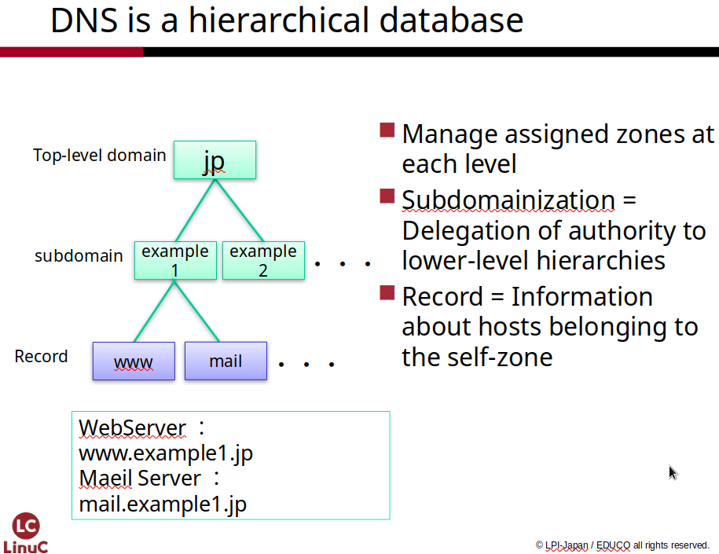
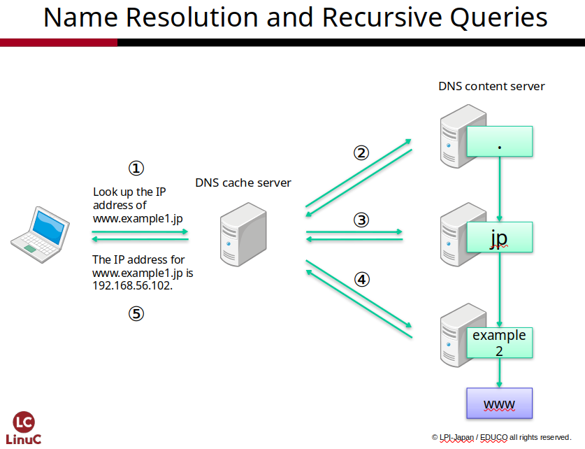
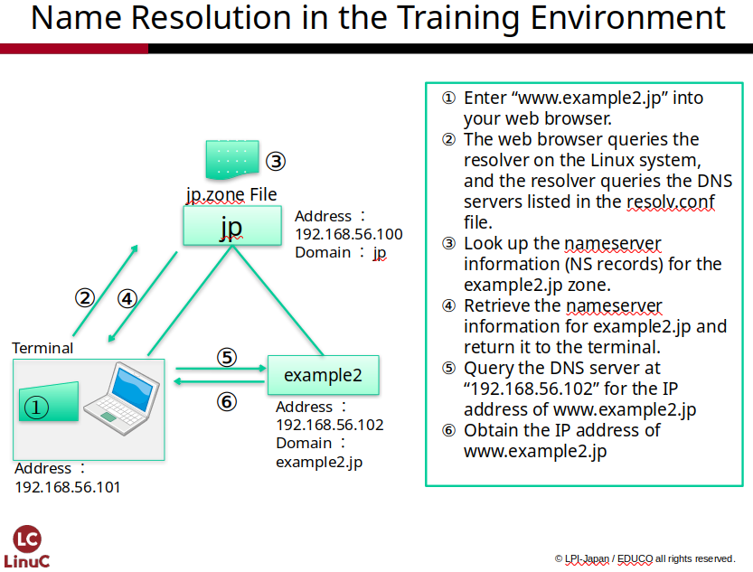
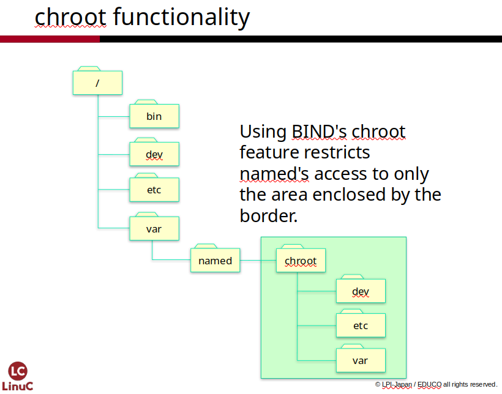
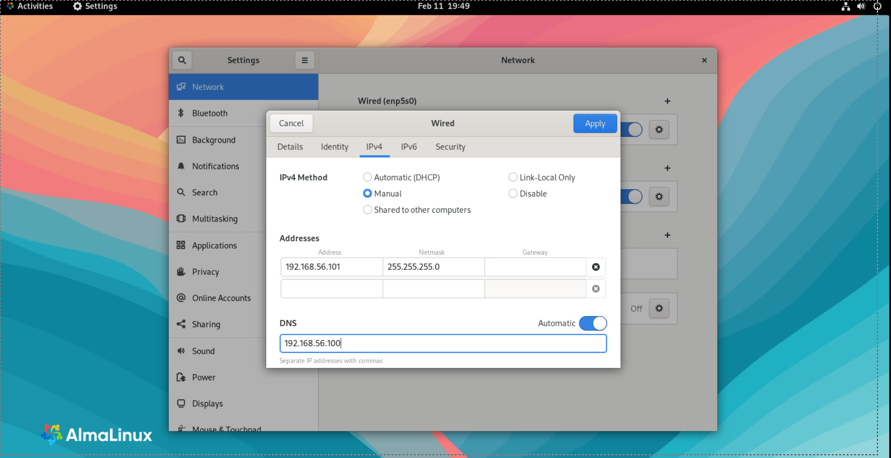

# Construction of a DNS Server
In Chapter 5, we will set up the Domain Name System (DNS), which serves
as the foundation for using network services through name resolution. We
will configure your DNS server so that it can be referenced by other
computers. You will become familiar with commands for querying DNS and
handle configuration files for the BIND program, which manages domains.

## Glossary
### DNS (Domain Name System) {.unlisted .unnumbered}

DNS is a system that registers IP addresses and
their corresponding hostnames. It responds to inquiries from programs by
providing the associated IP address or hostname.

### Domain Names and Zones {.unlisted .unnumbered}

The names assigned to organizations for use on the internet are called
**Domain Names**. Domain names are managed by **ICANN** (Internet
Corporation for Assigned Names and Numbers). When configuring a domain
name within DNS, it is referred to as a "**Zone**" rather than a
domain.

### Zone {.unlisted .unnumbered}

A **Zone** is a specific portion extracted from the DNS namespace. It
is used as the administrative unit for DNS management. A zone includes
domains, subdomains, and hostnames. While the DNS namespace is
represented as a tree structure, a zone is a segment containing part or
all of the nodes below a specific point.

### FQDN (Fully Qualified Domain Name) {.unlisted .unnumbered}

FQDN is a notation style that
describes the domain name all the way to the root domain by ending with
a "." (dot) on the far right.

### DNS Cache Server {.unlisted .unnumbered}

This server performs name queries on behalf of programs by contacting
various other DNS servers and returning the results. It is called a
**DNS Cache Server** because it caches (saves) the results of these
searches to provide them quickly for future inquiries. When "DNS
Server" is mentioned in client network settings, it usually refers to a
DNS Cache Server.

### DNS Content Server {.unlisted .unnumbered}

A **DNS Content Server** manages the IP addresses and hostnames for a
delegated zone. To use a domain name you have acquired, you must prepare
and configure a DNS Content Server.

### Resolver {.unlisted .unnumbered}

A **Resolver** is a program that performs name resolution, such as
searching for IP address information based on a domain name, or
searching for domain information based on an IP address.

### BIND (Berkeley Internet Name Domain) {.unlisted .unnumbered}

BIND is the most widely used DNS
server software in combination with Linux. It can function as both a DNS
Cache Server and a DNS Content Server.

### Glue Record {.unlisted .unnumbered}

A **Glue Record** is an "A record" for a delegated DNS content server.
It is required as additional information when a DNS server responds to a
query about a delegated zone by providing the address of the content
server for that zone.

### A Record {.unlisted .unnumbered}

The **A Record** is a type of record used to map a name (hostname) to an
IP address.

### NS (Name Server) Record {.unlisted .unnumbered}

The **NS Record** is used to specify the DNS content servers
(authoritative servers) that have authority over a zone.

### MX (Mail eXchange) Record {.unlisted .unnumbered}

The **MX Record** defines the domain name to be used for email
addresses. To handle potential mail server failures, multiple mail
servers can be listed; mail delivery is prioritized to the server with
the lower **preference value**.

## How DNS Works
Communication between computers on the internet is conducted using **IP
(Internet Protocol)**. While IP communication requires the
destination's IP address, it is extremely difficult for humans to
identify the vast number of computers on the internet using only
numerical IP addresses. To solve this, the concepts of **domain names**
and **hostnames** were introduced.

A domain name represents an **organization**, while a hostname refers to
a **specific computer** managed by that organization. When written, they
are formatted as *hostname.domainname* (separated by a dot), though
sometimes the entire string is simply referred to as the "hostname."

### The HOSTS File and DNS
At the beginning of internet research, the number of computers assigned
IP addresses was small enough to count on one's fingers. Therefore, the
mapping between hostnames and IP addresses was written in a file and
updated periodically. This mechanism still exists today; in Linux, that
file is **/etc/hosts**.

However, as the internet expanded, it became impossible to manage
everything through a single hosts file. This led to the emergence of
**DNS (Domain Name System)**.

### Management of Domain Names by DNS Content Servers
A DNS content server is prepared for each organization assigned a domain
name. The administrator of the DNS content server registers the
hostnames belonging to that domain and their assigned IP addresses into
the server. Users who want to access a host belonging to a certain
domain can obtain the IP address by querying that domain's DNS content
server.

In the DNS architecture, management authority for domains (zones) is
delegated to individual DNS administrators. This results in
**distributed management** rather than the centralized management seen
with host files. Because management tasks are shared and updates are
performed frequently, the system allows for the real-time lookup of
mappings between hostnames and IP addresses.

### Name Resolution via DNS Cache Servers
It would be extremely cumbersome if a user's terminal had to locate and
query the specific DNS content server every time it needed name
resolution. Instead, the terminal requests name resolution from a **DNS
Cache Server**. The DNS cache server then queries the DNS content
servers using a method called **recursive querying** (described later).
Once name resolution is complete, it returns only the final result to
the terminal.

Because of this structure, when configuring IP address settings on a PC
or smartphone, it is necessary to set the DNS server to be used for
searches. This setting is the IP address of the DNS cache server to
which you are delegating the name resolution.

Additionally, the results of name resolution are cached for a certain
period. If a request for the same hostname arrives, the server responds
from the cache, eliminating the need to look it up every time.

## Domain Structure
By design, the domain names handled by DNS form a hierarchical tree
structure with the **root domain** at the top. You can think of it
exactly like a computer's file system, which has a root directory as
its starting point.

Any domain located below another is called a **subdomain**. This
hierarchical DNS tree is composed of the root domain and a vast number
of subdomains.

{width=70%}

### Root Domain
The **root domain** is the starting point of a domain name. While it is
usually omitted in daily use, it is represented by a **"." (dot)**
when written as a formal domain name.

### Top-Level Domain (TLD)
Top-level domains include **Generic TLDs** based on organization type,
such as *.com* and *.org*, as well as **Country Code TLDs** like *.jp*.
In Japan's case, there are also **Organizational Type JP domains**
(e.g., *example.co.jp*) and **General-use JP domains** (e.g.,
*example.jp*).

### Writing Domain Names
Domain names are written starting from the **right side**. In an **FQDN
(Fully Qualified Domain Name)**, the root domain is on the far right,
followed by the top-level domain, and then the specific domain names
assigned to each organization moving toward the left. Each element is
separated by a **"." (dot)**.

### Examples of Domain Name Notation
-   *example.com.*
-   *example.jp.*
-   *example.co.jp.*

For the parts following the top-level domain, the domain registrant can
decide on a unique name. In the examples above, the "**example**"
portion corresponds to the unique domain name.

### Subdomains
Adding further domain names to the left of an existing domain name, as
shown in the notation examples, is called **"creating subdomains."**
For example, if you want to divide the *example.co.jp* domain into two
sections for Tokyo and Osaka, you would use a format like the following:

...it would be written as follows:

-   tokyo.example.co.jp.
-   osaka.example.co.jp.

Creating subdomains is handled by the administrator who manages the
**parent domain** (the part to the right in the notation). For example,
the subdomain hierarchy for *tokyo.example.co.jp* is structured as
follows:

1.  The **jp** domain is a subdomain of the **root domain**.
2.  The **co.jp** domain is a subdomain of the **jp** domain.
3.  The **example.co.jp** domain is a subdomain of the **co.jp** domain.
4.  The **tokyo.example.co.jp** domain is a subdomain of the
    **example.co.jp** domain.

### Acquiring a Domain Name
Acquiring a domain name essentially means having the administrator of a
parent domain create a subdomain for you and **delegating the management
authority** to you.

If you want to obtain a unique, short domain name, you must have a
subdomain created by the management organization that oversees the
Top-Level Domain (TLD); however, this involves costs such as
registration fees.

If you are not concerned about having a short domain name and wish to
avoid costs, you can also have management authority for a subdomain
delegated to you by an administrator who has already acquired a domain
name.

## Name Resolution Using DNS
When resolving a name using DNS---that is, looking up an IP address from
a hostname---the investigation is carried out through the following
steps:

1.  **The terminal** sends a query to the **DNS cache server** provided
    by its own organization or ISP.
2.  The **DNS cache server** queries a **root server** for
    "www.example1.jp." The root server returns the IP address of the
    DNS content server that manages **"jp"** to the DNS cache server.
3.  The **DNS cache server** queries the DNS content server managing
    **"jp."** This server returns the IP address of the DNS content
    server managing the subdomain **"example1.jp"** to the DNS cache
    server.
4.  The **DNS cache server** queries the DNS content server managing
    **"example1.jp."** This server returns the IP address of
    **"www.example1.jp"** to the DNS cache server.
5.  The **DNS cache server** returns the IP address of
    "www.example1.jp" to the **client**.

This process, where the DNS cache server queries from the root server
downward in sequence until it reaches the DNS content server managing
the target domain, is called an **"Iterative Query."**

{width=70%}

## Overview of the DNS Construction Exercise
We will build DNS content servers by setting up two domain names,
**"example1.jp"** and **"example2.jp,"** so they can resolve each
other's names. We will also configure the delegation of zone management
authority from the **"jp"** domain down to these subdomains. To
achieve this, we will build the following three DNS servers:

### The "jp" Zone Machine
This machine will treat *example1.jp* and *example2.jp* as subdomains
and will be configured to delegate zone management authority to them. It
will also function as a **DNS cache server**.

### The "example1.jp" Zone Machine
This machine will be configured as the DNS content server that manages
the *example1.jp* zone.

### The "example2.jp" Zone Machine
This machine will be configured as the DNS content server that manages
the *example2.jp* zone.

## Exercise Procedures
You will connect three machines and configure them so they can reference
each other's DNS settings. This will require creating two additional
virtual machines and installing their operating systems. We will perform
the following tasks:

1.  Use **BIND** (the DNS server software) to configure the DNS content
    server managing the **example1.jp** zone.
2.  Create virtual machines for the **jp zone** and **example2.jp zone**
    and install the OS. Please note that the IP address settings for
    each will be different.
3.  Configure the DNS content server managing the **example2.jp** zone.
4.  Configure the DNS content server managing the **jp zone**. Set up
    the delegation of authority for both the **example1.jp** and
    **example2.jp** zones.
5.  Confirm that the DNS for the **example1.jp** and **example2.jp**
    zones can be referenced mutually.

**Note:** The mail server construction in the next chapter assumes that
the DNS server is correctly configured, so it is essential to complete
all the exercises in this chapter thoroughly.

## Addresses and Domains Used in the Exercise
The domain names, hostnames, and IP addresses for the three servers used
in this exercise are as follows:

| Domain name | Host | IP Address |
|---|---|---|
| jp. | host0.jp. | 192.168.56.100 |
| example1.jp. | host1.example1.jp. | 192.168.56.101 |
| example2.jp. | host2.example2.jp. | 192.168.56.102 |

## Flow of Address Resolution
Let's trace the process when the machine **host1.example1.jp
(192.168.56.101)** resolves the hostname **www.example2.jp**.

When displaying a web page in a browser, we usually enter the website
address without being conscious of the DNS cache server. Using the
example of entering a web address and requesting a page until it is
displayed, here is a brief explanation of how DNS operates:

1.  On the **host1.example1.jp** machine, you enter *www.example2.jp*
    into the web browser's address bar.
2.  The web browser sends an inquiry to the **Linux resolver**.
3.  The resolver queries the **DNS cache server (192.168.56.100)**
    specified in the */etc/resolv.conf* file.
4.  The DNS cache server references the **jp zone** DNS content server,
    which returns the IP address of the **example2.jp zone** DNS content
    server (**192.168.56.102**).
5.  The DNS cache server then sends an inquiry to the **example2.jp
    zone** DNS content server.
6.  The **example2.jp zone** DNS content server returns the IP address
    of the **www.example2.jp** host (**192.168.56.102**).
7.  The **DNS cache server** returns the result to the **example1.jp**
    machine.
8.  The **web browser** accesses *www.example2.jp* via **HTTP**,
    receives the web page, and displays it.

In actual internet DNS name resolution, recursive queries are performed
starting from the root zone in order. However, in this exercise
environment, it is different because the **DNS cache server itself is
also the DNS content server for the jp zone**, so it can immediately
return information regarding the example2.jp DNS content server.

{width=70%}

## Configuring the DNS Content Server
We will install **BIND** as the DNS content server software and
configure the settings for each zone.

### BIND Security Using the chroot Feature
The **chroot** (change root) feature is a security measure designed to
restrict a program's access, preventing it from accessing files outside
of a specific directory.

When BIND is executed using the chroot feature, the *bind* process
operates as if the **/var/named/chroot** directory is the **/** (root)
directory. For example, if the *bind* process attempts to access the
*/etc* directory, it will actually be redirected to the
*/var/named/chroot/etc* directory. This ensures the process cannot
access sensitive password files or other critical security information
on the main system.

{width=70%}

Given its role in providing the critical DNS service, BIND is executed
on a vast number of servers across the internet, making it a frequent
target for security attacks. In the unlikely event that BIND is
compromised or "taken over" by an attack, the **chroot** feature
allows us to restrict the directories the process can access. This
prevents access to other system files and minimizes the potential
damage.

In AlmaLinux, features such as symbolic links and mounting are used to
ensure that management remains largely unchanged even when using chroot.
Therefore, we will enable the chroot feature in this book as well.
Please note that you will need to install the additional **bind-chroot**
package, and the service unit name used with the *systemctl* command
will be different (*named-chroot*).

### Flow of Configuring a Zone
The tasks required to configure a zone are as follows:

1.  Install BIND.
2.  Add the zone to the *named.conf* file.
3.  Create the zone file and define the records.
4.  Verify the configuration files for syntax errors.
5.  Start BIND.
6.  Enable BIND to start automatically on boot.
7.  Modify firewall settings.
8.  Disable the NAT network.
9.  Check the DNS server settings referenced in */etc/resolv.conf*.
10. Verify name resolution.

The file **/etc/named.conf** serves as the primary configuration file
for BIND. In this file, you add the fundamental settings for BIND as
well as the zone definitions. Furthermore, you will create **zone
files** in the **/var/named** directory to define the specific details
(records) for each zone.

## Installing BIND
To install BIND, both the *bind* package and the *bind-chroot* package
are required. If the necessary packages are not already installed, use
the *dnf* command to install them.

```
[admin@host1 ~]$ sudo dnf install bind bind-chroot
```

## Basic Configuration of /etc/named.conf
In the */etc/named.conf* file, we will configure the basic settings to
make BIND operate as a DNS content server.

```
[admin@host1 ~]$ sudo vi /etc/named.conf
```
```
options {
    listen-on port 53 { 127.0.0.1; 192.168.56.101; };  ← Add the server's IP address
    listen-on-v6 port 53 { ::1; };
    directory "/var/named";
    dump-file "/var/named/data/cache_dump.db";
    statistics-file "/var/named/data/named_stats.txt";
    memstatistics-file "/var/named/data/named_mem_stats.txt";
    recursing-file "/var/named/data/named.recursing";
    secroots-file "/var/named/data/named.secroots";
    allow-query { any; };  ← Change localhost to any

    recursion no;  ← Change yes to no

    dnssec-validation yes;

    managed-keys-directory "/var/named/dynamic";
    geoip-directory "/usr/share/GeoIP";

    pid-file "/run/named/named.pid";
    session-keyfile "/run/named/session.key";

    include "/etc/crypto-policies/back-ends/bind.config";
};

logging {
    channel default_debug {
        file "data/named.run";
        severity dynamic;
    };
};

zone "." IN {
    type hint;
    file "named.ca";
};

zone "example1.jp" IN {  ← Specify the example1.jp zone
    type master;
    file "example1.jp.zone";  ← Specify the zone definition filename for example1.jp
    allow-update { none; };
};

include "/etc/named.rfc1912.zones";
include "/etc/named.root.key";
```

The settings are as follows.

### Configuring Addresses to Accept Queries
The default *named.conf* file is configured to only respond to queries
sent to *127.0.0.1* (the local loopback interface). To allow the server
to receive queries from external sources, add the server's own IP
address, **"192.168.56.101;"**, to the *listen-on* directive. (When
configuring the *example2.jp* or *jp* servers later, you will enter
their respective IP addresses instead).

### Configuring Permitted Query Addresses
By default, *allow-query* is set to *"localhost;"*, meaning only the
local machine can perform DNS queries. Since a DNS content server must
be accessible to everyone on the internet (or your network), change this
setting to **"any;"**.

### Configuration as a DNS Content Server
On a DNS content server, **recursion** (recursive queries) should
generally be disabled. Therefore, set *recursion* to **"no;"**.

**Note:** For the **jp server** in this exercise, it will also function
as a DNS cache server, so you must leave this set to **"yes;"** on
that specific machine.

### Adding a Forward Lookup Zone
Add the zone definition to */etc/named.conf*. In the example for this
machine, it is configured as follows:

```
zone "example1.jp" IN {
    type master;
    file "example1.jp.zone";
    allow-update { none; };
};
```

## Preparing the Zone File
To create the zone file, we will copy the template file
**/var/named/named.empty**. The name of the new file must match the name
specified in the *file* clause of your zone definition in *named.conf*.
For the *example1.jp* zone, the filename will be **example1.jp.zone**.

To ensure the new file has the same ownership (**root:named**) and
permissions (**640**) as the original template, use the *cp* command
with the ***-p*** (preserve) option.

```
[admin@host1 ~]$ sudo cp -p /var/named/named.empty /var/named/example1.jp.zone
[admin@host1 ~]$ sudo ls -l /var/named/example1.jp.zone
-rw-r-----. 1 root named 152 Nov  8 01:28 /var/named/example1.jp.zone
```

## Editing the Zone File
Next, we edit the */var/named/example1.jp.zone* file that we just
copied.

```
[admin@host1 ~]$ sudo vi /var/named/example1.jp.zone
```

```
$TTL 3H
$ORIGIN example1.jp.
@       IN SOA  host1 root (
                                        2023100901       ; serial
                                        1D      ; refresh
                                        1H      ; retry
                                        1W      ; expire
                                        3H )    ; minimum
        NS      host1.example1.jp.
        MX 10   mail.example1.jp.

host1   A       192.168.56.101
www     A       192.168.56.101
mail    A       192.168.56.101
```

### $TTL
This sets the default **TTL (Time to Live)** to 3 hours. It tells other
DNS servers how long they should cache the information from this file
before asking for an update.

### \$ORIGIN
This specifies the base domain for the zone. In DNS files, hostnames
must be written as **FQDNs** (ending with a "."). If a name does not
end in a dot, BIND automatically appends the *$ORIGIN* value. For
example, *www* becomes *www.example1.jp.*.

### SOA Record
The **SOA (Start of Authority)** record defines the management policy
for the zone.

-   @: Represents the domain name specified in **\$ORIGIN**.
-   **host1 & root**: Represent the primary DNS server and the
    administrator's email. Note that *root.example1.jp.* is interpreted
    as the email [*root@example1.jp*](mailto:root@example1.jp).
-   **Serial Number**: **This is crucial.** You must update this number
    every time you change the file. The standard format is *YYYYMMDDNN*
    (Year, Month, Day, and a 2-digit revision number). If the serial
    isn't increased, secondary servers or caches won't recognize your
    changes.

### NS Record
The **NS (Name Server) record** identifies the DNS content server for
this zone. In this case, it points to the server itself.

### MX Record
The **MX (Mail Exchange) record** defines the mail server for the
domain.

-   **Important:** Ensure there is a "." at the end of the FQDN on the
    right side.
-   **Note:** The blank space at the start of the line indicates it is
    inheriting the same subject (the @ or domain) from the previous
    line.

### A Record
The **A (Address) record** maps a hostname to an IPv4 address.

-   **Left side:** The hostname (e.g., *host1*, *www*, *mail*). Since
    these don't end in a dot, the zone name is automatically appended.
-   **Right side:** The IP address assigned to that name.

## Verifying Configuration and Zone File Syntax
Once you have finished creating the configuration and zone files, it is
crucial to verify their syntax. Because DNS settings are extensive and
detailed, you should use dedicated commands to ensure there are no
errors.

### Verifying *named.conf* and Common Pitfalls
When editing */etc/named.conf*, missing braces *{ }* or semicolons *;*
are very common mistakes. Use the *named-checkconf* command to verify
the file.

```
[admin@host1 ~]$ sudo named-checkconf
```

If the command returns **nothing** (as shown above), the syntax is
correct. If there is a problem, it will display the line number where
the error was detected:

```
[admin@host1 ~]$ sudo named-checkconf
/etc/named.conf:11: missing ';' before '}'
```

In this example, the error indicates a missing semicolon after an IP
address inside the *listen-on* braces. Use these error messages as a
guide to clean up any issues.

### Verifying Zone Files
A frequent mistake in zone files is forgetting the trailing dot *.* when
writing an FQDN. Use the *named-checkzone* command to check for errors.
The arguments required are the **zone name** (specified in *$ORIGIN*)
and the **zone filename**.

```
[admin@host1 ~]$ sudo named-checkzone example1.jp. /var/named/example1.jp.zone
zone example1.jp/IN: loaded serial 2023100901
OK
```

If the syntax is correct, the command will display the serial number you
configured followed by "**OK**." If there is an error, it will point
out the problem:

```
[admin@host1 ~]$ sudo named-checkzone example1.jp. /var/named/example1.jp.zone
zone example1.jp/IN: NS 'host1.example1.jp.example1.jp' has no address records (A or AAAA)
zone example1.jp/IN: not loaded due to errors.
```

In this example, since the hostname written on the right side of the NS
record is not an FQDN, it results in 'host1.example1.jp.example1.jp,'
which causes an error because the corresponding A record cannot be
found.

## Starting and Verifying BIND
Let's start the BIND service. To start BIND, you use the *systemctl*
command with the *named-chroot* unit.

```
[admin@host1 ~]$ sudo systemctl start named-chroot
```

Once it starts up, check its status.

```
[admin@host1 ~]$ sudo systemctl status named-chroot
● named-chroot.service - Berkeley Internet Name Domain (DNS)
      Loaded: loaded (/usr/lib/systemd/system/named-chroot.service; disabled; preset: disabled)
      Active: active (running) since Mon 2023-10-09 15:18:44 JST; 6s ago
     Process: 12416 ExecStartPre=/bin/bash -c if [ ! "$DISABLE_ZONE_CHECKING" == "yes" ]; then /usr/sbin/named-checkconf -t /var/named/chroot /etc/named.conf; else echo "Checking of zone files is disabled"; fi (code=exited, status=0/SUCCESS)
     Process: 12418 ExecStart=/usr/sbin/named -u named -c ${NAMEDCONF} -t /var/named/chroot $OPTIONS (code=exited, status=0/SUCCESS)
    Main PID: 12419 (named)
        Tasks: 6 (limit: 10696)
      Memory: 21.2M
          CPU: 32ms
      CGroup: /system.slice/named-chroot.service
                 └─12419 /usr/sbin/named -u named -c /etc/named.conf -t /var/named/chroot

Oct 09 15:18:44 localhost.localdomain named[12419]: network unreachable resolving './DNSKEY/IN': 2001:500:9f::42#53
Oct 09 15:18:44 localhost.localdomain named[12419]: network unreachable resolving './NS/IN': 2001:500:9f::42#53
Oct 09 15:18:44 localhost.localdomain named[12419]: network unreachable resolving './DNSKEY/IN': 2001:7fe::53#53
Oct 09 15:18:44 localhost.localdomain named[12419]: network unreachable resolving './NS/IN': 2001:7fe::53#53
Oct 09 15:18:44 localhost.localdomain named[12419]: all zones loaded
Oct 09 15:18:44 localhost.localdomain named[12419]: running
Oct 09 15:18:44 localhost.localdomain systemd[1]: Started Berkeley Internet Name Domain (DNS).
Oct 09 15:18:44 localhost.localdomain named[12419]: resolver priming query complete
```

Confirm that **"active (running)"** is displayed in the Active field.
Additionally, you should see **"Started Berkeley Internet Name
Domain..."** in the logs displayed at the bottom, confirming that the
BIND service has started. To exit the status view, press the **Q** key.


## Automatic Startup Configuration
Let's configure BIND to start automatically when the system boots up.
Use the *systemctl enable* command to set this.

```
[admin@host1 ~]$ sudo systemctl enable named-chroot
Created symlink /etc/systemd/system/multi-user.target.wants/named-chroot.service → /usr/lib/systemd/system/named-chroot.service.
```

You can verify if automatic startup is enabled as follows:

```
[admin@host1 ~]$ sudo systemctl is-enabled named-chroot
enabled
```

If the setting is correctly configured, "**enabled**" will be
displayed.

## Firewall Configuration
Configure the firewall to allow service permissions so that inquiries
can be made to the DNS content server. Execute the following
*firewall-cmd* commands:

```
[admin@host1 ~]$ sudo firewall-cmd --add-service=dns --zone=public --permanent
[admin@host1 ~]$ sudo firewall-cmd --reload
```

## DNS Settings and Disabling the NAT Network
Before verifying name resolution by the DNS server, we will check and
modify the settings of the DNS server to be referenced. Additionally,
during these changes, we will stop the **NAT network** of the virtual
machines used in this lab environment.

Why stop the NAT network?

In many lab environments (like VirtualBox), the NAT network provides an
automatic DNS path to the outside world. To ensure you are testing
**your own BIND server** and not just the internet's DNS via the NAT
gateway, you need to disable it or ensure the internal "Host-Only"
network takes priority for your name resolution tests.

### Configuring Referenced DNS Servers via /etc/resolv.conf
In Linux, the DNS servers referenced for name resolution are defined in
the */etc/resolv.conf* file.

```
[admin@host1 ~]$ cat /etc/resolv.conf
# Generated by NetworkManager
search flets-east.jp example1.jp
nameserver 192.168.11.1
nameserver 192.168.56.101
```

The contents of this file will vary depending on your specific network
environment. However, in the *nameserver* settings which specify which
DNS servers to look up you will likely see two types of entries:

1.  The **192.168.56.101** address that you configured during
    installation.
2.  Other addresses (like *192.168.11.1* in the example) that were
    automatically assigned by the **DHCP** server of the **NAT
    network**.

### What Happens if You Edit /etc/resolv.conf with an Editor?
If you modify */etc/resolv.conf* using a text editor, the changes take
effect **immediately**.

However, as indicated by the comment *# Generated by NetworkManager* at
the top of the file, */etc/resolv.conf* is automatically managed by
**NetworkManager**. Consequently, any changes made with an editor will
be **discarded** whenever the file is regenerated (such as after a
system reboot). While editing the file directly is fine for temporary
testing, if you want the settings to persist, you must modify the
underlying network configuration. At the end of this chapter, we will
explain how to modify the network interface settings permanently.

In the following steps, we will use NetworkManager to regenerate the
configuration file. Please note, however, that this method is also not a
permanent change; if the system is rebooted, the NAT network interface
will be re-enabled, and the changes will be discarded and reverted.

### Checking the Network Interface Names
First, check the names of your network interfaces.

```
[admin@host1 ~]$ ip -4 a
2: enp0s3: <BROADCAST,MULTICAST,UP,LOWER_UP> mtu 1500 qdisc fq_codel state UP group default qlen 1000
    inet 10.0.2.15/24 brd 10.0.2.255 scope global dynamic noprefixroute enp0s3
       valid_lft 85842sec preferred_lft 85842sec
3: enp0s8: <BROADCAST,MULTICAST,UP,LOWER_UP> mtu 1500 qdisc fq_codel state UP group default qlen 1000
    inet 192.168.56.101/24 brd 192.168.56.255 scope global noprefixroute enp0s8
       valid_lft forever preferred_lft forever
```

In this example, based on the IP address **"10.0.2.15"**, we can
identify that the NAT network interface is **"enp0s3"**.

### Disabling the NAT Network
To ensure that your DNS queries are handled by your own server and not
bypassed through the NAT gateway, you need to disable the NAT network
interface. Use the *nmcli* (Network Manager CLI) command to bring the
connection down:

```
[admin@host1 ~]$ sudo nmcli connection down enp0s3
Connection 'enp0s3' successfully deactivated (D-Bus active path: /org/freedesktop/NetworkManager/ActiveConnection/2)
```

### Verifying Changes to /etc/resolv.conf
NetworkManager regenerates */etc/resolv.conf* every time network
settings are modified. Verify that the changes have been applied.

```
[admin@host1 ~]$ cat /etc/resolv.conf
# Generated by NetworkManager
search example1.jp
nameserver 192.168.56.101
```

In this way, the settings for the DNS server being referenced have
become only for itself.

### Re-enabling the NAT Network Connection
If you need to connect to the internet again, you must re-enable the
network interface using the *nmcli* command.

```
[admin@host1 ~]$ sudo nmcli connection up enp0s3
Connection successfully activated (D-Bus active path: /org/freedesktop/NetworkManager/ActiveConnection/6)
```

Once you have confirmed that your internet connection is restored,
**disable the NAT network again** to continue with your DNS lab.

```
[admin@host1 ~]$ sudo nmcli connection down enp0s3
```

[!CAUTION] **Warning:** Please keep in mind that this deactivation is
temporary. When the OS is rebooted, the NAT network will automatically
become active again, and settings will revert to their original state.

## Verifying Name Resolution
After starting BIND and disabling the NAT network, verify that name
resolution is functioning correctly. The ***dig*** command is a tool
used for this purpose.

### Verifying Host Name Resolution with the *dig* Command
Use the *dig* command to confirm that a hostname can be resolved to its
corresponding IP address. To execute this, specify the hostname you want
to resolve as an argument for the *dig* command.

```
[admin@host1 ~]$ dig host1.example1.jp

; <<>> DiG 9.16.23-RH <<>> host1.example1.jp @192.168.56.101
;; global options: +cmd
;; Got answer:
;; ->>HEADER<<- opcode: QUERY, status: NOERROR, id: 32703
;; flags: qr aa rd; QUERY: 1, ANSWER: 1, AUTHORITY: 0, ADDITIONAL: 1
;; WARNING: recursion requested but not available

;; OPT PSEUDOSECTION:
; EDNS: version: 0, flags:; udp: 1232
; COOKIE: 8375a6e1adca8c5501000000657d0ee8465100965cb0f7dc (good)
;; QUESTION SECTION:
;host1.example1.jp.		IN	A

;; ANSWER SECTION:
host1.example1.jp.	10800	IN	A	192.168.56.101

;; Query time: 0 msec
;; SERVER: 192.168.56.101#53(192.168.56.101)    ; referenced DNS server
;; WHEN: Sat Dec 16 11:43:52 JST 2023
;; MSG SIZE  rcvd: 90
```

You can verify that the A record for host1.example1.jp is correctly
configured.

### What to Do if Name Resolution Fails
If name resolution does not work correctly, check the **"SERVER"**
result in the third line from the bottom of the *dig* output to see if
it is set to **"192.168.56.101"**.

If you forget to disable the NAT network, the DNS server being
referenced will be the IP address configured on the NAT network side
instead of your own BIND server.

### Resolving Other A Records
In the same way, let's verify the resolution for **www.example1.jp**
and **mail.example1.jp**.

To check these, run the following commands:

```
[admin@host1 ~]$ dig www.example1.jp
(Omitted)
;; QUESTION SECTION:
;www.example1.jp. IN A

;; ANSWER SECTION:
www.example1.jp. 10800 IN A 192.168.56.101
(Omitted)
```
```
[admin@host1 ~]$ dig mail.example1.jp
(Omitted)
;; QUESTION SECTION:
;mail.example1.jp. IN A

;; ANSWER SECTION:
mail.example1.jp. 10800 IN A 192.168.56.101
(Omitted)
```

### Verifying NS Records with the *dig* Command

By specifying *ns* after the domain name in the *dig* command, you can
display the **NS records** (Name Server information) registered for that
domain, along with the **A records** for the hosts returned in those NS
records.

```
[admin@host1 ~]$ dig example1.jp ns
(Omitted)
;; QUESTION SECTION:
;example1.jp. IN NS

;; ANSWER SECTION:
example1.jp. 10800 IN NS host1.example1.jp.

;; ADDITIONAL SECTION:
host1.example1.jp. 10800 IN A 192.168.56.101
(Omitted)
```

### Verifying MX Records with the *dig* Command
By specifying *mx* after the domain name in the *dig* command, you can
display the **MX records** (Mail Exchange/mail server information)
registered for the domain. Similar to the NS record query, the **A
record** for the host returned in the MX record will also be displayed.

```
[admin@host1 ~]$ dig example1.jp mx
(Omitted)
;; QUESTION SECTION:
;example1.jp. IN MX

;; ANSWER SECTION:
example1.jp. 10800 IN MX 10 mail.example1.jp.

;; ADDITIONAL SECTION:
mail.example1.jp. 10800 IN A 192.168.56.101
(Omitted)
```

### Running the *dig* Command by Specifying a DNS Server
By adding the argument *[@IP address]* to the *dig* command, you can
temporarily change the DNS server being referenced. This is extremely
useful for troubleshooting and investigating causes when a DNS server is
not behaving as expected.

```
[admin@host1 ~]$ dig www.example1.jp @192.168.56.101
```

## Adding example2.jp and jp Servers
Now that the **example1.jp** domain is successfully configured, we will
add two additional virtual machines. These will act as the DNS servers
managing the **example2.jp** and **jp** domains, allowing for mutual
name resolution across the network.

To add these servers, please repeat the procedures from **Chapters 2 and
3**, using the information below as your guide.

### Considerations for Creating Virtual Machines
Create two additional virtual machines in VirtualBox. Follow the same
steps used for your previous VM, but ensure the **Virtual Machine Name**
matches the **Hostname** to help distinguish between them easily.

| Name |
|---|
| host2.example2.jp |
| host0.jp |

### Don't Forget to Add the Network Adapters
Since the virtual machines communicate with each other via the
**Host-only Network**, ensure that you add the necessary network adapter
to each new VM.

-   **Adapter 1:** NAT (Used for internet access/package installation).
-   **Adapter 2:** Host-only Adapter (Used for communication between
    your DNS servers).

### OS Installation
Install the OS on the virtual machines you created. Set the **hostname**
and **IP address** to match each specific server's role as defined
below:

| Host Name | IP Address | DNS |
|---|---|---|
| host2.example2.jp. | 192.168.56.102 | 192.168.56.102 |
| host0.jp | 192.168.56.100 | 192.168.56.100 |

### Verifying Mutual Communication
Once the OS has started on your new virtual machines, use the *ping*
command to verify that they can communicate with each other. Try
executing the *ping* command from each of the new machines toward the
already running *host1.example1.jp* as shown below:

```
[admin@host0 ~]$ ping -c 4 192.168.56.101
[admin@host2 ~]$ ping -c 4 192.168.56.101
```

## Configuring the example2.jp Zone
First, you will configure the **example2.jp** zone. The workflow is
identical to the one used for the *example1.jp* zone:

1.  Install BIND.
2.  Add the zone to the *named.conf* file.
3.  Create the zone file and define the records.
4.  Verify configuration files for syntax errors.
5.  Start the BIND service.
6.  Enable BIND to start automatically on boot.
7.  Modify firewall settings.
8.  Deactivate the NAT network.
9.  Verify the DNS server settings in */etc/resolv.conf*.
10. Verify name resolution (testing).

The following points highlight the differences from the *example1.jp*
configuration:

### named.conf Configuration
Configure *named.conf*. The key differences are that the *listen-on* IP
address is set to **192.168.56.102** and the zone name being defined is
**"example2.jp"**.

```
options {
    listen-on port 53 { 127.0.0.1; 192.168.56.102; };  ← Add the host IP address
    listen-on-v6 port 53 { ::1; };
    directory "/var/named";
    dump-file "/var/named/data/cache_dump.db";
    statistics-file "/var/named/data/named_stats.txt";
    memstatistics-file "/var/named/data/named_mem_stats.txt";
    recursing-file "/var/named/data/named.recursing";
    secroots-file "/var/named/data/named.secroots";
    allow-query { any; };  ← Change localhost to any

    recursion no;  ← Change yes to no

    dnssec-validation yes;

    managed-keys-directory "/var/named/dynamic";
    geoip-directory "/usr/share/GeoIP";

    pid-file "/run/named/named.pid";
    session-keyfile "/run/named/session.key";

    include "/etc/crypto-policies/back-ends/bind.config";
};

logging {
    channel default_debug {
        file "data/named.run";
        severity dynamic;
    };
};

zone "." IN {
    type hint;
    file "named.ca";
};

zone "example2.jp" IN {
    type master;
    file "example2.jp.zone";
    allow-update { none; };
};

include "/etc/named.rfc1912.zones";
include "/etc/named.root.key";
```

### Creating the Zone Definition File
Next, you will create the zone definition file. Copy the template file
*named.empty* and name it *example2.jp.zone*. Make sure you do not
forget the *-p* option.

```
[admin@host2 ~]$ sudo cp -p /var/named/named.empty /var/named/example2.jp.zone
[admin@host2 ~]$ sudo ls -l /var/named/example2.jp.zone
-rw-r-----. 1 root named 152 Nov  8 01:28 /var/named/example2.jp.zone
```

### Modifying the Zone File
Now, edit the */var/named/example2.jp.zone* file that you just copied.
You must be careful to ensure that the **zone name** is set to
*example2.jp*, the **hostname** is set to *host2*, and the **IP
address** is set to *192.168.56.102*.

```
[admin@host2 ~]$ sudo vi /var/named/example2.jp.zone
```

```
$TTL 3H
$ORIGIN example2.jp.
@       IN SOA  host2 root (
                    2023100901       ; serial
                    1D      ; refresh
                    1H      ; retry
                    1W      ; expire
                    3H )    ; minimum
    NS      host2.example2.jp.
    MX 10   mail.example2.jp.

host2   A       192.168.56.102
www     A       192.168.56.102
mail    A       192.168.56.102
```

### Starting BIND

Once you have completed the configuration of the **example2.jp** zone,
start the BIND service.

```
[admin@host2 ~]$ sudo systemctl start named-chroot
```

### Enabling Auto-start and Configuring the Firewall
To ensure the DNS service remains operational after a reboot and is
accessible by other servers, you must enable the service and open the
necessary ports in the firewall.

```
[admin@host2 ~]$ sudo systemctl enable named-chroot
[admin@host2 ~]$ sudo firewall-cmd --add-service=dns --zone=public --permanent
success
[admin@host2 ~]$ sudo firewall-cmd --reload
success
```

### Disabling the NAT Network
You will now deactivate the **enp0s3** network interface, which is used
for the NAT network.

```
[admin@host2 ~]$ sudo nmcli connection down enp0s3
```

Verify that /etc/resolv.conf has been modified.

```
[admin@host2 ~]$ cat /etc/resolv.conf
# Generated by NetworkManager
search example2.jp
nameserver 192.168.56.102
```

### Verifying Name Resolution
Now, verify that name resolution is working correctly for the new
domain. The verification method is identical to the *dig* command tests
you performed for the *example1.jp* zone.

```
[admin@host2 ~]$ dig host2.example2.jp
```

```
[admin@host2 ~]$ dig example2.jp ns
```

```
[admin@host2 ~]$ dig example2.jp mx
```

## Configuring the Parent "jp" Zone DNS Content Server
After completing the setups for *example1.jp* and *example2.jp*, you
will now configure the jp zone, which acts as the parent (upper-level)
zone. The workflow follows the same 10 steps used previously:

1.  Install BIND.
2.  Add the zone to *named.conf*.
3.  Create the zone file and define the records.
4.  Verify configuration files for errors.
5.  Start BIND.
6.  Enable auto-start.
7.  Modify firewall settings.
8.  Deactivate the NAT network.
9.  Verify */etc/resolv.conf* settings.
10. Verify name resolution.

The following points highlight the differences from your previous
configurations:

### named.conf Configuration
Configure *named.conf* on the **host-jp** server. The primary
differences are the IP address and the fact that this server will also
function as a **DNS Cache Server**.

-   ***listen-on***: Set the IP address to **192.168.56.100**.
-   ***zone name***: The zone name is defined as **"jp"**.
-   ***recursion***: Unlike the other servers, leave this set to
    ***yes;***. This allows the server to act as a cache server and
    resolve queries for other domains by communicating with the child
    servers.

```
options {
    listen-on port 53 { 127.0.0.1; 192.168.56.100; };  ← Add the host IP address
    listen-on-v6 port 53 { ::1; };
    directory "/var/named";
    dump-file "/var/named/data/cache_dump.db";
    statistics-file "/var/named/data/named_stats.txt";
    memstatistics-file "/var/named/data/named_mem_stats.txt";
    recursing-file "/var/named/data/named.recursing";
    secroots-file "/var/named/data/named.secroots";
    allow-query { any; };  ← Change localhost to any

    recursion yes;  ← Keep yes for the cache server role

    dnssec-validation yes;

    managed-keys-directory "/var/named/dynamic";
    geoip-directory "/usr/share/GeoIP";

    pid-file "/run/named/named.pid";
    session-keyfile "/run/named/session.key";

    include "/etc/crypto-policies/back-ends/bind.config";
};

logging {
    channel default_debug {
        file "data/named.run";
        severity dynamic;
    };
};

zone "." IN {
    type hint;
    file "named.ca";
};

zone "jp" IN {
    type master;
    file "jp.zone";
    allow-update { none; };
};

include "/etc/named.rfc1912.zones";
include "/etc/named.root.key";
```

### Creating the Zone Definition File
Next, you will create the zone definition file for the **jp** domain.
Copy the template file *named.empty* to create *jp.zone*. As with the
previous servers, the *-p* option is essential to preserve the correct
file attributes.

```
[admin@host0 ~]$ sudo cp -p /var/named/named.empty /var/named/jp.zone
[admin@host0 ~]$ sudo ls -l /var/named/jp.zone
-rw-r-----. 1 root named 152 Nov  8 01:28 /var/named/jp.zone
```

### Modifying the Zone File
Now, edit the */var/named/jp.zone* file. Take note that the zone name is
**"jp"**, the hostname is **"host-jp"** (or host0), and the IP
address is **192.168.56.100**.

Unlike the other domains, this TLD server will not be used for email or
web services, so **you do not need to create MX records or A records for
"www" or "mail."**

Instead, you will perform **Zone Delegation**. You must define the *NS*
records for the subdomains (*example1.jp* and *example2.jp*) and include
**Glue Records** (A records) that specify the IP addresses of the DNS
servers managing those zones.

```
[admin@host0 ~]$ sudo vi /var/named/jp.zone
```

```
$TTL 3H
$ORIGIN jp.
@       IN SOA  host0 root (
                    2023100901       ; serial
                    1D      ; refresh
                    1H      ; retry
                    1W      ; expire
                    3H )    ; minimum
    NS      host0.jp.
example1.jp.    NS      host1.example1.jp.
example2.jp.    NS      host2.example2.jp.

host0   A       192.168.56.100
host1.example1.jp.     A       192.168.56.101
host2.example2.jp.     A       192.168.56.102
```

### Starting BIND

Once the setup for the jp zone is complete, start BIND.

```
[admin@host0 ~]$ sudo systemctl start named-chroot
```

### Settings for Automatic Startup and Firewall
Configure the settings for automatic startup and the firewall.

```
[admin@host0 ~]$ sudo systemctl enable named-chroot
[admin@host0 ~]$ sudo firewall-cmd --add-service=dns --zone=public --permanent
success
[admin@host0 ~]$ sudo firewall-cmd --reload
success
```

### Stopping the NAT Network
Disable the network interface enp0s3 for the NAT network.

```
[admin@host0 ~]$ sudo nmcli connection down enp0s3
```

Confirm that /etc/resolv.conf has been modified.

```
[admin@host0 ~]$ cat /etc/resolv.conf
# Generated by NetworkManager
search jp
nameserver 192.168.56.100
```

### Verifying Name Resolution
Verify name resolution. To confirm whether the glue records indicating
the DNS content servers for the **example1.jp** and **example2.jp**
zones can be resolved, query the NS records for each.

```
[admin@host0 ~]$ dig example1.jp ns
```

```
[admin@host0 ~]$ dig example2.jp ns
```

## Verifying Mutual Name Resolution
Since the three DNS servers are now configured, confirm that
**example1.jp** and **example2.jp** can perform mutual name resolution.

### Changing the DNS Server to Reference
To enable mutual referencing between the **example1.jp** and
**example2.jp** zones, each machine must be configured to use **host0.jp
(192.168.56.100)** as the DNS server for name resolution.

Follow these steps to change the settings for both **host1** and
**host2**:

1.  Right-click the desktop and select **"Settings"** from the pop-up
    menu.
2.  Select **"Network"** from the menu on the left side of the
    settings screen.
3.  Click the **gear icon button** in the **"Ethernet (enp0s8)"**
    section.
4.  The connection profile settings screen will be displayed.
5.  Click the **"IPv4"** tab.
6.  Change the DNS server address to the IP address of the **host0.jp**
    machine: **"192.168.56.100"**.
7.  Press the **"Apply"** button to return to the previous screen.
8.  Toggle the switch in the **"Ethernet (enp0s8)"** section to
    **"OFF"**.
9.  Toggle the switch back to **"ON"** to apply the new DNS settings.

{width=70%}

The settings are applied by regenerating **/etc/resolv.conf**. Please
check the contents of the file.

### Verifying Name Resolution
Query the NS and MX records of other domains using the *dig* command.
The following is being executed on **host1** to verify if the records
for the **example2.jp** domain can be resolved.

```
[admin@host1 ~]$ dig www.example2.jp
(Omitted)
;; QUESTION SECTION:
;www.example2.jp.		IN	A

;; ANSWER SECTION:
www.example2.jp.	10716	IN	A	192.168.56.102

;; Query time: 0 msec
;; SERVER: 192.168.56.100#53(192.168.56.100)
```

```
[admin@host1 ~]$ dig example2.jp mx
(Omitted)
;; QUESTION SECTION:
;example2.jp.			IN	MX

;; ANSWER SECTION:
example2.jp.		10704	IN	MX	10 mail.example2.jp.

;; Query time: 0 msec
;; SERVER: 192.168.56.100#53(192.168.56.100)
```

Resolution of the MX record is a prerequisite for running the mail
server in the next chapter. Please ensure that name resolution is
functioning correctly before proceeding to the next chapter.

## If Name Resolution Does Not Work Correctly

If name resolution between servers is not working correctly, please
check the following points:

-   **DNS server is running**: Ensure the service is active on each
    host.
-   **DNS server is responding to queries**: Verify the server actually
    replies to name resolution requests.
-   **IP communication is functional**: Use the *ping* command to
    confirm that the machines can reach each other over the network.
-   **Firewall settings have been modified**: Ensure that the firewall
    is not blocking DNS traffic (typically port **53** for both UDP and
    TCP).
-   **Referenced DNS server setting**: Confirm that the DNS server
    address has been correctly changed to **192.168.56.100**.
\pagebreak
