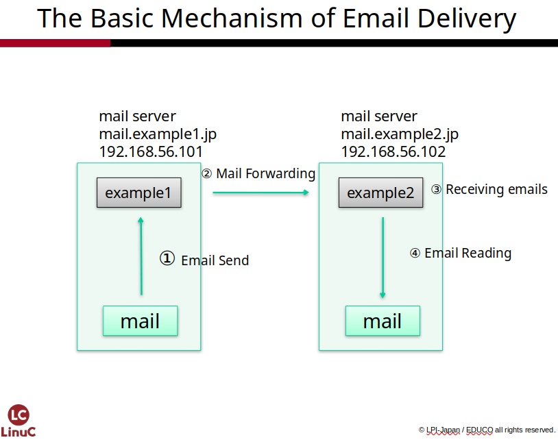
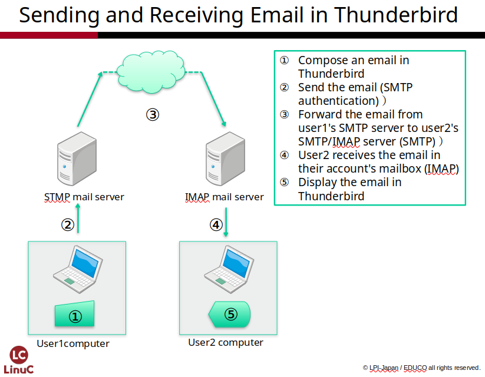
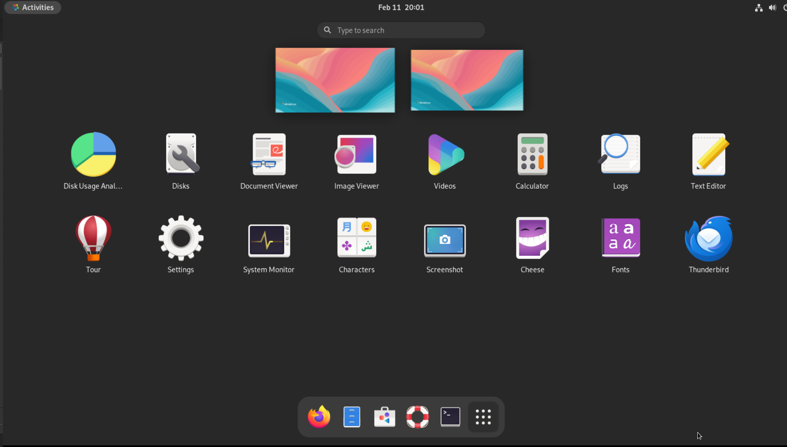
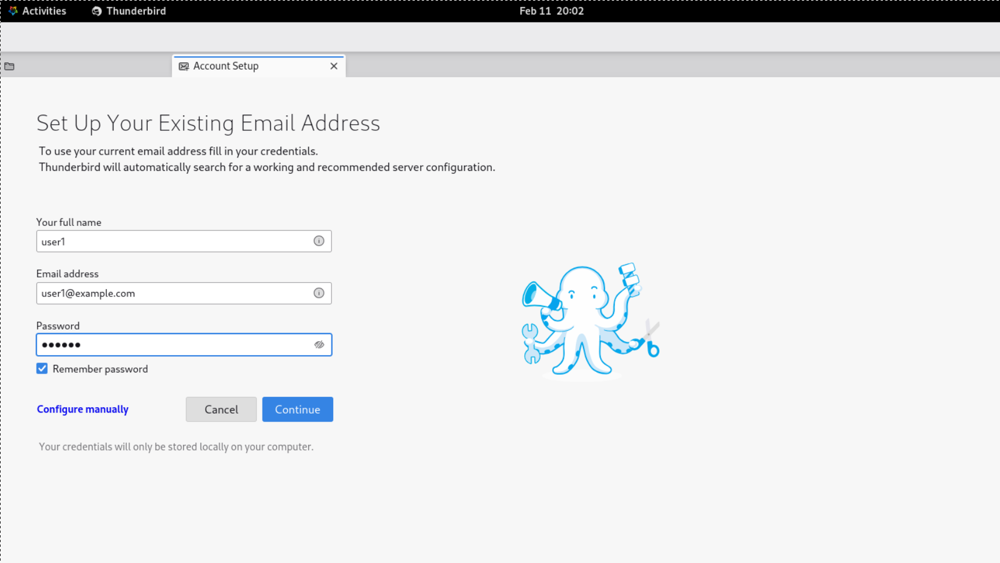
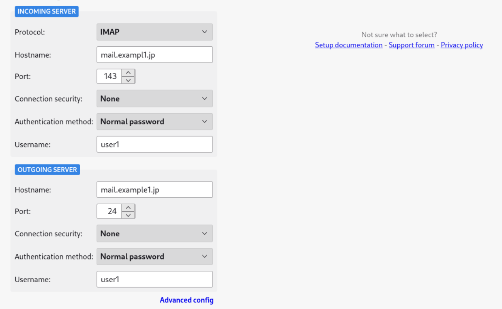
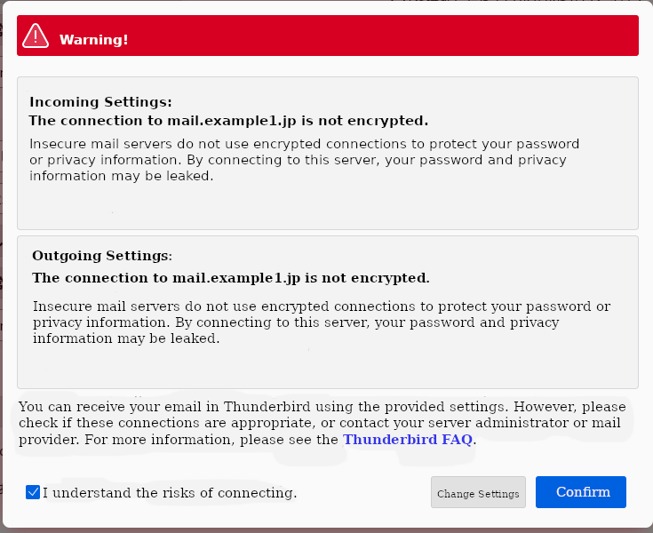
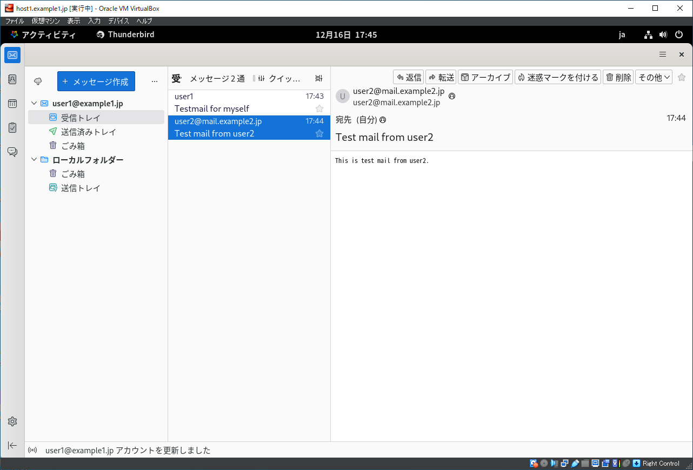

# Building a Mail Server
In Chapter 6, we will configure the mail server to enable email
exchange. First, we will use **Postfix** to set up email transfer
between mail servers. Furthermore, we will build a more practical email
environment using **Dovecot** as the IMAP server and **Thunderbird** as
the mail client.

## Glossary

### Mail Server {.unlisted .unnumbered}

Provides email services. It receives mail from clients and
sends it to the destination mail server. Additionally, a receiving mail
server stores incoming mail and responds to client requests.

### MTA (Mail Transfer Agent) {.unlisted .unnumbered}

A program that performs mail transfer. Sendmail and Postfix are
representative examples.

### SMTP (Simple Mail Transfer Protocol) {.unlisted .unnumbered}

A protocol used when sending and transferring electronic mail.

### SMTP Authentication {.unlisted .unnumbered}

A mechanism that performs authentication when sending mail via SMTP. It
is used, for example, to permit mail relaying (otherwise restricted as a
countermeasure against spam) via this authentication function.

### Postfix {.unlisted .unnumbered}

A server program that operates as an MTA. It is said to be more secure
and faster than Sendmail, which has been used on Linux and Unix systems
for a long time.

### POP3 (Post Office Protocol version 3) {.unlisted .unnumbered}

A protocol used when a client retrieves electronic mail. It has a simple
design and fewer features compared to IMAP4.

### IMAP4 (Internet Message Access Protocol 4) {.unlisted .unnumbered}

A protocol used when a client retrieves electronic mail. It is
feature-rich, supporting functions such as mail folders.

### Dovecot {.unlisted .unnumbered}

A program that provides POP3 and IMAP4 server functionality.

### Thunderbird {.unlisted .unnumbered}

A high-performance mail client software distributed by the Mozilla
Project. It runs on a wide variety of environments, including Windows,
macOS, and Linux.

## Mechanism of Email Exchange
Many people use email on the internet, and email is exchanged through
the following steps. The actions and protocols involved in each step are
shown in parentheses.

1.  Email is sent from the sender's mail client to the outgoing mail
    server (**SMTP Authentication**).
2.  The outgoing mail server transfers the email to the receiving mail
    server (**SMTP**).
3.  The receiving mail server delivers the email to the mailbox of the
    destination address (**Mail Delivery**).
4.  The recipient's mail client connects to the mail server where the
    mailbox is located (**POP3 or IMAP4**).
5.  The recipient's mail client receives the email, and the user can
    view it.

## Sending Email
Email transmission is handled through mail servers. When a mail server
receives an email, it is forwarded to the mail server responsible for
the recipient's email address and is eventually placed in the
destination mailbox. Whether the email is sent from a mail client like
Thunderbird or Outlook, or from a webmail service like Gmail, the
operating principle remains the same.

The programs and protocols involved in sending email are explained
below.

### MTA (Mail Transfer Agent)
Email sent from a mail client is transferred from the outgoing mail
server to the destination receiving mail server. The program that
performs this email transfer is called an MTA. In this textbook, we use
an MTA called **Postfix**. Another famous MTA is **Sendmail**.

### MDA (Mail Delivery Agent)
The program that delivers the email received by the receiving mail
server to the mailbox of the destination address is called an MDA.
Postfix, which is an MTA, also handles MDA functions. Another example of
an MDA is **Procmail**.

### MUA (Mail User Agent)
The program used by the email user to send and receive mail is called an
MUA. In this textbook, we use **Thunderbird**. Webmail is also a type of
MUA.

### Extensions to SMTP (Simple Mail Transfer Protocol)
The sending of email from mail clients and the transfer of email between
mail servers are handled by a protocol called **SMTP**. Since SMTP was
designed and defined a long time ago, it lacked features like
authentication and access restrictions, leading to problems where mail
servers were exploited to send spam. To solve these issues, **ESMTP
(Extended SMTP)** was defined. When the term "SMTP" is used, it often
includes the functions defined in ESMTP.

### SMTP Authentication (SMTP AUTH) and Relay
SMTP Authentication is one of the features of ESMTP. Because standard
SMTP lacks authentication, servers can become "stepping stones" for
sending spam if they are not properly configured (e.g., by restricting
source IP addresses). SMTP Authentication performs authentication during
the email submission process and only accepts email if the
authentication is successful. The process of taking an accepted email
and forwarding it to the destination receiving mail server is called
**relaying**.

## Receiving Email
Once the sent email is delivered to the destination mailbox, the
recipient can receive and read it. The following sections explain
several matters related to receiving email.

### Mail Delivery
The process where a receiving mail server accepts an email and delivers
it to the destination address's mailbox is called **delivery**. If the
mailbox does not exist, an error is returned to the sending mail server
indicating that the destination is unknown. The software that performs
mail delivery is called an **MDA (Mail Delivery Agent)**.

### Local Delivery
When the sender and recipient use the same mail server, there is no need
to transfer the email to an external mail server; it is immediately
delivered to the destination address's mailbox. This is called **local
delivery**.

### POP3 (Post Office Protocol version 3)
POP3 is a protocol used for receiving electronic mail. It is a very
simple protocol where a connection is established using a username and
password to retrieve the content of the emails.

### IMAP4 (Internet Message Access Protocol 4)
Like POP3, IMAP4 is a protocol used for receiving electronic mail. IMAP4
is more feature-rich than POP3, with its support for folder functions
being a major characteristic. Since emails can be kept on the IMAP
server, it is possible to use both a mail client and webmail
simultaneously; however, this consumes mail server storage accordingly,
necessitating capacity management.

## Building a Mail Server
In this mail server construction, we will build two units: an outgoing
mail server and a receiving mail server. Each server will be configured
as follows:

-   A single machine will serve a dual role as both the mail server and
    the mail client.
-   **Postfix** will be installed as the MTA and configured as both the
    outgoing and receiving mail server.
-   **Dovecot** will be installed and configured as the IMAP server.
-   Mail accounts will be created on each mail server.
-   **Thunderbird** will be installed as the mail client, with the
    server itself configured as the sending and receiving server.

Normally, the mail server and mail client are prepared on separate
machines and connected via SMTP, POP3, or IMAP4; however, in this
practical exercise, they will reside on the same machine. The
construction will be carried out in two stages: the configuration of
Postfix and sending/receiving mail via the *mail* command, followed by
the configuration of Dovecot and Thunderbird and their respective mail
exchange.

### Sending and Receiving Mail Using the mail Command
Once the Postfix configuration is complete, we will use the *mail*
command to exchange emails as an operational check. Since this does not
require mail client configuration, it is suitable for verifying that the
MTA is correctly configured.

{width=70%}

### Sending and Receiving Mail Using Thunderbird
Set up Thunderbird as the mail client to perform email transmission via
SMTP authentication and email reception from the IMAP server via
Dovecot.

{width=70%}

## Installing Postfix
Install Postfix using the *dnf* command. Additionally, install the
**Cyrus-SASL** (*cyrus-sasl* package) used for SMTP authentication and
the *s-nail* package which includes the *mail* command. At the same
time, install the *dovecot* package to be used as the IMAP server and
the *thunderbird* package to be used as the mail client.

### Enabling the NAT Network
If the NAT network was disabled during the DNS server configuration,
enable it so that you can connect to the internet. Disable it again
after the installation is complete.

```
$ sudo nmcli con up enp0s3
Connection successfully activated (D-Bus active path: /org/freedesktop/NetworkManager/ActiveConnection/11)
```

### Package Installation
Install the necessary packages using the *dnf* command.

```
$ sudo dnf install postfix cyrus-sasl s-nail dovecot thunderbird
```

### Disabling the NAT Network
Disable the NAT network.

```
$ sudo nmcli con down enp0s3
Connection 'enp0s3' successfully deactivated (D-Bus active path: /org/freedesktop/NetworkManager/ActiveConnection/11)
```

### Installation in Environments Without Internet Access
For practical exercises in environments where an internet connection is
unavailable, the mail server was likely added during the initial OS
installation; however, the *s-nail* package is not included. Similarly,
**Thunderbird** (*thunderbird* package) is also not installed.

At the end of this chapter, the method for installing packages from the
**RPM** files included in the ISO image is explained. Please follow
those instructions to install *s-nail* and *thunderbird*.

## Configuring the Postfix Configuration File: main.cf
The main configuration file for Postfix is located at
*/etc/postfix/main.cf*. Locate the following parameters and configure
them as specified.

```
$ sudo vi /etc/postfix/main.cf
```

Some parameters may already have default values set, so you will need to
overwrite them. If a parameter is commented out (preceded by a *#*),
remove the comment character to enable the setting and then enter the
value.

The parameters *smtpd_sasl_auth_enable* and
*smtpd_recipient_restrictions* are not present in the default *main.cf*,
so you must add them to the end of the file.

Set up **host1** and **host2** as follows:

host1 Configuration

| Item | Setting Value |
|---|---|
| myhostname | mail.example1.jp |
| mydomain | example1.jp |
| inet_interfaces | localhost, 192.168.56.101 |
| mydestination | $mydomain |
| smtpd_sasl_auth_enable | yes |
| smtpd_recipient_restrictions | permit_mynetworks, permit_sasl_authenticated, reject_unauth_destination |

Host2 Configuration

| Item | Setting Value |
|---|---|
| myhostname | mail.example2.jp |
| mydomain | example2.jp |
| inet_interfaces | localhost, 192.168.56.102 |
| mydestination | $mydomain |
| smtpd_sasl_auth_enable | yes |
| smtpd_recipient_restrictions | permit_mynetworks, permit_sasl_authenticated, reject_unauth_destination |

The meanings and set values for each parameter are as follows:

### myhostname
This parameter defines the **host name** of the mail server.

**Configuration for host1:**
```
myhostname = mail.example1.jp
```

**Configuration for host2:**
```
myhostname = mail.example2.jp
```

### mydomain
This parameter defines the **domain name** that the mail server manages.

**Configuration for host1:**
```
mydomain = example1.jp
```

**Configuration for host2:**
```
mydomain = example2.jp
```

### inet_interfaces
This sets the IP addresses of the network interfaces that will accept
incoming mail. **Be careful:** if you forget to include *localhost*, the
server will no longer accept mail sent from itself.

**Configuration for host1:**
```
inet_interfaces = localhost, 192.168.56.101
```

**Configuration for host2:**
```
inet_interfaces = localhost, 192.168.56.102
```

### mydestination
This sets the domain names for which the server will receive mail. The
server will only accept emails where the destination address
(*account@domain-name*) matches one of these domains.

**Common Configuration (host1 & host2):**
```
mydestination = $mydomain
```

### smtpd_sasl_auth_enable
This enables SASL authentication integration for **SMTP
Authentication**.

**Common Configuration (host1 & host2):**
```
smtpd_sasl_auth_enable = yes
```

### smtpd_recipient_restrictions
This setting configures the server to allow mail transmission from
clients who have been successfully authenticated via SASL.

**Common Configuration (host1 & host2):**
```
smtpd_recipient_restrictions = permit_mynetworks, permit_sasl_authenticated, reject_unauth_destination
```

[!NOTE] These two settings (6.7.5 and 6.7.6) relate to the SMTP
Authentication (SASL integration) described later, but we are
configuring them now to streamline the process.

## Syntax Check
Once you have finished modifying */etc/postfix/main.cf*, you should
perform a syntax check to ensure there are no errors in the
configuration file.

You can run the following command to check for configuration errors:

```
$ sudo postfix check
```

If the syntax is correct, nothing will be displayed. If an error is
shown, examine the content of the error message carefully and make the
necessary corrections.

## Starting Postfix
Start the *postfix* service. Use the following commands to start the
service and ensure it launches automatically when the system boots.

```
$ sudo systemctl start postfix
```

## Configuring Automatic Startup and the Firewall
Configure the service to start automatically at boot and adjust the
firewall settings to allow mail traffic.

```
$ sudo systemctl enable postfix
$ sudo firewall-cmd --add-service=smtp --zone=public --permanent
$ sudo firewall-cmd --reload
```

### Configuring Postfix Startup Order (Optional)
Even if you configure Postfix for automatic startup using the *systemctl
enable* command, Postfix may sometimes fail to start after a system
reboot. This is due to the specifications regarding the startup order of
services during system boot.

Specifically, the cause is that the system attempts to start Postfix
before the network services have finished starting. To ensure correct
operation, it is necessary to modify the configuration file referenced
by systemd.

Since the exercises in this textbook do not involve frequent system
reboots, you can simply start Postfix manually whenever it is not
running. However, if you are running Postfix on a system intended for
continuous operation, please perform the following modifications.

### Modifying with the systemctl edit Command
By using the *systemctl edit* command, you can edit the configuration
file for the target service. However, please note that the editor that
launches will be **nano**, so the usage is slightly different from
**vim**.

### Modifying the Configuration File with vim
You may also open and modify the configuration file directly using
**vim**. The configuration file is located at
*/usr/lib/systemd/system/postfix.service*.

```
$ sudo vi /usr/lib/systemd/system/postfix.service
```

```
[Unit]
Description=Postfix Mail Transport Agent
After=syslog.target network-online.target  ← Change "network.target" to "network-online.target"
Conflicts=sendmail.service exim.service
```

*After=network.target* starts Postfix after the network service starts,
but it does not confirm that the network is actually functional. By
changing this to *After=network-online.target*, Postfix will only start
after confirming that the network is fully available.

To verify that the changes have been applied, please restart the system
and confirm that Postfix starts automatically.

## Configuring SMTP Authentication (SASL Integration)
SMTP Authentication is a mechanism for performing authentication when
sending email. Since Postfix itself does not possess authentication
functionality, it integrates with **SASL** (Simple Authentication and
Security Layer). To perform SASL integration, you must configure Postfix
and start the *saslauthd* service.

### Verifying Postfix Settings
Enable SASL authentication in the Postfix configuration file, *main.cf*.
You have already configured the following two additional parameters:

| Item | Setting Value |
|---|---|
| smtpd_sasl_auth_enable | yes |
| smtpd_recipient_restrictions | permit_mynetworks, permit_sasl_authenticated, reject_unauth_destination |

When the SMTP authentication function is enabled, Postfix requests
authentication from **saslauthd**. Once authentication is successful,
Postfix accepts the email and performs the relay.

### Starting the saslauthd Service
Start the *saslauthd* service for SMTP authentication.

```
$ sudo systemctl start saslauthd
```

Also, configure *saslauthd* for automatic startup.

```
$ sudo systemctl enable saslauthd
```

This completes the Postfix configuration.

## Creating Accounts
Create accounts to facilitate the exchange of emails. Accounts must be
created on both **host1** and **host2**.

### Creating user1 on host1
Create an account named **user1** on host1. This account will have the
email address *user1@example1.jp*. Use the *passwd* command to set the
password.

```
[admin@host1 ~]$ sudo useradd user1
[admin@host1 ~]$ sudo passwd user1
Changing password for user user1.
New password: userpass  ← Input characters are hidden
BAD PASSWORD: The password fails the dictionary check - it is based on a dictionary word
Retype new password: userpass  ← Input characters are hidden
passwd: all authentication tokens updated successfully.
```

### Creating user2 on host2
Create an account named **user2** on host2. This account will use the
email address *user2@example2.jp*. Use the *passwd* command to set the
password as well.

```
[admin@host2 ~]$ sudo useradd user2
[admin@host2 ~]$ sudo passwd user2
Changing password for user user2.
New password: userpass  ← Input characters are hidden
BAD PASSWORD: The password fails the dictionary check - it is based on a dictionary word
Retype new password: userpass  ← Input characters are hidden
passwd: all authentication tokens updated successfully.
```

## Testing Email Transmission and Reception 
Test whether emails can be sent and received correctly. These tests will
be performed using the accounts you created, **user1** and **user2**.
Open a separate terminal and use the *su* command to switch to these
users. The *mail* command will be used for sending and receiving.

### Setting Up a Terminal for Log Monitoring (Optional)
Since the mail server operates in the background, you must refer to the
logs to see how it is functioning. By running the *tail* command with
the *-f* option, the log will be reloaded and displayed in real-time as
new entries are written.

1.  Launch a **Terminal**.
2.  Execute the *tail* command to display */var/log/maillog*.

```
$ sudo tail -f /var/log/maillog
```

### Launching the Terminal for Mail and Switching Users
Launch a terminal for sending and receiving mail, and switch users using
the *su* command. To ensure a complete environment switch, execute the
command as *su - username*, including the *-* (hyphen).

1.  Launch a **Terminal**.
2.  Switch users with the *su* command.

### Switching to user1 on host1
On **host1**, perform operations as **user1**.

```
[admin@host1 ~]$ sudo su - user1
[user1@host1 ~]$
```

### Switching to user2 on host2
On **host2**, perform operations as **user2**.

```
[admin@host2 ~]$ sudo su - user2
[user2@host2 ~]$
```

### Sending an Email from user1@example1.jp to user2@example2.jp
Use the *mail* command to send an email from **user1** on **host1** to
[**user2@example2.jp**](mailto:user2@example2.jp).

```
[user1@host1 ~]$ mail user2@example2.jp  ← Specify the destination address as the argument for the mail command
Subject: Test mail from user1  ← Enter the Subject
This is test mail from user1  ← Enter the message body
^D  ← Press Ctrl+d when finished entering the message body
-------
(Preliminary) Envelope contains:
To: <user2@example2.jp>
Subject: Test mail from user1
Send this message [yes/no, empty: recompose]? yes  ← Typing "yes" sends the email
```

### Verifying Mail Reception for user2
Use the *mail* command to confirm whether the email has arrived for
**user2** on *host2.example2.jp*.

```
[user2@host2 ~]$ mail
Heirloom Mail version 12.5 7/5/10.  Type ? for help.
"/var/spool/mail/user2": 1 message 1 new
>N  1 user1@mail.example1.jp   Tue Feb 19 13:38  21/751   "Test mail from user1"
& 1  ← Enter "1" to read the message
Message  1:
From user1@mail.example1.jp  Tue Feb 19 13:38:31 2019
Return-Path: <user1@mail.example1.jp>
X-Original-To: user2@example2.jp
Delivered-To: user2@example2.jp
Date: Tue, 19 Feb 2019 13:38:31 +0900
To: user2@example2.jp
Subject: Test mail from user1
User-Agent: Heirloom mailx 12.5 7/5/10
Content-Type: text/plain; charset=us-ascii
From: user1@mail.example1.jp
Status: R

This is Test Mail from user1

& q  ← Enter "q" to quit
Held 1 message in /var/spool/mail/user2
```

As you can see, this confirms that the email has been successfully sent
from *host1.example1.jp* to *host2.example2.jp*.

Now, let's verify the reverse: check that an email can also be sent
from **user2@example2.jp** to **user1@example1.jp**.

## Sending and Receiving Email with Email Client Software
In typical mail server operations, users send and receive emails using
email client software. The **SMTP** protocol is used for sending, while
**IMAP4** or **POP3** is used for receiving.

To enable email reception via an IMAP server, we will install
**Dovecot** (an IMAP server) and **Thunderbird** (an email client) to
test the transmission and reception of emails.

The following tasks will be performed on **host1**, but you may also
configure them on **host2** to enable bidirectional email exchange.

## Dovecot Configuration
We will now configure **Dovecot** to act as the IMAP server.

The configuration is split between the main file
*/etc/dovecot/dovecot.conf* and several files located within the
*/etc/dovecot/conf.d/* directory. Specifically, we will look at the
following:

-   ***/etc/dovecot/dovecot.conf*** (No changes required)
-   ***/etc/dovecot/conf.d/10-mail.conf***
-   ***/etc/dovecot/conf.d/10-auth.conf***
-   ***/etc/dovecot/conf.d/10-ssl.conf***

### /etc/dovecot/dovecot.conf (No changes required)
This is the global configuration file. The default settings are written
as comments throughout the file. No specific changes are necessary for
this setup.

```
$ sudo vi /etc/dovecot/dovecot.conf
(omitted)
# Protocols we want to be serving.
#protocols = imap pop3 lmtp submission  ← IMAP/POP3/LMTP/SMTP submission are available for use.

# A comma separated list of IPs or hosts where to listen in for connections.
# "*" listens in all IPv4 interfaces, "::" listens in all IPv6 interfaces.
# If you want to specify non-default ports or anything more complex,
# edit conf.d/master.conf.
#listen = *, ::  ← Listens for connections on all of the host's IP addresses.
```

### /etc/dovecot/conf.d/10-mail.conf
This file is used to configure settings such as the location of the
mailbox. For this setup, we will specify the **mbox** format for the
mailbox and configure the necessary access permissions.

```
$ sudo vi /etc/dovecot/conf.d/10-mail.conf
```

```
(omitted)
#   mail_location = maildir:~/Maildir
#   mail_location = mbox:~/mail:INBOX=/var/mail/%u
#   mail_location = mbox:/var/mail/%d/%1n/%n:INDEX=/var/indexes/%d/%1n/%n
#
# <doc/wiki/MailLocation.txt>
#
#mail_location =
mail_location = mbox:~/mail:INBOX=/var/mail/%u  ← Add this, referencing the 2nd example above

(omitted)

# Group to enable temporarily for privileged operations. Currently this is
# used only with INBOX when either its initial creation or dotlocking fails.
# Typically this is set to "mail" to give access to /var/mail.
#mail_privileged_group =
mail_privileged_group = mail  ← Add this so privileged operations are performed as the "mail" group

# Grant access to these supplementary groups for mail processes. Typically
# these are used to set up access to shared mailboxes.
#mail_access_groups =
mail_access_groups = mail  ← Add this to grant access permissions to the "mail" group
(omitted)
```

### /etc/dovecot/conf.d/10-auth.conf
This file is used to configure authentication settings. For this setup,
we will allow **plain-text authentication** (unencrypted).

```
$ sudo vi /etc/dovecot/conf.d/10-auth.conf
```

```
##
## Authentication processes
##

# Disable LOGIN command and all other plaintext authentications unless
# SSL/TLS is used (LOGINDISABLED capability). Note that if the remote IP
# matches the local IP (ie. you're connecting from the same computer), the
# connection is considered secure and plaintext authentication is allowed.
# See also ssl=required setting.
#disable_plaintext_auth = yes
disable_plaintext_auth = no  ← Change to "no"
(omitted)
```

### /etc/dovecot/conf.d/10-ssl.conf

This file is used to configure SSL/TLS settings. Since we will not be
using SSL/TLS encryption for this setup, we will disable the SSL/TLS
feature.

```
$ sudo vi /etc/dovecot/conf.d/10-ssl.conf
```

```
##
## SSL settings
##

# SSL/TLS support: yes, no, required. <doc/wiki/SSL.txt>
# disable plain pop3 and imap, allowed are only pop3+TLS, pop3s, imap+TLS and imaps
# plain imap and pop3 are still allowed for local connections
ssl = no  ← Change "required" (or "yes") to "no"
```

## Starting Dovecot
Start the **dovecot** service.

```
$ sudo systemctl start dovecot
```

### Enabling Auto-start and Firewall Configuration
We will now configure the service to start automatically upon system
boot and adjust the firewall settings to allow mail traffic.

```
$ sudo systemctl enable dovecot
$ sudo firewall-cmd --add-service=imap --zone=public --permanent
$ sudo firewall-cmd --reload
```

## Thunderbird Configuration
Next, we will configure **Thunderbird** as the email client.

### Switching Users and Logging In
Log in using the user account **user1**, which was created specifically
for testing email transmission and reception. If you are currently
logged in as a different user, please log out first.

The password is ***userpass***. If the password has not been set
correctly, log back in as the **admin** user and use the *passwd*
command to reset it. This password will also be required for the
Thunderbird configuration.

### Launching Thunderbird
Start Thunderbird. Click on **"Activities"** in the upper left corner
of the screen, then click **"Show Applications"** at the far right of
the icon dock displayed at the bottom of the screen. From the
application icons that appear, click **"Thunderbird."**

{width=70%}

When Thunderbird starts, a separate web browser window may open
displaying the Thunderbird home page. You may safely close that browser
window entirely.

### Basic Thunderbird Configuration
Display the Thunderbird application window and confirm that the **"Set
Up Your Existing Email Address"** tab is visible.

Enter the values for each configuration item as follows:

| Item | Setting Value |
|---|---|
| Your full name | user1 |
| Email address | user1@example1.jp |
| Password | userpass |
| Remember password | Check this box |

{width=70%}

### Thunderbird Incoming/Outgoing Mail Server Configuration
Click on **"Manual Config"** (or "Configure manually") to set up the
incoming and outgoing mail servers. The "Incoming Server" and
"Outgoing Server" sections will appear. Enter the following values for
each setting:

| Item | Setting Value |
|---|---|
| Protocol | IMAP |
| Hostname | mail.example1.jp |
| Port | 143 |
| Connection security | None |
| Authentication method | Normal password |
| Username | user1 |

| Item | Setting Value |
|---|---|
| Hostname | mail.example1.jp |
| Port | 25 |
| Connection security | None |
| Authentication method | Normal password |
| Username | user1 |

{width=70%}

Once you have finished entering the settings, click the **"Done"**
button.

A **"Warning!"** dialog will appear. Check the box in the lower-left
corner that says **"I understand the risks"** and then click the
**"Confirm"** button.

{width=70%}

Finally, click the **"Done"** button in the **"Account Successfully
Created"** (or "Connection to Linked Services") screen.

## Sending Email
To send an email, click the **"Write"** button to open the message
composition window.

### Sending Email to Yourself
1.  Click the **"Write"** button.
2.  Address the email to your own email address
    (***user1@example1.jp***), compose a message, and send it.
3.  Click the **"Get Messages"** button and confirm that the email is
    successfully received.

### Sending Email to Another Server
1.  Click the **"Write"** button.
2.  Address the email to the user on **host2**
    (***user2@example2.jp***), compose a message, and send it.
3.  On **host2**, use the *mail* command to confirm that the email was
    received.
4.  From **host2**, use the *mail* command to send an email to
    ***user1@example1.jp***, and confirm that it can be received on
    **host1**.

{width=70%}

## In Case of Troubleshooting
In this chapter, we studied electronic email systems. We also configured
an actual mail server and verified the sending and receiving of emails
using the *mail* command and Thunderbird.

Even if the mail server itself is configured correctly and running, it
may not function properly if the **DNS server** is not working
correctly. If you cannot send or receive emails despite having no issues
in your configuration files, first use the *dig* command to verify that
DNS is operating correctly. Additionally, check the system logs
(***/var/log/maillog***) to see if any errors are being reported.

## Installing Packages from an ISO Image
The *dnf* command typically downloads and installs packages from
repositories located on the internet. To install packages in an
environment without internet access, you can install them directly from
the **RPM packages** contained within the **ISO image**.

1.  Log in to the virtual machine as the **admin** user.
2.  Load the ISO image into the virtual machine's **virtual optical
    drive**.
3.  The ISO image will be **automatically mounted**.

### Checking the ISO Image Mount Point
Check the mount point (directory) where the ISO image has been
automatically mounted. You can verify the mount point using the *mount*
command. Since there are typically many mount points listed, use the
*grep* command to filter the results.

```
$ mount | grep dvd
/dev/sr0 on /run/media/admin/AlmaLinux-9-3-x86_64-dvd type iso9660
(ro,nosuid,nodev,relatime,nojoliet,check=s,map=n,blocksize=2048,
uid=1000,gid=1000,dmode=500,fmode=400,uhelper=udisks2)
```

You can see that the ISO image is mounted as an **ISO9660** file system
under */run/media/username/*.

Now, let's check the contents of the ISO image.

```
$ ls /run/media/admin/AlmaLinux-9-3-x86_64-dvd/
AppStream  EULA                     TRANS.TBL         images
BaseOS     LICENSE                  boot.catalog      media.repo
EFI        RPM-GPG-KEY-AlmaLinux-9  extra_files.json
```

### Installing Packages
You will now install the packages from the mounted ISO image.
Specifically, you will install **s-nail** and **thunderbird**, which
were not installed during the initial OS setup. These packages are
located within the *AppStream* directory of the media.

```
$ cd /run/media/admin/AlmaLinux-9-3-x86_64-dvd/AppStream/Packages/
$ ls -l s-nail-14.9.22-6.el9.x86_64.rpm
-r--r--r--. 5 admin admin 635625 Mar 10  2022 s-nail-14.9.22-6.el9.x86_64.rpm
$ ls -l thunderbird-115.4.1-1.el9_2.alma.x86_64.rpm
-r--r--r--. 5 admin admin 111843172 Nov  3 00:37 thunderbird-115.4.1-1.el9_2.alma.x86_64.rpm
```

Once you have confirmed the location of the package's RPM file, you can
install it by specifying the file path as an argument for the *dnf*
command.

```
$ pwd
/run/media/admin/AlmaLinux-9-3-x86_64-dvd/AppStream/Packages
$ sudo dnf install ./s-nail-14.9.22-6.el9.x86_64.rpm
$ sudo dnf install ./thunderbird-115.4.1-1.el9_2.alma.x86_64.rpm
```
\pagebreak
