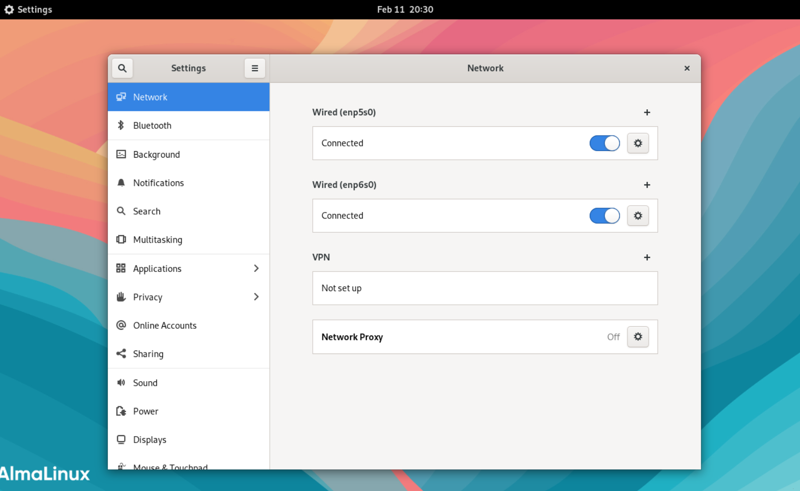
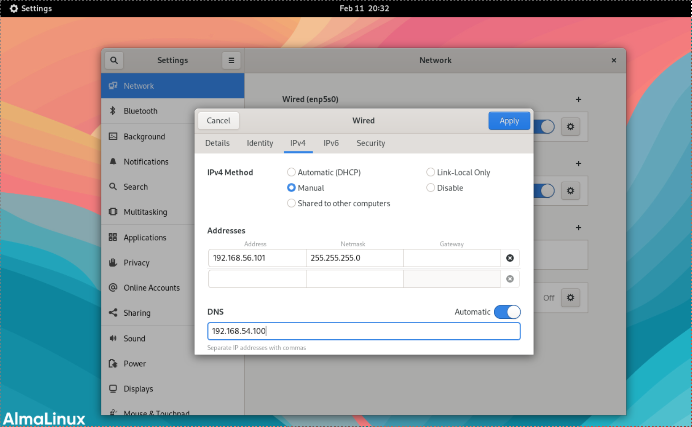

# Network and Security Settings
Chapter 7 reviews network and security settings once again. In
AlmaLinux, basic network and security configurations are performed
during installation. This section explains how to configure these
settings after the OS has been installed.

## Glossary

### Network Interface {.unlisted .unnumbered}

A physical interface for connecting LAN cables to exchange data with
external machines.

### Loopback Interface {.unlisted .unnumbered}

A virtual interface for exchanging data within the machine itself.

### IP (Internet Protocol) {.unlisted .unnumbered}

A protocol for exchanging data between computers connected to a
network.

### IP Address {.unlisted .unnumbered}

A value assigned to each computer in IP communication. By specifying
an IP address as a destination, data is delivered to the computer
assigned that specific address.

### IPv4 (Internet Protocol version 4) {.unlisted .unnumbered}

The communication protocol currently used on the internet. In IPv4, an
IP address is represented by 4 bytes (32 bits). Although it is
originally a sequence of 32 binary numbers (0s and 1s), it is written as
"192.168.1.1" by converting each byte to a decimal number and
separating them with dots (.) for human readability. In IPv6, the
next-generation IP, addresses are represented by 128 bits.

### Network Address {.unlisted .unnumbered}

An IP address that identifies the network itself to which a host
belongs.

### Broadcast Address {.unlisted .unnumbered}

An IP address used to target the entire network to which a host
belongs. By communicating with this address, data can be sent to all
hosts within that network.

### Netmask {.unlisted .unnumbered}

A value used to indicate which portion of an IP address is the network
part and which is the host part. The network address and broadcast
address can be calculated using the IP address and the netmask.

### Default Gateway {.unlisted .unnumbered}

The internet is a collection of small networks interconnected with
each other. Routers (gateways) are used as devices to connect these
small networks. While multiple gateways can be installed in a single
network, the default gateway is used to communicate with external
networks unless otherwise specified.

### DHCP (Dynamic Host Configuration Protocol) {.unlisted .unnumbered}

A protocol that automatically assigns network settings, such as IP
addresses.

### TCP (Transmission Control Protocol) {.unlisted .unnumbered}

TCP is a connection-oriented communication protocol. Combined with IP,
TCP/IP is the standard communication protocol of the internet. A key
feature of TCP is its mechanism to retransmit lost packets to ensure
reliable communication.

### UDP (User Datagram Protocol) {.unlisted .unnumbered}

UDP is a connectionless communication protocol. Unlike TCP, it does
not retransmit data, making it less reliable; however, it is suitable
for simple communications because it eliminates the "3-way handshake"
required to establish a session. For example, DNS name resolution
queries, which occur in massive quantities, use UDP.

### Port Number {.unlisted .unnumbered}

A port number is a value used by TCP and UDP during communication. For
example, since web servers operate using port number 80, a web browser
connects to port 80 of the target server. Port numbers range from 0 to
65535; numbers 0--1023 are reserved as WELL KNOWN PORTs, and 1024--49151
are reserved as REGISTERED PORTs.

### ICMP (Internet Control Message Protocol) {.unlisted .unnumbered}

A protocol used to notify information such as data transfer errors and
data transfer volume.

### ping Command {.unlisted .unnumbered}

The ping command uses ICMP to check whether a specified destination
host is reachable.

## Network Management
If the network is not working correctly, it is necessary to check
whether the network interfaces are configured properly. Furthermore, if
the settings are incorrect, the interface configuration must be changed.
This section explains how to check and configure network interfaces.

### Checking Network Interfaces
Check the settings to verify whether the machine where Linux is
installed can connect to the network normally. Use the *ip* command to
confirm this.

```
# ip addr show
1: lo: <LOOPBACK,UP,LOWER_UP> mtu 65536 qdisc noqueue state UNKNOWN group default qlen 1000
     link/loopback 00:00:00:00:00:00 brd 00:00:00:00:00:00
     inet 127.0.0.1/8 scope host lo
         valid_lft forever preferred_lft forever
     inet6 ::1/128 scope host
         valid_lft forever preferred_lft forever
2: enp0s3: <BROADCAST,MULTICAST,UP,LOWER_UP> mtu 1500 qdisc fq_codel state UP group default qlen 1000
     link/ether 08:00:27:2d:1c:bc brd ff:ff:ff:ff:ff:ff
     inet 10.0.2.15/24 brd 10.0.2.255 scope global dynamic noprefixroute enp0s3
         valid_lft 65668sec preferred_lft 65668sec
     inet6 fe80::a00:27ff:fe2d:1cbc/64 scope link noprefixroute
         valid_lft forever preferred_lft forever
3: enp0s8: <BROADCAST,MULTICAST,UP,LOWER_UP> mtu 1500 qdisc fq_codel state UP group default qlen 1000
     link/ether 08:00:27:93:ab:ef brd ff:ff:ff:ff:ff:ff
     inet 192.168.56.101/24 brd 192.168.56.255 scope global noprefixroute enp0s8
         valid_lft forever preferred_lft forever
     inet6 fe80::a00:27ff:fe93:abef/64 scope link noprefixroute
         valid_lft forever preferred_lft forever
```

The *lo* displayed by the *ip* command is the virtual loopback
interface. Additionally, in this example, *enp0s3* is the NAT interface
and *enp0s8* is the host-only interface. These names may also appear as
*enoXX*, *ensXX*, *ethX*, or *enxXX*.

### Reconfiguring Network Interfaces
If the IP address was configured incorrectly during installation or
needs to be changed, you must reconfigure the network interface.

Right-click on the desktop and select "Settings" from the popup menu.
Select "Network" from the menu on the left side of the settings
screen.

From the displayed network interfaces, click the gear icon button in the
row of the network interface you wish to modify.

{width=70%}

The connection profile settings screen will appear. Once you have
changed the settings, click the "Apply" button to return to the
previous screen.

{width=70%}

To apply the changed settings, toggle the switch for the modified
network interface to "OFF" and then back to "ON."

### Verifying Network Interface Operation
Use the *ping* command to verify if the network interface is
functioning. Specify the IP address of your own physical network
interface, the instructor's machine IP address (**192.168.56.100**), or
other machine IP addresses as the destination for the *ping* command.
You can stop the *ping* command by pressing **Ctrl+C**.

```
$ ping 192.168.56.101  # Your own IP address
PING 192.168.56.101 (192.168.56.101) 56(84) bytes of data.
64 bytes from 192.168.56.101: icmp_seq=1 ttl=64 time=0.148 ms
64 bytes from 192.168.56.101: icmp_seq=2 ttl=64 time=0.038 ms
64 bytes from 192.168.56.101: icmp_seq=3 ttl=64 time=0.040 ms
^C
--- 192.168.56.101 ping statistics ---
3 packets transmitted, 3 received, 0% packet loss, time 1999ms
rtt min/avg/max/mdev = 0.038/0.075/0.148/0.051 ms
```

## Checking Service Port Numbers
Use the *ss* and *lsof* commands to check which network services are
running on your PC. Executing the *ss -at* command displays all current
TCP communication states.

### Checking Port Usage with the ss Command
The *ss* command uses the *-a* option to display all service states, and
the *-t* option to display only information such as ports used by TCP
(Transmission Control Protocol) services.

```
$ ss -at
LISTEN 0 100 127.0.0.1:smtp 0.0.0.0:*
LISTEN 0 10 127.0.0.1:domain 0.0.0.0:*
LISTEN 0 10 127.0.0.1:domain 0.0.0.0:*
LISTEN 0 100 192.168.56.101:smtp 0.0.0.0:*
LISTEN 0 4096 127.0.0.1:ipp 0.0.0.0:*
LISTEN 0 100 0.0.0.0:imap 0.0.0.0:*
LISTEN 0 100 0.0.0.0:pop3 0.0.0.0:*
LISTEN 0 128 0.0.0.0:ssh 0.0.0.0:*
LISTEN 0 4096 127.0.0.1:rndc 0.0.0.0:*
(Omitted)
```

### Checking Port Usage with the lsof Command
The *lsof* command uses the *-i* option to display information about
ports currently receiving services and their corresponding programs.

```
$ sudo lsof -i
COMMAND PID USER FD TYPE DEVICE SIZE/OFF NODE NAME
(Omitted)
sshd 997 root 3u IPv4 21008 0t0 TCP *:ssh (LISTEN)
sshd 997 root 4u IPv6 21010 0t0 TCP *:ssh (LISTEN)
dovecot 1292 root ... (LISTEN)
master 22406 root ... (LISTEN)
named 24939 named ... (LISTEN)
```

### Checking Port Numbers via the services File
Please also check the */etc/services* file, where the correspondence
between port numbers and services (WELL KNOWN PORT NUMBERS: 0--1023 and
REGISTERED PORT NUMBERS: 1024--49151) is defined.

```
$ cat /etc/services
tcpmux 1/tcp # TCP port service multiplexer
tcpmux 1/udp # TCP port service multiplexer
rje 5/tcp # Remote Job Entry
rje 5/udp # Remote Job Entry
echo 7/tcp
echo 7/udp
discard 9/tcp sink null
discard 9/udp sink null
systat 11/tcp users
```

## Remote Login via SSH

SSH is a protocol used to log in to remote Linux servers over a network.
Because the communication is encrypted, passwords and session activities
remain secure from eavesdropping. Additionally, by using public key
authentication, you can log in without transmitting a password over the
network.

Linux provides the OpenSSH suite, which includes both a server and a
client.

### Password Authentication
The *ssh* command allows for remote login via password authentication
without any special configuration.

Try connecting to your own machine via SSH as shown below. For the first
connection, the SSH server's public key will be sent to you, and you
will be asked to confirm the connection; type "yes." If password
authentication is enabled, you will be prompted to enter your password.

```
[admin@host1 ~]$ ssh user1@localhost
The authenticity of host 'localhost (::1)' can't be established.
ED25519 key fingerprint is SHA256:7+us06xcMV24dGBfoGXIKCyiDWexydVXYlbYGMyV4Mk.
This key is not known by any other names
Are you sure you want to continue connecting (yes/no/[fingerprint])? yes
Warning: Permanently added 'localhost' (ED25519) to the list of known hosts.
user1@localhost's password: userpass
Last login: Sat Dec  2 11:44:55 2023
[user1@host1 ~]$ exit
logout
Connection to localhost closed.
[admin@host1 ~]$
```

### Public Key Authentication
While password authentication uses SSH to encrypt the communication
path, the password itself still travels across the network. Furthermore,
it is susceptible to "brute-force attacks," where passwords are
automatically generated and tried in sequence, making it unsuitable for
servers exposed to the internet.

Public key authentication is a method where only users possessing the
private key paired with a public key previously installed on the server
can log in remotely.

Configure public key authentication using the following steps:

1.  **Generate a Public and Private Key Pair** Use the *ssh-keygen*
    command to generate a pair consisting of a public key (*id_rsa.pub*)
    and a private key (*id_rsa*). These key files are saved in the
    *.ssh* directory created within your home directory.

    Set a **passphrase** for the private key to prevent unauthorized
    use. If the correct passphrase is not entered at the time of
    connection, the private key cannot be used, and the connection via
    public key authentication will fail. Since this passphrase is
    processed locally by the SSH client against the private key, no
    information regarding it is transmitted over the network.

```
[admin@host1 ~]$ su - user1
Password: userpass
Last login: Tue Dec  5 11:46:38 JST 2023 on pts/1
[user1@host1 ~]$ ssh-keygen
Generating public/private rsa key pair.
Enter file in which to save the key (/home/user1/.ssh/id_rsa):
Created directory '/home/user1/.ssh'.
Enter passphrase (empty for no passphrase): userpass
Enter same passphrase again: userpass
Your identification has been saved in /home/user1/.ssh/id_rsa
Your public key has been saved in /home/user1/.ssh/id_rsa.pub
The key fingerprint is:
SHA256:aiUB6c+AYV4K+8b6d3RgAYmYsoH3d2waUN0G3MmHNDk user1@host1.example1.jp
The key's randomart image is:
+---[RSA 3072]----+
|.o .o=.o.*o+     |
|B = =.. o E..    |
|.O B ..o . o     |
|o + + =.+        |
| o   *.*S        |
|  +   =+.        |
| o   .o.         |
|.   ...          |
| ... .           |
+----[SHA256]-----+
```

1.  **Creating authorized_keys on the Destination Server**
    To allow a user to connect via SSH using public key authentication, you must
    first create the user account on the destination server. Then,
    create the *.ssh/authorized_keys* file within that user's home
    directory.

2.  It is critical to set the correct permissions for security:
    The **.ssh directory** must have permissions set to **700**
    (*drwx------*), and the **authorized_keys** file must have
    permissions set to **600** (*-rw-------*).

```
[user1@host1 ~]$ ls -ld .ssh
drwx------. 2 user1 user1 38 Dec  5 11:47 .ssh
[user1@host1 ~]$ cd .ssh
[user1@host1 .ssh]$ touch authorized_keys
[user1@host1 .ssh]$ chmod 600 authorized_keys
[user1@host1 .ssh]$ cat id_rsa.pub >> authorized_keys
[user1@host1 .ssh]$ ls -l authorized_keys
-rw-------. 1 user1 user1 577 Dec  5 12:08 authorized_keys
```

1.  **Connecting with Public Key Authentication**
    To log in using public key authentication, use the *ssh* command as you did before. While
    the command syntax remains the same as password authentication, you
    will be prompted to enter the **passphrase** you set for your
    private key instead of the user's login password.

```
[user1@host1 ~]$ ssh user1@localhost
The authenticity of host 'localhost (::1)' can't be established.
ED25519 key fingerprint is SHA256:7+us06xcMV24dGBfoGXIKCyiDWexydVXYlbYGMyV4Mk.
This key is not known by any other names
Are you sure you want to continue connecting (yes/no/[fingerprint])? yes
Warning: Permanently added 'localhost' (ED25519) to the list of known hosts.
Enter passphrase for key '/home/user1/.ssh/id_rsa': userpass
Last login: Tue Dec  5 11:46:46 2023
[user1@host1 ~]$ exit
logout
Connection to localhost closed.
```

### Disabling Password Authentication
As long as password authentication remains enabled, there is a risk of
unauthorized remote login via brute-force attacks. Once you have
confirmed that you can connect successfully using public key
authentication, you should modify the SSH server settings to prohibit
password authentication.

1.  Confirm that the *admin* user can still connect using password
    authentication. If you are currently logged in as *user1*, type
    *exit* to return to the *admin* user.

```
[user1@host1 ~]$ exit
logout
[admin@host1 ~]$ ssh localhost
admin@localhost's password:
Activate the web console with: systemctl enable --now cockpit.socket

Last login: Tue Dec  5 12:16:49 2023 from ::1
[admin@host1 ~]$ exit
logout
Connection to localhost closed.
[admin@host1 ~]$
```

2.  Modify */etc/ssh/sshd_config*.

```
[admin@host1 ~]$ sudo vi /etc/ssh/sshd_config
```

```
# To disable tunneled clear text passwords, change to no
#PasswordAuthentication yes
PasswordAuthentication no
#PermitEmptyPasswords no
```

3.  Reload the sshd configuration. After saving your changes to
    */etc/ssh/sshd_config*, the SSH server needs to be notified to apply
    the new settings. You do this using the *systemctl* command with the
    *reload* or *restart* option.

```
[admin@host1 ~]$ sudo systemctl reload sshd
```

4.  Verify that users without public keys cannot connect. Now that
    you have disabled password authentication and reloaded the *sshd*
    service, test the security by attempting to log in with a user who
    does not have a public key registered (in this case, the *admin*
    user).

```
[admin@host1 ~]$ ssh localhost
admin@localhost: Permission denied (publickey,gssapi-keyex,gssapi-with-mic).
```

**Important warning**

Once you have applied these settings, remote login via password
authentication will be **completely disabled**.

Therefore, it is absolutely essential to ensure that a user with
**administrative privileges (sudo access)** is successfully configured
for **public key authentication** before you finalize the changes. If
you skip this step, you risk being locked out of your server entirely!

## Firewall Settings
A firewall is a function that performs various access restrictions on a
network to prevent attacks and unauthorized access.

In AlmaLinux, firewall functionality is managed by **firewalld**. It
manages rules for allowing or denying packets received by network
interfaces. You configure firewalld using the *firewall-cmd* command.

### Checking Firewall Settings
First, let's check which services are currently allowed.

```
$ sudo firewall-cmd --list-services
cockpit dhcpv6-client http ssh
```

In this section, ports for services such as **HTTP** and **SSH** are
permitted for incoming traffic.

### Adding Permitted Services
You can add permissions for specific services. In the following example,
the **imap** service is being added to the allowed list.

```
$ sudo firewall-cmd --add-service=imap
success
```

This setting takes effect immediately, but it will not remain active
after a system reboot. To make it persist after a reboot, you must
either use the settings shown in previous exercises followed by a
reload, or save the settings as described later.

```
$ sudo firewall-cmd --add-service=imap --zone=public --permanent
$ sudo firewall-cmd --reload
```

### Checking Available Services
Since the services that can be configured are predefined, let's check
the list.

```
$ sudo firewall-cmd --get-services
RH-Satellite-6 amanda-client amanda-k5-client bacula bacula-client bgp bitcoin bitcoin-rpc bitcoin-testnet bitcoin-testnet-rpc ceph ceph-mon cfengine condor-collector ctdb dhcp dhcpv6 dhcpv6-client dns docker-registry docker-swarm dropbox-lansync elasticsearch freeipa-ldap freeipa-ldaps freeipa-replication freeipa-trust ftp ganglia-client ganglia-master git gre high-availability http https imap imaps ipp ipp-client ipsec irc ircs iscsi-target jenkins kadmin kerberos kibana klogin kpasswd kprop kshell ldap ldaps libvirt libvirt-tls managesieve mdns minidlna mongodb mosh mountd ms-wbt mssql murmur mysql nfs nfs3 nmea-0183 nrpe ntp openvpn ovirt-imageio ovirt-storageconsole ovirt-vmconsole pmcd pmproxy pmwebapi pmwebapis pop3 pop3s postgresql privoxy proxy-dhcp ptp pulseaudio puppetmaster quassel radius redis rpc-bind rsh rsyncd samba samba-client sane sip sips smtp smtp-submission smtps snmp snmptrap spideroak-lansync squid ssh syncthing syncthing-gui synergy syslog syslog-tls telnet tftp tftp-client tinc tor-socks transmission-client upnp-client vdsm vnc-server wbem-https xmpp-bosh xmpp-client xmpp-local xmpp-server zabbix-agent zabbix-server
```

In some cases, these are defined by the protocol name, while in others,
they are defined by the name of the software you wish to use.

### Removing Permitted Services
You can also remove services that are currently permitted.

```
$ sudo firewall-cmd --remove-service=imap
success
```

This setting is also temporary; if you do not want it to be permitted
after a system reboot, you must save the settings as described next.

### Saving Firewall Settings
The changes made to firewall rules using the methods above are only
temporary. Therefore, they will be lost upon a reboot. To ensure the
settings remain active after a reboot, you must save the current
configuration.

```
$ sudo firewall-cmd --runtime-to-permanent
```
\pagebreak
