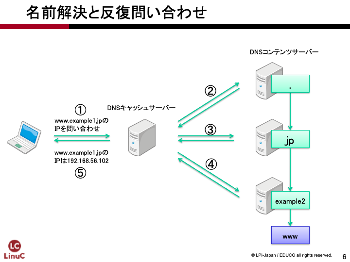
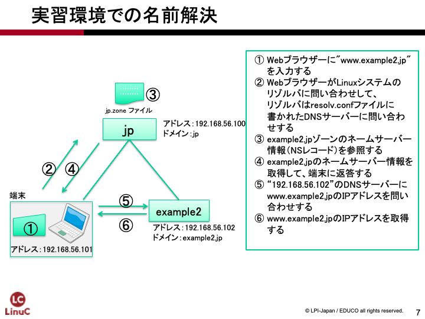

# DNSサーバーの構築
第5章では、ネットワークサービスを使うための土台となる名前解決のサービス(DNS)を設定します。自分のDNSサーバーを他のコンピュータから参照できるように設定をします。DNSに問い合わせを行うコマンドに慣れ、ドメインを管理するBINDプログラムの設定ファイルを扱います。

## 用語集
### DNS {.unlisted .unnumbered}
DNS(Domain Name System)は、IPアドレスと対応するホスト名を登録しておき、プログラムからの問い合わせに応じてIPアドレスやホスト名を返答するシステムです。

### ドメイン名とゾーン {.unlisted .unnumbered}
組織に割り当てられてインターネットで使用する名前をドメイン名と呼びます。ドメイン名はICANN(Internet Corporation for Assigned Names and Numbers)により管理されています。DNSでドメイン名を設定するときは、ドメインではなく「ゾーン」と呼びます。

### ゾーン {.unlisted .unnumbered}
DNSの名前空間の一部分を取り出したものをゾーンとよびます。ゾーンは、DNSを管理する単位として使われます。ゾーンには、ドメイン、サブドメイン、ホスト名などが含まれています。DNS名前空間はツリー構造で表されますが、ゾーンは特定のノード以下の一部または全部を含む部分です。

### FQDN {.unlisted .unnumbered}
ドメイン名表記で、一番右に「.」（ドット）でルートドメインまでを記述する方式をFQDNと呼びます。

### DNSキャッシュサーバー {.unlisted .unnumbered}
プログラムからの名前問い合わせを代行して、様々なDNSサーバーへ名前問い合わせを行って結果を返却するサーバーです。調べた結果をキャッシュしておき、次回問い合わせ時にキャッシュの情報を返すことから、DNSキャッシュサーバーと呼ばれます。クライアントのネットワーク設定でDNSサーバーと呼んだときには、DNSキャッシュサーバーのことを指します。

### DNSコンテンツサーバー {.unlisted .unnumbered}
委託されたゾーンのIPアドレスやホスト名を管理するDNSサーバーです。取得したドメイン名を利用するには、DNSコンテンツサーバーを用意して設定する必要があります。

### リゾルバ {.unlisted .unnumbered}
ドメイン名をもとにIPアドレス情報の検索をしたり、IPアドレスからドメイン情報の検索を行う、名前解決を行うプログラムのことです。

### BIND {.unlisted .unnumbered}
BIND(Berkeley Internet Name Domain)は、Linuxと組み合わせて多く使用されているDNSサーバーのソフトウェアです。DNSキャッシュサーバーとしても、DNSコンテンツサーバーとしても利用することができます。

### グルーレコード {.unlisted .unnumbered}
管理を委任しているゾーンについての問合せに対して、DNSサーバーが委任先のゾーンのDNSコンテンツサーバーのアドレスを返す際に、追加情報として必要となる委任先DNSコンテンツサーバーのAレコードをグルーレコードといいます。

### Aレコード {.unlisted .unnumbered}
名前に対してIPアドレスを指定するためのレコードです。

### NS(Name Server)レコード {.unlisted .unnumbered}
ゾーンの権威を持つDNSコンテンツサーバーを指定するためのレコードです。

### MX(Mail eXchange)レコード {.unlisted .unnumbered}
メールアドレスに利用するドメイン名を定義するためのレコードです。メールサーバーの障害にも対応するために、複数個のメールサーバーを記述でき、プリファレンス値の低いサーバーにメール配信が優先されます。

## DNSの仕組み
インターネットでのコンピュータ同士の通信は、IP(Internet Protocol)を使って行われています。IP通信には相手のIPアドレスが必要ですが、インターネット上の大量のコンピュータをIPアドレスで識別するのは困難です。そこでドメイン名やホスト名という考え方が導入されました。

ドメイン名は組織を表し、ホスト名はその組織が管理しているコンピュータです。表記するときは「ホスト名.ドメイン名」とドット区切りで表記しますが、両方を合わせてホスト名と呼ぶこともあります。

### HOSTSファイルとDNS
インターネットの研究が始まった当初はIPアドレスが割り当てられたコンピュータの数も数えるほどだったので、ホスト名とIPアドレスの対応関係はファイルに記述されて、定期的に更新されていました。この仕組みは今でも残っており、Linuxでは/etc/hostsがそのファイルです。

しかし、インターネットが広まるに従って、ホストファイルでは管理しきれなくなってきました。そこで登場したのがDNS(Domain Name System)です。

### DNSコンテンツサーバーによるドメイン名の管理
ドメイン名を割り当てられた組織毎にDNSコンテンツサーバーを用意します。DNSコンテンツサーバーの管理者は、そのドメインに所属しているホスト名と割り当てられたIPアドレスをDNSコンテンツサーバー登録します。

あるドメインに所属しているホストにアクセスしたいユーザーは、そのドメインのDNSコンテンツサーバーに問い合わせを行うことで、IPアドレスを得ることができます。

DNSの仕組みでは、ドメイン（ゾーン）の管理権限がそれぞれのDNS管理者に委譲されているので、ホストファイルのような一元管理ではなく分散管理となります。管理作業が分担されていて更新も頻繁に行われるので、リアルタイムにホスト名とIPアドレスの対応関係を調べることができる仕組みとなっています。

### DNSキャッシュサーバーによる名前解決
ユーザーの端末が名前解決を必要とする度に、アクセス先のDNSコンテンツサーバーを探して問い合わせをするのは非常に煩雑になります。そこで端末はDNSキャッシュサーバーに名前解決を依頼し、DNSキャッシュサーバーが後述する再帰問い合わせという方法でDNSコンテンツサーバーに対して問い合わせを行います。名前解決が完了すると、その結果だけを端末に返します。

このような仕組みになっているので、PCやスマートフォンではIPアドレス設定の際に検索に使用するDNSサーバーの設定が必要になります。この設定が、名前解決を依頼するDNSキャッシュサーバーのIPアドレスとなります。

また、名前解決の結果は一定期間キャッシュされています。同じホストの名前解決が依頼されるとキャッシュから返答するようにしているので、毎回調べる必要がありません。

\pagebreak
## ドメインの構造
DNSが取り扱うドメイン名は設計上、ルートドメインを頂点とした階層型のツリー構造となっています。ちょうどコンピュータのファイルシステムが、ルートディレクトリを頂点としたツリー構造になっているのと同じだと考えてよいでしょう。そして、その配下にあるドメインはサブドメインとよばれます。ドメインの階層型のツリーは、ルートドメインとたくさんのサブドメインから構成されています。

{width=70%}

### ルートドメイン
ルートドメインは、ドメイン名の開始点です。通常は省略されますが、ドメイン名として記述する際には「.」（ドット）で表されます。

### トップレベルドメイン
トップレベルドメインには、.comや.orgのような組織別ドメインや、.jpのような国別ドメインがあります。また、日本の場合にはexample.co.jpのような組織種別型ドメインと、example.jpのような汎用JPドメインなどがあります。

### ドメイン名の記述
ドメイン名の記述は、右側から記述していきます。FQDN(Fully Qualified Domain Name)であれば一番右にルートドメイン、そしてトップレベルドメインを記述し、さらに左側に各組織毎に割り当てられたドメイン名を記述していきます。各要素の間は「.」（ドット）で区切っていきます。

### ドメイン名の記述例
- example.com.
- example.jp.
- example.co.jp.

トップレベルドメイン以降のドメイン名は、ドメイン取得者が独自にドメイン名を決めることができます。上記の例ではexampleの部分が独自のドメイン名にあたります。

### サブドメイン
記述例のようにドメイン名の左側にさらにドメイン名を記述していくことを「サブドメイン化」と呼びます。たとえば、example.co.jpドメインをさらに東京と大阪の2つに分けて表記したいような場合には、以下の例のように記述します。

- tokyo.example.co.jp.
- osaka.example.co.jp.

サブドメイン化は、上位のドメイン（表記上の右側）を管理している管理者が行います。たとえば、tokyo.example.co.jpドメインまでのサブドメインの階層は次のようになっています。

1. jpドメインはルートドメインのサブドメイン
1. co.jpドメインはjpドメインのサブドメイン
1. example.co.jpドメインはco.jpドメインのサブドメイン
1. tokyo.example.co.jpドメインはexample.co.jpドメインのサブドメイン

### ドメイン名の取得
ドメイン名を取得するということは、上位のドメイン名の管理者にサブドメインを作ってもらい、管理権限を委譲してもらうということになります。

独自の短いドメイン名を取得したいのであればトップレベルドメインを管理している管理組織からサブドメイン化してもらうことになりますが、登録料などの費用がかかります。

短いドメイン名にこだわらない、費用をかけたくない場合には、既にドメイン名を取得している管理者からサブドメインの管理権限を委譲してもらうこともできます。

\pagebreak
## DNSを使った名前解決と再帰問い合わせ
DNSを使って名前を解決する、すなわち名前からIPアドレスを調べる時には、次のような手順で調査が行われます。

1. 端末は、自分の組織やプロバイダーの用意したDNSキャッシュサーバーへ問い合わせます。
1. DNSキャッシュサーバーは、ルートサーバーに「jp」を管理するDNSコンテンツサーバーのIPアドレスを問い合わせます。ルートサーバーは、「jp」を管理するDNSコンテンツサーバーのIPアドレスをDNSキャッシュサーバーへ返します。
1. DNSキャッシュサーバーは、「jp」を管理するDNSコンテンツサーバーへ、サブドメイン「example1.jp」を管理するDNSコンテンツサーバーのIPアドレスを問い合わせます。「jp」を管理するDNSコンテンツサーバーは、サブドメイン「example1.jp」を管理するDNSコンテンツサーバーのIPアドレスをDNSキャッシュサーバーへ返します。
1. DNSキャッシュサーバーは、「example1.jp」を管理するDNSコンテンツサーバーへ、「www.example1.jp」のIPアドレスを問い合わせます。「example1.jp」を管理するDNSコンテンツサーバーは、「www.example1.jp」のIPアドレスをDNSキャッシュサーバーへ返します。
1. DNSキャッシュサーバーは、クライアントに「www.example1.jp」のIPアドレスを返します。

このように、DNSキャッシュサーバーがルートサーバーから順番に問い合わせを行い、最終的に目的のドメインを管理するDNSコンテンツサーバーまで問い合わせをしていくことを「再帰問い合わせ」と呼びます。

{width=70%}

\pagebreak
## 演習で構築するDNSの概略
2つのドメイン名「example1.jp」と「example2.jp」を設定し、相互に名前解決ができるようにDNSコンテンツサーバーを構築します。また、jpドメインからサブドメイン化してゾーンの管理権限を委譲する設定も行います。以下の3つのDNSサーバーを構築します。

### jpゾーンのマシン
example1.jpとexample2.jpをサブドメイン化し、ゾーン管理権限の委譲を設定します。またDNSキャッシュサーバーとしても動作します。

### example1.jpゾーンのマシン
example1.jpゾーンを管理するDNSコンテンツサーバーとして設定します。

### example2.jpゾーンのマシン
example2.jpゾーンを管理するDNSコンテンツサーバーとして設定します。

## 演習の手順
3台のマシンを相互に接続し、相互にDNSを参照できるように設定します。追加でマシン2台分の仮想マシンの作成やOSのインストールなどが必要となります。以下の作業を行っていきます。

1. DNSサーバーソフトウェアであるBINDを使って、example1.jpゾーンを管理するDNSコンテンツサーバーを設定します。
1. jpゾーンおよびexample2.jpゾーンの仮想マシンを作成し、OSをインストールします。それぞれIPアドレスなどの設定が異なる点に注意してください。
1. example2.jpゾーンを管理するDNSコンテンツサーバーを設定します。
1. jpゾーンを管理するDNSコンテンツサーバーを設定します。example1.jpゾーンおよびexample2.jpゾーンに対する権限委譲を設定します。
1. example1.jpゾーンとexample2.jpゾーンのDNSを相互に参照できることを確認します。

次章のメールサーバー構築ではDNSサーバーが正しく設定されていることを前提としているので、この章の演習内容が完全に終わっている必要があります。

## 演習で使うアドレスとドメイン
演習で使用する3台のサーバーのドメイン名、ホスト名、IPアドレスは以下の通りです。

|ドメイン名|ホスト名|IPアドレス|
|---|---|---|
| jp. | host0.jp. | 192.168.56.100 |
| example1.jp. | host1.example1.jp. | 192.168.56.101 |
| example2.jp. | host2.example2.jp. | 192.168.56.102 |

## アドレス解決の流れ
host1.example1.jpのマシン(192.168.56.101)がホストwww.example2.jpを解決するときの動きを追ってみましょう。

WebブラウザでWebページを表示させるとき、DNSキャッシュサーバーのことは特に意識せずWebサイトのアドレスを入力しています。ここではWebアドレスを入力してリクエストしてページが表示されるまでの流れを例に、DNSがどのように動くのか簡単に説明します。

1. host1.example1.jpマシンは、Webブラウザにアドレスとしてwww.example2.jpを入力します。
1. Webブラウザは、Linuxのリゾルバに問い合わせます。
1. リゾルバは、/etc/resolv.confファイルで指定されているDNSキャッシュサーバー（192.168.56.100）へ問い合わせます。
1. DNSキャッシュサーバーは、jpゾーンのDNSコンテンツサーバーを参照し、example2.jpゾーンのDNSコンテンツサーバーのIPアドレス（192.168.56.102）を返します。
1. DNSキャッシュサーバーは、example2.jpゾーンのDNSコンテンツサーバーに問い合わせします。
1. example2.jpゾーンのDNSコンテンツサーバーは、www.example2.jpホストのIPアドレス（192.168.56.102）を返します。
1. DNSキャッシュサーバーは、結果をexample1.jpマシンへ返します。
1. Webブラウザは、www.example2.jpにHTTPでアクセスし、Webページを受け取って表示します。

実際のインターネットでのDNSの名前解決ではルートゾーンから順番に再帰問い合わせを行いますが、演習環境ではDNSキャッシュサーバー自身がjpゾーンのDNSコンテンツサーバーでもあるため、すぐにexample2.jpのDNSコンテンツサーバーに関する情報を返す点が異なります。

{width=70%}

\pagebreak
## DNSコンテンツサーバーの設定
DNSコンテンツサーバーのソフトウェアとしてBINDをインストールして、各ゾーンの設定を行います。

### chroot機能を利用したBINDのセキュリティ
chroot機能はセキュリティを高めるために、プログラムに対して特定のディレクトリ以外にはアクセスできないようにするための機能です。

chroot機能を使ってBINDを実行すると、bindプロセスは/var/named/chrootディレクトリを/（ルート）ディレクトリとして動作します。たとえば、bindプロセスが/etcディレクトリにアクセスしても、実際にアクセスされるのは/var/named/chroot/etcディレクトリになるので、パスワードその他のセキュリティに関する情報にアクセスできません。

{width=70%}

DNSという重要なサービスを提供している関係上、BINDはインターネット上の数多くのサーバーで実行されており、セキュリティの攻撃を受けやすくなっています。万が一、BINDがセキュリティ攻撃を受けて乗っ取られてしまったとしても、chroot機能のおかげでbindプロセスがアクセスできるディレクトリを限定することができるので、システムのその他のファイルへのアクセスを妨げ、被害を最小限に食い止めることができます。

AlmaLinuxでは、シンボリックリンクやマウントなどのLinuxの機能を使って、chroot機能を使った場合でもほとんど管理方法が変わらないように工夫されています。そのため、本書でもchroot機能を有効にします。追加でbind-chrootパッケージのインストールが必要だったり、systemctlコマンドで扱うユニット名（named-chroot）が異なる点に注意してください。

### ゾーンを設定する流れ
ゾーンを設定するために必要な作業は以下の手順となります。

1. BINDのインストールを行います。
1. named.confファイルにゾーンを追加します。
1. ゾーンファイルを作成し、レコードなどを記述します。
1. 設定ファイルに書式間違いが無いか確認します。
1. BINDの起動を行います。
1. BINDの自動起動の設定を行います。
1. ファイアウォールの設定を変更します。
1. NATネットワークを無効化します。
1. /etc/resolv.confの参照するDNSサーバーの設定を確認します。
1. 名前解決の確認を行います。

BINDの基本的な設定ファイルとして/etc/named.confファイルがあります。/etc/named.confにBINDの基本的な設定とゾーンの定義を追加します。さらにゾーンの詳細を定義するゾーンファイルを/var/namedディレクトリに作ります。

## BINDのインストール
BINDのインストールには、bindパッケージとbind-chrootパッケージが必要です。必要なパッケージがインストールされていないときには、dnfコマンドでインストールします。

```
[admin@host1 ~]$ sudo dnf install bind bind-chroot
```

## /etc/named.confの基本設定
/etc/named.confファイルにBINDをDNSコンテンツサーバーとして動作させる基本設定を行います。

```
[admin@host1 ~]$ sudo vi /etc/named.conf
```

```
options {
	listen-on port 53 { 127.0.0.1; 192.168.56.101; }; ← サーバー自身のIPアドレスを追加
	listen-on-v6 port 53 { ::1; };
	directory 	"/var/named";
	dump-file 	"/var/named/data/cache_dump.db";
	statistics-file "/var/named/data/named_stats.txt";
	memstatistics-file "/var/named/data/named_mem_stats.txt";
	recursing-file  "/var/named/data/named.recursing";
	secroots-file   "/var/named/data/named.secroots";
	allow-query     { any; }; ← localhostをanyに変更

	recursion no; ← yesをnoに変更

	dnssec-validation yes;

	managed-keys-directory "/var/named/dynamic";
	geoip-directory "/usr/share/GeoIP";

	pid-file "/run/named/named.pid";
	session-keyfile "/run/named/session.key";

	include "/etc/crypto-policies/back-ends/bind.config";
};

logging {
        channel default_debug {
                file "data/named.run";
                severity dynamic;
        };
};

zone "." IN {
	type hint;
	file "named.ca";
};

zone "example1.jp" IN { ← example1.jpゾーンを指定
	type master;
	file "example1.jp.zone"; ← example1.jp用のゾーン定義ファイル名を指定
	allow-update { none; };
};

include "/etc/named.rfc1912.zones";
include "/etc/named.root.key";
```

設定の内容は以下の通りです。

### 問い合わせを受け付けるアドレスの設定
デフォルトのnamed.confファイルは、127.0.0.1(ローカルループバックインターフェース)への問い合わせにしか返答しない設定なので、外部からの問い合わせを受けられるようにサーバー自身のIPアドレスである「192.168.56.101;」をlisten-onに追加します。後ほど設定するexample2.jpサーバーやjpサーバーの場合にはそれぞれのサーバーのIPアドレスを記述します。

### 問い合わせを許可するアドレスの設定
allow-queryにはデフォルトでは「localhost;」と設定されていて、ローカルからしかDNS問い合わせができないようになっています。DNSコンテンツサーバーはインターネット上のすべての人から参照できなければならないので、この設定を「any」に変更します。

### DNSコンテンツサーバーとしての設定
DNSコンテンツサーバーでは、recursion（再帰問合せ）を禁止にしておく必要があります。そのため、recursionに「no」を設定します。ただし、jpサーバーの場合にはDNSキャッシュサーバーとしても動作させるのでyesのままにしておく必要があります。

### 正引きゾーンの追加
/etc/named.confにゾーン定義を追加します。上記例では以下のように設定しています。

```
zone "example1.jp" IN {
	type master;
	file "example1.jp.zone";
	allow-update { none; };
};	
```

## ゾーンファイルの準備
ゾーンファイルのテンプレートとなる/var/named/named.emptyファイルをコピーします。新たに作成するファイルのファイル名はゾーン定義のfile句で指定したファイル名を指定します。example1.jpゾーンであればexample1.jp.zoneとなります。また、コピー元と同じ所有権（root:named）、パーミッション（640）にするため、cpコマンドに-pオプションを付けて実行します。

```
[admin@host1 ~]$ sudo cp -p /var/named/named.empty /var/named/example1.jp.zone
[admin@host1 ~]$ sudo ls -l /var/named/example1.jp.zone
-rw-r-----. 1 root named 152 11月  8 01:28 /var/named/example1.jp.zone
```

\pagebreak
## ゾーンファイルの修正
コピーした/var/named/example1.jp.zoneファイルを修正します。

```
[admin@host1 ~]$ sudo vi /var/named/example1.jp.zone
```

```
$TTL 3H
$ORIGIN example1.jp.
@       IN SOA  host1 root (
                                        2023100901       ; serial
                                        1D      ; refresh
                                        1H      ; retry
                                        1W      ; expire
                                        3H )    ; minimum
        NS      host1.example1.jp.
        MX 10   mail.example1.jp.

host1   A       192.168.56.101
www     A       192.168.56.101
mail    A       192.168.56.101
```

### $TTL
このゾーン定義ファイル内の記述のTTL（Time to Live・生存時間・有効期間）が3時間であることをデフォルト指定しています。

### \$ORIGIN
このゾーン定義が対象としているゾーン名を指定します。ゾーン定義内のホスト名はすべてFQDNで最後が「.」で終わる必要がありますが、省略された場合には$ORIGINで指定されたゾーン名で補完されます。たとえば、「www」という記述は「www.example1.jp.」と補完されて扱われます。

### SOAレコード
＠から始まるゾーンファイルの最初のレコードはSOAレコードです。このゾーンの管理ポリシーについて設定します。SOAレコードの先頭には＠がありますが、これは$ORIGINで指定したゾーン（ここではexample1.jp.）に置き換えられます。host1はこのDNSコンテンツサーバーのホスト名、rootは管理者ユーザーです。どちらもゾーン名が補完されて、「host1.example1.jp.」「root.example1.jp.」となりますが、ユーザー名は最初の「.」を「@」にしてメールアドレスとして読み替えます。これらは単なる文字列なので、BINDの動作には影響を与えません。シリアルナンバー(serial)は、ゾーン定義を変更する毎に必ず変更する必要があります。西暦(4桁の年)と月日(2桁ずつ)の後に01から99までの数字(2桁)が付いた10桁の数字で指定します。日が異なる場合には日付を、同じ日に変更が複数回あった場合には最後の2桁を変更するのを忘れないようにしてください。

### NSレコード
NSレコードは、このゾーンのDNSコンテンツサーバーである自分自身を定義します。

### MXレコード
MXレコードはドメインのメールサーバーを定義します。

NSレコードやMXレコードの定義では、右側にFQDNを入れるので、最後に必ず「.」を付けてください。また、先頭が空白になっていますが、これは前の行と同じ対象（この場合には＠）が省略されていることを示しています。

### Aレコード
Aレコードで名前とIPアドレスの対応を定義する箇所は、左側にホスト名、右側にIPアドレスが入ります。マシンのホスト名であるhost1や、その他のサービスで使う名前であるwwwやmailとIPアドレスへの対応を記述しました。最後に「.」が付かない名前には、$ORIGINで定義しているゾーン名(ここではexample1.jp.)が自動的に追加されます。

## 設定ファイルとゾーンファイルの書式確認
設定ファイルとゾーンファイルの作成が終わったら、書式の確認を行います。設定が多岐に渡るため、間違いがないかを確認するためのコマンドを使って確認します。

### 設定ファイルの書式確認と注意点
/etc/named.confファイルの編集時、括弧やセミコロンの不足などは良くある設定ミスです。named-checkconfコマンドで/etc/named.confに間違いがないか確認しましょう。

```
[admin@host1 ~]$ sudo named-checkconf
```

この例のように、何も表示されなければ書式に問題がないということです。問題がある場合には、次のように問題がありそうな行番号が表示されます。

```
[admin@host1 ~]$ sudo named-checkconf
/etc/named.conf:11: missing ';' before '}'
```

これは、listen-on portの{}にアドレスを追加するときにIPアドレスの後にセミコロンを記述するのを忘れたというエラーです。エラー表示を見ながら、こうした問題を取り除きましょう。

### ゾーンファイルの書式確認
ゾーンファイルを編集時、よくあるミスとしては、FQDNで記述すべきところを最後の.が抜けているなどがあります。named-checkzoneコマンドを使ってゾーンファイルに間違いがないか確認しましょう。引数は$ORIGINに指定したゾーン名と、確認を行うゾーンファイル名です。

```
[admin@host1 ~]$ sudo named-checkzone example1.jp. /var/named/example1.jp.zone
zone example1.jp/IN: loaded serial 2023100901
OK
```

書式に問題がなければ、この例のように設定したシリアルナンバーが表示され、OKと表示されます。設定が間違っている場合には、次のように問題のある行番号が表示されます。

```
[admin@host1 ~]$ sudo named-checkzone example1.jp. /var/named/example1.jp.zone 
zone example1.jp/IN: NS 'host1.example1.jp.example1.jp' has no address records (A or AAAA)
zone example1.jp/IN: not loaded due to errors.
```

この例では、NSレコードの右側に書いたホスト名がFQDNになっていないため、「host1.example1.jp.example1.jp」となってしまい、対応するAレコードが見つからないというエラーが発生しています。

## BINDの起動と確認
BINDを起動してみましょう。BINDの起動は、systemctlコマンドでnamed-chrootユニットを使います。

```
[admin@host1 ~]$ sudo systemctl start named-chroot
```

起動できたら、状態を確認します。

```
[admin@host1 ~]$ sudo systemctl status named-chroot
● named-chroot.service - Berkeley Internet Name Domain (DNS)
     Loaded: loaded (/usr/lib/systemd/system/named-chroot.service; disabled; preset: disabled)
     Active: active (running) since Mon 2023-10-09 15:18:44 JST; 6s ago
    Process: 12416 ExecStartPre=/bin/bash -c if [ ! "$DISABLE_ZONE_CHECKING" == "yes" ]; then /usr/sbin/named>
    Process: 12418 ExecStart=/usr/sbin/named -u named -c ${NAMEDCONF} -t /var/named/chroot $OPTIONS (code=exi>
   Main PID: 12419 (named)
      Tasks: 6 (limit: 10696)
     Memory: 21.2M
        CPU: 32ms
     CGroup: /system.slice/named-chroot.service
             └─12419 /usr/sbin/named -u named -c /etc/named.conf -t /var/named/chroot

Oct 09 15:18:44 localhost.localdomain named[12419]: network unreachable resolving './DNSKEY/IN': 2001:500:9f:>
Oct 09 15:18:44 localhost.localdomain named[12419]: network unreachable resolving './NS/IN': 2001:500:9f::42#>
Oct 09 15:18:44 localhost.localdomain named[12419]: network unreachable resolving './DNSKEY/IN': 2001:7fe::53>
Oct 09 15:18:44 localhost.localdomain named[12419]: network unreachable resolving './NS/IN': 2001:7fe::53#53
Oct 09 15:18:44 localhost.localdomain named[12419]: zone 1.0.0.0.0.0.0.0.0.0.0.0.0.0.0.0.0.0.0.0.0.0.0.0.0.0.>
Oct 09 15:18:44 localhost.localdomain named[12419]: all zones loaded
Oct 09 15:18:44 localhost.localdomain named[12419]: running
Oct 09 15:18:44 localhost.localdomain systemd[1]: Started Berkeley Internet Name Domain (DNS).
Oct 09 15:18:44 localhost.localdomain named[12419]: managed-keys-zone: Key 20326 for zone . is now trusted (a>
Oct 09 15:18:44 localhost.localdomain named[12419]: resolver priming query complete
```

Activeの欄に「active (running)」と表示されていることを確認します。また、下に表示されるログにも「Started Berkeley Internet Name Domain...」と表示されていて、BINDのサービスが起動していることが確認できます。

表示を終了するにはQキーを押します。

## 自動起動の設定
システム起動時にBINDが自動的に起動されるように設定しておきましょう。systemctl enableコマンドで設定します。

```
[admin@host1 ~]$ sudo systemctl enable named-chroot
Created symlink /etc/systemd/system/multi-user.target.wants/named-chroot.service → /usr/lib/systemd/system/named-chroot.service.
```

自動起動になっているかは、次のように確認できます。

```
[admin@host1 ~]$ sudo systemctl is-enabled named-chroot
enabled
```

自動起動の設定がされている場合には、「enabled」と表示されます。

## ファイアウォールの設定
DNSコンテンツサーバーへの問い合わせができるようにファイアウォールのサービス許可設定を行います。以下のfirewall-cmdコマンドを実行します。

```
[admin@host1 ~]$ sudo firewall-cmd --add-service=dns --zone=public --permanent
[admin@host1 ~]$ sudo firewall-cmd --reload
```

## 参照するDNSサーバーの設定とNATネットワークの停止
DNSサーバーによる名前解決を確認する前に、参照するDNSサーバーの設定について確認、変更します。また、変更にあたっては、実習環境で使用している仮想マシンのNATネットワークの停止を行います。

### /etc/resolv.confによる参照DNSサーバーの設定
Linuxで名前解決を行うために参照するDNSサーバーは/etc/resolv.confに記述されています。

```
[admin@host1 ~]$ cat /etc/resolv.conf
# Generated by NetworkManager
search flets-east.jp example1.jp
nameserver 192.168.11.1
nameserver 192.168.56.101
```

設定の内容は使用しているネットワーク環境によって異なりますが、参照するDNSサーバーを指定するnameserverの設定値として、インストール時に設定した「192.168.56.101」以外に設定されているのがNATネットワークのDHCPで設定された参照するDNSサーバーです。

### エディタで/etc/resolv.confを修正すると？
エディタで/etc/resolv.confを修正すると、設定は即時有効となります。

ただし、ファイルの先頭行に「# Generated by NetworkManager」と書かれている通り、/etc/resolv.confはNetworkManagerが自動的に生成しています。そのため、システムの再起動などによって再生成されるとエディタでの変更は破棄されます。一時的に動作を変更したいような場合にはよいですが、継続して設定を適用したい場合には大元となるネットワークの設定を変更する必要があります。本章の最後では、ネットワークインターフェースの設定を変更する方法を解説しています。

以下の手順ではNetworkManagerを操作して設定ファイルを再生成しています。ただし、この方法も継続的な変更ではなく、システムが再起動されるとNATネットワークのネットワークインターフェースが有効化され、変更は破棄され元に戻ります。

### ネットワークインターフェースの名前を確認
まず、ネットワークインターフェースの名前を確認します。

```
[admin@host1 ~]$ ip -4 a
（略）
2: enp0s3: <BROADCAST,MULTICAST,UP,LOWER_UP> mtu 1500 qdisc fq_codel state UP group default qlen 1000
    inet 10.0.2.15/24 brd 10.0.2.255 scope global dynamic noprefixroute enp0s3
       valid_lft 85842sec preferred_lft 85842sec
3: enp0s8: <BROADCAST,MULTICAST,UP,LOWER_UP> mtu 1500 qdisc fq_codel state UP group default qlen 1000
    inet 192.168.56.101/24 brd 192.168.56.255 scope global noprefixroute enp0s8
       valid_lft forever preferred_lft forever
```

この例では、IPアドレス「10.0.2.15」からNATネットワークのネットワークインターフェースは「enp0s3」と分かります。

### NATネットワークを停止する
NATネットワークのネットワークインターフェースenp0s3を停止します。NetworkManagerをコマンドラインから操作するnmcliコマンドを使用します。

```
[admin@host1 ~]$ sudo nmcli connection down enp0s3
接続 'enp0s3' が正常に非アクティブ化されました (D-Bus アクティブパス: /org/freedesktop/NetworkManager/ActiveConnection/2)
```

### /etc/resolv.confの変更の確認
NetworkManagerは設定が変更される度に/etc/resolv.confを再生成します。変更されたことを確認します。

```
[admin@host1 ~]$ cat /etc/resolv.conf
# Generated by NetworkManager
search example1.jp
nameserver 192.168.56.101
```

このように、参照するDNSサーバーの設定が自分自身だけになりました。

### NATネットワークの接続の有効化
再度インターネットなどに接続する必要が出た場合には、nmcliコマンドでネットワークインターフェースを有効化する必要があります。

```
[admin@host1 ~]$ sudo nmcli connection up enp0s3
接続が正常にアクティベートされました (D-Bus アクティブパス: /org/freedesktop/NetworkManager/ActiveConnection/6)
```

インターネットに接続できるように戻ったことを確認したら、再度NATネットワークを無効化しておきます。

```
[admin@host1 ~]$ sudo nmcli connection down enp0s3
```

ただし、この無効化はOSが再起動されるとNATネットワークが有効になり元に戻ることに注意してください。

## 名前解決の確認
BINDを起動し、NATネットワークを無効化したら、名前解決が正常に行われるかを確認します。名前解決の確認にはdigコマンドが使用できます。

### digコマンドでホストの名前解決を確認
digコマンドでホスト名からIPアドレスが解決されることを確認します。digコマンドの引数に名前解決するホスト名を指定して実行します。

```
[admin@host1 ~]$ dig host1.example1.jp

; <<>> DiG 9.16.23-RH <<>> host1.example1.jp @192.168.56.101
;; global options: +cmd
;; Got answer:
;; ->>HEADER<<- opcode: QUERY, status: NOERROR, id: 32703
;; flags: qr aa rd; QUERY: 1, ANSWER: 1, AUTHORITY: 0, ADDITIONAL: 1
;; WARNING: recursion requested but not available

;; OPT PSEUDOSECTION:
; EDNS: version: 0, flags:; udp: 1232
; COOKIE: 8375a6e1adca8c5501000000657d0ee8465100965cb0f7dc (good)
;; QUESTION SECTION:
;host1.example1.jp.		IN	A

;; ANSWER SECTION:
host1.example1.jp.	10800	IN	A	192.168.56.101

;; Query time: 0 msec
;; SERVER: 192.168.56.101#53(192.168.56.101) ← 参照したDNSサーバーのIPアドレス
;; WHEN: Sat Dec 16 11:43:52 JST 2023
;; MSG SIZE  rcvd: 90

```

host1.example1.jpのAレコードが正しく設定されていることが確認できます。

### 正しく名前解決が行えない場合
正しく動作しない場合、結果の下から3行にある「SERVER」の結果が「192.168.56.101」になっているかを確認してください。NATネットワークの無効化を忘れていると、参照するDNSサーバーがNATネットワーク側に設定されたIPアドレスになっています。

### その他のAレコードを名前解決する
同様に、www.example1.jpやmail.example1.jpも確認してみます。

```
[admin@host1 ~]$ dig www.example1.jp
（略）
;; QUESTION SECTION:
;www.example1.jp.		IN	A

;; ANSWER SECTION:
www.example1.jp.	10800	IN	A	192.168.56.101
（略）
```

```
[admin@host1 ~]$ dig mail.example1.jp
（略）
;; QUESTION SECTION:
;mail.example1.jp.		IN	A

;; ANSWER SECTION:
mail.example1.jp.	10800	IN	A	192.168.56.101
（略）
```

### digコマンドでNSレコードを確認
ドメイン名の後にnsを指定すると、ドメインに登録されているNSレコード(ネームサーバーの情報)と、NSレコードで返されたホストのAレコードが表示されます。

```
[admin@host1 ~]$ dig example1.jp ns
（略）
;; QUESTION SECTION:
;example1.jp.			IN	NS

;; ANSWER SECTION:
example1.jp.		10800	IN	NS	host1.example1.jp.

;; ADDITIONAL SECTION:
host1.example1.jp.	10800	IN	A	192.168.56.101
（略）
```

### digコマンドでMXレコードを確認
ドメイン名の後にmxを指定すると、ドメインに登録されているMXレコード(メールサーバーの情報)と、MXレコードで返されたホストのAレコードが表示されます。

```
[admin@host1 ~]$ dig example1.jp mx
（略）
;; QUESTION SECTION:
;example1.jp.			IN	MX

;; ANSWER SECTION:
example1.jp.		10800	IN	MX	10 mail.example1.jp.

;; ADDITIONAL SECTION:
mail.example1.jp.	10800	IN	A	192.168.56.101
（略）
```

### 参照するDNSサーバーを指定したdigコマンドの実行
digコマンドの引数に「@IPアドレス」を指定することで、一時的に参照するDNSサーバーを変更することができます。DNSサーバーの動作が正しくないような場合の原因究明に利用できます。

```
[admin@host1 ~]$ dig www.example1.jp @192.168.56.101
```

## example2.jpサーバーとjpサーバーの追加
example1.jpドメインの設定ができたので、相互に名前解決ができるように仮想マシンを2台追加し、それぞれexample2.jpドメイン、jpドメインを管理するDNSサーバーとして設定します。

追加の手順は以下の情報を参考に、第2章および第3章の手順を繰り返し行ってください。

### 仮想マシン作成の留意事項
VirtualBoxで仮想マシンを追加で2台作成します。

既に作成している仮想マシンと同じように作成しますが、区別が付くように仮想マシンの名前をホスト名に合わせてください。

| 名前 |
|------------|
| host2.example2.jp |
| host0.jp |

### ネットワークアダプターの追加を忘れずに
仮想マシンはホストオンリーネットワークで相互に通信を行いますので、ネットワークアダプターの追加を忘れないようにしてください。

### OSのインストール
作成した仮想マシンにOSをインストールします。

ホスト名とIPアドレスをそれぞれのサーバーに合わせて設定します。

| ホスト名 | IPアドレス | DNS |
|---|---|---|
| host2.example2.jp | 192.168.56.102 | 192.168.56.102 |
| host0.jp | 192.168.56.100 | 192.168.56.100 |

### 相互通信の確認
OSが起動したら、仮想マシン間で相互に通信ができることをpingコマンドを使って確認してください。

以下のように、各マシンから既に動作しているhost1.example1.jpに向けてpingコマンドを実行してみます。

```
$ ping 192.168.56.101
```

## example2.jpゾーンの設定
まず、example2.jpゾーンの設定を行います。手順はexample1.jpゾーンを設定した以下の手順と同じです。

1. BINDのインストールを行います。
1. named.confファイルにゾーンを追加します。
1. ゾーンファイルを作成し、レコードなどを記述します。
1. 設定ファイルに書式間違いが無いか確認します。
1. BINDの起動を行います。
1. BINDの自動起動の設定を行います。
1. ファイアウォールの設定を変更します。
1. NATネットワークを無効化します。
1. /etc/resolv.confの参照するDNSサーバーの設定を確認します。
1. 名前解決の確認を行います。

以下、example1.jpゾーンの設定と異なるポイントです。

### named.confの設定
named.confを設定します。listen-onに設定するIPアドレスが「192.168.56.102」になる点と、定義するゾーン名が「example2.jp」になる点が異なります。

```
options {
	listen-on port 53 { 127.0.0.1; 192.168.56.102; }; ← ホストのIPアドレスを追加
	listen-on-v6 port 53 { ::1; };
	directory 	"/var/named";
	dump-file 	"/var/named/data/cache_dump.db";
	statistics-file "/var/named/data/named_stats.txt";
	memstatistics-file "/var/named/data/named_mem_stats.txt";
	recursing-file  "/var/named/data/named.recursing";
	secroots-file   "/var/named/data/named.secroots";
	allow-query     { any; }; ← localhostをanyに変更

	recursion no; ← yesをnoに変更

	dnssec-validation yes;

	managed-keys-directory "/var/named/dynamic";
	geoip-directory "/usr/share/GeoIP";

	pid-file "/run/named/named.pid";
	session-keyfile "/run/named/session.key";

	include "/etc/crypto-policies/back-ends/bind.config";
};

logging {
        channel default_debug {
                file "data/named.run";
                severity dynamic;
        };
};

zone "." IN {
	type hint;
	file "named.ca";
};

zone "example2.jp" IN { ← example2.jpゾーンを指定
	type master;
	file "example2.jp.zone"; ← example2.jp用のゾーン定義ファイル名を指定
	allow-update { none; };
};	

include "/etc/named.rfc1912.zones";
include "/etc/named.root.key";
```

### ゾーン定義ファイルの作成
ゾーン定義ファイルを作成します。named.emptyをexample2.jp.zoneとしてコピーします。-pオプションを忘れないようにしてください。

```
[admin@host2 ~]$ sudo cp -p /var/named/named.empty /var/named/example2.jp.zone
[admin@host2 ~]$ sudo ls -l /var/named/example2.jp.zone
-rw-r-----. 1 root named 152 11月  8 01:28 /var/named/example2.jp.zone
```

### ゾーンファイルの修正
コピーした/var/named/example2.jp.zoneファイルを修正します。ゾーン名が「example2.jp」、ホスト名が「host2」、IPアドレスが「192.168.56.102」になっている点に注意が必要です。

```
[admin@host2 ~]$ sudo vi /var/named/example2.jp.zone
```

```
$TTL 3H
$ORIGIN example2.jp.
@       IN SOA  host2 root (
                                        2023100901       ; serial
                                        1D      ; refresh
                                        1H      ; retry
                                        1W      ; expire
                                        3H )    ; minimum
        NS      host2.example2.jp.
        MX 10   mail.example2.jp.

host2   A       192.168.56.102
www     A       192.168.56.102
mail    A       192.168.56.102
```

### BINDの起動
example2.jpゾーンの設定が完了したら、BINDを起動します。

```
[admin@host2 ~]$ sudo systemctl start named-chroot
```

### 自動起動とファイアウォールの設定
自動起動の設定や、ファイアウォールの設定を行います。

```
[admin@host2 ~]$ sudo systemctl enable named-chroot
[admin@host2 ~]$ sudo firewall-cmd --add-service=dns --zone=public --permanent
[admin@host2 ~]$ sudo firewall-cmd --reload
```

### NATネットワークを停止する
NATネットワークのネットワークインターフェースenp0s3を停止します。

```
[admin@host2 ~]$ sudo nmcli connection down enp0s3

```

/etc/resolv.confが変更されていることを確認します。

```
[admin@host2 ~]$ cat /etc/resolv.conf
# Generated by NetworkManager
search example2.jp
nameserver 192.168.56.102
```

### 名前解決の確認
名前解決を確認します。確認方法はexample1.jpゾーンを設定した際に行ったdigコマンドと同様です。

```
[admin@host2 ~]$ dig host2.example2.jp
```

```
[admin@host2 ~]$ dig example2.jp ns
```

```
[admin@host2 ~]$ dig example2.jp mx
```

## 上位jpゾーンのDNSコンテンツサーバーの設定
example1.jpゾーン、example2.jpゾーンの設定が完了したら、上位ゾーンにあたるjpゾーンの設定を行います。手順はexample1.jpゾーンやexample2.jpゾーンを設定した以下の手順と同じです。

1. BINDのインストールを行います。
1. named.confファイルにゾーンを追加します。
1. ゾーンファイルを作成し、レコードなどを記述します。
1. 設定ファイルに書式間違いが無いか確認します。
1. BINDの起動を行います。
1. BINDの自動起動の設定を行います。
1. ファイアウォールの設定を変更します。
1. NATネットワークを無効化します。
1. /etc/resolv.confの参照するDNSサーバーの設定を確認します。
1. 名前解決の確認を行います。

以下、example1.jpゾーンの設定と異なるポイントです。

### named.confの設定
named.confを設定します。listen-onに設定するIPアドレスが192.168.56.100になる点と、定義するゾーン名が.jpになる点が異なります。また、このDNSサーバーはDNSキャッシュサーバーとしても動作させるので、recursionの設定を「yes;」のままにしておきます。

```
options {
	listen-on port 53 { 127.0.0.1; 192.168.56.100; }; ← ホストのIPアドレスを追加
	listen-on-v6 port 53 { ::1; };
	directory 	"/var/named";
	dump-file 	"/var/named/data/cache_dump.db";
	statistics-file "/var/named/data/named_stats.txt";
	memstatistics-file "/var/named/data/named_mem_stats.txt";
	recursing-file  "/var/named/data/named.recursing";
	secroots-file   "/var/named/data/named.secroots";
	allow-query     { any; }; ← localhostをanyに変更

	recursion yes; ← yesのままにすること

	dnssec-validation yes;

	managed-keys-directory "/var/named/dynamic";
	geoip-directory "/usr/share/GeoIP";

	pid-file "/run/named/named.pid";
	session-keyfile "/run/named/session.key";

	include "/etc/crypto-policies/back-ends/bind.config";
};

logging {
        channel default_debug {
                file "data/named.run";
                severity dynamic;
        };
};

zone "." IN {
	type hint;
	file "named.ca";
};

zone "jp" IN { ← jpゾーンを指定
	type master;
	file "jp.zone"; ← jp用のゾーン定義ファイル名を指定
	allow-update { none; };
};

include "/etc/named.rfc1912.zones";
include "/etc/named.root.key";
```

### ゾーン定義ファイルの作成
ゾーン定義ファイルを作成します。named.emptyをjp.zoneとしてコピーします。-pオプションを忘れないようにしてください。

```
[admin@host0 ~]$ sudo cp -p /var/named/named.empty /var/named/jp.zone
[admin@host0 ~]$ sudo ls -l /var/named/jp.zone
-rw-r-----. 1 root named 152 11月  8 01:28 /var/named/jp.zone
```

### ゾーンファイルの修正
コピーした/var/named/jp.zoneファイルを修正します。ゾーン名が「jp」、ホスト名が「host0」、IPアドレスが「192.168.56.100」になっている点に注意が必要です。メールやWebなどには使用しないので、MXレコードやwww、mailなどのAレコードは作成しません。

サブドメインとして権限の委譲を行ったexample1.jpゾーンとexample2.jpゾーンのNSレコード、それぞれのゾーンを管理するDNSコンテンツサーバーを指定するAレコードをグルーレコードとして記述します。

```
[admin@host0 ~]$ sudo vi /var/named/jp.zone
```

```
$TTL 3H
$ORIGIN jp.
@       IN SOA  host0 root (
                                        2023100901       ; serial
                                        1D      ; refresh
                                        1H      ; retry
                                        1W      ; expire
                                        3H )    ; minimum
        NS      host0.jp.
example1.jp. NS      host1.example1.jp.
example2.jp. NS      host2.example2.jp.

host0   A       192.168.56.100
host1.example1.jp.     A       192.168.56.101
host2.example2.jp.     A       192.168.56.102
```

### BINDの起動
jpゾーンの設定が完了したら、BINDを起動します。

```
[admin@host0 ~]$ sudo systemctl start named-chroot
```

### 自動起動とファイアウォールの設定
自動起動の設定や、ファイアウォールの設定を行います。

```
[admin@host0 ~]$ sudo systemctl enable named-chroot
[admin@host0 ~]$ sudo firewall-cmd --add-service=dns --zone=public --permanent
[admin@host0 ~]$ sudo firewall-cmd --reload
```

### NATネットワークを停止する
NATネットワークのネットワークインターフェースenp0s3を停止します。

```
[admin@host0 ~]$ sudo nmcli connection down enp0s3

```

/etc/resolv.confが変更されていることを確認します。

```
[admin@host0 ~]$ cat /etc/resolv.conf
# Generated by NetworkManager
search jp
nameserver 192.168.56.100
```

### 名前解決の確認
名前解決を確認します。example1.jpゾーンとexample2.jpゾーンのDNSコンテンツサーバーを示すグルーレコードが名前解決できるかを確認するため、それぞれのNSレコードを問い合わせます。

```
[admin@host0 ~]$ dig example1.jp ns
```

```
[admin@host0 ~]$ dig example2.jp ns
```

## 相互に名前解決できることを確認
3台のDNSサーバーが設定できたので、example1.jpとexample2.jpを相互に名前解決できることを確認します。

### 参照するDNSサーバーの変更
example1.jpゾーンとexample2.jpゾーンを相互に参照できるようにするには、各マシンが名前解決のために参照するDNSサーバーをhost0.jp（192.168.56.100）に設定しておく必要があります。

以下の手順で、host1とhost2の設定をそれぞれ変更します。

1. デスクトップを右クリックし、ポップアップメニューから「設定」を選択します。
1. 設定画面の左側のメニューから「ネットワーク」を選択します。
1. 「Ethernet (enp0s8)」の欄にある歯車のボタンをクリックします。
1. 接続プロファイルの設定画面が表示されます。
1. 「IPv4」のタブをクリックします。
1. DNSサーバーのアドレスをhost0.jpマシンのIPアドレス「192.168.56.100」に変更します。
1. 「適用」ボタンを押して元の画面に戻ります。
1. 「Ethernet (enp0s8)」の欄にあるスイッチを一旦「オフ」に変えます。
1. 再度「オン」に変えるとDNS設定が変更されます。

{width=70%}

設定は/etc/resolv.confが再生成されることで適用されています。ファイルの内容を確認してみてください。

### 名前解決の確認
digコマンドで、他のドメインのNSレコードやMXレコードを問い合わせてみます。

以下は、host1上で実行して、example2.jpドメインのレコードが名前解決できるかを確認しています。

```
[admin@host1 ~]$ dig www.example2.jp
（略）
;; QUESTION SECTION:
;www.example2.jp.		IN	A

;; ANSWER SECTION:
www.example2.jp.	10716	IN	A	192.168.56.102

;; Query time: 0 msec
;; SERVER: 192.168.56.100#53(192.168.56.100)
（略）
```

```
$ dig example2.jp mx
（略）
;; QUESTION SECTION:
;example2.jp.			IN	MX

;; ANSWER SECTION:
example2.jp.		10704	IN	MX	10 mail.example2.jp.

;; Query time: 0 msec
;; SERVER: 192.168.56.100#53(192.168.56.100)
（略）
```

MXレコードの名前解決は、次の章で行うメールサーバーを動かす上での前提条件となります。きちんと名前解決が行えていることを確認した上で次の章に進んでください。

## うまく名前解決が行えない場合には
サーバー相互の名前解決がうまく動作しない場合には、以下の点を確認してください。

- DNSサーバーが起動している
- DNSサーバーが名前解決に応答している
- pingコマンドでお互いにIP通信が行えている
- ファイアウォールの設定が変更されている
- 参照するDNSサーバーの設定が「192.168.56.100」に変更されている

\pagebreak
