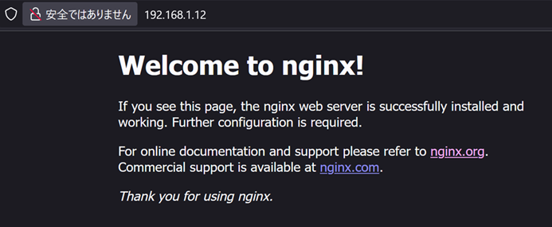

# Webサーバーの構築
第4章では、ホームページやWebシステムを公開するためのWebサービスを設定します。パッケージのインストールやシステム管理権限などについても触れます。
なお、セキュリティを考慮したネットワークのアクセス制限については第7章で紹介します。

## 用語集
### HTML(HyperText Markup Language) {.unlisted .unnumbered}
Webページを書くためのタグを使って文章を構造的に記述できるマークアップ言語です。他ドキュメントへのハイパーリンクを書いたり、画像を利用したり、リストや表などの高度な表現も可能です。現在では、ページレイアウトなどを定義するCSS（Cascading Style Sheets）や、プログラムを記述できるJavaScriptなどと組み合わせて高度なWebページを作成できます。

### HTTP(HyperText Transfer Protocol) {.unlisted .unnumbered}
WebブラウザとWebサーバーの間でHTMLなどのコンテンツ(データ)送受信に使われる通信手順です。ファイルのリクエスト(要求)とファイルのレスポンス(返送)が組でセッションになります。現在では、SSL/TLSで通信を暗号化するなどしてセキュリティを高めたHTTPS（Hypertext Transfer Protocol Secure）が使用されています。

### Nginx {.unlisted .unnumbered}
Igor Sysoevsによって開発されたオープンソースソフトウェアでありあり、現在もっとも世界中で利用されているWebサーバーです。Webサーバーとしてだけではなく、リバースプロキシサーバ、ロードバランサーとしても利用できるソフトウェアです。

### Apache HTTPサーバー {.unlisted .unnumbered}
従来から世界中で利用されている使われているWebサーバーであり、大規模な商用サイトから自宅サーバーまで幅広く利用されています。Apacheソフトウェア財団のApache HTTPサーバープロジェクトで開発が行われているオープンソースソフトウェアです。

### URL(Uniform Resource Locator) {.unlisted .unnumbered}
インターネット上のリソースを指定するための記述方法で、ホームページのアドレスやメールのアドレスなどを指定できます。リソースを特定するスキーム名とアドレスを「://」でつないで書きます。

### パッケージ {.unlisted .unnumbered}
プログラムの本体であるバイナリや設定ファイル、ドキュメントなどを一式まとめてインストール可能なようにまとめたものです。大きなプログラムの場合、本体とライブラリ、各種拡張機能などを別々のパッケージとしてまとめて選択的にインストールできるようにしていることがあります。Linuxディストリビューションは、このパッケージの集合体と考えることができます。

### システム管理権限 {.unlisted .unnumbered}
Linuxは複数のユーザーが同時に利用できるマルチユーザー型のOSです。システム管理権限は、システム全体に対する変更などが行える権限で、一般的なユーザーには与えられていません。Linuxではrootユーザーか、sudoコマンドを使える権限が与えられたユーザーのみシステム管理権限を行使できます。本教科書で利用するLinuxディストリビューションであるUbuntuでは、後者のsudoコマンドによる管理者権限の操作を行います。

\pagebreak
## Webサーバーの仕組み
Webシステムとは、インターネット環境で最も代表的なクライアントサーバー型のシステムで、WebサーバーとクライアントのWebブラウザとで構成されます。Webサーバーは要求されたファイルをWebクライアントに提供し、クライアントは受け取ったファイルを表示します。

{width=70%}


提供される情報はテキストから画像や動画と幅広く、クライアントが対応しているデータならば広く扱えます。Webシステムの文章データとしてはHTMLが一般的に使われています。

## パッケージのインストール
LinuxでWebサーバーを動作させるには、まずWebサーバーのインストールを行います。ソースコードをコンパイルして動かすこともできますが、パッケージを使えば簡単にインストールが行えます。実習で使用しているUbuntu 24.04.2 LTS(Server)ではDEB形式のパッケージを使用しており、パッケージ管理ツールとしてaptコマンドが使用できます。

### aptコマンド
aptコマンドを使うと、パッケージのインストールや削除、アップデートなどが行えます。

### aptコマンドとapt-getコマンド
aptコマンドは、従来はapt-getコマンド・apt-cacheなどが行っていたパッケージ管理を置き換えるコマンドです。apt-get installコマンド等、使用しているサブコマンドの多くはaptコマンドでも実行できます。

### sudoコマンドによるroot権限の取得
aptコマンドによるパッケージのインストールは、システムの変更を伴うため管理者であるrootユーザーの権限が必要になります。コマンド実行時にroot権限を取得するには、sudoコマンドを使用します。OSインストール時、あるいは初期設定時に作成したユーザーにはsudoコマンドを実行する権限が与えられています。

### aptコマンドが参照するパッケージリポジトリ
aptコマンドは、インストールに使用するパッケージをリポジトリと呼ばれる場所から取得します。通常はインターネット上にリポジトリサーバーが用意されており、インターネット経由でパッケージをダウンロードします。今回はインターネットにアクセスできる前提で作業を行います。

### プロキシーが必要な場合には
インターネットへのアクセスにプロキシーを経由する必要がある場合、aptコマンドの設定でプロキシを設定することでアクセスできるようになります。設定方法は、別途マニュアル等を参照してください。

### インターネットにアクセスできない環境でのパッケージ管理
インターネットにアクセスできない環境ではインターネット上のリポジトリにアクセスできないため、以下のような方法でインストールを行う必要があります。本教科書ではインストール時に必要なソフトウェアを選択してインストールする方式を採用していますが、その他の方法が必要となる場合もあります。

- OSインストール時にあらかじめ必要なソフトウェアを選択してインストールしておく
- ISOイメージに含まれているDEBパッケージファイルをaptコマンドなどを使って手動でインストールする
- ISOイメージをリポジトリとして扱うように設定ファイルを作成する
- アクセス可能なローカルネットワーク上にリポジトリサーバーを用意する

ただし、リポジトリサーバーを用意する以外の方法ではセキュリティアップデートなどが行われた最新のパッケージをインストールするのが難しくなります。実際のシステムを運用するには、継続的にパッケージをアップデートできる方法を考えておくべきでしょう。

### 依存関係の解消
動作するために複数のパッケージが必要となる場合、aptコマンドはインストールするパッケージが必要とするパッケージも同時にインストールを行います。必要となるパッケージがあることを依存関係と呼びます。

## apt installコマンドによるパッケージのインストール
Nginxのパッケージ名はnginxです。まず、sudoコマンドを頭に付けてapt updateコマンドを実行し、ローカル環境に保持するレポジトリのパッケージリストを最新化します。その後、sudo apt installコマンドを実行します。

```
ubuntu@host1example1test:~$ sudo apt update
[sudo] password for ubuntu:
Get:1 http://security.ubuntu.com/ubuntu noble-security InRelease [126 kB]
Hit:2 http://jp.archive.ubuntu.com/ubuntu noble InRelease
Get:3 http://jp.archive.ubuntu.com/ubuntu noble-updates InRelease [126 kB]
Get:4 http://jp.archive.ubuntu.com/ubuntu noble-backports InRelease [126 kB]
Get:5 http://security.ubuntu.com/ubuntu noble-security/main amd64 Packages [782 kB]
Get:6 http://jp.archive.ubuntu.com/ubuntu noble-updates/main amd64 Packages [1,028 kB]
Get:7 http://jp.archive.ubuntu.com/ubuntu noble-updates/main Translation-en [224 kB]
Get:8 http://security.ubuntu.com/ubuntu noble-security/main Translation-en [147 kB]
Get:9 http://jp.archive.ubuntu.com/ubuntu noble-updates/main amd64 Components [161 kB]
Get:10 http://jp.archive.ubuntu.com/ubuntu noble-updates/restricted Translation-en [199 kB]
Get:11 http://jp.archive.ubuntu.com/ubuntu noble-updates/restricted amd64 Components [212 B]
Get:12 http://jp.archive.ubuntu.com/ubuntu noble-updates/universe amd64 Packages [1,059 kB]
Get:13 http://security.ubuntu.com/ubuntu noble-security/main amd64 Components [21.5 kB]
Get:14 http://security.ubuntu.com/ubuntu noble-security/restricted Translation-en [191 kB]
Get:15 http://security.ubuntu.com/ubuntu noble-security/restricted amd64 Components [212 B]
Get:16 http://security.ubuntu.com/ubuntu noble-security/universe amd64 Packages [833 kB]
Get:17 http://jp.archive.ubuntu.com/ubuntu noble-updates/universe Translation-en [268 kB]
Get:18 http://jp.archive.ubuntu.com/ubuntu noble-updates/universe amd64 Components [376 kB]
Get:19 http://security.ubuntu.com/ubuntu noble-security/universe amd64 Components [52.2 kB]
Get:20 http://jp.archive.ubuntu.com/ubuntu noble-updates/multiverse amd64 Components [940 B]
Get:21 http://jp.archive.ubuntu.com/ubuntu noble-backports/main amd64 Components [7,076 B]
Get:22 http://security.ubuntu.com/ubuntu noble-security/multiverse amd64 Components [212 B]
Get:23 http://jp.archive.ubuntu.com/ubuntu noble-backports/restricted amd64 Components [216 B]
Get:24 http://jp.archive.ubuntu.com/ubuntu noble-backports/universe amd64 Components [16.4 kB]
Get:25 http://jp.archive.ubuntu.com/ubuntu noble-backports/multiverse amd64 Components [212 B]
Fetched 5,746 kB in 11s (529 kB/s)
Reading package lists... Done
Building dependency tree... Done
Reading state information... Done
67 packages can be upgraded. Run 'apt list --upgradable' to see them.

ubuntu@host1example1test:~$ sudo apt install nginx
Reading package lists... Done
Building dependency tree... Done
Reading state information... Done
The following additional packages will be installed:
  nginx-common
Suggested packages:
  fcgiwrap nginx-doc ssl-cert
The following NEW packages will be installed:
  nginx nginx-common
0 upgraded, 2 newly installed, 0 to remove and 67 not upgraded.
Need to get 551 kB of archives.
After this operation, 1,596 kB of additional disk space will be used.
Do you want to continue? [Y/n] Y
Get:1 http://jp.archive.ubuntu.com/ubuntu noble-updates/main amd64 nginx-common all 1.24.0-2ubuntu7.3 [31.2 kB]
Get:2 http://jp.archive.ubuntu.com/ubuntu noble-updates/main amd64 nginx amd64 1.24.0-2ubuntu7.3 [520 kB]
Fetched 551 kB in 3s (213 kB/s)
Preconfiguring packages ...
Selecting previously unselected package nginx-common.
(Reading database ... 86743 files and directories currently installed.)
Preparing to unpack .../nginx-common_1.24.0-2ubuntu7.3_all.deb ...
Unpacking nginx-common (1.24.0-2ubuntu7.3) ...
Selecting previously unselected package nginx.
Preparing to unpack .../nginx_1.24.0-2ubuntu7.3_amd64.deb ...
Unpacking nginx (1.24.0-2ubuntu7.3) ...
Setting up nginx (1.24.0-2ubuntu7.3) ...
Setting up nginx-common (1.24.0-2ubuntu7.3) ...
Created symlink /etc/systemd/system/multi-user.target.wants/nginx.service → /usr/lib/systemd/system/nginx.service.
Processing triggers for ufw (0.36.2-6) ...
Processing triggers for man-db (2.12.0-4build2) ...
Scanning processes...
Scanning linux images...

Running kernel seems to be up-to-date.

No services need to be restarted.

No containers need to be restarted.

No user sessions are running outdated binaries.

No VM guests are running outdated hypervisor (qemu) binaries on this host.
```

sudoコマンドを初めて実行する際には、実行しているユーザーのパスワードが要求されます。sudoコマンド実行後、しばらくの間は再度実行する際にはパスワードが要求されませんが、一定時間経過後は再度要求されます。

インストールを行うnginxパッケージの依存関係を確認し、必要となる追加のパッケージも同時にインストールを行います。実行例では、依存関係にあるパッケージも追加でインストールすることを提案しています。問題なければ "y" を入力してパッケージのダウンロードとインストールを行います。

## Webサーバーの起動
Webサーバーを起動します。systemctlコマンドを使って、Webサーバーをバックグラウンドサービスとして起動します。

### systemctlコマンド
systemctlコマンドはsystemdを制御するためのコマンドです。systemdはLinuxがOSとして起動する際、Linuxカーネルが起動した後に一番最初に実行されるプロセスで、OS全体を制御します。systemctlコマンドは管理対象をユニットという単位で管理します。

### systemctl startコマンドによるWebサーバーの起動
Webサーバーを起動するには、systemctl startコマンドを実行します。systemdはWebサーバーをnginx.serviceユニットとして管理しています。ユニット名の.serviceは省略形の名称が重複していない限り省略できます。なお、nginxはインストール後に自動的に起動されているはずです。

## systemctl statusコマンドによるWebサーバーの動作確認
Webサーバーが正しくバックグラウンドサービスとして実行されているかを確認します。システム的に確認する方法と、Webサーバーとして動作していることの確認の両方を実行します。

### systemctl statusコマンドによる動作状態の確認
systemctl statusコマンドで、管理対象となるユニットの状態やログの一部などを確認できます。

表示を終了するにはQキーを入力します。

```
ubuntu@host1example1test:~$ systemctl status nginx
● nginx.service - A high performance web server and a reverse proxy server
     Loaded: loaded (/usr/lib/systemd/system/nginx.service; enabled; preset: enabled)
     Active: active (running) since Wed 2025-04-30 06:33:44 UTC; 6min ago
       Docs: man:nginx(8)
    Process: 1496 ExecStartPre=/usr/sbin/nginx -t -q -g daemon on; master_process on; (code=exited, stat>
    Process: 1501 ExecStart=/usr/sbin/nginx -g daemon on; master_process on; (code=exited, status=0/SUCC>
   Main PID: 1504 (nginx)
      Tasks: 2 (limit: 2272)
     Memory: 1.8M (peak: 2.0M)
        CPU: 49ms
     CGroup: /system.slice/nginx.service
             tq1504 "nginx: master process /usr/sbin/nginx -g daemon on; master_process on;"
             mq1505 "nginx: worker process"

Apr 30 06:33:43 host1example1local systemd[1]: Starting nginx.service - A high performance web server an>
Apr 30 06:33:44 host1example1local systemd[1]: Started nginx.service - A high performance web server and>
```

なお、nginxが起動していない場合は、sudo systemctl startコマンドを実行してください。
```
ubuntu@host1example1test:~$ systemctl status nginx
○ nginx.service - A high performance web server and a reverse proxy server
     Loaded: loaded (/usr/lib/systemd/system/nginx.service; enabled; preset: enabled)
     Active: inactive (dead) since Mon 2025-05-05 00:24:16 UTC; 2s ago
   Duration: 8h 46min 37.149s
       Docs: man:nginx(8)
    Process: 712 ExecStartPre=/usr/sbin/nginx -t -q -g daemon on; master_process on; (code=exited, status=>
    Process: 724 ExecStart=/usr/sbin/nginx -g daemon on; master_process on; (code=exited, status=0/SUCCESS)
    Process: 1675 ExecStop=/sbin/start-stop-daemon --quiet --stop --retry QUIT/5 --pidfile /run/nginx.pid >
   Main PID: 741 (code=exited, status=0/SUCCESS)
        CPU: 286ms

May 04 15:37:35 host1example1local systemd[1]: Starting nginx.service - A high performance web server and >
May 04 15:37:39 host1example1local systemd[1]: Started nginx.service - A high performance web server and a>
May 05 00:24:16 host1example1local systemd[1]: Stopping nginx.service - A high performance web server and >
May 05 00:24:16 host1example1local systemd[1]: nginx.service: Deactivated successfully.
May 05 00:24:16 host1example1local systemd[1]: Stopped nginx.service - A high performance web server and a>

ubuntu@host1example1test:~$ sudo systemctl start nginx
```

### Loadedの意味
ユニットの設定がsystemdに読み込まれているかどうかを表しています。ユニットの定義ファイルの位置や、自動起動の設定がされているかが確認できます。

### Activeの意味
現在、ユニットがアクティブかどうかを表しています。また、プロセスが動作しているかどうかが確認できます。

## Webサーバーへの接続の確認
Webサーバーが起動できたら、様々な方法でWebサーバーに接続して動作を確認します。

### curlコマンドによるローカル接続確認
ローカルでWebサーバーが動作していることを確認します。curlコマンドを実行して、自分自身（ローカル）を指すlocalhostに接続してみます。

```
ubuntu@host1example1test:~$ curl localhost
<!DOCTYPE html>
<html>
<head>
<title>Welcome to nginx!</title>
<style>
html { color-scheme: light dark; }
body { width: 35em; margin: 0 auto;
font-family: Tahoma, Verdana, Arial, sans-serif; }
</style>
</head>
<body>
<h1>Welcome to nginx!</h1>
<p>If you see this page, the nginx web server is successfully installed and
working. Further configuration is required.</p>

<p>For online documentation and support please refer to
<a href="http://nginx.org/">nginx.org</a>.<br/>
Commercial support is available at
<a href="http://nginx.com/">nginx.com</a>.</p>

<p><em>Thank you for using nginx.</em></p>
</body>
</html>
```

Webサーバーが実行されているので、サンプルページのHTMLが返ってきます。

### ホストOSのWebブラウザによる接続確認
ホストOSのWebブラウザを実行し、Webサーバーに接続してみます。
ホストOS上でWebブラウザを起動したら、アドレスに「192.168.1.12」を入力し、Enterキーを押します。

{width=70%}

Webブラウザの要求に対して、WebサーバーがHTMLを返し、WebブラウザがそのHTMLを解釈してWebページを表示しているのが分かります。HTMLが要求したことにより追加で取得した画像ファイルも埋め込まれています。1つのWebページを表示するのに、Webブラウザの裏側で複数のセッションがやり取りされて画像ファイルなどが取得されるようになっています。

## Webサーバーの停止
Webサーバーを停止してみます。停止にはsystemctl stopコマンドを実行します。

```
ubuntu@host1example1test:~$ sudo systemctl stop nginx
```

### systemctl statusコマンドによる動作状態の確認
systemctl statusコマンドを実行して、動作状態を確認します。

```
ubuntu@host1example1test:~$ systemctl status nginx
○ nginx.service - A high performance web server and a reverse proxy server
     Loaded: loaded (/usr/lib/systemd/system/nginx.service; enabled; preset: enabled)
     Active: inactive (dead) since Mon 2025-05-05 00:24:16 UTC; 2s ago
   Duration: 8h 46min 37.149s
       Docs: man:nginx(8)
    Process: 712 ExecStartPre=/usr/sbin/nginx -t -q -g daemon on; master_process on; (code=exited, status=>
    Process: 724 ExecStart=/usr/sbin/nginx -g daemon on; master_process on; (code=exited, status=0/SUCCESS)
    Process: 1675 ExecStop=/sbin/start-stop-daemon --quiet --stop --retry QUIT/5 --pidfile /run/nginx.pid >
   Main PID: 741 (code=exited, status=0/SUCCESS)
        CPU: 286ms

May 04 15:37:35 host1example1local systemd[1]: Starting nginx.service - A high performance web server and >
May 04 15:37:39 host1example1local systemd[1]: Started nginx.service - A high performance web server and a>
May 05 00:24:16 host1example1local systemd[1]: Stopping nginx.service - A high performance web server and >
May 05 00:24:16 host1example1local systemd[1]: nginx.service: Deactivated successfully.
May 05 00:24:16 host1example1local systemd[1]: Stopped nginx.service - A high performance web server and and >
```

Active行が inactive (dead)になっており、プロセス関係の情報が表示されなくなり、Webサーバーが停止しているのが分かります。

### curlコマンドによる接続確認
Webサーバーが停止している状態で、curlコマンドを実行してみます。

```
ubuntu@host1example1test:~$ curl localhost
curl: (7) Failed to connect to localhost port 80 after 0 ms: Couldn't connect to server
```

即座にエラーが表示されて、Webサーバーにアクセスできないのが分かります。

### Webサーバーを再度起動
Webサーバーを再度起動し、正常にアクセスできるように復旧したことを確認してください。

```
ubuntu@host1example1test:~$ sudo systemctl start nginx
```

```
ubuntu@host1example1test:~$ curl localhost
```

## システム起動時のWebサーバー自動起動
Webサーバーの起動設定を行いましたが、これらの設定がOSを再起動しても自動起動するようになっているか、systemctl is-nenabledコマンドで確認しておきましょう。自動起動が無効である場合、OSの再起動後にWebサーバーが利用出来なくなります。
以下のように"enabled"となっていれば自動起動が有効となっています。

```
ubuntu@host1example1test:~$ systemctl is-enabled nginx
enabled
```

自動起動設定が無効(disabled)となっている場合は、systemctl enableコマンドで有効化します。

```
ubuntu@host1example1test:~$ systemctl is-enabled nginx
disabled

ubuntu@host1example1test:~$ sudo systemctl enable nginx
Synchronizing state of nginx.service with SysV service script with /usr/lib/systemd/systemd-sysv-install.
Executing: /usr/lib/systemd/systemd-sysv-install enable nginx
Created symlink /etc/systemd/system/multi-user.target.wants/nginx.service → /usr/lib/systemd/system/nginx.service.
```

### OS再起動
まず、OSを再起動し、Webサーバーが自動起動せず、ファイアウォールの設定が行われないことを確認します。OSを再起動するにはsudo systemctl rebootコマンドを実行します。

```
ubuntu@host1example1test:~$ sudo systemctl reboot
```

### 再起動後の動作確認
Webサーバーが自動的に起動していないこと、ファイアウォールの設定でHTTPが許可されていないことを確認します。

```
ubuntu@host1example1test:~$ sudo systemctl status nginx
```

## ログの確認
Webサーバーへのアクセスや発生したエラーはログファイルに記録されています。アクセスログはどのような人がどのようなページにアクセスしているかの分析に、エラーログは発生した障害の解決に利用されます。

それぞれ、どのような情報が記録されているか確認してみましょう。

### Webサーバーのログファイルの確認
Webサーバーのログは/var/log/nginx/ディレクトリに記録されています。

```
ubuntu@host1example1test:~$ ls /var/log/nginx/
access.log    error.log
```

access_logとerror_logの2つのログファイルなどが確認できます。

### アクセスログの確認
アクセスログに記録されている内容を確認します。

```
ubuntu@host1example1test:~$ cat /var/log/nginx/access.log
::1 - - [05/May/2025:00:25:54 +0000] "GET / HTTP/1.1" 200 288 "-" "curl/8.5.0"
192.168.1.122 - - [05/May/2025:05:06:33 +0000] "GET / HTTP/1.1" 200 226 "-" "Mozilla/5.0 (Windows NT 10.0; Win64; x64; rv:138.0) Gecko/20100101 Firefox/138.0"
192.168.1.122 - - [05/May/2025:05:06:33 +0000] "GET /favicon.ico HTTP/1.1" 404 134 "http://192.168.1.12/" "Mozilla/5.0 (Windows NT 10.0; Win64; x64; rv:138.0) Gecko/20100101 Firefox/138.0"
```

アクセスログには、以下のような情報が記録されています。

- アクセス元のIPアドレス
- アクセスした時間
- アクセスの内容
- アクセスの結果（エラー番号）
- アクセスした際に入力されたURL
- アクセスに利用されたブラウザの種類

### エラー番号
アクセスログの中で分かりにくいのが、アクセスの結果を示すエラー番号です。エラー番号は様々な種類が定義されていますが、現時点で記録されているのは主に以下の2つです。

- 200：アクセスが成功した
- 404：アクセスしたファイルなどが見つからず失敗した

この2つ以外にも、304や403などが記録されている場合があります。

### エラーログの確認
エラーログに記録されている内容を確認します。

```
ubuntu@host1example1test:~$ cat /var/log/nginx/error.log
```

エラーログには、Webサーバーの起動や停止の際に出力されたログや、アクセスログにも記録されているエラーの詳細などが記録されます。


### index.htmlを配置する
Webサーバーは、Webブラウザからのリクエストに応じて表示するHTMLファイルなどを/var/www/htmlディレクトリ以下に配置するように設定されています。index.htmlは、Webブラウザがファイル名を指定しなかった場合にデフォルトで参照されるHTMLファイルの名前です。
では、デフォルトで用意されたものではなく、独自内容のindex.htmlを作成してみましょう。

以下のコマンドを実行して、/var/www/htmlディレクトリにindex.htmlファイルを作成します。

```
ubuntu@host1example1test:~$ sudo sh -c "echo 'Welcome to My First Web Server' > /var/www/html/index.html"
```

書き込みには管理者権限が必要ですが、リダイレクトによってファイルを作成するにはコマンド全体をsudoコマンドで呼び出したsh -cコマンドで実行する必要があります。また、コマンド全体を「"」(ダブルクォーテーション)で囲い、書き込み文字列を「'」(シングルクォーテーション)で囲っています。この違いにも注意してコマンドを入力してください。

\pagebreak
### Webブラウザからのアクセスとログの確認
Webブラウザから再度Webサーバーにアクセスしてみます。今度はテストページではなく、変更したメッセージが表示されたのではないでしょうか。

{width=70%}

また、アクセスログにどのように記録されているか、エラーログにエラーが記録されていないことも確認してみてください。

\pagebreak
