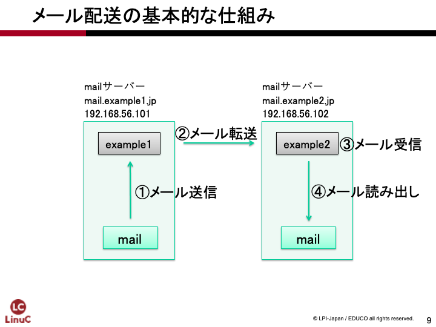
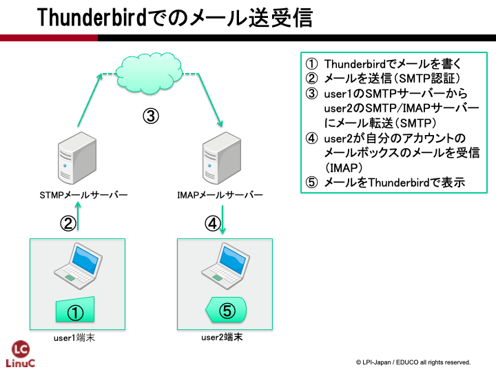

# メールサーバーの構築
第6章では、メールのやり取りが行えるようメールサーバーを設定します。まずはPostfixを使って、メールサーバー同士でメールのやり取りが行えるように設定します。さらにIMAPサーバーのDovecotとメールクライアントソフトウェアを使って、より実践的なメール環境を構築します。

## 用語集
### メールサーバー {.unlisted .unnumbered}
電子メールのサービスを行います。クライアントよりメールを受け取り、相手先のメールサーバーまで送ります。また、受信用のメールサーバーでは、送ってきたメールを蓄積しておいて、クライアントの要求に応じて応答します。

### MTA（Mail Transfer Agent） {.unlisted .unnumbered}
メールの転送を行うプログラムです。SendmailやPostfixなどが代表例です。

### SMTP（Simple Mail Transfer Protocol） {.unlisted .unnumbered}
電子メールの送信、転送のときに利用されるプロトコルのことです。

### SMTP認証 {.unlisted .unnumbered}
SMTPでのメールを送信する際に認証を行う機構です。迷惑メール対策としてのメール中継の制限を、この認証機能で許可する、といった利用方法があります。

### Postfix {.unlisted .unnumbered}
MTAとして動作するサーバープログラムです。LinuxやUnixのシステムで古くから使われてきたSendmailよりもセキュリティが高く、高速に動作すると言われています。

### POP3（Post Office Protocol version3） {.unlisted .unnumbered}
クライアントが電子メールを取り寄せるときに利用されるプロトコルです。シンプルな設計で、IMAP4と比べて機能が少ないです。

### IMAP4（Internet Message Access Protocol 4） {.unlisted .unnumbered}
クライアントが電子メールを取り寄せるときに利用されるプロトコルです。メールのフォルダ機能サポート等、多機能です。

### Dovecot {.unlisted .unnumbered}
POP3やIMAP4のサーバー機能を提供するプログラムです。

## メールのやり取りの仕組み
インターネット上で沢山の人が電子メールを利用していますが、電子メールは以下の手順でやり取りされています。括弧内はそれぞれの手順に関わる動作やプロトコルです。

1. 送信者のメールクライアントから送信用メールサーバーにメールを送信します（SMTP認証）
1. 送信用メールサーバーは受信用メールサーバーにメールを転送します（SMTP）
1. 受信用メールサーバーは宛先アドレスのメールボックスにメールを配送します（メール配送）
1. 受信者のメールクライアントでメールボックスのあるメールサーバーに接続します（POP3やIMAP4）
1. 受信者のメールクライアントがメールを受信して、メールを見ることができます

## メールの送信
メールの送信は、メールサーバーを介してやり取りが行われます。メールサーバーがメールを受け取ると、宛先のメールアドレスを担当しているメールサーバーに転送され、最終的に宛先のメールボックスに入れられます。ThunderbirdやOutlookのようなメールクライアントから送信したメールでも、GmailのようなWebメールから送信したメールでも、動作原理は同じです。

メールの送信に関わるプログラムやプロトコルについて解説します。

### MTA（Mail Transfer Agent）
メールクライアントから送信されたメールは、送信用メールサーバーから宛先の受信用メールサーバーに転送されます。このメールの転送を行うプログラムをMTAと呼びます。本教科書ではPostfixというMTAを利用します。他に有名なMTAとしてSendmailがあります。

### MDA（Mail Delivery Agent）
受信用メールサーバーが受信したメールを宛先アドレスのメールボックスに配送するプログラムをMDAと呼びます。MTAであるPostfixがMDAの機能も受け持ちます。他にMDAとしてProcmailがあります。

### MUA（Mail User Agent）
メールの利用者が、メールの送信や受信を行うプログラム(メールクライアントソフトウェア)をMUAと呼びます。Thunderbirdなどがあります。WebメールもMUAの一種となります。

### SMTP（Simple Mail Transfer Protocol）の拡張
メールクライアントからのメール送信や、メールサーバー間のメールの転送は、SMTPというプロトコルでやり取りされています。SMTPはかなり昔に設計、定義されたプロトコルのため、認証やアクセス制限などが無く、勝手にメールサーバーを利用されて迷惑メールを送られてしまう問題がありました。このような問題を解決するためにESMTP（拡張SMTP）が定義されました。SMTPと呼ぶ場合、このESMTPで定義された機能も含んでいることがあります。

### SMTP認証（SMTP Authentication）とリレー
SMTP認証はESMTPの機能のうちの1つです。通常のSMTPには認証機能が無いため、送信元のIPアドレスを制限するなど適切に設定されていないと迷惑メール送信の踏み台とされてしまう問題があります。SMTP認証は、メールの送信時に認証を行い、認証が行われた場合のみメールの送信を受け付けます。受け付けたメールを宛先の受信用メールサーバーに転送することをリレーと呼びます。

## メールの受信
送信されたメールが宛先のメールボックスに配送されると、受信者はメールを受信して読むことができます。メールの受信に関係するいくつかの事項について解説します。

### メールの配送
受信用メールサーバーがメールを受け取り、宛先アドレスのメールボックスにメールを届けることを配送と呼びます。メールボックスが無い場合、宛先不明として送信用メールサーバーにエラーを返します。メールの配送を行うソフトウェアをMDA（Mail Delivery Agent）と呼びます。

### ローカル配送
送信側と受信側が同じメールサーバーを使用している場合、メールは外部のメールサーバーに転送する必要がなく、すぐに宛先アドレスのメールボックスに配送されます。これをローカル配送と呼びます。

### POP3（Post Office Protocol version 3）
POP3は電子メールを受信するときに利用するプロトコルです。非常にシンプルなプロトコルで、ユーザー名、パスワードを利用して接続し、メールの内容を受信します。

### IMAP4（Internet Message Access Protocol 4）
IMAP4もPOP3同様、メールを受信するときに利用するプロトコルです。IMAP4はPOP3に比べて機能が豊富で、大きな特徴としてフォルダ機能をサポートしていることが挙げられます。メールをIMAPサーバーに残しておくことができるので、メールクライアントとWebメールを併用したりすることもできますが、その分だけメールサーバーのストレージを消費するので容量管理が必要になります。

## メールサーバーの構築
メールサーバーの構築は、送信用メールサーバーと受信用メールサーバーの2台を構築します。それぞれのサーバーを以下のように設定します。

- 1台のマシンで、メールサーバーとメールクライアントの1台2役とします。
- MTAとしてPostfixをインストールし、送信用メールサーバーおよび受信用メールサーバーとして設定します。
- IMAPサーバーとしてDovecotをインストールし、設定します。
- それぞれのメールサーバーにメールアカウントを作成します。
- メールクライアントとしてThunderbirdをインストールし、サーバー自身を送受信用サーバーとして設定します。

通常、メールサーバーとメールクライアントは別々のマシンを用意し、その間をSMTPやPOP3、IMAP4などで接続しますが、実習では同じマシンで行います。

構築は、Postfixの設定とmailコマンドによるメールの送受信、DovecotとThunderbirdの設定とメールの送受信の2段階に分けて行います。

### mailコマンドを利用したメールの送受信
Postfixの設定が完了したら、動作確認としてmailコマンドを使ってメールのやり取りを行います。メールクライアントの設定を必要としないので、MTAが正しく設定されていることを確認するのに適しています。

{width=70%}

\pagebreak
### Thunderbirdを利用したメールの送受信
Thunderbirdをメールクライアントとして設定し、SMTP認証によるメール送信や、DovecotによるIMAPサーバーからのメール受信を行います。

{width=70%}

## Postfixのインストール
Postfixをaptコマンドでインストールをします。
また、IMAPサーバーとして使用するdovecotパッケージも同時にインストールしておきます。

### パッケージのインストール
aptコマンドで必要なパッケージをインストールします。
Postfixのインストールでは設定のタイプの選択をしますが、「Internet Site」としておけば大丈夫です。また、それぞれのドメインを入力します。

```
$ sudo apt install postfix dovecot-pop3d dovecot-imapd
```

{width=70%}

{width=70%}

## Postfixの設定ファイルmain.cfの設定
Postfixの設定ファイルは/etc/postfix/main.cfです。次のパラメータを探して設定します。

```
$ sudo vi /etc/postfix/main.cf
```

パラメータによっては、デフォルト値が設定されているので、その場合には書き換えます。コメントアウトされた形で記述されている場合には、コメントアウトを外して設定を有効にした上で値を記述します。

「smtpd_sasl_auth_enable」と「smtpd_recipient_restrictions」は、main.cfに記述されていないので、ファイルの最後に追加しておきます。

host1とhost2に、それぞれ以下のように設定します。

host1の設定

| 項目 | 設定値 |
|------------|---------------|
| myhostname | mail.example1.test |
| mydomain | example1.test |
| inet_interfaces | localhost, 192.168.1.12 |
| mydestination | $mydomain |

host2の設定

| 項目 | 設定値 |
|------------|---------------|
| myhostname | mail.example2.test |
| mydomain | example2.test |
| inet_interfaces | localhost, 192.168.1.13 |
| mydestination | $mydomain |

それぞれのパラメータの意味と設定値は以下の通りです。

### myhostname
メールサーバーのホスト名を設定します。

host1の設定
```
myhostname = mail.example1.test
```

host2の設定
```
myhostname = mail.example2.test
```

### mydomain
メールサーバーのドメイン名を設定します。

host1の設定
```
mydomain = example1.test
```

host2の設定
```
mydomain = example2.test
```

### inet_interfaces
メールを受け付けるネットワークインターフェースのIPアドレスを設定します。localhostの記述を忘れると、自分自身からのメールを受け付けなくなるので注意が必要です。

host1の設定
```
inet_interfaces = localhost, 192.168.1.12
```

host2の設定
```
inet_interfaces = localhost, 192.168.1.13
```

### mydestination
メールを受信するドメイン名を設定します。宛先メールアドレス（アカウント名@ドメイン名）がこのドメイン名になっているメールのみ受け取ります。

host1とhost2共通の設定
```
mydestination = $mydomain
```

### mynetworks
Postfixが信頼するネットワークの範囲を指定します。今回の構成で使用している「192.168.1.0/24」と localhostのネットワークである「127.0.0.0/8」を記載します。

host1とhost2共通の設定
```
mynetworks = 192.168.1.0/24 127.0.0.0/8
```

\pagebreak
## 書式のチェック
/etc/postfix/main.cfの修正ができたら、書式チェックを行っておきます。

```
$ sudo postfix check
```

書式が正しい場合には、何も表示されません。エラーが表示された場合には、エラー内容をよく見て修正します。例えば、パラメータ名を記載ミスした場合には、以下のように指摘されます。

```
/usr/sbin/postconf: warning: /etc/postfix/main.cf: unused parameter: mynetworkss=192.168.1.0/24 127.0.0.0/8
```


## Postfixの起動
設定の変更内容を反映させるため、postfixサービスを再起動します。

```
ubuntu@host1example1test:~$ sudo systemctl restart postfix
```

## Postfixの自動起動
Postfixの自動起動の設定を確認しておきます。

```
ubuntu@host1example1test:~$ systemctl is-enabled postfix
enabled
```

これでPostfixの設定は完了です。

## アカウントの作成
メールのやり取りを行うためのアカウントを作成します。アカウントはhost1とhost2の双方で行います。

### host1にuser1を作成
host1でuser1というアカウントを作成します。このアカウントはuser1@example1.testというメールアドレスになります。

```
ubuntu@host1example1test:~$ sudo adduser user1
[sudo] password for ubuntu:
info: Adding user `user1' ...
info: Selecting UID/GID from range 1000 to 59999 ...
info: Adding new group `user1' (1001) ...
info: Adding new user `user1' (1001) with group `user1 (1001)' ...
info: Creating home directory `/home/user1' ...
info: Copying files from `/etc/skel' ...
New password:
Retype new password:
passwd: password updated successfully
Changing the user information for user1
Enter the new value, or press ENTER for the default
        Full Name []:
        Room Number []:
        Work Phone []:
        Home Phone []:
        Other []:
Is the information correct? [Y/n]
info: Adding new user `user1' to supplemental / extra groups `users' ...
info: Adding user `user1' to group `users' ...
```

### host2にuser2を作成
host2でuser2というアカウントを作成します。このアカウントはuser2@example2.testというメールアドレスになります。

```
ubuntu@host2example2test:~$ sudo adduser user2
[sudo] password for ubuntu:
info: Adding user `user2' ...
info: Selecting UID/GID from range 1000 to 59999 ...
info: Adding new group `user2' (1001) ...
info: Adding new user `user2' (1001) with group `user2 (1001)' ...
info: Creating home directory `/home/user2' ...
info: Copying files from `/etc/skel' ...
New password:
Retype new password:
passwd: password updated successfully
Changing the user information for user2
Enter the new value, or press ENTER for the default
        Full Name []:
        Room Number []:
        Work Phone []:
        Home Phone []:
        Other []:
Is the information correct? [Y/n]
info: Adding new user `user2' to supplemental / extra groups `users' ...
info: Adding user `user2' to group `users' ...
```

### メールエイリアスのデータベース構築
newaliasesコマンドを実施し、メールエイリアスデータベースを構築します。

```
ubuntu@host1example1test:~$ sudo newaliases
```

## mailコマンドを使ったメール送受信のテスト
メールの送受信が行えるかテストを行います。メールの送受信は作成したユーザーuser1とuser2で行います。ユーザーで操作できるようuser1/user2でリモートアクセス(ssh)を行い、メールの送受信にはmailコマンドを使用します。
mailコマンドを利用できるようにパッケージ「mailutils」をインストールします。

```
ubuntu@host1example1test:~$ sudo apt install mailutils
```

### ログの確認用端末の設定（任意）
メールサーバーはバックグラウンドで動作するため、どのように動いているのか確認するためにはログを参照する必要があります。

tailコマンドに-fオプションを付けて実行すると、ログが書き込まれる毎に再読み込みされて最新のログを閲覧できます。

1. メールサーバへリモートアクセスします。
1. tailコマンドを実行して/var/log/maillogを表示します。

```
ubuntu@host1example1test:~$ sudo tail -f /var/log/mail.log
```

ログの確認後は、「ctrl+c」で終了できます


### user1@example1.testからuser2@example2.testへメール送信
mailコマンドを使って、host1のuser1からuser2@example2.testへメールを送信します。

```
user1@host1example1test:~$ mail user2@example2.test ← mailコマンドの引数に宛先のアドレスを指定
Cc:
Subject: Test mail from user1 ← Subjectを入力
This is test mail from user1 ← メッセージ本文を入力
^D ← メッセージ本文の入力が終わったらCtrl+dを入力
```

### user2のメール着信確認
mailコマンドを使って、host2.example2.testのuser2にメールが届いているかを確認します。

```
user2@host2example2test:~$ mail
"/var/mail/user2": 1 message 1 new
>N   1 user1@host1example Tue May  6 00:09  16/655   Test mail from user1
& 1	← 1を入力
Return-Path: <user1@host1example1test>
X-Original-To: user2@example2.test
Delivered-To: user2@example2.test
Received: from mail.example1.test (unknown [192.168.1.12])
        by mail.example2.test (Postfix) with ESMTPS id 8B71822224
        for <user2@example2.test>; Tue,  6 May 2025 00:09:08 +0000 (UTC)
Received: by mail.example1.test (Postfix, from userid 1001)
        id 351E8401B; Tue,  6 May 2025 00:09:08 +0000 (UTC)
To: <user2@example2.test>
Subject: Test mail from user1
User-Agent: mail (GNU Mailutils 3.17)
Date: Tue,  6 May 2025 00:09:08 +0000
Message-Id: <20250506000908.351E8401B@mail.example1.test>
From: user1@host1example1test

This is test mail from user1

& q	← qを入力
```

このように、host1.example1.testからhost2.example2.testにメールが送られていることがわかります。

反対にuser2@example2.testからuser1@example1.testへのメールも送信できることを確認してみましょう。

## メールクライアントソフトでのメールの送受信
通常のメールサーバーの運用では、メールの利用者はメールクライアントを使用してメールの送受信を行います。送信はSMTP、受信はIMAP4やPOP3をプロトコルとして使用します。

IMAPサーバーを利用してメールを受信できるよう、POP3/IMAPサーバーであるDovecotを設定し、メールを送受信してみます。
また、メールクライアントにはVirtualboxを動作させているホストPC上にThunderbirdなどのソフトウェアをインストールしメールの送受信を行います。

以下の作業はhost1で行いますが、host2でも設定して双方向でメールのやり取りができるようにしてもよいでしょう。

## Dovecotの設定
IMAPサーバーとしてDovecotの設定を行います。

今回設定するファイルは/etc/dovecot/dovecot.confと、/etc/dovecot/conf.dディレクトリ以下に分かれている以下のファイルです。

- /etc/dovecot/dovecot.conf（変更不要）
- /etc/dovecot/conf.d/10-mail.conf
- /etc/dovecot/conf.d/10-auth.conf
- /etc/dovecot/conf.d/10-ssl.conf


### /etc/dovecot/dovecot.conf（変更不要）
全体的な設定ファイルです。デフォルトの設定がコメントアウトで記述されています。特に変更は必要ありません。

```
$ sudo vi /etc/dovecot/dovecot.conf
（略）
# Protocols we want to be serving.
#protocols = imap pop3 lmtp submission	← IMAP/POP3/LMTP/SMTP submissionが使用可能

# A comma separated list of IPs or hosts where to listen in for connections.
# "*" listens in all IPv4 interfaces, "::" listens in all IPv6 interfaces.
# If you want to specify non-default ports or anything more complex,
# edit conf.d/master.conf.
#listen = *, ::	← ホストのすべてのIPアドレスで接続を受け付ける
```

### /etc/dovecot/conf.d/10-mail.conf
メールボックスの位置などを設定するファイルです。

今回はmbox形式のメールボックスを指定します。また、メールボックスへのアクセス権限を設定します。

```
ubuntu@host1example1test:~$ sudo vi /etc/dovecot/conf.d/10-mail.conf
```

```
（略）
#   mail_location = maildir:~/Maildir
#   mail_location = mbox:~/mail:INBOX=/var/mail/%u
#   mail_location = mbox:/var/mail/%d/%1n/%n:INDEX=/var/indexes/%d/%1n/%n
#
# <doc/wiki/MailLocation.txt>
#
#mail_location =
mail_location = mbox:~/mail:INBOX=/var/mail/%u	← postfixでも使われるmbox形式によるメールの保存を行う

（略）

# Group to enable temporarily for privileged operations. Currently this is
# used only with INBOX when either its initial creation or dotlocking fails.
# Typically this is set to "mail" to give access to /var/mail.
#mail_privileged_group =
mail_privileged_group = mail ← 権限が必要な動作はmailグループとして行う

# Grant access to these supplementary groups for mail processes. Typically
# these are used to set up access to shared mailboxes. Note that it may be
# dangerous to set these if users can create symlinks (e.g. if "mail" group is
# set here, ln -s /var/mail ~/mail/var could allow a user to delete others'
# mailboxes, or ln -s /secret/shared/box ~/mail/mybox would allow reading it).
#mail_access_groups =
mail_access_groups = mail ← mailグループにアクセス権限を与えるように追加
（略）
```

### /etc/dovecot/conf.d/10-auth.conf
認証を設定するファイルです。

今回は暗号化していない平文での認証を許可します。

```
ubuntu@host1example1test:~$ sudo vi /etc/dovecot/conf.d/10-auth.conf
```

```
##
## Authentication processes
##

# Disable LOGIN command and all other plaintext authentications unless
# SSL/TLS is used (LOGINDISABLED capability). Note that if the remote IP
# matches the local IP (ie. you're connecting from the same computer), the
# connection is considered secure and plaintext authentication is allowed.
# See also ssl=required setting.
#disable_plaintext_auth = yes
disable_plaintext_auth = no	← noに変更
（略）
```

### /etc/dovecot/conf.d/10-ssl.conf
SSL/TLSを設定するファイルです。

今回はSSL/TLS暗号化をしませんので、SSL/TLS暗号化の利用を停止しておきます。

```
ubuntu@host1example1test:~$ sudo vi /etc/dovecot/conf.d/10-ssl.conf
```

```
##
## SSL settings
##

# SSL/TLS support: yes, no, required. <doc/wiki/SSL.txt>
# disable plain pop3 and imap, allowed are only pop3+TLS, pop3s, imap+TLS and imaps
# plain imap and pop3 are still allowed for local connections
ssl = no	← yesをnoに変更
```

## Dovecotの再起動
dovecotサービスを再起動します。

```
ubuntu@host1example1test:~$ sudo systemctl restart dovecot
```

### Dovecotの自動起動
自動起動の設定を確認します。

```
ubuntu@host1example1test:~$ sudo systemctl is-enabled dovecot
enabled
```

## メールクライアントの設定
次に、ホストPCにてメールクライアントソフトウェアのThunderbirdの設定を行いますが、まずホストPCが利用するDNSサーバの情報を、構築済みのDNSサーバ「192.168.1.11」に変更します。

{width=70%}


### Thunderbirdの起動
Thunderbirdを起動します。

Thunderbirdが起動すると別途Webブラウザが開いてThunderbirdのWebページが表示されますが、Webブラウザごと閉じて構いません。

\pagebreak
### Thunderbirdの基本設定
Thunderbirdのアプリケーションウインドウを表示し、「既存のメールアドレスのセットアップ」タブが表示されていることを確認します。
もしくは、「メールアカウント操作」の中にある「メールアカウントを追加」を選択します。

各設定項目の値を以下のように入力します。

| 設定項目 | 設定値 |
|---|---|
| あなたの名前 |user1 |
| メールアドレス |user1@example1.test |
| パスワード |アカウント作成時に指定したもの |
| パスワードを記憶する | チェックしておく |

{width=70%}

\pagebreak
### Thunderbirdの送受信メールサーバーの設定
「手動設定」をクリックして、Thunderbirdの送受信メールサーバーの設定を行います。

「受信サーバー」と「送信サーバー」が表示されるので、各設定項目を以下のように入力します。

| 設定項目 | 設定値 |
|---|---|
| プロトコル | IMAP |
| ホスト名 | mail.example1.test |
| ポート番号 | 143 |
| 接続の保護 | なし |
| 認証方式 | 通常のパスワード認証 |
| ユーザ名 | user1 |

| 設定項目 | 設定値 |
|------------|---------------|
| ホスト名 | mail.example1.test |
| ポート番号 | 25 |
| 接続の保護 | なし |
| 認証方式 | 通常のパスワード認証 |
|ユーザ名 | user1 |

{width=70%}

入力を終えたら「完了」ボタンをクリックします。

\pagebreak
「警告！」ダイアログが表示されますが、左下の「接続する上での危険性を理解しました」をチェックし、「確認」ボタンをクリックします。

{width=70%}

最後に「リンクしたサービスへの接続」の「完了」ボタンをクリックします。
正常に完了出来た場合、

{width=70%}
{width=70%}


\pagebreak
## メールの送信
メールを送信するには、「作成」ボタンをクリックしてメール作成ウインドウを呼び出します。

### 自分宛のメール送信
1. 「作成」ボタンをクリック
1. 宛先に自分のメールアドレス（user1@example1.test）を指定して、メールを作成、送信してみます。
1. 「受信」ボタンをクリックして、メールが受信できることを確認します。

{width=70%}

### 別サーバー宛のメール送信
1. 「作成」ボタンをクリック
1. 宛先に他の受講生のメールアドレス（user2@example2.test）を指定して、メールを作成、送信してみます。
1. host2でmailコマンドを使ってメールを受信できたことを確認します。
1. mailコマンドでuser1@example1.test宛にメールを送信し、host1で受信できることを確認します。

```
user2@host2example2test:~$ mail
"/var/mail/user2": 1 message 1 new
>N   1 user1              Tue May  6 01:05  22/890   テストメール from u
? 1
Return-Path: <user1@example1.test>
X-Original-To: user2@example2.test
Delivered-To: user2@example2.test
Received: from mail.example1.test (unknown [192.168.1.12])
        by mail.example2.test (Postfix) with ESMTPS id 9B1E4220B3
        for <user2@example2.test>; Tue,  6 May 2025 01:05:40 +0000 (UTC)
Received: from [192.168.1.122] (unknown [192.168.1.122])
        by mail.example1.test (Postfix) with ESMTP id 3DF257A3D
        for <user2@example2.test>; Tue,  6 May 2025 01:05:39 +0000 (UTC)
Message-ID: <15e595f5-6ea5-4b67-9242-e69458cce8fb@example1.test>
Date: Tue, 6 May 2025 10:05:37 +0900
MIME-Version: 1.0
User-Agent: Mozilla Thunderbird
Content-Language: en-US
To: user2@example2.test
From: user1 <user1@example1.test>
Subject: テストメール from user1
Content-Type: text/plain; charset=UTF-8; format=flowed
Content-Transfer-Encoding: 8bit

テストメール(from user1)です

? q
```


## うまく動作しない場合には
本章では、電子メールに関する学習を行いました。また、実際にメールサーバーを設定し、mailコマンドやThunderbirdを利用してメールの送受信の確認を行いました。

メールサーバーの設定は、メールサーバーが正しく設定され起動していたとしても、DNSサーバーが正しく動いていなければ利用できない場合があります。設定ファイルの記述に問題がないのに、メールがどうしても送れない、受信できない場合は、まずDNSが正しく動いているかdigコマンドを実行して確認します。また、ログ（/var/log/maillog）を見て、エラーが出ていないかを確認してみてください。
\pagebreak
