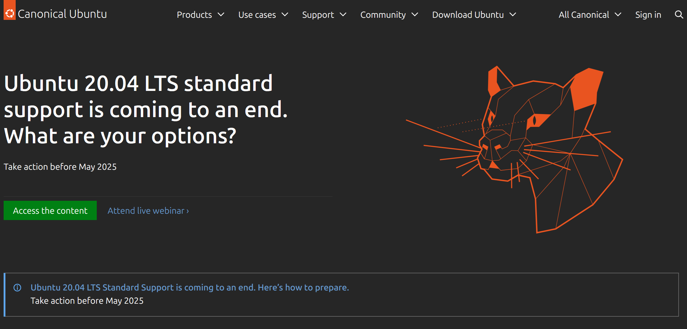
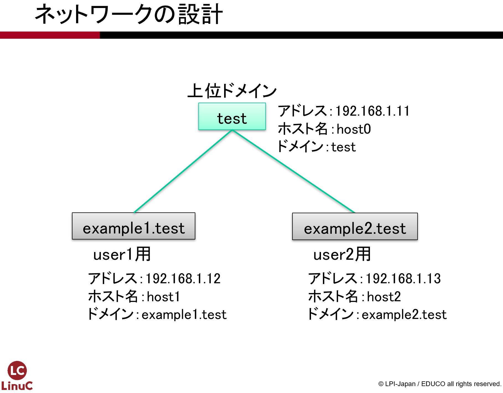

# Linuxサーバーの概要
本教科書では、Linuxをインストールしてサーバー環境を構築する実習をしながら、LinuCレベル1からレベル2の出題範囲に含まれる主要な技術の理解を目指します。

第1章ではLinuxサーバーの概要について解説し、2章以降に行う実習に必要な環境と知識の確認を行います。

## 用語集
### Linux {.unlisted .unnumbered}
Linus Torvalds氏により開発された、UNIX互換を目指したOSの総称をLinuxといいます。ソースコードは公開されており、世界中の開発者の協力により、日々開発が継続されています。

### Linuxディストリビューション {.unlisted .unnumbered}
Linuxは狭い意味ではOSの中心部（＝カーネル）のみを指しますが、Linuxカーネルだけではシステムは動作しません。カーネル以外のさまざまなソフトウェアやインストーラを追加して、利用できるようにしたのがLinuxディストリビューションです。Linuxディストリビューションごとに開発方針があり、それに沿ってソフトウェアがまとめられ、リリースが行われています。

### Ubuntu {.unlisted .unnumbered}
Linuxのディストリビューションの1つです。DebianというLinuxディストリビューション互換の環境を無償で提供しているLinuxディストリビューションで、Ubuntuコミュニティによって開発されています。

### IPアドレス {.unlisted .unnumbered}
インターネットにおいてIPで通信が行われる場合、ホスト一つ一つにIPアドレスが割り当てられます。IPアドレスとはインターネット上でのホストの所在地を示す「住所」にあたります。
現在ではIPv4とIPv6の2種類がありますが、本教科書ではIPv4を使います。IPv4では32ビットのIPアドレスを、8ビット毎に.(ドット)で区切って10進数で表記します。

### ネットワークアドレス {.unlisted .unnumbered}
IPネットワークは1つ以上のホストの集まりであるネットワークを形成し、そのネットワーク内の通信と、ネットワーク間の通信で構成されています。このネットワークの識別に利用されるのが、ネットワークアドレスです。IPアドレスは、所属しているネットワークを表すネットワーク部と、ホスト個別に割り当てられるホスト部に分けることができます。

### サブネットマスク {.unlisted .unnumbered}
IPアドレスのうちネットワークアドレス部を識別するための数値のことをいいます。32ビットのうち、先頭からネットワーク部となる部分のビットを1として表します。たとえば先頭から24ビットがネットワーク部になる場合、IPアドレスの後ろに「/24」と表記したり、10進数に変換して「255.255.255.0」と表記したりします。

### ホスト名 {.unlisted .unnumbered}
ネットワークに接続されたコンピュータに割り当てられた名称のことをいいます。ドメイン名を省略した短い名前を指す場合と、ドメイン名を含んだFQDN(Fully Qualified Domain Name)の形式のものがあります。

### ドメイン名 {.unlisted .unnumbered}
インターネット上に存在するコンピュータやネットワークを識別するために付けられている名前です。会社などの組織毎に独自のドメイン名を取得して利用します。ドメイン名はアルファベット、数字、一部の記号の組み合わせで構成されますが、日本語.jp のような国際化ドメインも使われるようになっています。

### DNSサーバーアドレス {.unlisted .unnumbered}
FQDN（＝ホスト名＋ドメイン名）とIPアドレスの変換を「名前解決」と呼びます。この名前解決を行うのがDNS（Domain Name System）です。ホストは設定したDNSサーバーアドレスに対して名前解決を依頼します。

### ハードディスク（HDD） {.unlisted .unnumbered}
磁気を用いた記憶媒体であり、パソコンの記憶媒体の他、ビデオレコーダーなどの記憶媒体としても用いられています。

### SSD {.unlisted .unnumbered}
半導体メモリであるフラッシュメモリを用いた記憶媒体であり、ハードディスクよりも読み書きの処理性能に優れています。

### DVD {.unlisted .unnumbered}
光学メディアの1種類で、ビデオ再生での利用で普及し、現在ではデータ記録の用途でも利用されています。約700MBのCD-ROMに比べ、約4.7GBと大容量でも利用できることから、OSのインストールディスクとしても利用されています。

### USBメモリ {.unlisted .unnumbered}
USBに接続して利用する外部ストレージです。OSのインストールディスクとして利用できます。

## 実習で利用するハードウェア
本教科書の実習では、仮想マシンを使って実習環境を構築します。

仮想マシンの詳細については第2章で解説しますが、ここでは実習用に用意するハードウェアの仕様などについて解説します。

### マシン本体  
WindowsやLinux、macOSが動作する、いわゆる「パソコン」（PC）を想定しています。用意したPCに「VirtualBox」のような仮想マシンソフトウェアをインストールして実習環境を構築します。

### CPU
実習ではCPU負荷の高い処理は行わないため、高性能なCPUは必要ありません。ただし、仮想マシンを実行するために仮想化支援技術が必要となります。古いCPUでない限り仮想化支援技術を備えていますが、BIOS（UEFI）で有効にする必要があります。

本教科書ではVirtualBoxを利用するため、CPUアーキテクチャはIA（Intel Architecture）のCPUを想定しています。

ARMアーキテクチャのCPUに対応した仮想マシンソフトウェアを利用し、ARM対応のLinuxディストリビューションをインストールすれば同様の実習を行うこともできます。仮想マシンの設定などが異なりますので、適宜読み替えて実習を行ってください。

### メモリ
Ubuntu 24.04 LTS(Server)では1.0GB以上のメモリが推奨されています。

DNSやメールの実習では3台の仮想マシンを使って実習を行うので、3台分で3.0GBのメモリが必要です。メモリは仮想マシンの他に、OS（ホストOSと呼ぶ）やその他のアプリケーションを同時に動作させるために必要となるので、最低でも8GB、快適に実習を行うには16GB以上のメモリが搭載されていることが望ましいでしょう。

メモリの搭載量が少ない場合には、仮想マシンへのメモリの割り当てを減らす、余計なアプリケーションを動作させないようにするなどのメモリ効率改善や、メモリスワップ発生による速度低下を許容する必要があります。

### ストレージ
仮想マシンが利用する仮想ハードディスクはファイルとしてPCに接続されたハードディスクやSSDなどのストレージに保管されます。仮想ハードディスクファイルは利用した分だけストレージを消費します。

実習で利用する環境はおよそ7GBの容量を消費します。VirtualBoxのデフォルトでは最大20GBの仮想ハードディスクファイルが作られるので、3台の仮想マシンで少なくとも21GB、最大60GBの容量を用意しておく必要があります。

仮想ハードディスクファイルの読み書きは頻繁に行われるため、ハードディスクよりも高速なSSDを利用するのが望ましいでしょう。

### ネットワーク
実習ではインターネットに接続できる必要があります。実習用に用意するPCは有線LAN、無線LAN、どちらの方式で接続されていても構いません。

## 利用するLinuxのディストリビューション
本教科書では、Ubuntu 24.04 LTS(Server)のIntel/AMD x86_64アーキテクチャに対応したバージョンを利用します。

```
https://ubuntu.com/
```

{width=70%}

Ubuntuは、LinuxディストリビューションであるDebianをベースにしたディストリビューションとして提供されています。利用に際し費用が発生しない、無償で提供されているディストリビューションです。

### インストール用ISOイメージの入手
Ubuntuが配布しているISOイメージを、ダウンロードします。仮想マシンは、ISOイメージを仮想光学ドライブにセットすることでインストールが行えるので、インストール用のDVD/USBメモリを作成する必要がありません。

#### ダウンロード方法
ISOイメージをダウンロードするには、以下のURLにアクセスします。

```
https://ubuntu.com/download/server
```

## ISOイメージのファイル名
ISOイメージは以下のようなファイル名になっています。

```
ubuntu-バージョン-live-イメージの種類-アーキテクチャ.iso
```

## バージョン
本教科書では、本教科書の作成時点で最新であったUbuntu 24.04 LTS(Server)を利用した構築方法について解説しています。

今後のバージョンアップで、より新しいバージョンのUbuntuが入手可能になっているかもしれません。バージョン24.04系であればマイナーバージョンによる大きな差は無いので同様の手順でサーバーの構築ができると推測されますが、セキュリティ対応などの関係でデフォルトの設定が変更されることで動作が変わる場合があります。

初めて本教科書の内容を学習する際には、まずはバージョンを合わせて動作を確認し、その後異なるバージョンで同様に動作するか確認してみてください。バージョンによる動作の違いについては、本教科書の情報交換を行うSlackで情報共有を行い、本教科書の今後のバージョンアップで対応していく予定です。

## アーキテクチャ
Linuxカーネルは様々な種類のCPUアーキテクチャに対応しています。アーキテクチャによってバイナリが異なるため、アーキテクチャに合わせたISOイメージを選択する必要があります。主なアーキテクチャには以下のものがあります。

### arm64
IntelやAMDのCPUアーキテクチャです。64ビット版になります。

### ppc64el
IBM POWERのCPUアーキテクチャです。

この他に
IBM Z (s390x)やRISC-Vなどのアーキテクチャに対応したISOイメージが用意されています。

## ISOイメージの種類
ISOイメージには、いくつかの種類があります。インストールの目的によってイメージを選択します。Ubuntuには、以下の4種類のISOイメージが用意されています。

- Server(CLI環境で操作するサーバ用途)
- Desktop(GUI環境を含むデスクトップ用途)
- Core(組み込み用途)
- Cloud(クラウド環境用途)

本教科書の演習では、Server(CLI環境で操作するサーバ用途)を使ってインストールします。ubuntu-24.04-live-server-arm64.isoをダウンロードしてください。

実務では最小限のインストールを行い、必要なパッケージを追加してサーバーを構築することが多いので、リモートアクセス環境を提供するOpenSSHのみ、OSインストール時に追加しています。

物理マシンに直接インストールしたい場合には、USBメモリに書き込んで起動用USBメモリを作成します。

## ネットワーク環境について
本教科書では仮想マシンを利用して実習を行うため、特別なネットワークは必要ありませんが、以下の点について確認しておいてください。

### インターネットへの接続
ソフトウェアのインストールを行うため、インターネット上に用意されているリポジトリサーバーへのアクセスが必要になります。実習で利用するVirtualBoxでは、NATネットワークで外部ネットワークに接続します。VirtualBoxのNATネットワークは、実習用PCがインターネットに接続できていれば特別な設定は必要ありません。

プロキシーを経由して接続する必要がある場合には、接続のための設定情報を入手するか、ネットワーク管理者に相談してください。

### 仮想マシン間の接続
仮想マシン間の接続は仮想ネットワークを経由して行うため、利用している仮想マシンソフトウェアの仕様によって異なります。本教科書で利用するVirtualBoxはホストオンリーネットワーク接続を行うため、仮想マシン同士とホストOSのみしか相互に接続できず、外部のネットワークからは隔離されているため、IPアドレスなどは独自に設定できます。

## ネットワークの設定項目
サーバーを構築していくにあたり、以下のような設定項目をどう設定するか決める必要があります。

### ドメイン名
ドメイン名は、DNSサーバーを設定するときに必要になります。このドメイン名は、あくまでこのネットワーク内だけで有効なドメイン名で、外部のDNSとは隔離された状態にあります。

本教科書では、2台の仮想マシンのためにexample1.jpとexample2.jpの2つのドメイン名を使用します。また、DNSによる名前解決を行うためにもう1台の仮想マシンを作成し、jpドメインとして設定します。

| マシン | 設定値 |
| ---- | ---- |
| 1台目 | example1.jp. |
| 2台目 | example2.jp. |
| 3台目 | jp. |

### ホスト名
自分のPCに設定するホスト名です。ドメイン名に合わせてhost1とhost2を設定します。jpドメイン用にはhost0を設定します。

ホスト名は、ドメイン名と合わせてFQDN(Fully Qualified Domain Name)で記述する場合もあります。FQDN表記の場合には、それぞれ以下のようになります。

| マシン | 設定値 |
| ---- | ---- |
| 1台目 | host1.example1.jp. |
| 2台目 | host2.example2.jp. |
| 3台目 | host0.jp. |

### IPアドレス
IPアドレスは、VirtualBoxのホストオンリーネットワーク接続のデフォルトに合わせて、それぞれ以下のように設定しています。

| マシン | 設定値 |
| ---- | ---- |
| 1台目 | 192.168.56.101 |
| 2台目 | 192.168.56.102 |
| 3台目 | 192.168.56.100 |

### サブネットマスク
サブネットマスクは、IPアドレスのネットワーク部とホスト部を分ける値です。

本教科書では255.255.255.0(/24)とします。

### ネットワークアドレス
ネットワークアドレスは、PCが含まれているネットワーク全体を示すアドレスです。

本教科書では192.168.56.0となります。

### デフォルトゲートウエイ
異なるサブネットとの通信に必要な値です。

ホストオンリーネットワーク接続では外部への接続を行わないため、デフォルトゲートウェイは設定しません。

実際のサーバー構築においては、ネットワークの設定を確認の上、適切なデフォルトゲートウェイのアドレスを確認、設定してください。

### DNSサーバーアドレス
ホスト名とIPアドレスの対応を解決する、DNS（ドメインネームシステム）という機構があります。DNSを利用するためにはDNSサーバーのIPアドレスが必要です。

本教科書の第5章で実際にDNSサーバーを設定し動作させます。実習では、まず自分自身（ローカル）で動作させているDNSサーバーを参照するため、DNSサーバーアドレスを自分自身のIPアドレスとします。

| マシン | 設定値 |
| ---- | ---- |
| 1台目 | 192.168.56.101 |
| 2台目 | 192.168.56.102 |
| 3台目 | 192.168.56.100 |

## ネットワーク設定まとめ
各仮想マシン毎のネットワークの設定は以下のようになります。

{width=70%}

### 1台目の仮想マシン
| 設定項目 | 設定値 |
| ---- | ---- |
| ホスト名 | host1.example1.jp. |
| IPアドレス | 192.168.56.101 |
| サブネットマスク | 255.255.255.0(/24) |
| ネットワークアドレス | 192.168.56.0 |
| デフォルトゲートウエイ | 設定不要 |
| DNSサーバーアドレス | 192.168.56.101 |

### 2台目の仮想マシン
| 設定項目 | 設定値 |
| ---- | ---- |
| ホスト名 | host2.example2.jp. |
| IPアドレス | 192.168.56.102 |
| サブネットマスク | 255.255.255.0(/24) |
| ネットワークアドレス | 192.168.56.0 |
| デフォルトゲートウエイ | 設定不要 |
| DNSサーバーアドレス | 192.168.56.102 |

### 3台目の仮想マシン
| 設定項目 | 設定値 |
| ---- | ---- |
| ホスト名 | host0.jp. |
| IPアドレス | 192.168.56.100 |
| サブネットマスク | 255.255.255.0(/24) |
| ネットワークアドレス | 192.168.56.0 |
| デフォルトゲートウエイ | 設定不要 |
| DNSサーバーアドレス | 192.168.56.100 |

\pagebreak
