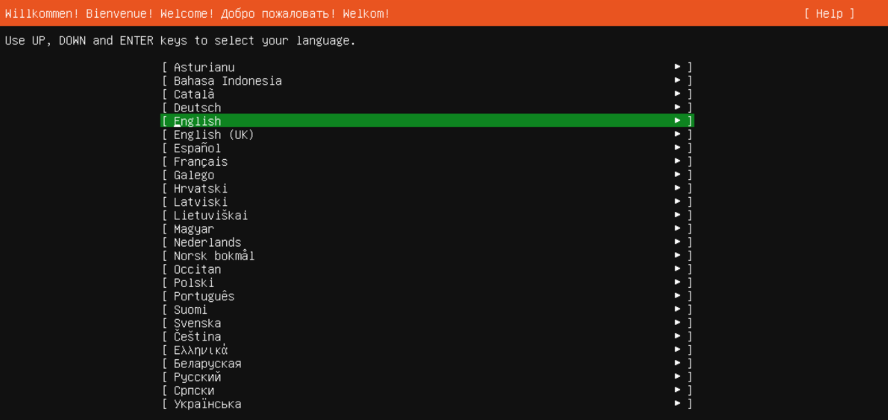
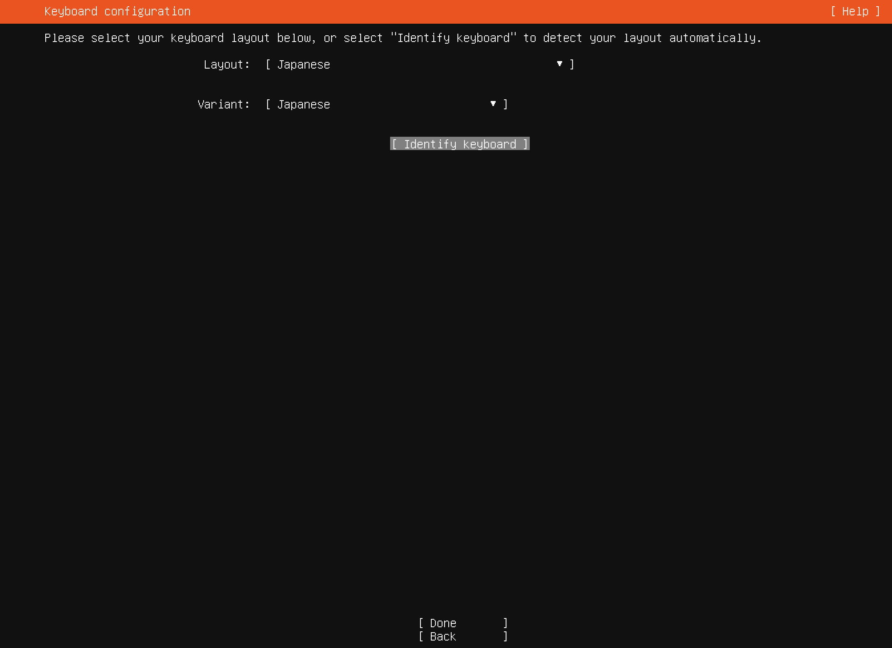
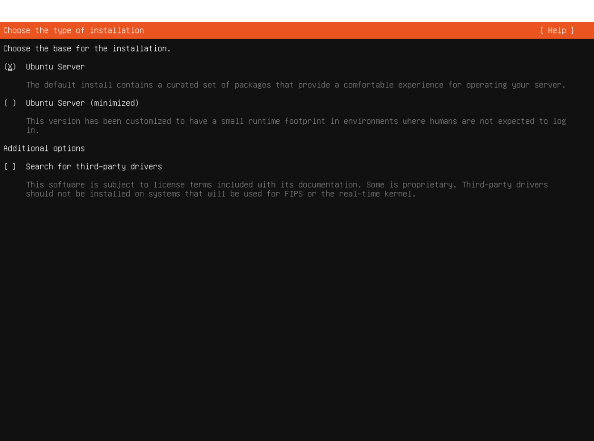
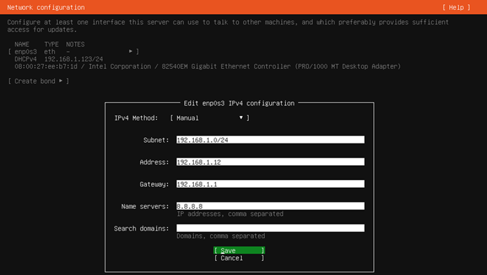
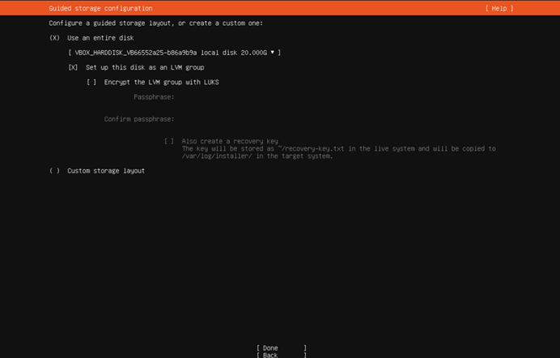
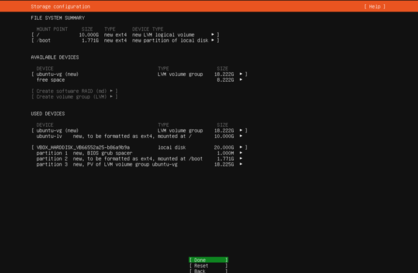
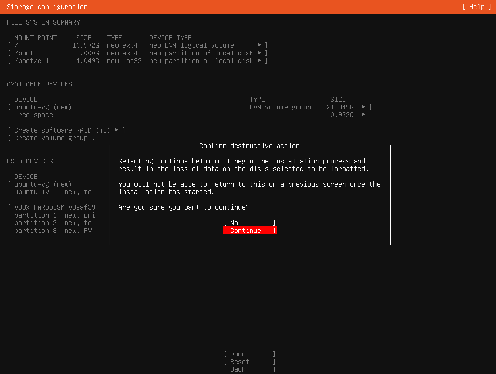
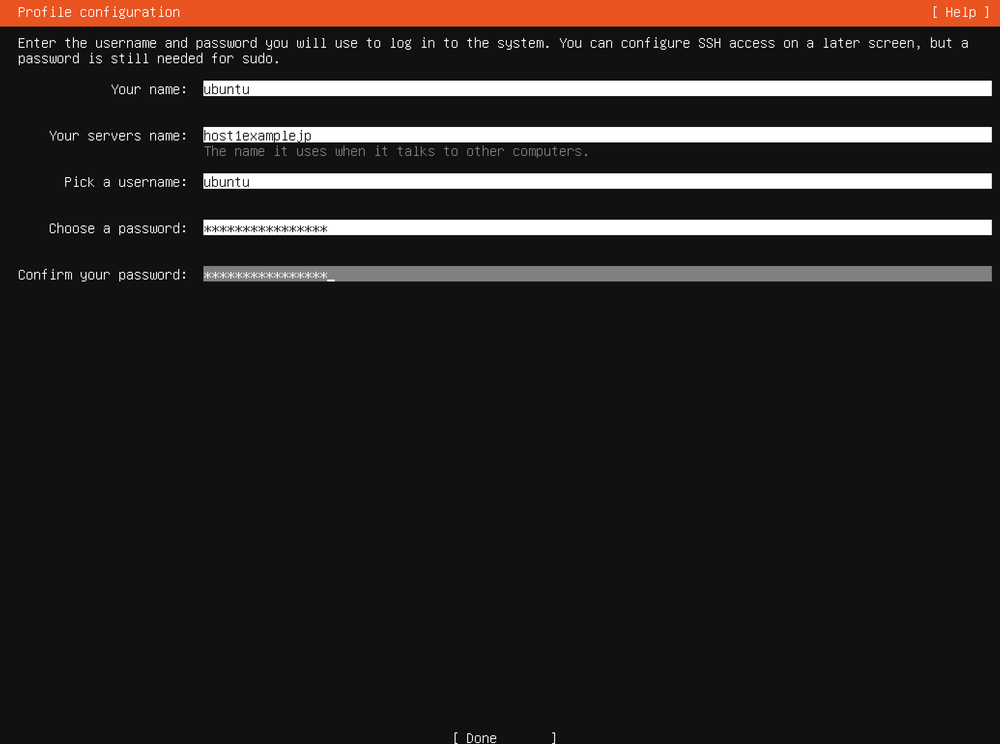
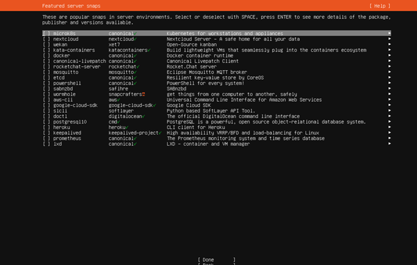

# Linuxのインストールと設定
第3章では、VirtualBoxで作成した仮想マシンにUbuntu 24.04.2 LTS(Server)をインストールします。インストール後、初期設定とネットワーク接続の確認を行います。

## 用語集
### ISOイメージ {.unlisted .unnumbered}
CD-ROMやDVD-ROMはISO9660という形式でファイルを保存しています。このISO9660形式のディスクをそのまま1つのファイルに保存したものをISOイメージと呼びます。

### ブートローダー {.unlisted .unnumbered}
OSの起動時に最初に読み込まれるプログラムです。ブートローダーがLinuxカーネルを読み込んでシステムが起動します。

### パーティション {.unlisted .unnumbered}
Linuxはディスクを複数の区画（パーティション）に分割して利用します。データを保存するパーティションの他、仮想メモリが利用するスワップ用のパーティションなどがあります。

### NAT {.unlisted .unnumbered}
NAT（Network Address Translation）はIP通信時にIPアドレスを変換して通信を行う仕組みです。IPv4ではインターネットに直接接続できるグローバルIPアドレスが枯渇しているため、1つのグローバルIPアドレスを複数のホストで共有して利用できるようにNATを活用しています。

### root {.unlisted .unnumbered}
Linuxのシステム管理者のユーザー名です。

## 仮想マシンの起動
VirtualBoxマネージャーで仮想マシンを選択し、「起動」をクリックします。別ウインドウで仮想マシンが起動します。

### ISOイメージファイルのマウント
あらかじめ仮想マシンの仮想光学ドライブにISOイメージを読み込ませる設定をしていない場合、起動用のISOイメージを設定するダイアログが表示されます。

画面の指示に従って、ISOイメージのファイルを指定し、「マウントとブートのリトライ」ボタンをクリックして起動します。

{width=70%}

## OSのインストール
以下の手順に従って、OSのインストールを行います。

### インストーラ起動オプションの選択
OSインストール用のISOイメージを読み込んで起動すると、最初にGRUBというブートローダーが起動します。ここでインストーラの起動オプションを選択できます。

デフォルトの「Try or Install Ubuntu Server」で起動し、インストールを行います。すでに選択されているので、Enterキーを押します。

{width=70%}


\pagebreak
### 言語選択
言語の選択画面が表示されるので、メニューから「English」を選択します。

{width=70%}


### キーボードレイアウト選択
キーボードレイアウトの選択画面が表示されるので、メニューから「Japanese」を選択します。

{width=70%}


### インストールタイプ選択
インストールタイプの選択画面が表示されるので、メニューから「Ubuntu Server」を選択します。

{width=70%}

\pagebreak

### ネットワーク設定
ネットワーク設定画面が表示されるので、認識されたネットワークインターフェイスにDHCPによりIPアドレスが付与されていることを確認します。
なお、サーバとして使用するため、enp0s8は固定IPアドレスを設定します。

固定IPアドレスの設定方法

1.「enp0s3 eth」を選択肢、Enter押下

2.「Edit IPv4」を選択後、Enter押下

3.「IPv4 Method」を選択後、「Manual」に変更

4.以下のように各項目を設定

Subnet：192.168.1.0/24

Address:192.168.1.12

Gateway:192.168.1.1

Name servers:192.168.1.12

{width=70%}

\pagebreak
### プロキシ設定
プロキシ設定画面が表示されるので、必要に応じてプロキシを設定します。
今回の環境では、未設定としています。

{width=70%}


### ミラーサイト設定
ミラーサイト設定画面が表示されるので、必要に応じてミラーサイトを設定します。
今回は、未設定としています。

{width=70%}

\pagebreak

### ストレージ設定
ストレージ設定画面が表示されるので、構築するサーバにで必要となるを設定します。
今回は、特にストレージ設定は変更なくデフォルトのまま進めます。

{width=70%}

{width=70%}

{width=70%}

\pagebreak

### サーバ名・ユーザ名・ユーザパスワード設定
サーバ名・ユーザ名・ユーザパスワードの設定画面が表示されるので、それぞれ設定します。
今回は、ユーザ名 ubuntuと設定しています。

{width=70%}

\pagebreak

### Ubuntu Pro選択
Ubuntu Pro(有償サポート)の選択画面が表示されるので、選択します。
今回は、サポート無し(Skip for now)としました。

{width=70%}

\pagebreak

### OpenSShのインストール選択
OpenSSHのインストールを選択します。

{width=70%}

\pagebreak


### 追加パッケージ選択
追加するパッケージを選択します。
今回は、パッケージの追加はなしとしました。

{width=70%}

\pagebreak

### インストールプロセスの進捗
インストールプロセスが開始されました。
全てのインストールプロセスが終了後、「Installation Cpmplete!」と表示されるので、
「Reboot Now」を選択し、Enterを押下します。
再起動が行われ、ユーザ名を入力するプロンプトが表示されればインストールは完了です。

{width=70%}

\pagebreak

## ログインとログアウト
Ubuntu 24.04.2 LTS(Server)を使い始めるにはログインを、使い終わったらログアウトを行います。


### ログインする方法
「host1example1test login:」というプロンプトのあとに設定したユーザ名(ubuntu)入力しEnter押下、
その後表示される「Password:」というプロンプトのあとに設定したパスワードを入力しEnter押下します。

ログイン出来た場合は、
「ubuntu@host1example1test:~$」というプロンプトが表示されます。

{width=70%}

### ログアウトする方法
ログアウトするには、exitコマンドを実行します。

\pagebreak
## コマンドの実行方法
コマンドを実行してLinuxを操作するには、ログイン後のプロンプトが表示された状態でコマンドを実行します。
また、仮想マシンで直接コマンド実行するのではなく、ホストOSからSSHを使ってリモート接続して操作することもできます。方法については第7章の解説を参考にしてください。

## ネットワーク接続の確認
ネットワークに正しく接続されているかの確認を行います。
それぞれについてテストします。

### 名前解決の確認
digコマンドを使って、DNSによる名前解決を確認します。

```
ubuntu@host1example1test:~$ dig lpi.or.jp

; <<>> DiG 9.18.30-0ubuntu0.24.04.2-Ubuntu <<>> lpi.or.jp
;; global options: +cmd
;; Got answer:
;; ->>HEADER<<- opcode: QUERY, status: NOERROR, id: 11707
;; flags: qr rd ra; QUERY: 1, ANSWER: 1, AUTHORITY: 0, ADDITIONAL: 1

;; OPT PSEUDOSECTION:
; EDNS: version: 0, flags:; udp: 65494
;; QUESTION SECTION:
;lpi.or.jp.                     IN      A

;; ANSWER SECTION:
lpi.or.jp.              300     IN      A       219.94.215.12

;; Query time: 14 msec
;; SERVER: 127.0.0.53#53(127.0.0.53) (UDP)
;; WHEN: Sun May 04 15:54:30 UTC 2025
;; MSG SIZE  rcvd: 54
```

きちんとDNSの名前解決が行えていることが分かります。

\pagebreak
### インターネットへの接続の確認
Pingコマンドを使って、インターネット上のサーバーへの接続を確認します。

```
ubuntu@host1example1test:~$ ping lpi.or.jp
PING lpi.or.jp (219.94.215.12) 56(84) bytes of data.
64 bytes from 12.215.94.219.static.www232b.sakura.ne.jp (219.94.215.12): icmp_seq=1 ttl=54 time=12.9 ms
64 bytes from 12.215.94.219.static.www232b.sakura.ne.jp (219.94.215.12): icmp_seq=2 ttl=54 time=15.3 ms
64 bytes from 12.215.94.219.static.www232b.sakura.ne.jp (219.94.215.12): icmp_seq=3 ttl=54 time=31.8 ms
64 bytes from 12.215.94.219.static.www232b.sakura.ne.jp (219.94.215.12): icmp_seq=4 ttl=54 time=12.6 ms
^C
--- lpi.or.jp ping statistics ---
4 packets transmitted, 4 received, 0% packet loss, time 3004ms
rtt min/avg/max/mdev = 12.619/18.172/31.825/7.950 ms
```

pingコマンドの実行を停止するにはCtrl＋cを押します。正しく通信できていることがわかります。宛先のIPアドレスがdigコマンドで調べたIPアドレスと同じになっていることも分かります。

pingコマンドでの接続に対する応答を返さないサーバーもあるので、返答が無い場合にはその他のサーバーへの接続も試してみるか、LinuxのGUIでWebブラウザを起動してWebサイトへ接続するなども試してみるとよいでしょう。

### ゲストOSからホストOSへの接続の確認
pingコマンドで、ホストOSへの接続を確認します。ホストOS側のIPアドレスは、VirtualBoxのネットワーク設定で確認した「192.168.1.12」になります。

```
ubuntu@host1example1test:~$ ip addr show
1: lo: <LOOPBACK,UP,LOWER_UP> mtu 65536 qdisc noqueue state UNKNOWN group default qlen 1000
    link/loopback 00:00:00:00:00:00 brd 00:00:00:00:00:00
    inet 127.0.0.1/8 scope host lo
       valid_lft forever preferred_lft forever
    inet6 ::1/128 scope host noprefixroute
       valid_lft forever preferred_lft forever
2: enp0s3: <BROADCAST,MULTICAST,UP,LOWER_UP> mtu 1500 qdisc fq_codel state UP group default qlen 1000
    link/ether 08:00:27:ee:b7:1d brd ff:ff:ff:ff:ff:ff
    inet 192.168.1.12/24 brd 192.168.1.255 scope global enp0s3
       valid_lft forever preferred_lft forever
    inet6 240f:32:57b8:1:a00:27ff:feee:b71d/64 scope global dynamic mngtmpaddr noprefixroute
       valid_lft 266sec preferred_lft 266sec
    inet6 fe80::a00:27ff:feee:b71d/64 scope link
       valid_lft forever preferred_lft forever
```

### ホストOSからゲストOSへの接続の確認
ホストOS側でコマンドプロンプトを起動して、pingコマンドでゲストOSへの接続を確認します。ゲストOS側のIPアドレスは「192.168.1.12」になります。
コマンドプロンプトを起動するには、画面左下の「ここに入力して検索」に「cmd」と入力します。「コマンドプロンプト」が検索されるので、クリックして起動します。

```
Microsoft Windows [Version 10.0.26100.3915]
(c) Microsoft Corporation. All rights reserved.

C:\Users\kujir>ping 192.168.1.12

192.168.1.12 に ping を送信しています 32 バイトのデータ:
192.168.1.12 からの応答: バイト数 =32 時間 =1ms TTL=64
192.168.1.12 からの応答: バイト数 =32 時間 =1ms TTL=64
192.168.1.12 からの応答: バイト数 =32 時間 <1ms TTL=64
192.168.1.12 からの応答: バイト数 =32 時間 =1ms TTL=64

192.168.1.12 の ping 統計:
    パケット数: 送信 = 4、受信 = 4、損失 = 0 (0% の損失)、
ラウンド トリップの概算時間 (ミリ秒):
    最小 = 0ms、最大 = 1ms、平均 = 0ms
```


確認が行えたらCtrl+Cを入力して動作を停止します。

\pagebreak
