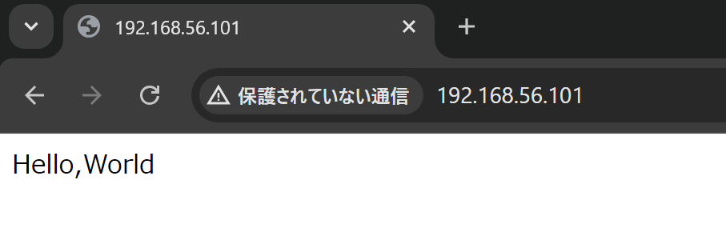

# Webサーバーの構築
第4章では、ホームページやWebシステムを公開するためのWebサービスを設定します。パッケージのインストールやシステム管理権限、セキュリティを考慮したネットワークのアクセス制限などについても触れます。

## 用語集
### HTML(HyperText Markup Language) {.unlisted .unnumbered}
Webページを書くためのタグを使って文章を構造的に記述できるマークアップ言語です。他ドキュメントへのハイパーリンクを書いたり、画像を利用したり、リストや表などの高度な表現も可能です。現在では、ページレイアウトなどを定義するCSS（Cascading Style Sheets）や、プログラムを記述できるJavaScriptなどと組み合わせて高度なWebページを作成できます。

### HTTP(HyperText Transfer Protocol) {.unlisted .unnumbered}
WebブラウザとWebサーバーの間でHTMLなどのコンテンツ(データ)送受信に使われる通信手順です。ファイルのリクエスト(要求)とファイルのレスポンス(返送)が組でセッションになります。現在では、通信を暗号化するなどしてセキュリティを高めたHTTPS（Hypertext Transfer Protocol Secure）が使用されています。

### Apache HTTPサーバー {.unlisted .unnumbered}
世界中でもっとも使われているWebサーバーであり、大規模な商用サイトから自宅サーバーまで幅広く利用されています。Apacheソフトウェア財団のApache HTTPサーバープロジェクトで開発が行われているオープンソースソフトウェアです。

### URL(Uniform Resource Locator) {.unlisted .unnumbered}
インターネット上のリソースを指定するための記述方法で、ホームページのアドレスやメールのアドレスなどを指定できます。リソースを特定するスキーム名とアドレスを「://」でつないで書きます。

### パッケージ {.unlisted .unnumbered}
プログラムの本体であるバイナリや設定ファイル、ドキュメントなどを一式まとめてインストール可能なようにまとめたものです。大きなプログラムの場合、本体とライブラリ、各種拡張機能などを別々のパッケージとしてまとめて選択的にインストールできるようにしていることがあります。Linuxディストリビューションは、このパッケージの集合体と考えることができます。

### システム管理権限 {.unlisted .unnumbered}
Linuxは複数のユーザーが同時に利用できるマルチユーザー型のOSです。システム管理権限は、システム全体に対する変更などが行える権限で、一般的なユーザーには与えられていません。Linuxではrootユーザーか、sudoコマンドを使える権限が与えられたユーザーのみシステム管理権限を行使できます。

\pagebreak
## Webサーバーの仕組み
Webシステムとは、インターネット環境で最も代表的なクライアントサーバー型のシステムで、WebサーバーとクライアントのWebブラウザとで構成されます。Webサーバーは要求されたファイルをWebクライアントに提供し、クライアントは受け取ったファイルを表示します。

{width=70%}


提供される情報はテキストから画像や動画と幅広く、クライアントが対応しているデータならば広く扱えます。Webシステムの文章データとしてはHTMLが一般的に使われています。

WebサーバーとしてApache HTTPサーバーが多く使われていますが、Nginx（エンジンエックス）や各種Webアプリケーションを動作させるのに特化したWebアプリケーションサーバーなども使われています。

## パッケージのインストール
LinuxでWebサーバーを動作させるには、まずWebサーバーのインストールを行います。ソースコードをコンパイルして動かすこともできますが、パッケージを使えば簡単にインストールが行えます。実習で使用しているUbuntu 24.04 LTS(Server)ではDEB形式のパッケージを使用しており、パッケージ管理ツールとしてaptコマンドが使用できます。

### aptコマンド
aptコマンドを使うと、パッケージのインストールや削除、アップデートなどが行えます。

### aptコマンドとapt-getコマンド
aptコマンドは、従来はapt-getコマンド・apt-cacheなどが行っていたパッケージ管理を置き換えるコマンドです。apt-get installコマンド等、使用しているサブコマンドの多くはaptコマンドでも実行できます。

### sudoコマンドによるroot権限の取得
aptコマンドによるパッケージのインストールは、システムの変更を伴うため管理者であるrootユーザーの権限が必要になります。コマンド実行時にroot権限を取得するには、sudoコマンドを使用します。OSインストール時、あるいは初期設定時に作成したユーザーにはsudoコマンドを実行する権限が与えられています。

### aptコマンドが参照するパッケージリポジトリ
aptコマンドは、インストールに使用するパッケージをリポジトリと呼ばれる場所から取得します。通常はインターネット上にリポジトリサーバーが用意されており、インターネット経由でパッケージをダウンロードします。今回はインターネットにアクセスできる前提で作業を行います。

### プロキシーが必要な場合には
インターネットへのアクセスにプロキシーを経由する必要がある場合、aptコマンドの設定でプロキシを設定することでアクセスできるようになります。設定方法はマニュアル等を参照してください。

### インターネットにアクセスできない環境でのパッケージ管理
インターネットにアクセスできない環境ではインターネット上のリポジトリにアクセスできないため、以下のような方法でインストールを行う必要があります。本教科書ではインストール時に必要なソフトウェアを選択してインストールする方式を採っていますが、その他の方法が必要となる場合もあります。

- OSインストール時にあらかじめ必要なソフトウェアを選択してインストールしておく
- ISOイメージに含まれているDEBパッケージファイルをaptコマンドなどを使って手動でインストールする
- ISOイメージをリポジトリとして扱うように設定ファイルを作成する
- アクセス可能なローカルネットワーク上にリポジトリサーバーを用意する

ただし、リポジトリサーバーを用意する以外の方法ではセキュリティアップデートなどが行われた最新のパッケージをインストールするのが難しくなります。実際のシステムを運用するには、継続的にパッケージをアップデートできる方法を考えておくべきでしょう。

### 依存関係の解消
動作するために複数のパッケージが必要となる場合、aptコマンドはインストールするパッケージが必要とするパッケージも同時にインストールを行います。必要となるパッケージがあることを依存関係と呼びます。

## apt installコマンドによるパッケージのインストール
Apache HTTPサーバーのパッケージ名はapache2です。まず、sudoコマンドを頭に付けてapt updateコマンドを実行し、ローカル環境に保持するレポジトリのパッケージリストを最新化します。その後、sudo apt installコマンドを実行します。

```
ubuntu@host1examplejp:~$ sudo apt update
[sudo] password for ubuntu:
Hit:1 http://security.ubuntu.com/ubuntu noble-security InRelease
Hit:2 http://jp.archive.ubuntu.com/ubuntu noble InRelease
Get:3 http://jp.archive.ubuntu.com/ubuntu noble-updates InRelease [126 kB]
Hit:4 http://jp.archive.ubuntu.com/ubuntu noble-backports InRelease
Get:5 http://jp.archive.ubuntu.com/ubuntu noble-updates/main amd64 Packages [220 kB]
Get:6 http://jp.archive.ubuntu.com/ubuntu noble-updates/universe amd64 Packages [116 kB]
Fetched 462 kB in 3s (146 kB/s)
Reading package lists... Done
Building dependency tree... Done
Reading state information... Done
36 packages can be upgraded. Run 'apt list --upgradable' to see them.

ubuntu@host1examplejp:~$ sudo apt install apache2
Reading package lists... Done
Building dependency tree... Done
Reading state information... Done
The following additional packages will be installed:
  apache2-bin apache2-data apache2-utils libapr1t64 libaprutil1-dbd-sqlite3 libaprutil1-ldap libaprutil1t64
  liblua5.4-0 ssl-cert
Suggested packages:
  apache2-doc apache2-suexec-pristine | apache2-suexec-custom www-browser
The following NEW packages will be installed:
  apache2 apache2-bin apache2-data apache2-utils libapr1t64 libaprutil1-dbd-sqlite3 libaprutil1-ldap libaprutil1t64
  liblua5.4-0 ssl-cert
0 upgraded, 10 newly installed, 0 to remove and 36 not upgraded.
Need to get 2,080 kB of archives.
After this operation, 8,091 kB of additional disk space will be used.
Do you want to continue? [Y/n]
Get:1 http://jp.archive.ubuntu.com/ubuntu noble/main amd64 libapr1t64 amd64 1.7.2-3.1build2 [107 kB]
Get:2 http://jp.archive.ubuntu.com/ubuntu noble/main amd64 libaprutil1t64 amd64 1.6.3-1.1ubuntu7 [91.9 kB]
Get:3 http://jp.archive.ubuntu.com/ubuntu noble/main amd64 libaprutil1-dbd-sqlite3 amd64 1.6.3-1.1ubuntu7 [11.2 kB]
Get:4 http://jp.archive.ubuntu.com/ubuntu noble/main amd64 libaprutil1-ldap amd64 1.6.3-1.1ubuntu7 [9,116 B]
Get:5 http://jp.archive.ubuntu.com/ubuntu noble/main amd64 liblua5.4-0 amd64 5.4.6-3build2 [166 kB]
Get:6 http://jp.archive.ubuntu.com/ubuntu noble-updates/main amd64 apache2-bin amd64 2.4.58-1ubuntu8.1 [1,327 kB]
Get:7 http://jp.archive.ubuntu.com/ubuntu noble-updates/main amd64 apache2-data all 2.4.58-1ubuntu8.1 [163 kB]
Get:8 http://jp.archive.ubuntu.com/ubuntu noble-updates/main amd64 apache2-utils amd64 2.4.58-1ubuntu8.1 [96.2 kB]
Get:9 http://jp.archive.ubuntu.com/ubuntu noble-updates/main amd64 apache2 amd64 2.4.58-1ubuntu8.1 [90.2 kB]
Get:10 http://jp.archive.ubuntu.com/ubuntu noble/main amd64 ssl-cert all 1.1.2ubuntu1 [17.8 kB]
Fetched 2,080 kB in 2s (902 kB/s)
Preconfiguring packages ...
Selecting previously unselected package libapr1t64:amd64.
(Reading database ... 83360 files and directories currently installed.)
Preparing to unpack .../0-libapr1t64_1.7.2-3.1build2_amd64.deb ...
Unpacking libapr1t64:amd64 (1.7.2-3.1build2) ...
Selecting previously unselected package libaprutil1t64:amd64.
Preparing to unpack .../1-libaprutil1t64_1.6.3-1.1ubuntu7_amd64.deb ...
Unpacking libaprutil1t64:amd64 (1.6.3-1.1ubuntu7) ...
Selecting previously unselected package libaprutil1-dbd-sqlite3:amd64.
Preparing to unpack .../2-libaprutil1-dbd-sqlite3_1.6.3-1.1ubuntu7_amd64.deb ...
Unpacking libaprutil1-dbd-sqlite3:amd64 (1.6.3-1.1ubuntu7) ...
Selecting previously unselected package libaprutil1-ldap:amd64.
Preparing to unpack .../3-libaprutil1-ldap_1.6.3-1.1ubuntu7_amd64.deb ...
Unpacking libaprutil1-ldap:amd64 (1.6.3-1.1ubuntu7) ...
Selecting previously unselected package liblua5.4-0:amd64.
Preparing to unpack .../4-liblua5.4-0_5.4.6-3build2_amd64.deb ...
Unpacking liblua5.4-0:amd64 (5.4.6-3build2) ...
Selecting previously unselected package apache2-bin.
Preparing to unpack .../5-apache2-bin_2.4.58-1ubuntu8.1_amd64.deb ...
Unpacking apache2-bin (2.4.58-1ubuntu8.1) ...
Selecting previously unselected package apache2-data.
Preparing to unpack .../6-apache2-data_2.4.58-1ubuntu8.1_all.deb ...
Unpacking apache2-data (2.4.58-1ubuntu8.1) ...
Selecting previously unselected package apache2-utils.
Preparing to unpack .../7-apache2-utils_2.4.58-1ubuntu8.1_amd64.deb ...
Unpacking apache2-utils (2.4.58-1ubuntu8.1) ...
Selecting previously unselected package apache2.
Preparing to unpack .../8-apache2_2.4.58-1ubuntu8.1_amd64.deb ...
Unpacking apache2 (2.4.58-1ubuntu8.1) ...
Selecting previously unselected package ssl-cert.
Preparing to unpack .../9-ssl-cert_1.1.2ubuntu1_all.deb ...
Unpacking ssl-cert (1.1.2ubuntu1) ...
Setting up ssl-cert (1.1.2ubuntu1) ...
Created symlink /etc/systemd/system/multi-user.target.wants/ssl-cert.service → /usr/lib/systemd/system/ssl-cert.service.
Setting up libapr1t64:amd64 (1.7.2-3.1build2) ...
Setting up liblua5.4-0:amd64 (5.4.6-3build2) ...
Setting up apache2-data (2.4.58-1ubuntu8.1) ...
Setting up libaprutil1t64:amd64 (1.6.3-1.1ubuntu7) ...
Setting up libaprutil1-ldap:amd64 (1.6.3-1.1ubuntu7) ...
Setting up libaprutil1-dbd-sqlite3:amd64 (1.6.3-1.1ubuntu7) ...
Setting up apache2-utils (2.4.58-1ubuntu8.1) ...
Setting up apache2-bin (2.4.58-1ubuntu8.1) ...
Setting up apache2 (2.4.58-1ubuntu8.1) ...
Enabling module mpm_event.
Enabling module authz_core.
Enabling module authz_host.
Enabling module authn_core.
Enabling module auth_basic.
Enabling module access_compat.
Enabling module authn_file.
Enabling module authz_user.
Enabling module alias.
Enabling module dir.
Enabling module autoindex.
Enabling module env.
Enabling module mime.
Enabling module negotiation.
Enabling module setenvif.
Enabling module filter.
Enabling module deflate.
Enabling module status.
Enabling module reqtimeout.
Enabling conf charset.
Enabling conf localized-error-pages.
Enabling conf other-vhosts-access-log.
Enabling conf security.
Enabling conf serve-cgi-bin.
Enabling site 000-default.
Created symlink /etc/systemd/system/multi-user.target.wants/apache2.service → /usr/lib/systemd/system/apache2.service.
Created symlink /etc/systemd/system/multi-user.target.wants/apache-htcacheclean.service → /usr/lib/systemd/system/apache-htcacheclean.service.
Processing triggers for ufw (0.36.2-6) ...
Processing triggers for man-db (2.12.0-4build2) ...
Processing triggers for libc-bin (2.39-0ubuntu8.2) ...
Scanning processes...
Scanning linux images...

Running kernel seems to be up-to-date.

No services need to be restarted.

No containers need to be restarted.

No user sessions are running outdated binaries.

No VM guests are running outdated hypervisor (qemu) binaries on this host.
```

sudoコマンドを初めて実行する際には、実行しているユーザーのパスワードが要求されます。sudoコマンド実行後、しばらくの間は再度実行する際にはパスワードが要求されませんが、一定時間経過後は再度要求されます。

インストールを行うapache2パッケージの依存関係を確認し、必要となる追加のパッケージも同時にインストールを行います。実行例では、依存関係にあるパッケージ、も追加でインストールすることを提案しています。問題なければ y を入力してパッケージのダウンロードとインストールを行います。

## Webサーバーの起動
Webサーバーを起動します。systemctlコマンドを使って、Webサーバーをバックグラウンドサービスとして起動します。

### systemctlコマンド
systemctlコマンドはsystemdを制御するためのコマンドです。systemdはLinuxがOSとして起動する際、Linuxカーネルが起動した後に一番最初に実行されるプロセスで、OS全体を制御します。systemctlコマンドは管理対象をユニットという単位で管理します。

### systemctl startコマンドによるWebサーバーの起動
Webサーバーを起動するには、systemctl startコマンドを実行します。systemdはWebサーバーをapache2.serviceユニットとして管理しています。ユニット名の.serviceは省略形の名称が重複していない限り省略できます。

```
ubuntu@host1examplejp:~$ sudo systemctl start apache2
```

エラーなどが発生しなければ、systemctl startコマンドの実行は何も表示されず終了します。

## systemctl statusコマンドによるWebサーバーの動作確認
Webサーバーが正しくバックグラウンドサービスとして実行されているかを確認します。システム的に確認する方法と、Webサーバーとして動作していることの確認の両方を実行します。

### systemctl statusコマンドによる動作状態の確認
systemctl statusコマンドで、管理対象となるユニットの状態やログの一部などを確認できます。

表示を終了するにはQキーを入力します。

```
ubuntu@host1examplejp:~$ systemctl status apache2
● apache2.service - The Apache HTTP Server
     Loaded: loaded (/usr/lib/systemd/system/apache2.service; enabled; preset: enabled)
     Active: active (running) since Sun 2024-07-07 12:23:28 UTC; 5min ago
       Docs: https://httpd.apache.org/docs/2.4/
   Main PID: 3042 (apache2)
      Tasks: 55 (limit: 2257)
     Memory: 5.3M (peak: 5.6M)
        CPU: 181ms
     CGroup: /system.slice/apache2.service
             tq3042 /usr/sbin/apache2 -k start
             tq3045 /usr/sbin/apache2 -k start
             mq3046 /usr/sbin/apache2 -k start

Jul 07 12:23:28 host1examplejp systemd[1]: Starting apache2.service - The Apache HTTP Server...
Jul 07 12:23:28 host1examplejp apachectl[3041]: AH00558: apache2: Could not reliably determine the server's fully qu>
Jul 07 12:23:28 host1examplejp systemd[1]: Started apache2.service - The Apache HTTP Server.
```

### Loadedの意味
ユニットの設定がsystemdに読み込まれているかどうかを表しています。ユニットの定義ファイルの位置や、自動起動の設定がされているかが確認できます。

### Activeの意味
現在、ユニットがアクティブかどうかを表しています。また、プロセスが動作しているかどうかが確認できます。

## Webサーバーへの接続の確認
Webサーバーが起動できたら、様々な方法でWebサーバーに接続して動作を確認します。

### curlコマンドによるローカル接続確認
ローカルでWebサーバーが動作していることを確認します。curlコマンドを実行して、自分自身（ローカル）を指すlocalhostに接続してみます。

```
ubuntu@host1examplejp:~$ curl localhost
<!DOCTYPE html PUBLIC "-//W3C//DTD XHTML 1.0 Transitional//EN" "http://www.w3.org/TR/xhtml1/DTD/xhtml1-transitional.dtd">
<html xmlns="http://www.w3.org/1999/xhtml">
  <!--
    Modified from the Debian original for Ubuntu
    Last updated: 2022-03-22
    See: https://launchpad.net/bugs/1966004
  -->
  <head>
    <meta http-equiv="Content-Type" content="text/html; charset=UTF-8" />
    <title>Apache2 Ubuntu Default Page: It works</title>
    <style type="text/css" media="screen">

略

          </p>
          <p>
                Please report bugs specific to modules (such as PHP and others)
                to their respective packages, not to the web server itself.
          </p>
        </div>

      </div>
    </div>
    <div class="validator">
    </div>
  </body>
</html>
```

Webサーバーが実行されているので、サンプルページのHTMLが返ってきます。

### ホストOSのWebブラウザによる接続確認
ホストOSのWebブラウザを実行し、Webサーバーに接続してみます。
ホストOS上でWebブラウザを起動したら、アドレスに「192.168.56.101」を入力し、Enterキーを押します。

{width=70%}

Webブラウザの要求に対して、WebサーバーがHTMLを返し、WebブラウザがそのHTMLを解釈してWebページを表示しているのが分かります。HTMLが要求したことにより追加で取得した画像ファイルも埋め込まれています。1つのWebページを表示するのに、Webブラウザの裏側で複数のセッションがやり取りされて画像ファイルなどが取得されるようになっています。

## Webサーバーの停止
Webサーバーを停止してみます。停止にはsystemctl stopコマンドを実行します。

```
ubuntu@host1examplejp:~$ sudo systemctl stop apache2
```

### systemctl statusコマンドによる動作状態の確認
systemctl statusコマンドを実行して、動作状態を確認します。

```
ubuntu@host1examplejp:~$ systemctl status apache2
○ apache2.service - The Apache HTTP Server
     Loaded: loaded (/usr/lib/systemd/system/apache2.service; enabled; preset: enabled)
     Active: inactive (dead) since Sun 2024-07-07 12:35:04 UTC; 3s ago
   Duration: 11min 35.808s
       Docs: https://httpd.apache.org/docs/2.4/
    Process: 3368 ExecStop=/usr/sbin/apachectl graceful-stop (code=exited, status=0/SUCCESS)
   Main PID: 3042 (code=exited, status=0/SUCCESS)
        CPU: 357ms

Jul 07 12:23:28 host1examplejp systemd[1]: Starting apache2.service - The Apache HTTP Server...
Jul 07 12:23:28 host1examplejp apachectl[3041]: AH00558: apache2: Could not reliably determine the server's fully qu>
Jul 07 12:23:28 host1examplejp systemd[1]: Started apache2.service - The Apache HTTP Server.
Jul 07 12:35:04 host1examplejp systemd[1]: Stopping apache2.service - The Apache HTTP Server...
Jul 07 12:35:04 host1examplejp apachectl[3370]: AH00558: apache2: Could not reliably determine the server's fully qu>
Jul 07 12:35:04 host1examplejp systemd[1]: apache2.service: Deactivated successfully.
Jul 07 12:35:04 host1examplejp systemd[1]: Stopped apache2.service - The Apache HTTP Server.
```

Active行が inactive (dead)になっており、プロセス関係の情報が表示されなくなり、Webサーバーが停止しているのが分かります。

### curlコマンドによる接続確認
Webサーバーが停止している状態で、curlコマンドを実行してみます。

```
ubuntu@host1examplejp:~$ curl localhost
curl: (7) Failed to connect to localhost port 80 after 0 ms: Couldn't connect to server
```

即座にエラーが表示されて、Webサーバーにアクセスできないのが分かります。

### Webサーバーを再度起動
Webサーバーを再度起動し、正常にアクセスできるように復旧したことを確認してください。

```
ubuntu@host1examplejp:~$ sudo systemctl start apache2
```

```
ubuntu@host1examplejp:~$ curl localhost
```

## ファイアウォールの設定とリモート接続確認
セキュリティを強化するため、デフォルトでは外部からは必要最低限のネットワーク通信しか受け付けないようにファイアウォールが設定されています。そのため、ローカルではWebサーバーに接続できても、リモートからは接続できません。ファイアウォールの設定を変更して、リモートからの接続を許可します。

### 仮想マシンでのリモート接続の確認方法
リモート接続の確認は、ホストOS上で起動したWebブラウザからゲストOS上のWebサーバーに接続します。同一の物理マシンですが、論理的には別々のOS、別々のIPアドレスを持っており、ネットワークを経由してリモートにあるWebサーバーに接続していることになります。

### デフォルト状態では接続できないことを確認する
まず、現在のファイアウォールの設定を確認します。ファイアウォールの操作には、ufwコマンドを使用します。

```
ubuntu@host1examplejp:~$ sudo ufw status
Status: inactive
```

ステータスがinactiveとなっており、ufwは有効化されていないことが分かります。


### ファイアウォールの設定を変更して接続を許可する
ufwコマンドでapache2サービスの接続、及び管理用に使用するsshサービスを許可します。

```
ubuntu@host1examplejp:~$ sudo ufw allow 80/tcp
Rules updated
Rules updated (v6)

ubuntu@host1examplejp:~$ sudo ufw allow 22/tcp
Rules updated
Rules updated (v6)
```

ファイアウォークを有効化します。

```
ubuntu@host1examplejp:~$ sudo ufw enable
Command may disrupt existing ssh connections. Proceed with operation (y|n)? y
Firewall is active and enabled on system startup
```

再度ファイアウォールの設定を確認します。

```
ubuntu@host1examplejp:~$ sudo ufw status
Status: active

To                         Action      From
--                         ------      ----
80/tcp                     ALLOW       Anywhere
22/tcp                     ALLOW       Anywhere
80/tcp (v6)                ALLOW       Anywhere (v6)
22/tcp (v6)                ALLOW       Anywhere (v6)
```

http通信(80/tcp)とssh通信(22/tcp)が追加され、接続が許可されました。

ホストOS上のWebブラウザから「192.168.56.101」に接続します。

{width=70%}

テストページが表示されたら、ホストOSからのアクセスはファイアウォールを通過してWebサーバーに接続できています。

## システム起動時のWebサーバー自動起動とファイアウォールの設定
Webサーバーの起動や、ファイアウォールの設定を行いましたが、これらの設定はOSを再起動すると無効になってしまいます。OSを再起動してもWebサーバーが自動的に起動し、ファイアウォールの設定が行われてHTTPによるアクセスが可能になるように設定しましょう。

### OS再起動
まず、OSを再起動し、Webサーバーが自動起動せず、ファイアウォールの設定が行われないことを確認します。OSを再起動するにはsudo systemctl rebootコマンドを実行します。

```
ubuntu@host1examplejp:~$ sudo systemctl reboot
```

### 再起動後の動作確認
Webサーバーが自動的に起動していないこと、ファイアウォールの設定でHTTPが許可されていないことを確認します。

```
ubuntu@host1examplejp:~$ sudo systemctl status apache2
```

```
ubuntu@host1examplejp:~$ sudo ufw status
```

### Webサーバーの自動起動設定
WebサーバーをOS起動時に自動的に起動するようにするにはsystemctl enableコマンドを実行します。

```
ubuntu@host1examplejp:~$ sudo systemctl enable apache2
Synchronizing state of apache2.service with SysV service script with /usr/lib/systemd/systemd-sysv-install.
Executing: /usr/lib/systemd/systemd-sysv-install enable apache2
```

### ファイアウォールの自動設定
ファイアウォールをOS起動時に自動的に起動するようにするにはsystemctl enableコマンドを実行します。

```
ubuntu@host1examplejp:~$ sudo systemctl enable ufw
Synchronizing state of ufw.service with SysV service script with /usr/lib/systemd/systemd-sysv-install.
Executing: /usr/lib/systemd/systemd-sysv-install enable ufw
```

### OS再起動と確認
再度、OSを再起動します。再起動後、Webサーバーが自動起動していること、ファイアウォールの設定が行われていることを確認します。

```
ubuntu@host1examplejp:~$ sudo systemctl status apache2
```

```
ubuntu@host1examplejp:~$ sudo ufw status
```

## ログの確認
Webサーバーへのアクセスや発生したエラーはログファイルに記録されています。アクセスログはどのような人がどのようなページにアクセスしているかの分析に、エラーログは発生した障害の解決に利用されます。

それぞれ、どのような情報が記録されているか確認してみましょう。

### Webサーバーのログファイルの確認
Webサーバーのログは/var/log/apache2ディレクトリに記録されています。

```
ubuntu@host1examplejp:~$ ls /var/log/apache2/
access.log  error.log  other_vhosts_access.log
```

access_logとerror_logの2つのログファイルなどが確認できます。

### アクセスログの確認
アクセスログに記録されている内容を確認します。

```
ubuntu@host1examplejp:~$ cat /var/log/apache2/access.log
::1 - - [07/Jul/2024:12:30:11 +0000] "GET / HTTP/1.1" 200 10926 "-" "curl/8.5.0"
192.168.56.1 - - [07/Jul/2024:12:32:59 +0000] "GET / HTTP/1.1" 200 3460 "-" "Mozilla/5.0 (Windows NT 10.0; Win64; x64) AppleWebKit/537.36 (KHTML, like Gecko) Chrome/126.0.0.0 Safari/537.36"
192.168.56.1 - - [07/Jul/2024:12:32:59 +0000] "GET /icons/ubuntu-logo.png HTTP/1.1" 200 3607 "http://192.168.56.101/" "Mozilla/5.0 (Windows NT 10.0; Win64; x64) AppleWebKit/537.36 (KHTML, like Gecko) Chrome/126.0.0.0 Safari/537.36"
192.168.56.1 - - [07/Jul/2024:12:33:00 +0000] "GET /favicon.ico HTTP/1.1" 404 492 "http://192.168.56.101/" "Mozilla/5.0 (Windows NT 10.0; Win64; x64) AppleWebKit/537.36 (KHTML, like Gecko) Chrome/126.0.0.0 Safari/537.36"
192.168.56.1 - - [07/Jul/2024:12:33:51 +0000] "-" 408 0 "-" "-"
```

アクセスログには、以下のような情報が記録されています。

- アクセス元のIPアドレス
- アクセスした時間
- アクセスの内容
- アクセスの結果（エラー番号）
- アクセスした際に入力されたURL
- アクセスに利用されたブラウザの種類

### エラー番号
アクセスログの中で分かりにくいのが、アクセスの結果を示すエラー番号です。エラー番号は様々な種類が定義されていますが、現時点で記録されているのは主に以下の2つです。

- 200：アクセスが成功した
- 404：アクセスしたファイルなどが見つからず失敗した

この2つ以外にも、304や403などが記録されている場合があります。

### エラーログの確認
エラーログに記録されている内容を確認します。

```
ubuntu@host1examplejp:~$ cat /var/log/apache2/error.log
[Sun Jul 07 12:23:28.503185 2024] [mpm_event:notice] [pid 3042:tid 123327566579584] AH00489: Apache/2.4.58 (Ubuntu) configured -- resuming normal operations
[Sun Jul 07 12:23:28.503320 2024] [core:notice] [pid 3042:tid 123327566579584] AH00094: Command line: '/usr/sbin/apache2'
[Sun Jul 07 12:35:04.355845 2024] [mpm_event:notice] [pid 3042:tid 123327566579584] AH00492: caught SIGWINCH, shutting down gracefully
[Sun Jul 07 12:54:03.333616 2024] [mpm_event:notice] [pid 858:tid 128521383122816] AH00489: Apache/2.4.58 (Ubuntu) configured -- resuming normal operations
[Sun Jul 07 12:54:03.357247 2024] [core:notice] [pid 858:tid 128521383122816] AH00094: Command line: '/usr/sbin/apache2'
```

エラーログには、Webサーバーの起動や停止の際に出力されたログや、アクセスログにも記録されているエラーの詳細などが記録されています。


### index.htmlを配置する
Webサーバーは、Webブラウザからのリクエストに応じて表示するHTMLファイルなどを/var/www/htmlディレクトリ以下に配置するように設定されています。index.htmlは、Webブラウザがファイル名を指定しなかった場合にデフォルトで参照されるHTMLファイルの名前です。
では、デフォルトで用意されたものではなく、独自内容のindex.htmlを作成してみましょう。

以下のコマンドを実行して、/var/www/htmlディレクトリにindex.htmlファイルを作成します。

```
ubuntu@host1examplejp:~$ sudo sh -c "echo 'Hello,World' > /var/www/html/index.html"
```

書き込みには管理者権限が必要ですが、リダイレクトによってファイルを作成するにはコマンド全体をsudoコマンドで呼び出したsh -cコマンドで実行する必要があります。また、コマンド全体を「"」(ダブルクォーテーション)で囲い、書き込み文字列を「'」(シングルクォーテーション)で囲っています。この違いにも注意してコマンドを入力してください。

\pagebreak
### Webブラウザからのアクセスとログの確認
Webブラウザから再度Webサーバーにアクセスしてみます。今度はテストページではなく、「Hello,World」の文字列が表示されたのではないでしょうか。

{width=70%}

また、アクセスログにどのように記録されているか、エラーログにエラーが記録されていないことも確認してみてください。

\pagebreak
