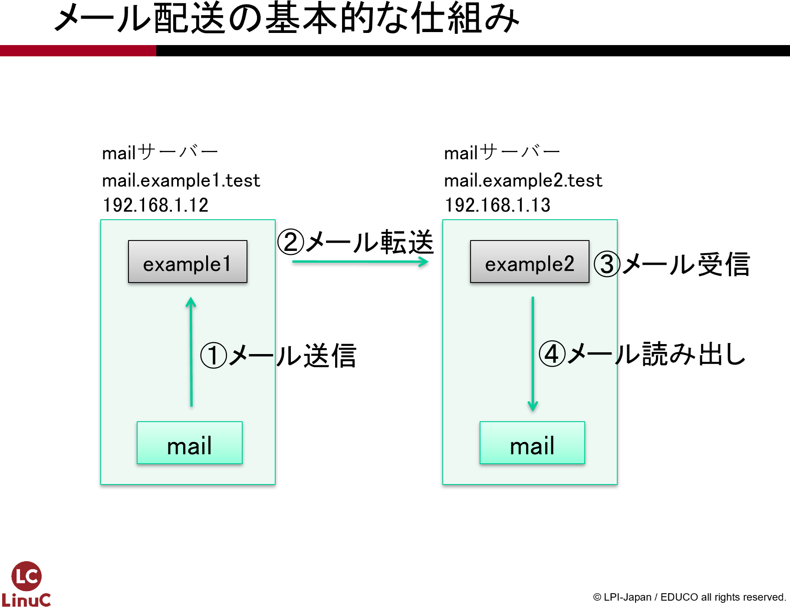

# メールサーバーの構築
第6章では、メールのやり取りが行えるようメールサーバーを設定します。まずはPostfixを使って、メールサーバー同士でメールのやり取りが行えるように設定します。さらにIMAPサーバーのDovecotとメールクライアントのThunderbirdを使って、より実践的なメール環境を構築します。

## 用語集
### メールサーバー {.unlisted .unnumbered}
電子メールのサービスを行います。クライアントよりメールを受け取り、相手先のメールサーバーまで送ります。また、受信用のメールサーバーでは、送ってきたメールを蓄積しておいて、クライアントの要求に応じて応答します。

### MTA（Mail Transfer Agent） {.unlisted .unnumbered}
メールの転送を行うプログラムです。SendmailやPostfixなどが代表例です。

### SMTP（Simple Mail Transfer Protocol） {.unlisted .unnumbered}
電子メールの送信、転送のときに利用されるプロトコルのことです。

### SMTP認証 {.unlisted .unnumbered}
SMTPでのメールを送信する際に認証を行う機構です。迷惑メール対策としてのメール中継の制限を、この認証機能で許可する、といった利用方法があります。

### Postfix {.unlisted .unnumbered}
MTAとして動作するサーバープログラムです。LinuxやUnixのシステムで古くから使われてきたSendmailよりもセキュリティが高く、高速に動作すると言われています。

### POP3（Post Office Protocol version3） {.unlisted .unnumbered}
クライアントが電子メールを取り寄せるときに利用されるプロトコルです。シンプルな設計で、IMAP4と比べて機能が少ないです。

### IMAP4（Internet Message Access Protocol 4） {.unlisted .unnumbered}
クライアントが電子メールを取り寄せるときに利用されるプロトコルです。メールのフォルダ機能サポート等、多機能です。

### Dovecot {.unlisted .unnumbered}
POP3やIMAP4のサーバー機能を提供するプログラムです。

### Thunderbird {.unlisted .unnumbered}
Mozilla Projectが配布している、高機能なメールクライアントソフトウェアです。動作環境はWindows、macOS、Linux等と多岐に渡っています。

## メールのやり取りの仕組み
インターネット上で沢山の人が電子メールを利用していますが、電子メールは以下の手順でやり取りされています。括弧内はそれぞれの手順に関わる動作やプロトコルです。

1. 送信者のメールクライアントから送信用メールサーバーにメールを送信します（SMTP認証）
1. 送信用メールサーバーは受信用メールサーバーにメールを転送します（SMTP）
1. 受信用メールサーバーは宛先アドレスのメールボックスにメールを配送します（メール配送）
1. 受信者のメールクライアントでメールボックスのあるメールサーバーに接続します（POP3やIMAP4）
1. 受信者のメールクライアントがメールを受信して、メールを見ることができます

## メールの送信
メールの送信は、メールサーバーを介してやり取りが行われます。メールサーバーがメールを受け取ると、宛先のメールアドレスを担当しているメールサーバーに転送され、最終的に宛先のメールボックスに入れられます。ThunderbirdやOutlookのようなメールクライアントから送信したメールでも、GmailのようなWebメールから送信したメールでも、動作原理は同じです。

メールの送信に関わるプログラムやプロトコルについて解説します。

### MTA（Mail Transfer Agent）
メールクライアントから送信されたメールは、送信用メールサーバーから宛先の受信用メールサーバーに転送されます。このメールの転送を行うプログラムをMTAと呼びます。本教科書ではPostfixというMTAを利用します。他に有名なMTAとしてSendmailがあります。

### MDA（Mail Delivery Agent）
受信用メールサーバーが受信したメールを宛先アドレスのメールボックスに配送するプログラムをMDAと呼びます。MTAであるPostfixがMDAの機能も受け持ちます。他にMDAとしてProcmailがあります。

### MUA（Mail User Agent）
メールの利用者が、メールの送信や受信を行うプログラムをMUAと呼びます。本教科書ではThunderbirdを利用します。WebメールもMUAの一種となります。

### SMTP（Simple Mail Transfer Protocol）の拡張
メールクライアントからのメール送信や、メールサーバー間のメールの転送は、SMTPというプロトコルでやり取りされています。SMTPはかなり昔に設計、定義されたプロトコルのため、認証やアクセス制限などが無く、勝手にメールサーバーを利用されて迷惑メールを送られてしまう問題がありました。このような問題を解決するためにESMTP（拡張SMTP）が定義されました。SMTPと呼ぶ場合、このESMTPで定義された機能も含んでいることがあります。

### SMTP認証（SMTP Authentication）とリレー
SMTP認証はESMTPの機能のうちの1つです。通常のSMTPには認証機能が無いため、送信元のIPアドレスを制限するなど適切に設定されていないと迷惑メール送信の踏み台とされてしまう問題があります。SMTP認証は、メールの送信時に認証を行い、認証が行われた場合のみメールの送信を受け付けます。受け付けたメールを宛先の受信用メールサーバーに転送することをリレーと呼びます。

## メールの受信
送信されたメールが宛先のメールボックスに配送されると、受信者はメールを受信して読むことができます。メールの受信に関係するいくつかの事項について解説します。

### メールの配送
受信用メールサーバーがメールを受け取り、宛先アドレスのメールボックスにメールを届けることを配送と呼びます。メールボックスが無い場合、宛先不明として送信用メールサーバーにエラーを返します。メールの配送を行うソフトウェアをMDA（Mail Delivery Agent）と呼びます。

### ローカル配送
送信側と受信側が同じメールサーバーを使用している場合、メールは外部のメールサーバーに転送する必要がなく、すぐに宛先アドレスのメールボックスに配送されます。これをローカル配送と呼びます。

### POP3（Post Office Protocol version 3）
POP3は電子メールを受信するときに利用するプロトコルです。非常にシンプルなプロトコルで、ユーザー名、パスワードを利用して接続し、メールの内容を受信します。

### IMAP4（Internet Message Access Protocol 4）
IMAP4もPOP3同様、メールを受信するときに利用するプロトコルです。IMAP4はPOP3に比べて機能が豊富で、大きな特徴としてフォルダ機能をサポートしていることが挙げられます。メールをIMAPサーバーに残しておくことができるので、メールクライアントとWebメールを併用したりすることもできますが、その分だけメールサーバーのストレージを消費するので容量管理が必要になります。

## メールサーバーの構築
メールサーバーの構築は、送信用メールサーバーと受信用メールサーバーの2台を構築します。それぞれのサーバーを以下のように設定します。

- 1台のマシンで、メールサーバーとメールクライアントの1台2役とします。
- MTAとしてPostfixをインストールし、送信用メールサーバーおよび受信用メールサーバーとして設定します。
- IMAPサーバーとしてDovecotをインストールし、設定します。
- それぞれのメールサーバーにメールアカウントを作成します。
- メールクライアントとしてThunderbirdをインストールし、サーバー自身を送受信用サーバーとして設定します。

通常、メールサーバーとメールクライアントは別々のマシンを用意し、その間をSMTPやPOP3、IMAP4などで接続しますが、実習では同じマシンで行います。

構築は、Postfixの設定とmailコマンドによるメールの送受信、DovecotとThunderbirdの設定とメールの送受信の2段階に分けて行います。

### mailコマンドを利用したメールの送受信
Postfixの設定が完了したら、動作確認としてmailコマンドを使ってメールのやり取りを行います。メールクライアントの設定を必要としないので、MTAが正しく設定されていることを確認するのに適しています。

{width=70%}

\pagebreak
### Thunderbirdを利用したメールの送受信
Thunderbirdをメールクライアントとして設定し、SMTP認証によるメール送信や、DovecotによるIMAPサーバーからのメール受信を行います。

{width=70%}

## Postfixのインストール
Postfixをaptコマンドでインストールをします。また、SMTP認証で使用するSASL（saslauthdパッケージ）も一緒にインストールしておきます。
また、IMAPサーバーとして使用するdovecotパッケージも同時にインストールしておきます。

### パッケージのインストール
aptコマンドで必要なパッケージをインストールします。

```
$ sudo apt install postfix dovecot-pop3d dovecot-imapd saslauthd
```

## Postfixの設定ファイルmain.cfの設定
Postfixの設定ファイルは/etc/postfix/main.cfです。次のパラメータを探して設定します。

```
$ sudo vi /etc/postfix/main.cf
```

パラメータによっては、デフォルト値が設定されているので、その場合には書き換えます。コメントアウトされた形で記述されている場合には、コメントアウトを外して設定を有効にした上で値を記述します。

「smtpd_sasl_auth_enable」と「smtpd_recipient_restrictions」は、main.cfに記述されていないので、ファイルの最後に追加しておきます。

host1とhost2に、それぞれ以下のように設定します。

host1の設定

| 項目 | 設定値 |
|------------|---------------|
| myhostname | mail.example1.jp |
| mydomain | example1.jp |
| inet_interfaces | localhost, 192.168.56.101 |
| mydestination | $mydomain |
| smtpd_sasl_auth_enable | yes |
| smtpd_recipient_restrictions | permit_mynetworks, permit_sasl_authenticated, reject_unauth_destination |

host2の設定

| 項目 | 設定値 |
|------------|---------------|
| myhostname | mail.example2.jp |
| mydomain | example2.jp |
| inet_interfaces | localhost, 192.168.56.102 |
| mydestination | $mydomain |
| smtpd_sasl_auth_enable | yes |
| smtpd_recipient_restrictions | permit_mynetworks, permit_sasl_authenticated, reject_unauth_destination |

それぞれのパラメータの意味と設定値は以下の通りです。

### myhostname
メールサーバーのホスト名を設定します。

host1の設定
```
myhostname = mail.example1.jp
```

host2の設定
```
myhostname = mail.example2.jp
```

### mydomain
メールサーバーのドメイン名を設定します。

host1の設定
```
mydomain = example1.jp
```

host2の設定
```
mydomain = example2.jp
```

### inet_interfaces
メールを受け付けるネットワークインターフェースのIPアドレスを設定します。localhostの記述を忘れると、自分自身からのメールを受け付けなくなるので注意が必要です。

host1の設定
```
inet_interfaces = localhost, 192.168.56.101
```

host2の設定
```
inet_interfaces = localhost, 192.168.56.102
```

### mydestination
メールを受信するドメイン名を設定します。宛先メールアドレス（アカウント名@ドメイン名）がこのドメイン名になっているメールのみ受け取ります。

host1とhost2共通の設定
```
mydestination = $mydomain
```

### smtpd_sasl_auth_enable
SMTP認証用のSASL認証連携を有効にします。

host1とhost2共通の設定
```
smtpd_sasl_auth_enable = yes
```

### smtpd_recipient_restrictions
SMTP認証でSASL認証されたクライアントからのメール送信を許可するように設定します。

host1とhost2共通の設定
```
smtpd_recipient_restrictions = permit_mynetworks, permit_sasl_authenticated, reject_unauth_destination
```

これら2つの設定は後述するSMTP認証（SASL認証連携）に関係する設定ですが、先に設定しておきます。

\pagebreak
## 書式のチェック
/etc/postfix/main.cfの修正ができたら、書式チェックを行っておきます。

```
$ sudo postfix check
```

書式が正しい場合には、何も表示されません。エラーが表示された場合には、エラー内容をよく見て修正します。

## Postfixの起動
postfixサービスを起動します。

```
$ sudo systemctl start postfix
```

## 自動起動とファイアウォールの設定
自動起動の設定や、ファイアウォールの設定を行います。

```
$ sudo systemctl enable postfix
$ sudo ufw allow 25/tcp
$ sudo ufw status
```

### Postfixの起動順の設定（任意）
上記systemctl enableコマンドでPostfixの自動起動を設定しても、システムを再起動するとPostfixが起動していないことがあります。これはシステム起動時のサービスの起動順の設定の仕様によるものです。

具体的には、ネットワークサービスの起動完了を待たずにPostfixを起動しようとしているのが原因です。正しい動作をさせるためにはsystemdが参照している設定ファイルを修正する必要があります。

本教科書の実習では頻繁にシステム再起動を行うことはないので、起動していない場合にはその都度Postfixを起動すればよいですが、連続稼働させるシステムでPostfixを動作させる場合には、以下の修正を行ってください。

### systemctl editコマンドで修正
systemctl editコマンドを使うと、対象となるサービスの設定ファイルを編集することができます。ただし、起動するエディタがnanoになるので、vimと使い勝手が若干異なる点に注意が必要です。

### vimで設定ファイルを修正
vimで設定ファイルを直接開いて修正しても構いません。設定ファイルは/usr/lib/systemd/system/postfix.serviceです。

```
$ sudo vi /usr/lib/systemd/system/postfix.service
```

```
[Unit]
Description=Postfix Mail Transport Agent
After=syslog.target network-online.target ← network.targetをnetwork-online.targetに変更
Conflicts=sendmail.service exim.service
（略）
```

After=network.targetは、ネットワークサービスの起動の後にPostfixを起動しますが、ネットワークが使えるようになったことは確認しません。After=network-online.targetにすることで、ネットワークが使えるようになったことを確認した後にPostfixを起動します。

変更が適用されたことを確認するため、システムを再起動し、Postfixが自動的に起動していることを確認してください。

## SMTP認証（SASL認証連携）の設定
SMTP認証は、メール送信時に認証を行う仕組みです。Postfix自体は認証の機能を持っていませんので、SASL認証との連携を行います。SASL認証連携を行うには、Postfixへの設定とsaslauthdサービスの起動が必要です。

### Postfixの設定の確認
Postfixの設定ファイルであるmain.cfでSASL認証を有効にします。既に以下の2つのパラメータを追加で設定しています。

| 項目 | 設定値 |
|------------|---------------|
| smtpd_sasl_auth_enable | yes |
| smtpd_recipient_restrictions | permit_mynetworks, permit_sasl_authenticated, reject_unauth_destination |

SMTP認証の機能を有効にすると、Postfixはsaslauthdに認証を依頼し、認証が成功するとメールを受け取ってリレーを行います。

### saslauthdサービスの設定と起動
saslauthd用の設定(/etc/postfix/sasl/smtpd.conf)を作成し、SMTP認証用のsaslauthdサービスを起動します。

```
$ sudo vi /etc/postfix/sasl/smtpd.conf

$ sudo cat /etc/postfix/sasl/smtpd.conf
pwcheck_method: saslauthd
mech_list: plain login
```

```
$ sudo systemctl start saslauthd
```

saslauthdの自動起動設定も行っておきます。

```
$ sudo systemctl enable saslauthd
```

これでPostfixの設定は完了です。

## アカウントの作成
メールのやり取りを行うためのアカウントを作成します。アカウントはhost1とhost2の双方で行います。

### host1にuser1を作成
host1でuser1というアカウントを作成します。このアカウントはuser1@example1.jpというメールアドレスになります。passwdコマンドでパスワードの設定も行っておきます。

```
ubuntu@host1example1jp:~$ sudo adduser user1
info: Adding user `user1' ...
info: Selecting UID/GID from range 1000 to 59999 ...
info: Adding new group `user1' (1003) ...
info: Adding new user `user1' (1003) with group `user1 (1003)' ...
info: Creating home directory `/home/user1' ...
info: Copying files from `/etc/skel' ...
New password:
Retype new password:
passwd: password updated successfully
Changing the user information for user1
Enter the new value, or press ENTER for the default
        Full Name []:
        Room Number []:
        Work Phone []:
        Home Phone []:
        Other []:
Is the information correct? [Y/n]
info: Adding new user `user1' to supplemental / extra groups `users' ...
info: Adding user `user1' to group `users' ...
```

### host2にuser2を作成
host2でuser2というアカウントを作成します。このアカウントはuser2@example2.jpというメールアドレスになります。passwdコマンドでパスワードの設定も行っておきます。

```
ubuntu@host2example2jp:~$ sudo adduser user2
info: Adding user `user2' ...
info: Selecting UID/GID from range 1000 to 59999 ...
info: Adding new group `user2' (1003) ...
info: Adding new user `user2' (1003) with group `user2 (1003)' ...
info: Creating home directory `/home/user2' ...
info: Copying files from `/etc/skel' ...
New password:
Retype new password:
passwd: password updated successfully
Changing the user information for user1
Enter the new value, or press ENTER for the default
        Full Name []:
        Room Number []:
        Work Phone []:
        Home Phone []:
        Other []:
Is the information correct? [Y/n]
info: Adding new user `user1' to supplemental / extra groups `users' ...
info: Adding user `user2' to group `users' ...
```

### メールエイリアスのデータベース構築
newaliasesコマンドを実施し、メールエイリアスデータベースを構築します。

```
ubuntu@host1examplejp:~$ sudo newaliases
```

## mailコマンドを使ったメール送受信のテスト
メールの送受信が行えるかテストを行います。メールの送受信は作成したユーザーuser1とuser2で行います。ユーザーで操作できるよう別の端末を起動し、suコマンドを使ってユーザーを切り替えます。メールの送受信にはmailコマンドを使用します。

### ログの確認用端末の設定（任意）
メールサーバーはバックグラウンドで動作するため、どのように動いているのか確認するためにはログを参照する必要があります。

tailコマンドに-fオプションを付けて実行すると、ログが書き込まれる毎に再読み込みされて最新のログを閲覧できます。

1. 「端末」を起動します。
1. tailコマンドを実行して/var/log/maillogを表示します。

```
$ sudo tail -f /var/log/maillog
```

### メール送受信用端末の起動とユーザー切り替え
メール送受信用の端末を起動し、suコマンドでユーザーの切り替えを行います。ユーザーを完全に切り替えるために「su - ユーザー名」と「-」（ハイフン）を付けて実行してください。

1. 「端末」を起動します。
1. suコマンドでユーザーを切り替えます。

### host1でuser1に切り替え
host1はuser1で操作を行います。

```
ubuntu@host1example1jp:~$ sudo su - user1
user1@host1example1jp:~$
```

### host2でuser2に切り替え
host2はuser2で操作を行います。

```
ubuntu@host2example2jp:~$ sudo su - user2
user2@host2example2jp:~$
```
